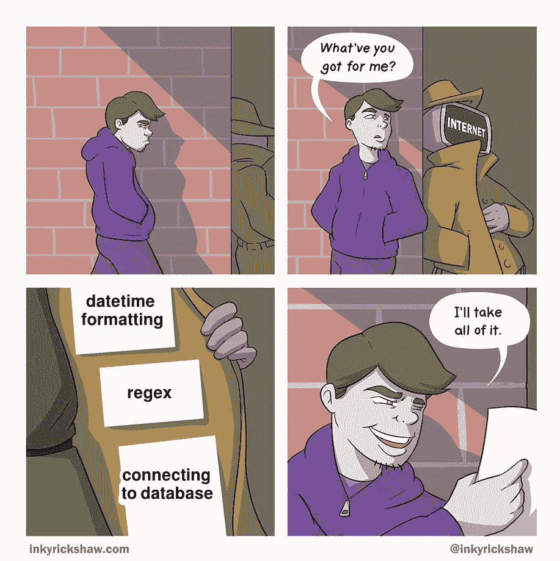
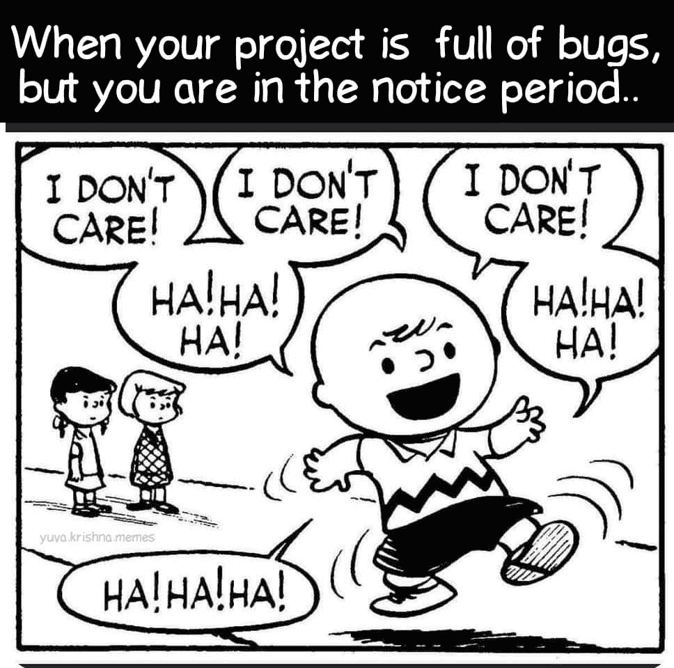
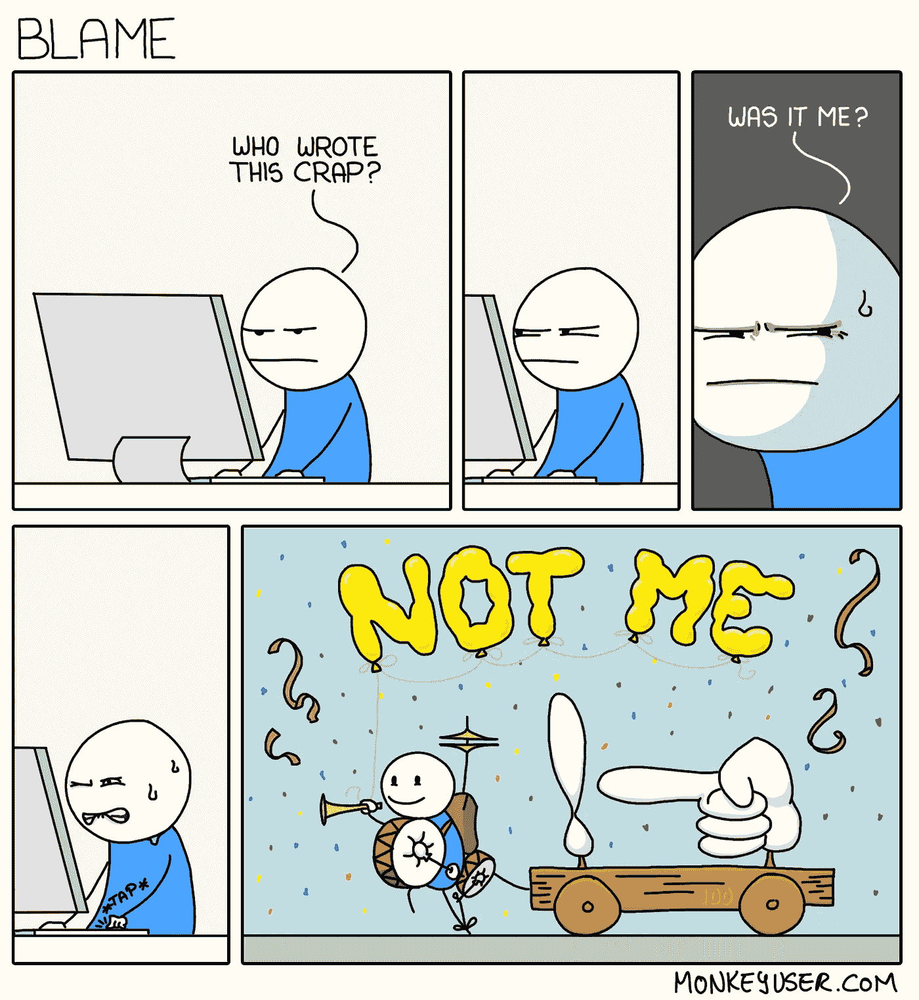

# 日常的编程笑话

> 原文：<https://javascript.plainenglish.io/daily-dose-of-programming-jokes-9bac7b6a96a7?source=collection_archive---------11----------------------->

## 最佳编程迷因汇编(第二部分)

Photo by [Senjuti Kundu](https://unsplash.com/@senjuti?utm_source=medium&utm_medium=referral) on [Unsplash](https://unsplash.com?utm_source=medium&utm_medium=referral)

***模因和快乐有什么联系吗？*** 如果你是我这种类型的人，那么你可能也爱在下班后查看手机。猜猜我在那里看到了什么？

我主要是在互联网上看到**视频、抖音和模因**。我不知道为什么，但这有助于我提神醒脑，减轻工作压力。这就是为什么我相信 *laugher 是人类最好的刷新按钮。*

在这篇文章中，我收集了一些我喜欢的网络迷因。

# 你最喜欢哪一个？我以前有一个新的文件夹系列…

[https://www.reddit.com/r/ProgrammerHumor/comments/ojxtdg/git/](https://www.reddit.com/r/ProgrammerHumor/comments/ojxtdg/git/)

# 有史以来最好的编程回复…对面可怜的人…

[https://www.facebook.com/photo/?fbid=1200115330452532&set=gm.2876702175930666](https://www.facebook.com/photo/?fbid=1200115330452532&set=gm.2876702175930666)

# 当我得到 Windows 更新时，我也有同样的感觉...

[https://www.facebook.com/photo?fbid=1070897396773567&set=gm.6406455706046826](https://www.facebook.com/photo?fbid=1070897396773567&set=gm.6406455706046826)

# 你是人类吗？是的，我确实注意到了一些小事…

[https://www.facebook.com/BlaxkerHacker/photos/a.122991386210034/333988921776945/](https://www.facebook.com/BlaxkerHacker/photos/a.122991386210034/333988921776945/)

# 每当我被从库中看到的简单代码所吸引，一旦我开始使用它…

[https://www.monkeyuser.com/2021/new-library/](https://www.monkeyuser.com/2021/new-library/)

# 黑暗模式是生活…

[https://www.reddit.com/r/ProgrammerHumor/comments/ojvsfq/light_attracts_bugs/](https://www.reddit.com/r/ProgrammerHumor/comments/ojvsfq/light_attracts_bugs/)

# 我绝对需要全部…

[https://twitter.com/PR0GRAMMERHUM0R/status/1415295034891591688/photo/1](https://twitter.com/PR0GRAMMERHUM0R/status/1415295034891591688/photo/1)

# JAVA 程序员就像…

[https://programmerhumor.io/programming-memes/thats-wrong-boy/](https://programmerhumor.io/programming-memes/thats-wrong-boy/)

# 当产品负责人不理解技术依赖并询问需求时…

[https://programmerhumor.io/programming-memes/his-product-owner-clearly-didnt-understand-what-a-technical-dependency-was-during-spring-gooming/](https://programmerhumor.io/programming-memes/his-product-owner-clearly-didnt-understand-what-a-technical-dependency-was-during-spring-gooming/)

# 奖金时间

# 你喜欢幸运饼干吗？如果你收到这个，作为一个开发者你的反应是什么？

[https://www.facebook.com/yuva.krishna.memes](https://www.facebook.com/yuva.krishna.memes)

# 我也有同样的感觉…当我很少用纸和笔写字的时候…

[https://www.facebook.com/yuva.krishna.memes](https://www.facebook.com/yuva.krishna.memes)

# 我不在乎，我知道这是一种不好的态度，但让我享受这种感觉…

[https://www.facebook.com/yuva.krishna.memes](https://www.facebook.com/yuva.krishna.memes)

# 一切皆有可能..不管怎样，你都可以得到结果。

[https://www.facebook.com/yuva.krishna.memes](https://www.facebook.com/yuva.krishna.memes)

# 让我们来看看 Div 的虚拟世界…在我改变位置进行适当调整后，他们看起来是怎样的…

[https://www.facebook.com/yuva.krishna.memes](https://www.facebook.com/yuva.krishna.memes)

# 当我在代码中发现一个问题时，最常见的事情发生了…

[https://www.monkeyuser.com/](https://www.monkeyuser.com/)

# 下次我会试着写正确的代码…让我们今天就发出请求吧…

[https://www.monkeyuser.com/](https://www.monkeyuser.com/)

# 我的分支在做什么？

[https://www.facebook.com/ProgrammersCreateLife](https://www.facebook.com/ProgrammersCreateLife)

# 当我们每年收到太多的框架时..这很正常…

[https://www.facebook.com/programminggeeks.in](https://www.facebook.com/programminggeeks.in)

# 你喜欢什么？我正在学习一门新的语言…

[https://www.facebook.com/techindustan/](https://www.facebook.com/techindustan/)

# 为帮助我们脱帽致敬…

[https://www.facebook.com/programminggeeks.in](https://www.facebook.com/programminggeeks.in)

**请随意分享您宝贵的掌声和评论，这样我将来可以提供更多类似的内容。**

 [## 日常的编程笑话

### 最佳编程迷因汇编(第 4 部分)

javascript.plainenglish.io](/daily-dose-of-programming-jokes-6541eba98194)  [## 11 个让你笑死的编程笑话

### 2021 年最佳编程迷因

javascript.plainenglish.io](/11-programming-jokes-that-will-make-you-die-laughing-df41d5547f11)  [## 2021 年最佳编程幽默汇编

### 编程迷因可以减轻你的压力

blog.devgenius.io](https://blog.devgenius.io/best-programming-humor-compilations-2021-623473bfb0d)  [## 有趣的编程迷因会让你笑死

### 编笑话来点亮你的周五

blog.devgenius.io](https://blog.devgenius.io/funny-programming-memes-that-will-make-you-die-laughing-1ccd8e139040)  [## 编程迷因和幸福之间的联系

### 2021 年最佳编程迷因汇编

blog.devgenius.io](https://blog.devgenius.io/the-connection-between-programming-memes-and-happiness-d768ab85b83d)  [## 10 个能让你心情轻松的最佳编程笑话

### 你读过的关于编程迷因 2021 的最不可思议的文章

medium.com](https://medium.com/geekculture/10-best-programming-jokes-to-lighten-up-your-mood-8870dab2bff7)  [## 日常的编程笑话

### 最佳编程迷因汇编(第 1 部分)

javascript.plainenglish.io](/daily-dose-of-programming-jokes-cb9b74fcfa2e) 

*更多内容请看*[***plain English . io***](http://plainenglish.io/)