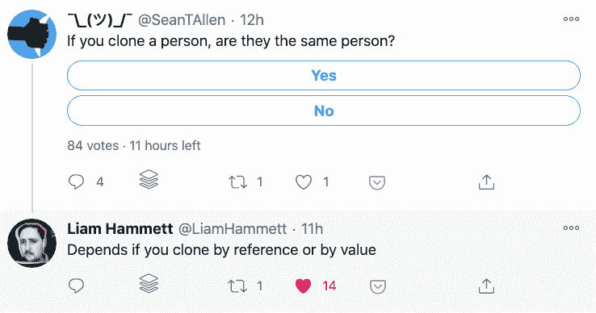
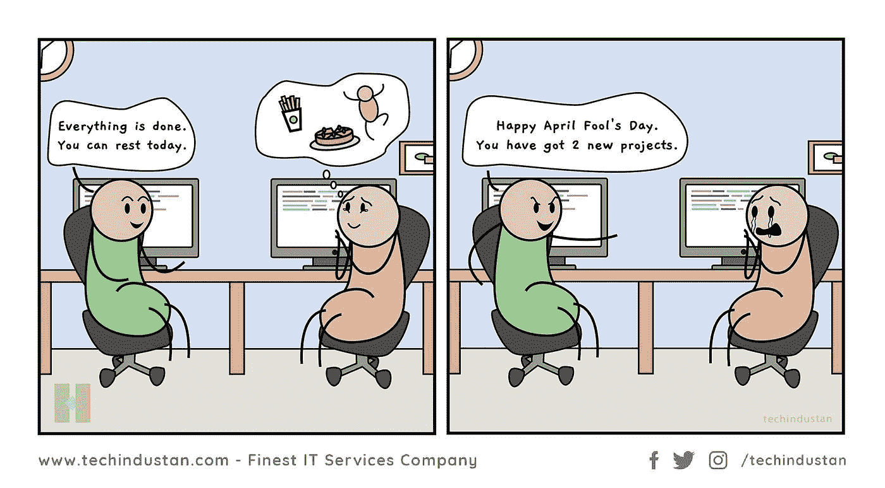

# 日常的编程笑话

> 原文：<https://javascript.plainenglish.io/daily-dose-of-programming-jokes-b97a3c8d884c?source=collection_archive---------13----------------------->

## 日常节目幽默

## 最佳编程迷因汇编(第 5 部分)

Photo by [Caroline Hernandez](https://unsplash.com/@carolinehdz?utm_source=medium&utm_medium=referral) on [Unsplash](https://unsplash.com?utm_source=medium&utm_medium=referral)

***模因和快乐有什么联系吗？*** 如果你是我这种类型的人，那么你可能也爱在下班后查看手机。猜猜我在那里看到了什么？

我主要是在互联网上看到**视频、抖音和模因**。我不知道为什么，但这有助于我提神醒脑，减轻工作压力。这就是为什么我相信 *laugher 是人类最好的刷新按钮。*

在这篇文章中，我收集了一些我喜欢的网络迷因。

# 我不需要你...让我放下你，伙计…

[https://www.reddit.com/r/ProgrammerHumor/comments/oo16aa/im_sorry_dear_data/](https://www.reddit.com/r/ProgrammerHumor/comments/oo16aa/im_sorry_dear_data/)

# 不要教我写了什么…哈哈

[https://www.reddit.com/r/ProgrammerHumor/comments/oo4ttu/perplexed_obama/](https://www.reddit.com/r/ProgrammerHumor/comments/oo4ttu/perplexed_obama/)

# 需要经历几个阶段？

[https://www.monkeyuser.com/2017/code-review-stages/?sc=true&dir=random](https://www.monkeyuser.com/2017/code-review-stages/?sc=true&dir=random)

# 希望我的周期到达那里…但是如何？

[https://www.monkeyuser.com/2017/testing-vs-prod-env/?sc=true&dir=random](https://www.monkeyuser.com/2017/testing-vs-prod-env/?sc=true&dir=random)

# 我靠编程挣钱…

[https://www.facebook.com/photo/?fbid=349251050087280&set=gm.1262598024177843](https://www.facebook.com/photo/?fbid=349251050087280&set=gm.1262598024177843)

# 一切皆有可能…

[https://www.facebook.com/techwithcodex/photos/a.137007467972178/331986501807606/](https://www.facebook.com/techwithcodex/photos/a.137007467972178/331986501807606/)

# 不要和我有眼神接触..我是最棒的…哈哈

[https://twitter.com/MayaShavin/status/1414659230833971205/photo/1](https://twitter.com/MayaShavin/status/1414659230833971205/photo/1)

# 没有布尔怎么有主见？

[https://twitter.com/realColinMac/status/1375360353442295811/photo/1](https://twitter.com/realColinMac/status/1375360353442295811/photo/1)

# 同辈压力？他会让我们的周末变得很糟糕…

[https://imgur.com/t/funny/Mk5F6E1](https://imgur.com/t/funny/Mk5F6E1)

# 奖金时间

# LOL…之前有严格的开发模式..这是我的代码的内部状态..当一个新变量加入未使用的变量时…

[https://www.facebook.com/photo?fbid=899897387465482&set=gm.2799768736940435](https://www.facebook.com/photo?fbid=899897387465482&set=gm.2799768736940435)

# 作为一名初级开发人员，我学到的第一件事是..不要碰工作正常的东西..它可以增加重新测试的努力，并可以打破其他东西…

[https://www.facebook.com/javascriptJS/photos/1861659490638313](https://www.facebook.com/javascriptJS/photos/1861659490638313)

# 有时候我的 Div 元素隐藏的方式让 z-index 也帮不上忙……:)

[https://www.facebook.com/javascriptJS/photos/1599789793491952](https://www.facebook.com/javascriptJS/photos/1599789793491952)

# 当你看到这段对话时，你有没有更深入地思考这个问题？也许电脑在向每个人询问它的家庭..谁知道…

[https://www.thecoderpedia.com/blog/programming-memes/](https://www.thecoderpedia.com/blog/programming-memes/)

# 如果一个常见的编码问题以这种方式问你会怎么样？

[https://www.facebook.com/DZoneInc/photos/10158915022879712](https://www.facebook.com/DZoneInc/photos/10158915022879712)

# 当我被某事卡住时…我的大脑会想…没有什么比满足感更重要…

[https://www.facebook.com/groups/programming.jokes](https://www.facebook.com/groups/programming.jokes)

# 你见过可以帮助重构的超级英雄吗？抱歉，尚不存在任何内容…

[https://www.monkeyuser.com/](https://www.monkeyuser.com/)

# 总是关注你所有行动的客户…

Source:[https://www.facebook.com/programminggeeks.in](https://www.facebook.com/programminggeeks.in)

# 当我的最后期限延长时…我也有同样的感觉..最佳水平的拖延症…

[https://www.monkeyuser.com/](https://www.monkeyuser.com/)

# 愚人节玩笑？是的，这可以适用于任何月份…哈哈

[https://www.facebook.com/techindustan/](https://www.facebook.com/techindustan/)

# 延伸阅读:

 [## 日常的编程笑话

### 最佳编程迷因汇编(第 4 部分)

javascript.plainenglish.io](/daily-dose-of-programming-jokes-6541eba98194)  [## 11 个让你笑死的编程笑话

### 2021 年最佳编程迷因

javascript.plainenglish.io](/11-programming-jokes-that-will-make-you-die-laughing-df41d5547f11)  [## 2021 年最佳编程幽默汇编

### 编程迷因可以减轻你的压力

blog.devgenius.io](https://blog.devgenius.io/best-programming-humor-compilations-2021-623473bfb0d)  [## 有趣的编程迷因会让你笑死

### 编笑话来点亮你的周五

blog.devgenius.io](https://blog.devgenius.io/funny-programming-memes-that-will-make-you-die-laughing-1ccd8e139040)  [## 编程迷因和幸福之间的联系

### 2021 年最佳编程迷因汇编

blog.devgenius.io](https://blog.devgenius.io/the-connection-between-programming-memes-and-happiness-d768ab85b83d)  [## 10 个能让你心情轻松的最佳编程笑话

### 你读过的关于编程迷因 2021 的最不可思议的文章

medium.com](https://medium.com/geekculture/10-best-programming-jokes-to-lighten-up-your-mood-8870dab2bff7)  [## 日常的编程笑话

### 最佳编程迷因汇编(第 1 部分)

javascript.plainenglish.io](/daily-dose-of-programming-jokes-cb9b74fcfa2e) 

*更多内容请看*[***plain English . io***](http://plainenglish.io/)