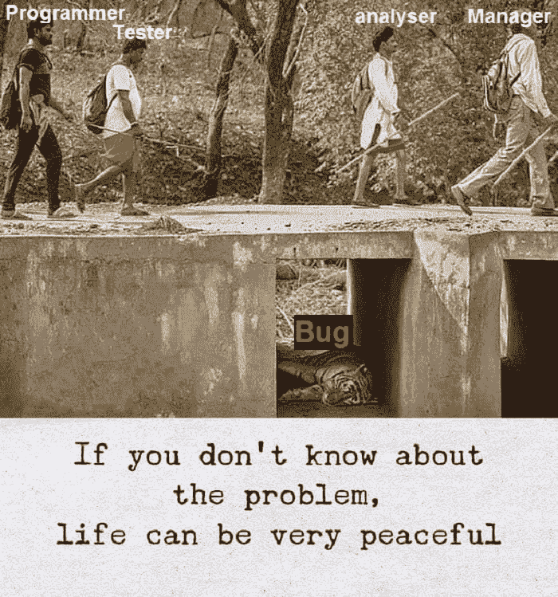
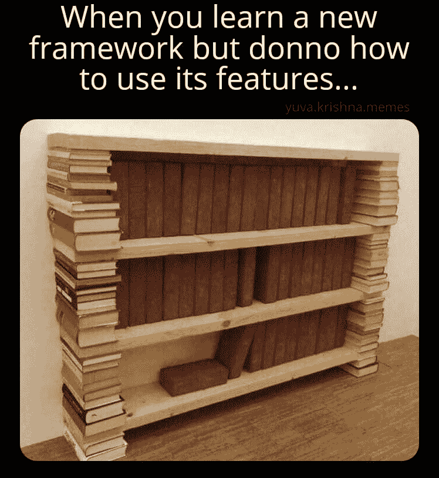
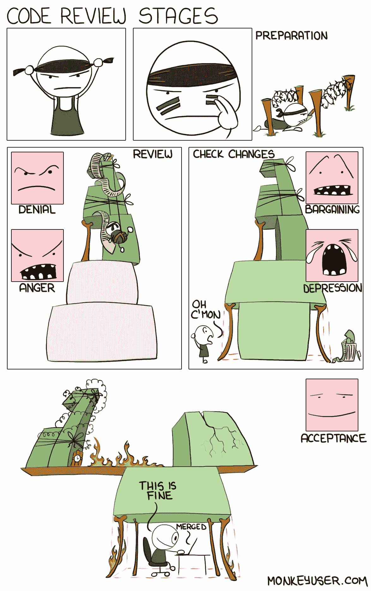

# 日常的编程笑话

> 原文：<https://javascript.plainenglish.io/daily-dose-of-programming-jokes-b9b5b8aa09ed?source=collection_archive---------8----------------------->

## 日常节目幽默

## 最佳编程迷因汇编(第三部分)

Photo by [Caroline Hernandez](https://unsplash.com/@carolinehdz?utm_source=medium&utm_medium=referral) on [Unsplash](https://unsplash.com?utm_source=medium&utm_medium=referral)

***模因和快乐有什么联系吗？*** 如果你是我这种类型的人，那么你可能也爱在下班后查看手机。猜猜我在那里看到了什么？

我主要是在互联网上看到**视频、抖音和模因**。我不知道为什么，但这有助于我提神醒脑，减轻工作压力。这就是为什么我相信 *laugher 是人类最好的刷新按钮。*

在这篇文章中，我收集了一些我喜欢的网络迷因。

# 丑陋的事实…

[https://www.facebook.com/DZoneInc/photos/a.336758034711/10159517902774712/](https://www.facebook.com/DZoneInc/photos/a.336758034711/10159517902774712/)

# 让我们找到错误的根本原因…时间到了…

[https://www.monkeyuser.com/2018/root-cause/?sc=true&dir=random](https://www.monkeyuser.com/2018/root-cause/?sc=true&dir=random)

# 你的地址是什么？我的是…

[https://www.facebook.com/photo?fbid=4265063180221311&set=gm.2872966899620618](https://www.facebook.com/photo?fbid=4265063180221311&set=gm.2872966899620618)

# 我的代码感觉不好，如果我怀疑他…

[https://www.facebook.com/photo?fbid=1741999619316996&set=gm.2873716776212297](https://www.facebook.com/photo?fbid=1741999619316996&set=gm.2873716776212297)

# 不要挑战程序员的幽默

[https://www.reddit.com/r/ProgrammerHumor/comments/okr5j0/programmers_humor_touching_the_sky/](https://www.reddit.com/r/ProgrammerHumor/comments/okr5j0/programmers_humor_touching_the_sky/)

# 我随时准备释放…

[https://www.reddit.com/r/ProgrammerHumor/comments/okcd9m/minimum_viable_product/](https://www.reddit.com/r/ProgrammerHumor/comments/okcd9m/minimum_viable_product/)

# 如果它不起作用，让我们用更高的优先级来修复错误…

[https://programmerhumor.io/programming-memes/daily-life/](https://programmerhumor.io/programming-memes/daily-life/)

# 硬编码变量就像

[https://programmerhumor.io/programming-memes/hard-coding-variables-be-like-2/](https://programmerhumor.io/programming-memes/hard-coding-variables-be-like-2/)

# 太具体的建议…

[https://programmerhumor.io/programming-memes/that-felt-a-little-bit-too-specific/](https://programmerhumor.io/programming-memes/that-felt-a-little-bit-too-specific/)

# 奖励时间:

# 通常发生在我周五工作并为客户做演示的时候…

[https://www.facebook.com/ProgrammersCreateLife/photos/a.241809332534619/3750971258285058/](https://www.facebook.com/ProgrammersCreateLife/photos/a.241809332534619/3750971258285058/)

# 有时初级开发人员知道得更多…

[https://www.facebook.com/DZoneInc/photos/a.336758034711/10159280091324712](https://www.facebook.com/DZoneInc/photos/a.336758034711/10159280091324712)

# 我根据项目购买课程，当我按照这样的指示结束时…

[https://www.facebook.com/javascriptJS/photos/a.1387402908063976/2172042662933326/](https://www.facebook.com/javascriptJS/photos/a.1387402908063976/2172042662933326/)

# 当我试图修复一个让事情变得更糟的小错误时…

[https://www.quora.com/What-are-the-best-programming-comic-strips](https://www.quora.com/What-are-the-best-programming-comic-strips)

# 总有一些隐藏的错误..不要打扰他们…

[https://www.facebook.com/ProgrammersCreateLife/photos/a.241809332534619/3817315068317343/](https://www.facebook.com/ProgrammersCreateLife/photos/a.241809332534619/3817315068317343/)

# 当我的教练问我最喜欢哪台机器时…

[https://www.facebook.com/javascriptJS/photos/1833542923449970](https://www.facebook.com/javascriptJS/photos/1833542923449970)

# 星期五提前离开…

# 永远不要试图扰乱工作代码…

[https://www.facebook.com/javascriptJS/photos/1602108066593458](https://www.facebook.com/javascriptJS/photos/1602108066593458)

# 随着太多框架的出现…

[https://www.facebook.com/yuva.krishna.memes/photos/a.105527467815845/299995221702401/](https://www.facebook.com/yuva.krishna.memes/photos/a.105527467815845/299995221702401/)

# 当我的学长让我在代码中添加注释时…

[https://www.facebook.com/javascriptJS/photos/a.1387402908063976/2170533493084243/](https://www.facebook.com/javascriptJS/photos/a.1387402908063976/2170533493084243/)

# 添加所有东西，这样它就能在自动工具中捕捉到…

[https://www.reddit.com/r/ProgrammerHumor/comments/mnbgz1/knows_every_programming_language/](https://www.reddit.com/r/ProgrammerHumor/comments/mnbgz1/knows_every_programming_language/)

# 我最好的敌人是…

[https://www.facebook.com/DZoneInc/photos/10158920521754712](https://www.facebook.com/DZoneInc/photos/10158920521754712)

# 我不需要你…让我放下你，伙计…

[https://www.reddit.com/r/ProgrammerHumor/comments/oo16aa/im_sorry_dear_data/](https://www.reddit.com/r/ProgrammerHumor/comments/oo16aa/im_sorry_dear_data/)

# 不要教我写了什么…哈哈

[https://www.reddit.com/r/ProgrammerHumor/comments/oo4ttu/perplexed_obama/](https://www.reddit.com/r/ProgrammerHumor/comments/oo4ttu/perplexed_obama/)

# 需要经历几个阶段？

[https://www.monkeyuser.com/2017/code-review-stages/?sc=true&dir=random](https://www.monkeyuser.com/2017/code-review-stages/?sc=true&dir=random)

# 希望我的周期到达那里…但是如何？

[https://www.monkeyuser.com/2017/testing-vs-prod-env/?sc=true&dir=random](https://www.monkeyuser.com/2017/testing-vs-prod-env/?sc=true&dir=random)

# 我靠编程挣钱…

[https://www.facebook.com/photo/?fbid=349251050087280&set=gm.1262598024177843](https://www.facebook.com/photo/?fbid=349251050087280&set=gm.1262598024177843)

# 一切皆有可能…

[https://www.facebook.com/techwithcodex/photos/a.137007467972178/331986501807606/](https://www.facebook.com/techwithcodex/photos/a.137007467972178/331986501807606/)

# 不要和我有眼神接触..我是最棒的…哈哈

[https://twitter.com/MayaShavin/status/1414659230833971205/photo/1](https://twitter.com/MayaShavin/status/1414659230833971205/photo/1)

# 没有布尔怎么有主见？

[https://twitter.com/realColinMac/status/1375360353442295811/photo/1](https://twitter.com/realColinMac/status/1375360353442295811/photo/1)

# 同辈压力？他会让我们的周末变得很糟糕…

[https://imgur.com/t/funny/Mk5F6E1](https://imgur.com/t/funny/Mk5F6E1)

# **请随意分享您宝贵的掌声和评论，这样我将来可以提供更多类似的内容。**

 [## 日常的编程笑话

### 最佳编程迷因汇编(第 4 部分)

javascript.plainenglish.io](/daily-dose-of-programming-jokes-6541eba98194)  [## 11 个让你笑死的编程笑话

### 2021 年最佳编程迷因

javascript.plainenglish.io](/11-programming-jokes-that-will-make-you-die-laughing-df41d5547f11)  [## 2021 年最佳编程幽默汇编

### 编程迷因可以减轻你的压力

blog.devgenius.io](https://blog.devgenius.io/best-programming-humor-compilations-2021-623473bfb0d)  [## 有趣的编程迷因会让你笑死

### 编笑话来点亮你的周五

blog.devgenius.io](https://blog.devgenius.io/funny-programming-memes-that-will-make-you-die-laughing-1ccd8e139040)  [## 编程迷因和幸福之间的联系

### 2021 年最佳编程迷因汇编

blog.devgenius.io](https://blog.devgenius.io/the-connection-between-programming-memes-and-happiness-d768ab85b83d)  [## 10 个能让你心情轻松的最佳编程笑话

### 你读过的关于编程迷因 2021 的最不可思议的文章

medium.com](https://medium.com/geekculture/10-best-programming-jokes-to-lighten-up-your-mood-8870dab2bff7)  [## 日常的编程笑话

### 最佳编程迷因汇编(第 1 部分)

javascript.plainenglish.io](/daily-dose-of-programming-jokes-cb9b74fcfa2e) 

*更多内容看*[***plain English . io***](http://plainenglish.io/)