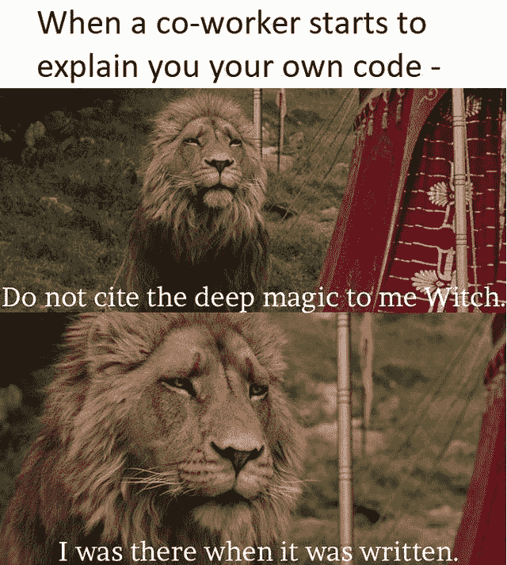

# 日常的编程笑话

> 原文：<https://javascript.plainenglish.io/daily-dose-of-programming-jokes-cb9b74fcfa2e?source=collection_archive---------11----------------------->

## 最佳编程迷因汇编(第 1 部分)

Photo by [Yoann Boyer](https://unsplash.com/@yoannboyer?utm_source=medium&utm_medium=referral) on [Unsplash](https://unsplash.com?utm_source=medium&utm_medium=referral)

***模因和快乐有什么联系吗？*** 如果你是我这种类型的人，那么你可能也爱在下班后查看手机。猜猜我在那里看到了什么？

我主要是在互联网上看到**视频、抖音和模因**。我不知道为什么，但这有助于我提神醒脑，减轻工作压力。这就是为什么我相信 *laugher 是人类最好的刷新按钮。*

在这篇文章中，我收集了一些我喜欢的网络迷因。

# 他们嫉妒我的幸福

[https://www.reddit.com/r/ProgrammerHumor/comments/oiiwi3/there_goes_away_one_more_sunday/](https://www.reddit.com/r/ProgrammerHumor/comments/oiiwi3/there_goes_away_one_more_sunday/)

# 不正确，但是让我们想想…

[https://www.reddit.com/r/ProgrammerHumor/comments/oinxee/the_truth_can_hurt_sometimes/](https://www.reddit.com/r/ProgrammerHumor/comments/oinxee/the_truth_can_hurt_sometimes/)

# 我到底做了什么来解决这个问题…也许什么也没做…

[https://www.reddit.com/r/ProgrammerHumor/comments/oimbw6/things_that_magically_work_but_you_dont_know_why/](https://www.reddit.com/r/ProgrammerHumor/comments/oimbw6/things_that_magically_work_but_you_dont_know_why/)

# 你需要学习交易…来处理 API

[https://www.reddit.com/r/ProgrammerHumor/comments/ohh9nv/200_ok/](https://www.reddit.com/r/ProgrammerHumor/comments/ohh9nv/200_ok/)

# 还有谁会因为认为警告有助于节省时间而忽视警告呢？

[https://www.reddit.com/r/ProgrammerHumor/comments/ofeexz/inner_peace/](https://www.reddit.com/r/ProgrammerHumor/comments/ofeexz/inner_peace/)

# 单元测试意味着增加覆盖率……(有时)

[https://www.reddit.com/r/ProgrammerHumor/](https://www.reddit.com/r/ProgrammerHumor/)

# 人工智能出错

[https://www.reddit.com/r/ProgrammerHumor/comments/ojf2eu/ai/](https://www.reddit.com/r/ProgrammerHumor/comments/ojf2eu/ai/)

# 重新编译…我怎么总是忘记？

[https://www.reddit.com/r/ProgrammerHumor/comments/ojdicf/it_happened_more_than_once/](https://www.reddit.com/r/ProgrammerHumor/comments/ojdicf/it_happened_more_than_once/)

# 一些噩梦…还是现实？

[https://www.monkeyuser.com/2019/great-expectations/?sc=true&dir=random](https://www.monkeyuser.com/2019/great-expectations/?sc=true&dir=random)

# 奖金时间

# 浏览量每天都在增加，是的，人们好奇的看着，怎么会有人这么做呢？英雄联盟

[https://www.facebook.com/ProgrammersCreateLife/](https://www.facebook.com/ProgrammersCreateLife/)

# 打算买床垫？像问答一样思考…这将有助于:D

[https://www.monkeyuser.com/](https://www.monkeyuser.com/)

# 这种情况经常发生…风扇会启动，声音会出现…

[https://www.quora.com/What-are-some-of-the-best-programmer-jokes-and-memes-out-there](https://www.quora.com/What-are-some-of-the-best-programmer-jokes-and-memes-out-there)

# 你的愿望是什么？无 Bug 代码？抱歉 404:未找到

[https://www.facebook.com/techindustan/](https://www.facebook.com/techindustan/)

# 那种只有你的人能理解你的感觉…

[https://www.facebook.com/programminggeeks.in](https://www.facebook.com/programminggeeks.in)

# 当你有很多东西在桶里的时候，没有时间工作…

Source:[https://www.monkeyuser.com/](https://www.monkeyuser.com/)

# 当每个人都建议添加一些功能来美化网站时..结局会是这样的…

[https://www.monkeyuser.com/](https://www.monkeyuser.com/)

# 只有戴眼镜的人才能感受到这一点…

[https://www.facebook.com/JokesTechnical](https://www.facebook.com/JokesTechnical)

# 对不起，这种事不会再发生了..欢迎好友…

[https://www.facebook.com/DZoneInc/photos/10158894902394712](https://www.facebook.com/DZoneInc/photos/10158894902394712)

# 当初级开发给出评估时…项目经理也有同样的感觉…

[https://www.facebook.com/javascriptJS/photos/1559356324201966](https://www.facebook.com/javascriptJS/photos/1559356324201966)

## 请请帮帮我…哈哈…

## 新发明…

## 唯一的焦点应该是代码…如果它不起作用，那么让我们检查语句…

## 简单……不过，让我们问问……

## 又一个可怜的 PJ…

## 这并不总是真的…哈哈

## 新标题…

## 不能这样…我要我的额头…

## 您想在 StackOverflow 上更改什么？

## 完美的异常处理…

# 我不需要你…让我放下你，伙计…

[https://www.reddit.com/r/ProgrammerHumor/comments/oo16aa/im_sorry_dear_data/](https://www.reddit.com/r/ProgrammerHumor/comments/oo16aa/im_sorry_dear_data/)

# 不要教我写了什么…哈哈

[https://www.reddit.com/r/ProgrammerHumor/comments/oo4ttu/perplexed_obama/](https://www.reddit.com/r/ProgrammerHumor/comments/oo4ttu/perplexed_obama/)

# 需要经历几个阶段？

[https://www.monkeyuser.com/2017/code-review-stages/?sc=true&dir=random](https://www.monkeyuser.com/2017/code-review-stages/?sc=true&dir=random)

# 希望我的周期到达那里…但是如何？

[https://www.monkeyuser.com/2017/testing-vs-prod-env/?sc=true&dir=random](https://www.monkeyuser.com/2017/testing-vs-prod-env/?sc=true&dir=random)

# 我靠编程挣钱…

[https://www.facebook.com/photo/?fbid=349251050087280&set=gm.1262598024177843](https://www.facebook.com/photo/?fbid=349251050087280&set=gm.1262598024177843)

# 一切皆有可能…

[https://www.facebook.com/techwithcodex/photos/a.137007467972178/331986501807606/](https://www.facebook.com/techwithcodex/photos/a.137007467972178/331986501807606/)

# 不要和我有眼神接触..我是最棒的…哈哈

[https://twitter.com/MayaShavin/status/1414659230833971205/photo/1](https://twitter.com/MayaShavin/status/1414659230833971205/photo/1)

# 没有布尔怎么有主见？

[https://twitter.com/realColinMac/status/1375360353442295811/photo/1](https://twitter.com/realColinMac/status/1375360353442295811/photo/1)

# 同辈压力？他会让我们的周末变得很糟糕…

[https://imgur.com/t/funny/Mk5F6E1](https://imgur.com/t/funny/Mk5F6E1)

# **请随意分享您宝贵的掌声和评论，这样我将来可以提供更多类似的内容。**

 [## 日常的编程笑话

### 最佳编程迷因汇编(第 4 部分)

javascript.plainenglish.io](/daily-dose-of-programming-jokes-6541eba98194)  [## 2021 年最佳编程幽默汇编

### 编程迷因可以减轻你的压力

blog.devgenius.io](https://blog.devgenius.io/best-programming-humor-compilations-2021-623473bfb0d)  [## 有趣的编程迷因会让你笑死

### 编笑话来点亮你的周五

blog.devgenius.io](https://blog.devgenius.io/funny-programming-memes-that-will-make-you-die-laughing-1ccd8e139040)  [## 编程迷因和幸福之间的联系

### 2021 年最佳编程迷因汇编

blog.devgenius.io](https://blog.devgenius.io/the-connection-between-programming-memes-and-happiness-d768ab85b83d)  [## 10 个能让你心情轻松的最佳编程笑话

### 你读过的关于编程迷因 2021 的最不可思议的文章

medium.com](https://medium.com/geekculture/10-best-programming-jokes-to-lighten-up-your-mood-8870dab2bff7)  [## 日常的编程笑话

### 最佳编程迷因汇编(第 1 部分)

javascript.plainenglish.io](/daily-dose-of-programming-jokes-cb9b74fcfa2e) 

*更多内容看*[***plain English . io***](http://plainenglish.io/)