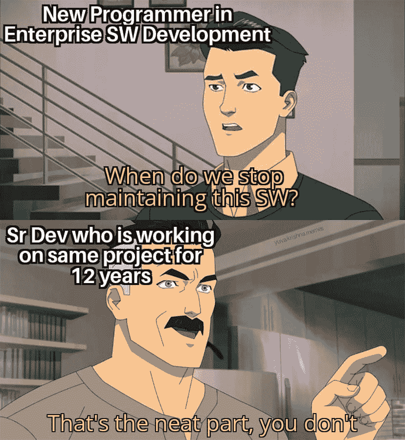
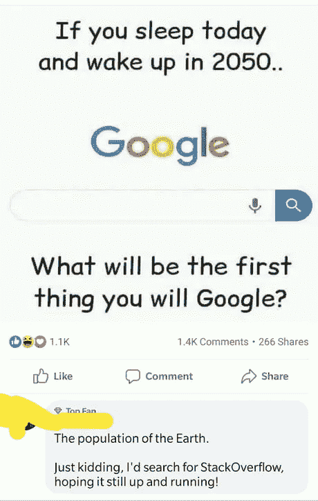
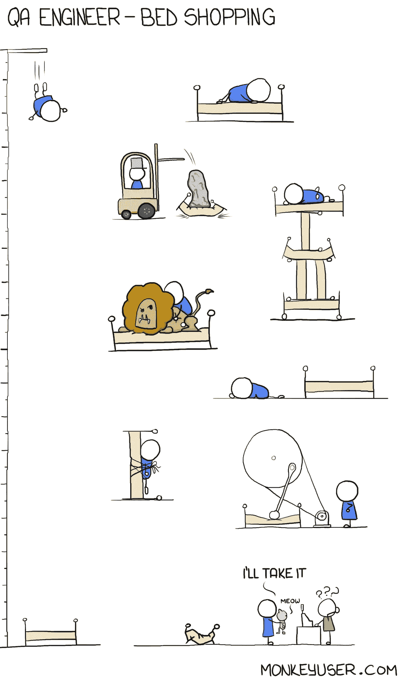
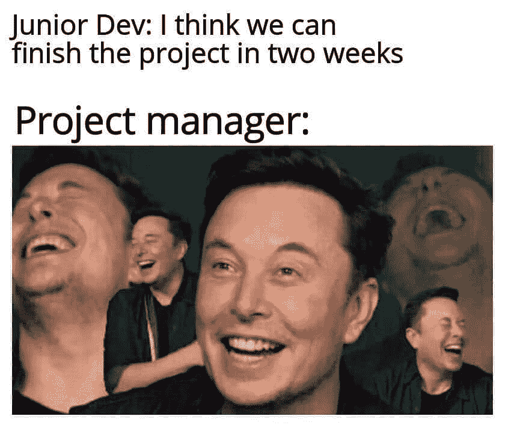

# 日常的编程笑话

> 原文：<https://javascript.plainenglish.io/daily-dose-of-programming-jokes-e828999da74d?source=collection_archive---------11----------------------->

## 程序员动机的每周照片

## 最佳编程迷因汇编(第 11 部分)

Photo by [Tim Mossholder](https://unsplash.com/@timmossholder?utm_source=medium&utm_medium=referral) on [Unsplash](https://unsplash.com?utm_source=medium&utm_medium=referral)

***模因和快乐有什么联系吗？*** 如果你是我这种类型的人，那么你可能也爱在下班后查看手机。猜猜我在那里看到了什么？

我主要是在互联网上看到**视频、抖音和模因**。我不知道为什么，但这有助于我提神醒脑，减轻工作压力。这就是为什么我相信 *laugher 是人类最好的刷新按钮。*

在这篇文章中，我收集了一些我喜欢的网络迷因。

# 我的生活问题…

[https://www.facebook.com/DZoneInc/photos/a.336758034711/10159553517674712/](https://www.facebook.com/DZoneInc/photos/a.336758034711/10159553517674712/)

# 当我和朋友谈论 JavaScript 和 Java 时，这种情况经常发生

[https://www.facebook.com/yuva.krishna.memes/photos/a.105527467815845/385113166523939/](https://www.facebook.com/yuva.krishna.memes/photos/a.105527467815845/385113166523939/)

# 如果你参加所有的产品会议，这意味着你知道一切…你是救世主…

[https://www.facebook.com/yuva.krishna.memes/photos/a.105527467815845/384661446569111/](https://www.facebook.com/yuva.krishna.memes/photos/a.105527467815845/384661446569111/)

# 我们能不能停止维护这个软件…

[https://www.facebook.com/yuva.krishna.memes/photos/a.105527467815845/384653033236619/](https://www.facebook.com/yuva.krishna.memes/photos/a.105527467815845/384653033236619/)

# 其中一个拙劣的笑话…

[https://www.facebook.com/photo/?fbid=4381277188618065&set=gm.6507842149241514](https://www.facebook.com/photo/?fbid=4381277188618065&set=gm.6507842149241514)

# LOL…安全测试是最差的…

[https://www.facebook.com/photo/?fbid=1286443845117522&set=gm.847086009343989](https://www.facebook.com/photo/?fbid=1286443845117522&set=gm.847086009343989)

# 有意义的信息。

[https://www.facebook.com/codevweb95/photos/a.109799858049136/118691307159991/](https://www.facebook.com/codevweb95/photos/a.109799858049136/118691307159991/)

# 不同的体验，不同的击球方式…

[https://www.facebook.com/coder724/photos/gm.1181013739084032/395320245487954/](https://www.facebook.com/coder724/photos/gm.1181013739084032/395320245487954/)

# 你在寻找什么？用叉子移除孩子？

[https://www.facebook.com/coder724/photos/gm.1181201935731879/395512935468685/](https://www.facebook.com/coder724/photos/gm.1181201935731879/395512935468685/)

> 奖金时间

# 不需要信任…我知道你总是对的…

# 发生了很多…问了一个非常愚蠢的问题，但专家很乐意提供详细的答案…

# 耶！最好这样做，否则，你会因为重复的问题标志而失去一些分数…

# 当一个人经历一些事情时，心跳会加快…

# 绝对需要一个每天早晚都能给我袖手旁观的人…

# 浏览量每天都在增加，是的，人们好奇的看着，怎么会有人这么做呢？英雄联盟

[https://www.facebook.com/ProgrammersCreateLife/](https://www.facebook.com/ProgrammersCreateLife/)

# 打算买个床垫？像问答一样思考…这将有助于:D

[https://www.monkeyuser.com/](https://www.monkeyuser.com/)

# 这种情况经常发生…风扇会启动，声音会出现…

[https://www.quora.com/What-are-some-of-the-best-programmer-jokes-and-memes-out-there](https://www.quora.com/What-are-some-of-the-best-programmer-jokes-and-memes-out-there)

# 你的愿望是什么？无 Bug 代码？抱歉 404:未找到

[https://www.facebook.com/techindustan/](https://www.facebook.com/techindustan/)

# 那种只有你的人能理解你的感觉…

[https://www.facebook.com/programminggeeks.in](https://www.facebook.com/programminggeeks.in)

# 当你有很多东西在桶里的时候，没有时间工作…

Source:[https://www.monkeyuser.com/](https://www.monkeyuser.com/)

# 当每个人都建议添加一些功能来美化网站时...结局会是这样的…

[https://www.monkeyuser.com/](https://www.monkeyuser.com/)

# 只有戴眼镜的人才能感受到这一点…

[https://www.facebook.com/JokesTechnical](https://www.facebook.com/JokesTechnical)

# 对不起，这种事不会再发生了…欢迎朋友…

[https://www.facebook.com/DZoneInc/photos/10158894902394712](https://www.facebook.com/DZoneInc/photos/10158894902394712)

# 当初级开发给出评估时…项目经理也有同样的感觉…

[https://www.facebook.com/javascriptJS/photos/1559356324201966](https://www.facebook.com/javascriptJS/photos/1559356324201966)

# 进一步阅读

 [## 有趣的编程迷因会让你笑死

### 编笑话来点亮你的周五

blog.devgenius.io](https://blog.devgenius.io/funny-programming-memes-that-will-make-you-die-laughing-1ccd8e139040)  [## 编程迷因和幸福之间的联系

### 2021 年最佳编程迷因汇编

blog.devgenius.io](https://blog.devgenius.io/the-connection-between-programming-memes-and-happiness-d768ab85b83d)  [## 10 个能让你心情轻松的最佳编程笑话

### 你读过的关于编程迷因 2021 的最不可思议的文章

medium.com](https://medium.com/geekculture/10-best-programming-jokes-to-lighten-up-your-mood-8870dab2bff7)  [## 日常的编程笑话

### 最佳编程迷因汇编(第 1 部分)

javascript.plainenglish.io](/daily-dose-of-programming-jokes-cb9b74fcfa2e) 

*更多内容请看*[***plain English . io***](http://plainenglish.io/)