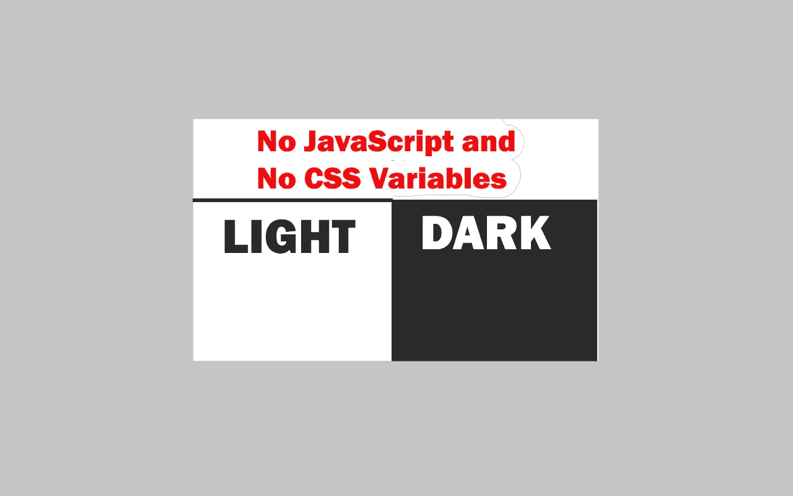

# 无 JavaScript 的黑暗模式开关

> 原文：<https://javascript.plainenglish.io/dark-mode-switch-without-javascript-112e65e6a1e3?source=collection_archive---------4----------------------->

## 我们来做一个没有 JavaScript，没有 CSS 变量的黑暗模式切换。



Image created with ❤️️ By author.

黑暗模式功能是目前你可以添加到你的网站上的重要功能之一。用户在使用您的网站或 web 应用程序时需要此功能来保护他们的眼睛，尤其是在晚上。所以，如果你想为你的用户提供良好的体验，这是非常有用的。

在本文中，我们将只使用 CSS 复选框输入来进行亮/暗模式切换，而不使用任何 JavaScript。让我们开始吧。

# 超文本标记语言

在 HTML 中，我们将有一个 checkbox 类型的输入和一个包含一些文本的容器 div。

下面是代码示例:

```
<body>
    **<input type="checkbox" id="checkbox">** **<div class="container">**
        <h1>Dark Mode Example</h1>
        <p>Lorem ipsum dolor sit amet, consectetur adipiscing elit. Nullam nec justo a nulla fermentum scelerisque. Ut molestie est
        eu ipsum viverra, volutpat euismod erat fringilla. Aliquam ac vulputate massa. Nunc lobortis diam libero, in molestie
        mauris cursus in. Nulla facilisi. Etiam congue libero nec lectus aliquet, et pharetra nisi faucibus. Ut dictum lorem id
        ante consequat sollicitudin. Pellentesque euismod, magna vel pellentesque tincidunt, nisi ante ultrices ante, ut
        tincidunt mauris dui a nulla. Aenean aliquam imperdiet nulla id maximus. Nullam vel aliquet turpis. Sed quis quam sit
        amet magna fringilla congue id quis felis. Donec ultricies elementum velit, eu sodales magna molestie vitae. Vestibulum
        venenatis felis eu consequat suscipit. Phasellus interdum tincidunt justo, nec finibus turpis hendrerit ac. Vivamus non
        felis orci.</p>
    **</div>**
</body>
```

如你所见，为了简单起见，我们在 HTML 中只使用了简单的文本。因此，每当复选框被切换时，我们将在暗模式和亮模式之间切换。我们不会使用 CSS 变量。

您可以在下面的代码栏中查看上述 HTML 的输出:

Codepen by author.

# CSS 部分

现在让我们使用 CSS 来设计元素的样式。首先，我们将设置一些基本的样式。

这里有一个例子:

```
*{
    margin: 0;
    padding: 0;
    box-sizing: border-box;
    font-family: sans-serif;
}body{
    height: 100vh;
    display: flex;
    align-items: center;
    justify-content: center;
}.container{
    width: 100%;
    height: 100%;
    padding: 80px 20px;
    transition: .4s ease;
}
.container h1{
    text-align: center;
}
.container p{
    padding: 30px 0;
}
```

之后，我们需要设置复选框的样式，以便在亮暗模式之间切换。

```
/* Styling the checkbox input */**#checkbox**{
    position: fixed;
    top: 20px;
    right: 20px;
    appearance: none;
    -webkit-appearance : none;
    -moz-appearance : none;
    -o-appearance : none;
    width: 80px;
    height: 40px;
    background: black;
    border-radius: 22px;
    cursor: pointer;
    outline: none;
}/* styling the circle inside the checkbox input */**#checkbox::before**{
    content: '';
    position: absolute;
    width: 40px;
    height: 35px;
    background-color:white;
    border-radius: 35px;
    top: 2px;
    left: 2px;
    cursor: pointer;
    transition: .3s linear;
}
```

然后，当复选框被切换时，我们将使用 CSS 伪元素`:checked`来改变页面的背景和颜色。

下面是代码示例:

```
/* Switching to the dark when the checkbox is toggled */**#checkbox:checked + .container**{
  background: rgb(19, 18, 18);
  color: white;
}
```

当用户切换复选框时，我们还需要为它添加一些额外的样式。

```
/* moving the checkbox circle when it's toggled by the user */**#checkbox:checked::before**{
    left: 40px;
}/* changing the color of the checkbox when it's toggled */**#checkbox:checked**{
    background: rgb(12, 177, 81);
}
```

就这样，我们做了一个简单的黑暗模式功能，没有使用 JavaScript，也没有 CSS 变量。

下面是一个 Codepen 示例来验证这一点:

Codepen by author.

# 结论

正如您所看到的，我们通过使用一个带有复选框类型的输入，实现了一个简单的亮/暗模式切换。这是一个有用的提示，我想与你分享。

感谢您阅读这篇文章。希望你觉得有用。

**更多阅读**

[](/the-ultimate-react-developer-roadmap-for-2021-a68c7fa56734) [## 2021 年 React 开发者终极路线图

### 成为现代 React 开发人员的逐步指南

javascript.plainenglish.io](/the-ultimate-react-developer-roadmap-for-2021-a68c7fa56734) 

*还有，如果你对 JavaScript 和 web 开发相关的更有用的内容感兴趣，可以* [*订阅*](https://mehdiouss.ck.page/) *我的快讯。*