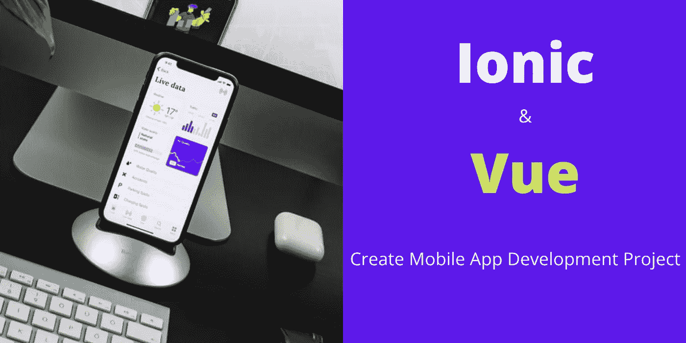
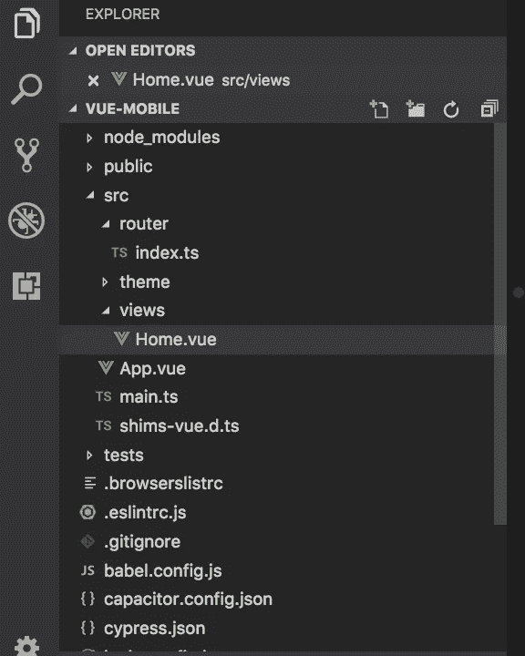
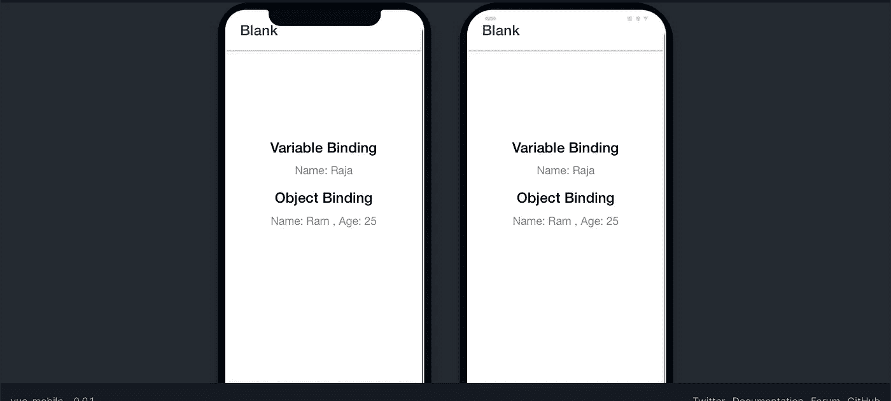
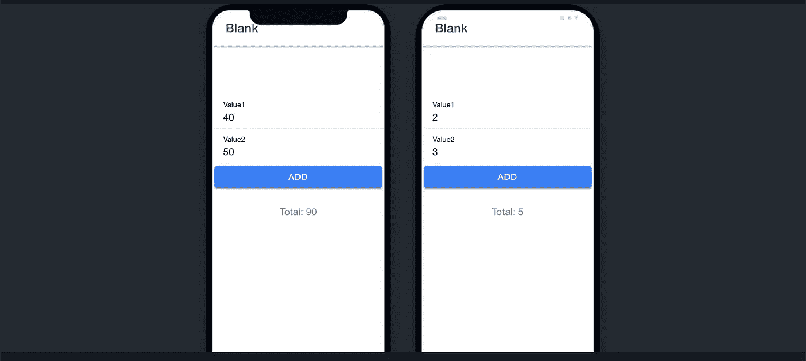

# 数据绑定、事件绑定— Ionic 和 Vue |混合移动应用

> 原文：<https://javascript.plainenglish.io/data-binding-event-binding-ionic-and-vue-hybrid-mobile-application-52059ff8cdee?source=collection_archive---------9----------------------->

使用 Ionic 和 Vue 创建一个移动应用项目。通过用按钮点击事件做简单的加法来学习数据和事件绑定。



Ionic 是一个混合移动应用框架。我们可以使用 Ionic 框架创建 **Android** 和 **iOS** 应用。最初，创建 Ionic 框架只是为了支持 **Angular** 。现在他们也支持 **React** 和 **Vue** 。所以我们可以使用 Vue 创建一个移动应用程序。混合移动应用将减少开发时间和开发成本。

在本教程中，我们将涵盖以下主题。

1.  如何使用 Vue 创建一个 Ionic 项目？。
2.  离子项目的结构。
3.  数据绑定。
4.  双向数据绑定。
5.  单击事件绑定。

# **先决条件**

你需要 **Node.js** 来使用 Ionic。使用下面的链接下载并安装 Node.js。

[](https://nodejs.org/en/download/) [## 下载| Node.js

### Node.js 是基于 Chrome 的 V8 JavaScript 引擎构建的 JavaScript 运行时。

nodejs.org](https://nodejs.org/en/download/) 

# **安装离子**

我们可以使用 npm 安装离子框架。使用以下命令在命令提示符或终端上安装 Ionic。

```
npm install -g @ionic/cli
```

以上命令将安装 Ionic。这需要一些时间，取决于你的网速。

# **创建离子项目**

我们已经安装了离子型。现在我们可以使用下面的命令创建 Ionic Vue 项目。

```
ionic start --type=vue
```

1.  **离子启动** = >标准命令创建一个项目。
2.  用于告诉 Ionic CLI 创建一个 vue 项目。为什么因为离子支持角和反应。所以有必要提一下 vue。
3.  在终端上执行命令后，它会要求您输入**项目名称**。
4.  然后它会要求您选择项目模板。选择**空白**项目

从网上下载需要的文件需要一些时间。下载完成后，使用 VS 代码编辑器(可以使用任何编辑器)打开项目文件夹。

# **离子 Vue 项目结构**



项目结构与 Vue web 应用程序结构非常相似。

1.  **App.vue** = >它是主文件，使用**<ion-router-outlet>**标签渲染所有组件输出。
2.  **router->index . ts**=>用于定义路由。默认情况下，主页被设置为根页面。您可以在 views 文件夹中找到 Home.vue。
3.  **视图文件夹** = >我们将只在这里创建所有的视图组件。

# **预览项目**

我们可以使用浏览器预览项目。它将渲染两个 Android iOS 视图。在您的项目终端中运行下面的命令，它将在浏览器中打开预览。

```
ionic serve --lab
```

**Android 和 iOS 在浏览器中的预览:**



**数据绑定:**

我们可以在**数据()**函数中定义我们的变量。看看下面**视图- > Home.vue** 文件中的代码。Home.vue 将 HTML、CSS 和 Vue JS 代码组合在一个文件中。

这里我声明了两个变量。

1.  **名称**是一个字符串变量
2.  而 **emp** 是一个对象变量。

我们可以使用**双花括号({{ }})** 显示(绑定)变量。所以在 Home.vue 的 HTML 部分使用下面的代码并保存它。它将自动呈现输出。

浏览器的输出:


# 双向数据绑定

双向数据绑定只不过是将变量与输入字段绑定在一起。在单向数据绑定中，我们将只显示变量值。在双向数据绑定中，我们也可以从 HTML 中更改值。我们可以使用 **v-model** 属性将变量绑定到输入字段。

要在 Ionic 中使用任何 UI 组件，我们必须导入它们。因此，在 Home.vue 文件中导入如下输入相关组件，并将该组件包含在**组件**部分中。

我们将使用两个数字做一个简单的加法。所以在 **data()** 部分创建三个变量。

1.  **值 1** 和**值 2** 变量用于表示输入字段。
2.  **total** 变量用于保存 value1 和 value2 的总和。

在 HTM 部分使用下面的代码创建输入字段，并使用 vue 的 **v-model** 属性绑定变量。

# **点击事件**

到目前为止，我们已经为加法创建了输入字段。现在创建一个按钮，并使用 **v-on:click** 属性绑定一个点击事件。复制下面的代码并粘贴到输入字段后。

然后在 Home.vue 文件的 ts 段创建一个 **add()** 函数。这些功能是在**方法**部分下创建的。

现在保存所有的更改。并且您可以使用浏览器测试该附加组件。

**加法的输出:**



**完整源代码链接:**

```
[https://github.com/bharathirajatut/ionic-vue/tree/main/data%20%26%20event%20binding%20example](https://github.com/bharathirajatut/ionic-vue/tree/main/data%20%26%20event%20binding%20example)
```

# **概要:**

这是一个关于如何使用 Ionic 和 Vue 创建移动应用项目的非常简单的教程。在这里，我们学习了三个主要概念。

1.  使用 v-model 属性的单向绑定
2.  使用 v-model 属性和输入字段的双向绑定。
3.  使用 v-on:click 属性的事件绑定。

希望这篇教程对你开启移动应用开发之旅有所帮助。我打算为 Ionic 和 Vue 写更多的教程。敬请关注更多文章。

感谢您的阅读。