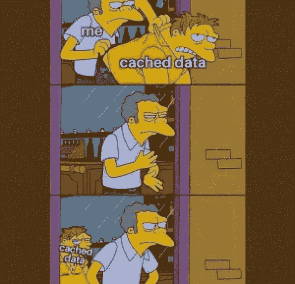
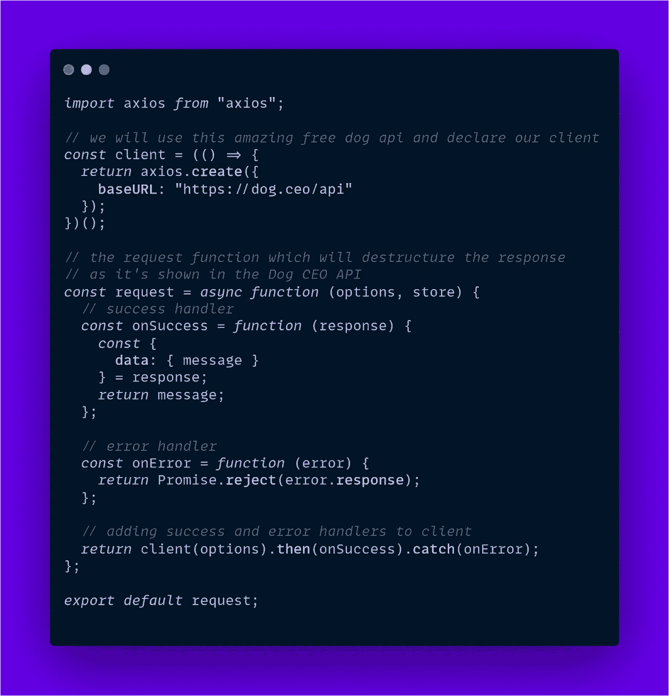
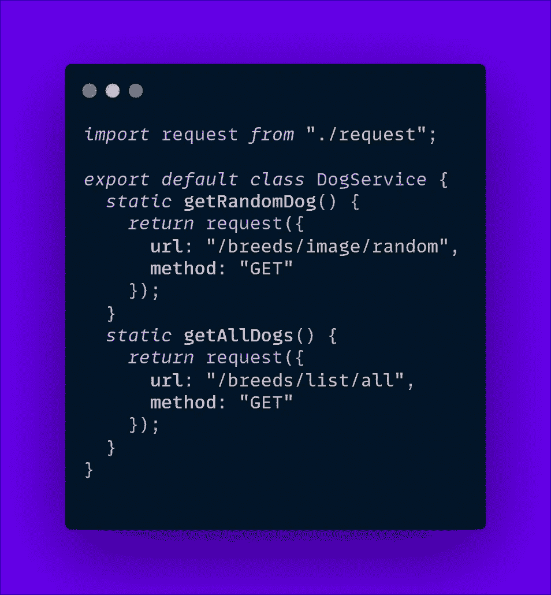
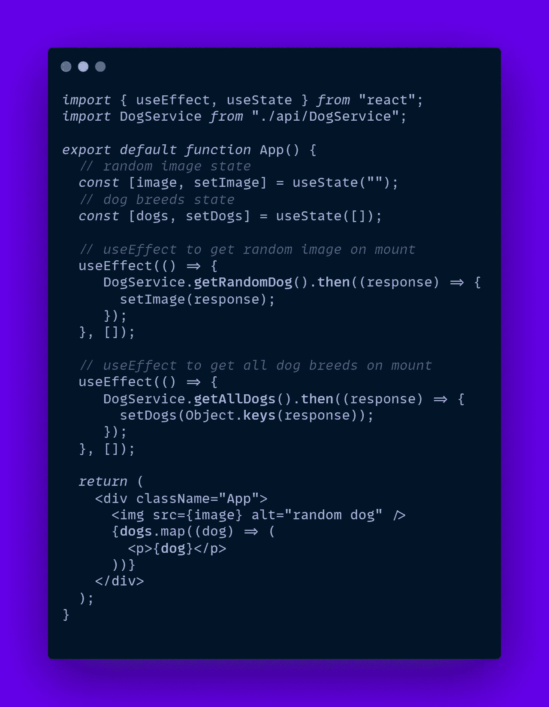
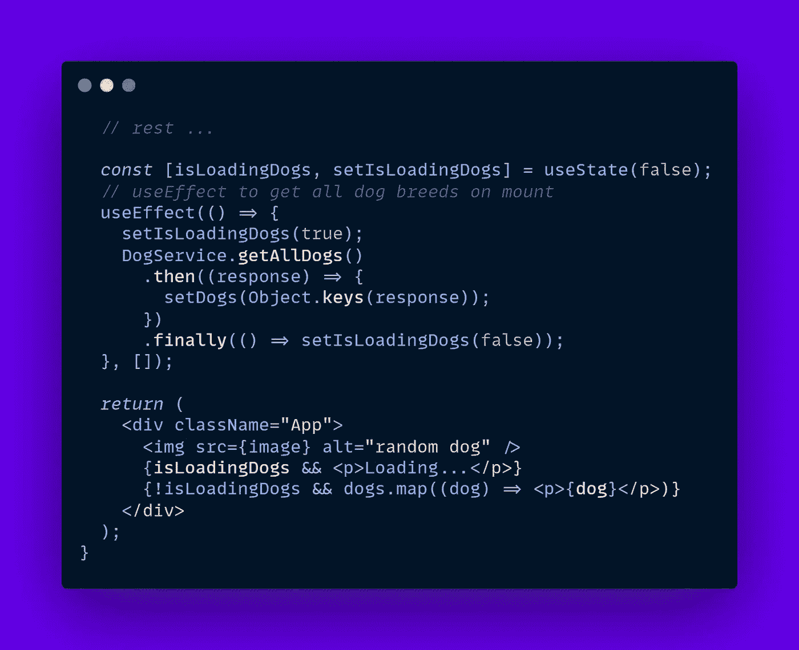
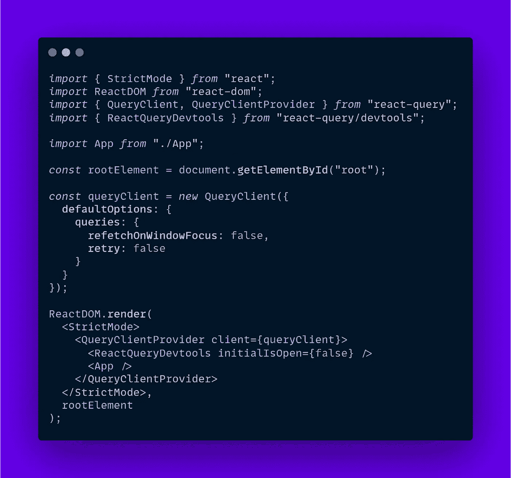
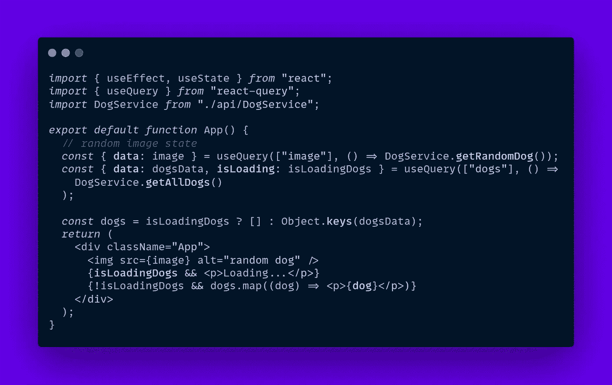
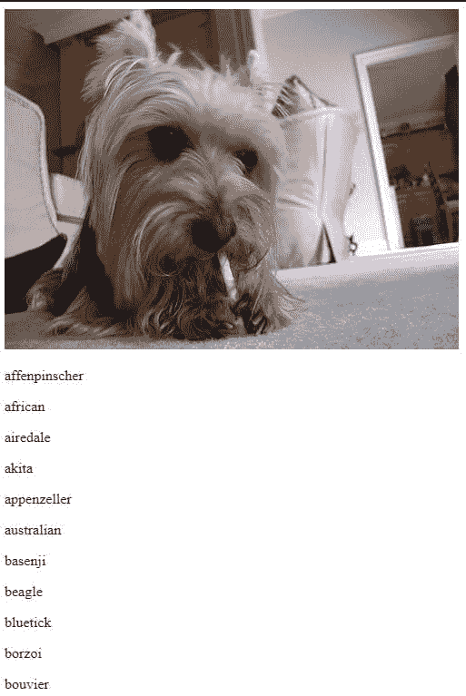
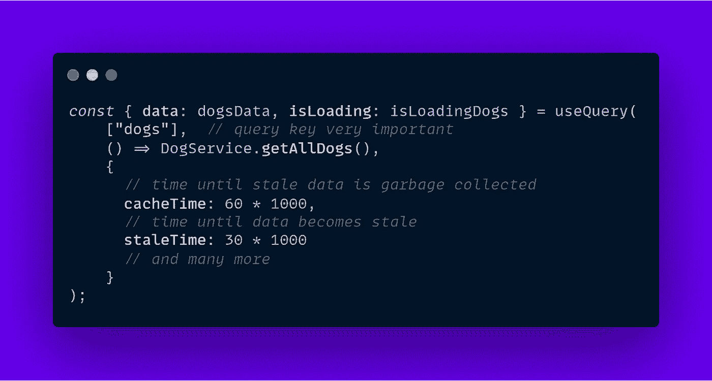

# 使用 React 查询和 Axios 获取数据

> 原文：<https://javascript.plainenglish.io/data-fetching-with-react-query-axios-257a95c86e77?source=collection_archive---------1----------------------->

## 在 react-query 中为毛茸茸的 HTTP 请求实现钩子

有许多库提供了向前端发出 HTTP 请求的方法，但有一个库多年来一直是事实上的领导者，那就是 [Axios](https://axios-http.com/docs/intro) 。这是一个整洁的库，允许更结构化和更快速的开发，但最近出现了一个名为 [react-query](https://react-query.tanstack.com/) 的库。它是为 React 设计的，使用了钩子和提供者，这是 React 应用程序中一种更本地的方法，它很棒**。**

# **1.为什么不只用 Axios？**

**Axios 是一个可靠的库，不要误会我的意思，但是 react-query 提供了一个缓存机制，它的 API 对 react 用户非常友好。这并不意味着你不能同时使用两者，如果你想代替使用基于浏览器的获取 API。**

****

# ****2。Axios 基础服务****

**我们将使用伟大的[狗 CEO API](https://dog.ceo/dog-api/) 来显示一个随机的毛茸茸的朋友和一个列表🐶。我们希望在组件使用 Axios 的自定义请求函数装载和析构响应数据(消息)时发出请求。**

****

**然后我们可以定义一个 DogService 类，它将使用静态方法通过 Axios API 发出请求。**

****

**我们可以使用应用程序组件中的请求，并展示我们新发现的毛茸茸的朋友，如下所示:**

****

**如果我们想显示一个加载指示器，直到“getAllDogs()”请求完成，该怎么办？**

**我们需要添加一个 isLoading 状态变量，并在请求开始和完成时手动更新它。**

****

**此外，如果我们需要显示一个错误消息，我们必须定义另一个错误状态变量，并且必须为应用程序中的多个请求处理这些状态，这可能会变得相当混乱。**

# **3.React 查询实现**

**这很好，但我们可以通过使用 react-query 缓存“getAllDogs()”请求来改进它，这也将消除 useEffect 在 mount 上发出请求的需要，并包括 error、isLoading 值和许多其他有用的有状态变量。**

**更新应用程序根目录下的 index.js 文件，添加 react-query 使用的“QueryClientProvider ”,以使钩子在一些默认设置下全局可用。此外，我们将添加 ReactQueryDevtools 来轻松调试缓存状态。**

****

**之后，让我们用 useQuery 钩子修改应用程序组件:**

****

**这种方法更干净，我们毛茸茸的朋友比以往任何时候都更优化。**

****

**此外，我们可以添加选项来定制和提高我们的性能。**

****

**你可以在 react-query [的官方文档中找到更多细节，或者如果你想查看这个例子，可以查看这个](https://react-query.tanstack.com/overview)[代码沙箱](https://codesandbox.io/s/axios-react-query-pj9nl?file=/src/index.js:495-546)。**

> **我希望你喜欢这个简短的指南，如果你把💜这就去。**

***更多内容尽在*[***plain English . io***](http://plainenglish.io/)**