# 使用 Prisma 进行数据建模

> 原文：<https://javascript.plainenglish.io/data-modeling-with-prisma-5c4c37f31d8c?source=collection_archive---------1----------------------->


Photo by [Charles Deluvio](https://unsplash.com/@charlesdeluvio?utm_source=unsplash&utm_medium=referral&utm_content=creditCopyText) on [Unsplash](https://unsplash.com/s/photos/data?utm_source=unsplash&utm_medium=referral&utm_content=creditCopyText)

这是 Prisma 系列介绍文章的第三部分。如果你还没有看过以前的文章，你可以在下面找到它们。

*   [使用 Prisma 简化后端开发](/simplifying-backend-development-with-prisma-564200f31943)
*   [深入探究 Prisma 模式](/diving-into-prisma-schema-b278e92dff8b)

我们已经考虑了一个简单博客场景的数据库逻辑，其中有两个数据库实体。用户和帖子。

在这篇文章中，我们将采取一种实用的方法来调节这些实体。我们将关注可能发生的不同类型的数据库实体映射 Prisma schema 如何帮助您在这样的场景中摆脱沉重的负担。

因为我们在这篇文章中涉及的范围很广，所以我们不会考虑如何根据我们所做的改变来创建 CRUD 操作。但是你可以在我们之前使用的的[资源库中找到相关的分支代码。](https://github.com/Pasi-D/Prisma-Starter)

本文末尾的分支如下所示。

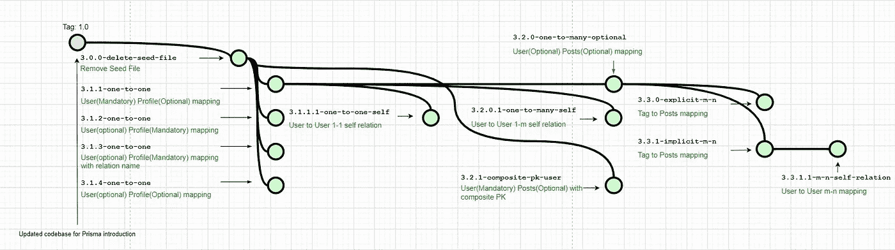

**If you’re seeing these branch names in comments of code segments used in this article that means you’ve reached up-to that point in the same git repository branch.**

根据基数[和基数](https://en.wikipedia.org/wiki/Cardinality_(data_modeling))的不同，可以有 3 种关系

1.  一对一(1-1)
2.  一对多(1 米)
3.  多对多(多对多)

我们将考虑这些关系类型中的每一种，并添加相关的修改。

# 一对一(一对一)关系

在修改中，我们将使用户和配置文件实体遵循一对一的映射。在这个过程中，我们也将改变用户实体中的一些属性。

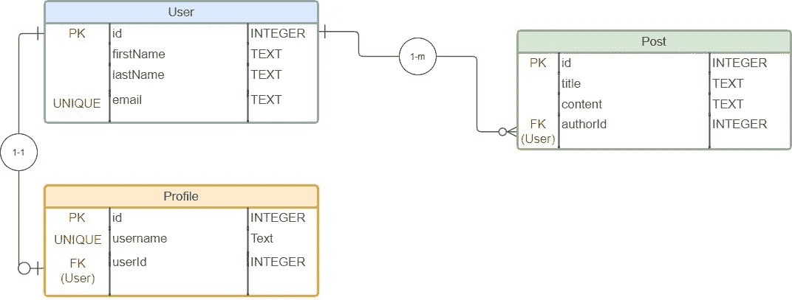

user-profile one to one mapping introduced to current ERD

一个用户记录可以有零到一个配置文件记录。配置文件记录必须有用户，否则无法创建。

user to profile 1–1 mapping

或者，您可以通过@relation 属性命名添加的外键约束。在这种情况下，两个模型都需要更新。

Optionally you can provide name to added foreign key constraint

让我们运行迁移&看看 SQL 查询是如何生成的。

```
npx prisma migrate dev --name “UserToProfile”
```

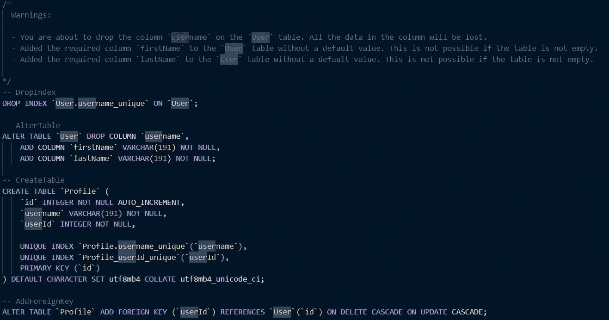

SQL queries generated for the user-profile migration

根据需要，为了创建用户，可以强制配置文件。

如果我们试图删除可选的类型修饰符，它将是无效的。

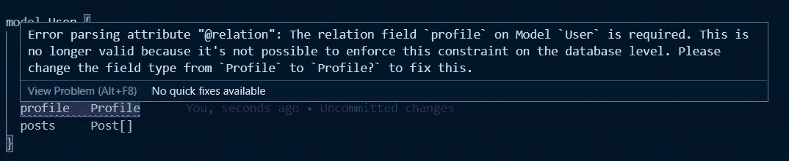

Removing optional modifier does not make the relationship mandatory

要从数据库级别做到这一点，我们需要在用户表中保留一个外键字段，如 ***profileId*** 。

因此，我们将在用户模型中添加一个标量字段***profile id****，该字段可以在 ***profile*** 关系字段&中引用。之前在 Profile 中添加的标量字段应被删除，使用户映射成为可选的。*

*User(optional) to Profile(Mandatory) 1–1 mapping*

*尝试进行此迁移时，系统会提示您一条警告。*

*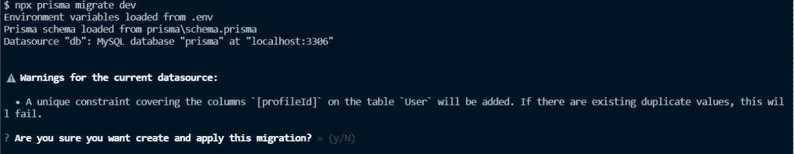*

*On attempting to run a migration, a warning is prompted to safeguard existing data*

*万一我们需要忽略以上任何一个条件。即独立地创建用户或简档记录&保持关系可选。*

*User(optional) to Profile(optional) 1–1 mapping*

> *D 选择实体以一对一映射的方式存储外键标量字段取决于您。*

## *一对一的自我关系*

*比方说，在《疫情时报》上，你决定为博客平台推出一个提名功能。您可以提名一个用户；万一你去世了，他/她可以接管。*

*在这种情况下，*

*   *一个用户可以有一个或零个提名者。*
*   *一个用户可以有一个或零个被提名人。*

*在这种情况下，我们必须向引用自身的用户模型添加一个关系字段。*

*生成的迁移文件如下所示。*

*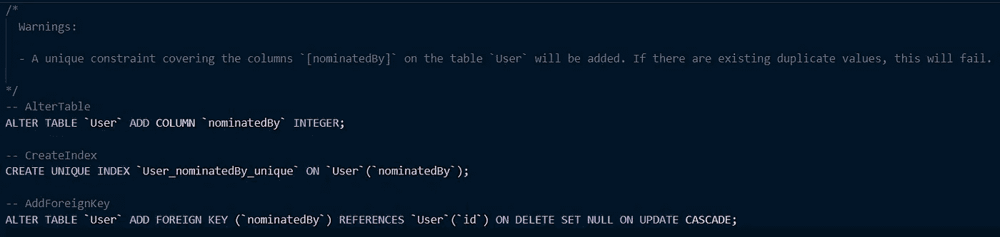*

*User-to-User one to one self relation migration SQL*

# *一对多(一对多)关系*

*我们到目前为止建立的用户-帖子关系是一对多的关系。相应地，我们可以*

*   *创建一个拥有零个或多个帖子的用户*
*   *创建一个始终与用户相关的帖子*

*User(Mandatory) to Post (Optional) 1-m mapping*

*与前面的一对一映射类似，我们可以将发布到用户映射设置为可选。即一个帖子可以有零到一个用户*

*User(optional) to Post(optional) 1-m mapping*

*如果我在用户表中使用复合主键而不是当前 id 字段，会发生什么情况？我需要如何在 Prisma 模式中反映这一点？*

*对于这种情况，需要进行以下修改。*

*Adding composite primary key in User replacing id needs to be reflected in other related models*

*如果我们看看与此相关的迁移变化。*

*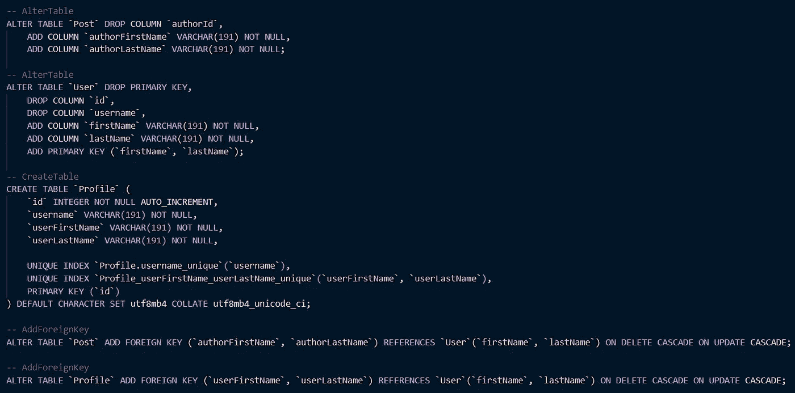*

*Migration SQL generated after adding a composite PK for User*

## **一对多自我关系**

*现在，如果你决定加入一个博客经理的职位，你将如何修改你的用户实体？*

*一种方法是向用户模型添加几个字段*

*User manage User 1-m self relation*

*这样一来，*

*   *一个用户(或博客成员用户)可以有零个或一个管理员*
*   *一个经理可以有零到多个成员*

*生成的迁移文件如下所示。*

*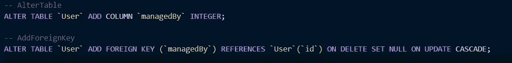*

*Migration SQL generated for User manage User one to many relationship*

# *多对多(m-n)关系*

*在关系数据库的 m-n 型关系中，我们创建了一个名为*关系表*的中间表(其他术语如*关联表*、*组合表*、*连接表*或*透视表*也有同样的含义。)*

*为了更好地理解这一点，让我们给我们的 Post 模型添加标签。一篇文章可以有零到多个标签，反之亦然。*

*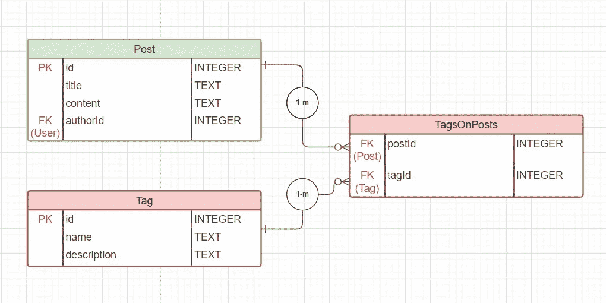*

*Tags to Post is a m-n relationship ERD. TagsOnPosts entity is the relation table*

*根据关系表，有两种方法可以定义 Prisma 模式中的多对多关系。*

1.  *显式多对多关系*
2.  *隐式多对多关系*

## **显式多对多关系**

*在显式 m-n 关系中，中间关系表被表示为 Prisma 模式中的模型。*

*与隐式 m-n 关系不同，您将管理关系表。所以，你可以遵循一个最适合的约定。*

*您可以在关系表中包含额外的元数据，例如创建日期标记(*)、分配人( ***)分配人(*** )。**

**由于每个模型必须至少有一个唯一的标准，该标准只有必填字段，我们将添加一个带有`[@@id](https://www.prisma.io/docs/reference/api-reference/prisma-schema-reference#id-1)`属性的多字段 ID。(即一个复合主键)如果你认为这是数据方面的，同一篇文章不能有相同的标签超过一次。**

**Tag to Post m-n explicit relation**

**针对这一更改运行迁移时，我们会得到以下 SQL 查询。**

**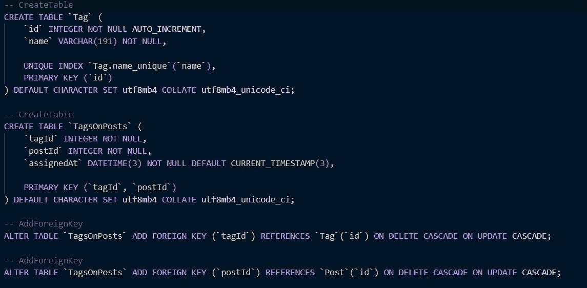**

**Tag to Post many to many explicit relation migration**

## ***隐含的多对多关系***

**在隐式 m-n 关系中，关系字段被定义为两个模型上的列表。尽管关系表存在于底层数据库中，但它是由 Prisma 管理的，并不在 Prisma 模式中显示。**

**Tag to Post m-n implicit relation**

**生成的迁移 SQL 查询如下。**

**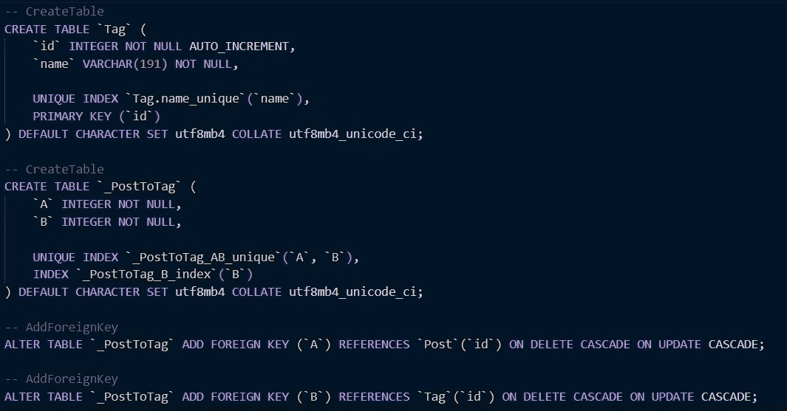**

**Tag to Post implicit m-n relation migration SQL query**

**隐式 m-n 关系中自动生成的关系表遵循特定的约定。**

**为了遵循隐含的 m-n 关系，两个模型都应该具有单个字段 ID ( `[@id](https://www.prisma.io/docs/reference/api-reference/prisma-schema-reference#id)`)**

## **多对多自我关系**

**一个多对多的自我关系总是隐含的。一个简单的例子是向用户模型添加追随者。**

**User follow User m-n self relation is always implicit**

**迁移生成的 SQL 如下所示。**

**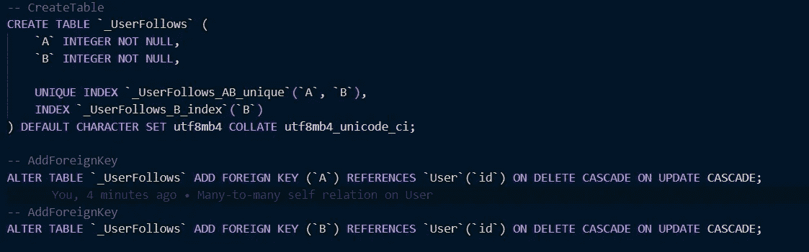**

**SQL migration generated in User follow User m-n self relation**

**除了不能添加额外的元数据之外，你不能在隐式的 m-n 关系中调节[引用动作](https://www.prisma.io/docs/concepts/components/prisma-schema/relations/referential-actions)。**

# **结论**

**我们已经通过简单的博客场景介绍了大多数的关系类型。**

**希望这篇文章能帮助你理解如何使用 Prisma 在关系数据库中管理不同的实体映射。**

**在下一篇文章中，我们将看看在 Prisma 中工作的实体映射中缺少的一个重要部分:[引用动作](https://en.wikipedia.org/wiki/Foreign_key#Referential_actions)**

***更多内容请看*[***plain English . io***](http://plainenglish.io)**