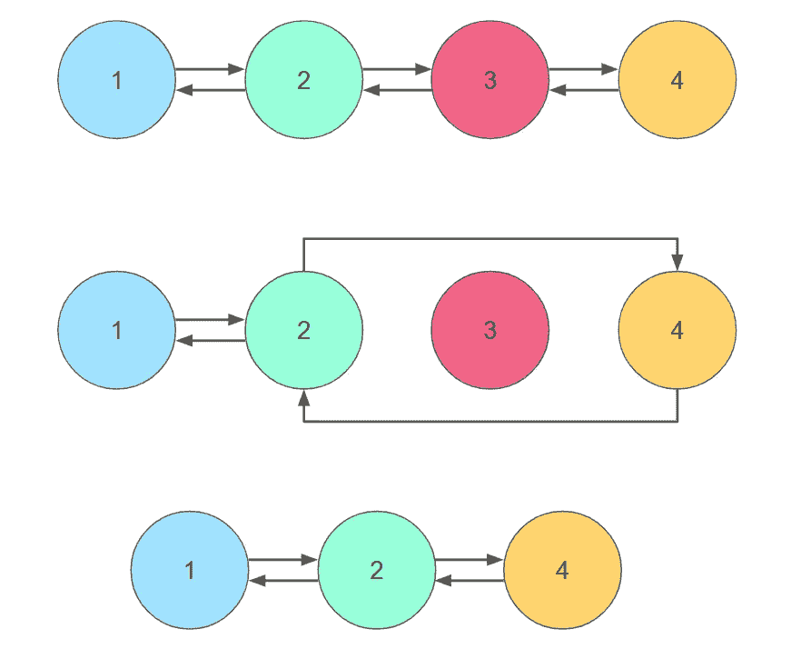

# 链表简介

> 原文：<https://javascript.plainenglish.io/data-structures-and-algorithms-linked-lists-4f098130d820?source=collection_archive---------17----------------------->


## 什么是链表？

链表是数据元素的集合，这些数据元素被称为节点。这些节点具有连续的顺序，但与数组不同，这些元素不存储在连续的内存位置中。相反，每个节点都有一个对序列中下一个节点的引用。每个节点还将包含一段数据。

链表中的第一个节点被称为头，链表中的最后一个元素被称为尾。尾部没有指向节点的引用，而是指向 null。


Linked list

## 双向链表

除了引用序列中的下一个节点，链表还可以引用序列中的上一个节点。链表中的节点引用了前一个和后一个节点，这种链表称为双向链表。在双向链表中，头部的前一个引用为空，尾部的后一个引用为空。


Doubly linked list

## 循环链表

在循环链表中，列表中的每个节点都有下一个引用。没有尾部或对 null 的引用。相反，节点的下一个引用是头节点，否则它将是序列中的最后一个节点。循环链表中的节点形成一个闭环，故名循环链表。


Circular linked list

## 操纵链表

要将节点添加到链表中，请在序列中的节点之间重新分配引用。前一个节点的下一个引用将被分配给新节点，在双向链表的情况下，序列中后一个节点的前一个引用也将被分配给新节点。新节点的下一个和前一个引用也必须分配给序列中新节点前后的节点。


Adding a node to a linked list

要创建一个链表，可以创建一个类并实例化一个新的链表。这个列表实例的头为 null，没有任何节点。还可以创建一个节点类来将节点添加到链表中。该节点需要用数据和下一个引用进行实例化。

```
class LinkedList {
  constructor() {
    this.head = null;
  }
}class Node {
  constructor(data, next = null) {
    this.data = data;
    this.next = next;
  }
}const list = new LinkedList();
```

当被调用时，下面的函数实例化一个新的节点并将它分配给 head 节点。它还将前一个头节点指定给其下一个引用。

```
insertNodeAtStart(data) {
  this.head = new Node(data, this.head);
}
```

要将一个节点添加到列表的末尾，可以使用以下函数。这个函数首先创建一个新节点。如果列表中没有头节点，这个新节点将被分配给头节点。否则，该函数将遍历列表中的每个节点，直到找到没有下一个引用的节点。该节点是列表中当前的最后一个节点。新节点将被分配给列表中最后一个节点的下一个引用。

```
insertNodeAtEnd(data) {
  let node = new Node(data);
  let current;
  if (!this.head) {
    this.head = node;
  } else {
    current = this.head;
    while (current.next) {
      current = current.next;
    }
    current.next = node;
  }
}
```

要从链表中移除节点，必须更改序列中的引用，以绕过将被移除的节点。被移除节点之前的节点现在将具有指向被移除节点之后的节点的下一个引用。如果列表是双向链接的，那么被移除节点之后的节点的先前引用现在将指向被移除节点之前的节点。



Removing node from linked list

要删除特定索引处的节点，必须遍历列表中的所有节点，直到到达具有所需索引的节点。当到达该节点时，序列中前面节点的下一个引用被分配给要删除的节点的下一个引用。这将绕过要删除的节点，将其从列表中删除。

```
deleteAtIndex(index) {
  let current = this.head;
  let previous;
  let count = 0;
  if (index === 0) {
    this.head = current.next;
  } else {
    while (count < index) {
      count++;
      previous = current;
      current = current.next;
    }
    previous.next = current.next;
  }
}
```

类似的功能可以用于基于其他标准来改变列表。例如，该功能可以适用于从列表中删除具有特定数据值的节点。

## 遍历链表

要访问特定节点保存的信息，必须遍历链表，直到到达该节点。搜索将从头或尾开始，并且每个节点的下一个或前一个属性将用于从一个节点前进到另一个节点，直到到达期望的节点。

```
getAtIndex(index) {
  let current = this.head;
  let count = 0;
  while (current) {
    if (count === index) {
      //When this is true the desired node has been accessed.    
      //Information about the node can be viewed or changed now.
      console.log(current.data);
    }
    current = current.next;
    count++;
  }
} console.log(current.data);
    }
    current = current.next;
    count++;
  }
}
```

*更多内容尽在*[*plain English . io*](http://plainenglish.io/)