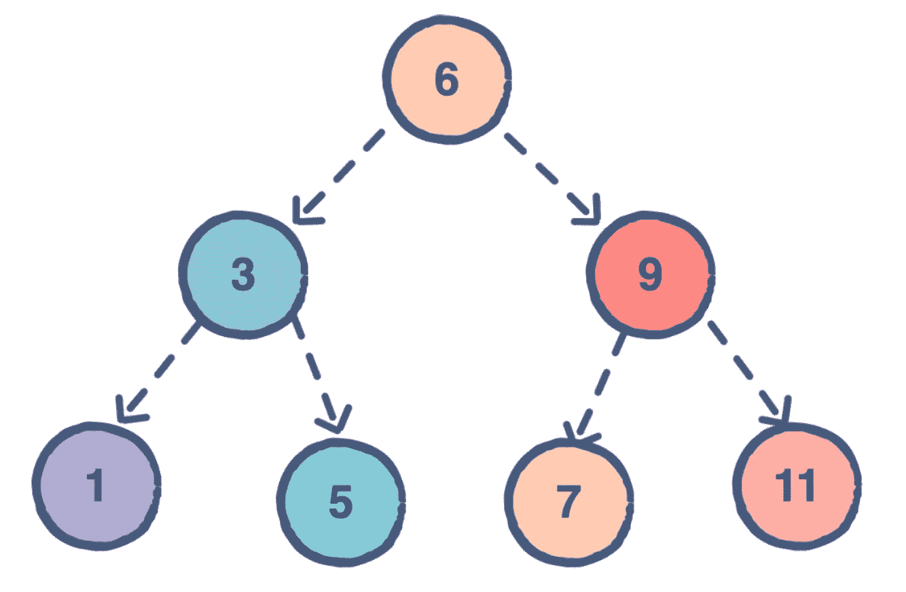
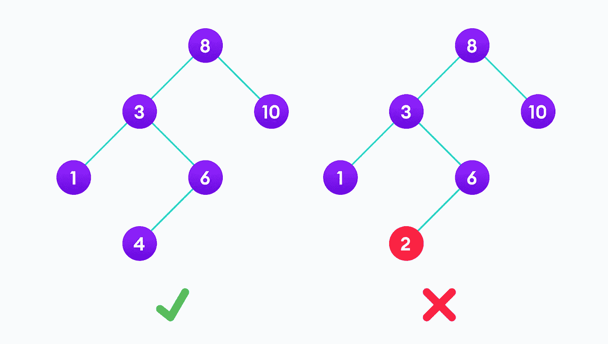

# 数据结构:二分搜索法树(BST)

> 原文：<https://javascript.plainenglish.io/data-structures-binary-search-trees-870395f8a74b?source=collection_archive---------14----------------------->

Photo by [Jeremy Bishop](https://unsplash.com/@jeremybishop?utm_source=unsplash&utm_medium=referral&utm_content=creditCopyText) on [Unsplash](https://unsplash.com/s/photos/tree?utm_source=unsplash&utm_medium=referral&utm_content=creditCopyText)

数据结构是算法的基石。为了编写和运行高效的代码，您必须对数据结构有深刻的理解。一旦您很好地掌握了不同的数据结构以及它们是如何工作的，您就可以开始识别特定数据结构的优缺点，然后就何时何地应该实现它们做出明智的决定。

二叉查找树(通常简称为 BST)是一种允许以有序方式高效存储整数的数据结构。二分搜索法树由一个**根**节点(树中的第一个节点)和它的任何子节点组成。这些子节点被命名为**左节点**和**右节点**。二分搜索法树如此命名是因为每个节点最多可以有两个子节点。没有任何子节点的节点被称为**叶**，两个不同节点之间的连接被称为**边**。

Src: [Educative.io](https://www.educative.io/edpresso/what-is-a-binary-search-tree)

为了说明术语，我们来看看上面的 [Educative.io](https://www.educative.io/edpresso/what-is-a-binary-search-tree) 图。在图中，包含值 6 的圆圈代表我们的根节点。然后根节点分支成两个独立的节点，包含值 3 的圆(左侧节点)和包含值 9 的圆(右侧节点)。这两个节点是根节点的子节点。根节点的每个子节点都有自己的子节点——由分支到另外两个节点来表示。图表最底部的这些节点(包含值 1、5、7、11 的圆圈)是叶节点。

使二叉查找树区别于普通二叉树的是所谓的 **BST 属性**。为了被认为是二叉查找树，树必须满足以下条件:

*   左子树的所有节点的值都小于根
*   右侧子树的所有节点的值都大于根节点的值

在每个节点上，其左侧子节点将小于父节点，而其右侧子节点将大于父节点。因此在整个树中，每个节点本身就是一个二叉查找树。

看看下面的图，你能解释为什么右边的树不是 BST 吗？

Src: [Programiz](https://www.programiz.com/dsa/binary-search-tree)

右边的树不是 BST，因为如果我们看一下左边的子树(即由值为 3 的节点及其后代节点组成的树)，它不满足 BST 属性。该子树包含右侧的一个节点(值为 2 的节点),该节点的值小于该子树最顶层的节点。如果它是一个 BST，值为 2 的节点必须是值为 1 的节点的右边子节点。

## **BST 的用例**

现在我们对二叉查找树的结构有了基本的了解，让我们来讨论一下 BST 的优点。这种有序的结构使其成为搜索特定元素/值的有效方法。给定一个值，我们可以快速确定 BST 是否包含该值，如果包含，它在树中的位置。

从根节点开始，我们首先检查它是否包含我们要寻找的值。如果不是，我们就问自己，我们要寻找的值是小于还是大于根节点。如果它更小，我们知道如果它在树中，它一定是左子树的一部分。相反，如果它更大，我们知道它一定是右边子树的一部分。在每一个节点，我们都经历相同的过程，直到我们得到我们想要的值。因此，在这个过程的每一步，我们可以消除大约一半的剩余数据结构，直到我们得到一个答案。

在一般情况下，二叉查找树结构允许我们以 O(log(n))的时间和空间复杂度执行搜索功能。如果我们将相同的概念应用于插入函数，我们可以确定二叉查找树中的插入函数也涉及 O(log(n))时间和空间复杂度。

我们现在对二叉查找树及其力量有了一个可行的理解。在下一篇博文中，我将讲述如何用代码实现二叉查找树。敬请期待！