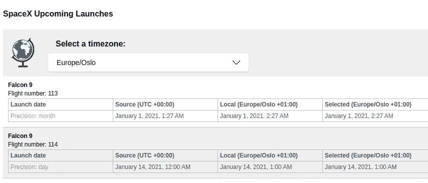

# 认识 Luxon，新的 Moment.js 杀手(第 1 部分)

> 原文：<https://javascript.plainenglish.io/dates-and-time-zone-awareness-in-your-react-application-with-luxon-a-moment-js-successor-d747b2cc0713?source=collection_archive---------12----------------------->

## 使用 Luxon 在 React 应用程序中设置日期和时区


Timezones (source: [wikimedia.org](https://upload.wikimedia.org/wikipedia/commons/8/88/World_Time_Zones_Map.png))

> 我创建的一个与本文相关的互动**演示**是在 Heroku 上托管的[，而**源代码**可以在 GitLab](https://gerard-react-timezones.herokuapp.com) 上找到[。这个网络应用程序列出了 SpaceX 即将到来的发射日期，你可以选择显示日期的时区。在本文的后半部分，我们来看一下代码的某些方面。](https://gitlab.com/gvanderput/react-timezones)

## 系列

本文是“**遇见鲁迅**”系列的**部分 1** :

*   `Part 1`:时区(*本文*)
*   `Part 2` : [使用 Luxon 库](https://medium.com/p/618053938cb6)

# 介绍

如果你是一名(高级)开发人员，你可能去过那里:参加关于如何在你的应用程序中处理**日期和时区** 的会议或讨论。这可能是一个很难讨论的话题，尤其是当您的应用程序有几个数据源包含来自不同时区的日期时。

我们都知道时区的存在及其运作方式；算是吧。我们都接到过在另一个时区度假的朋友或亲戚打来的电话:*“那边现在几点了？哦，下午 5 点？真有意思，这里才早上 9 点！”*。

但仅此而已。

当日期和时区成为我们发展的一部分时，事情会很快变得一团糟。难。令人沮丧。

但也没那么难。

真的不是。

在我们真正开始之前，我将描述几个您应该熟悉的项目(请随意跳过):

1.  时区
2.  协调世界时。亦称 COORDINATED UNIVERSAL TIME
3.  UTC 偏移量
4.  Luxon vs. Moment.js

## 时区:

世界被分成时区([地图](https://en.wikipedia.org/wiki/UTC_offset#/media/File:World_Time_Zones_Map.png))。当你从一个时区旅行到另一个时区时，你通常会提前**一个小时**-或者回到过去(但也有一些例外)。

## UTC:

维基百科:“*世界调节时钟和时间的主要时间标准*”。如果我们想要全球同步我们的时钟，我们需要一个参考点。一个我们都认同的标准。那就是 UTC(协调世界时)。

UTC 又称*祖鲁时间；*用于航空等领域的术语。当飞行员相互交流时间时，无论他们在世界的哪个角落，他们都会谈论*祖鲁时间*或*祖鲁时间*，以避免不必要的误解。

## UTC 偏移量:

与 UTC 相比，所有时区都有一定的*时差*。

当国家或州使用夏令时/夏令时时，这种时差会在一年中的特定日期发生变化(*“记住，明天我们将再次调整时钟，这样我们就可以多睡一个小时”*)。

在某些国家，时间*是* UTC，全年都是。所以与 UTC 没有任何抵消或差异。我们把这个写成 **UTC 00:00** ，或者简称为 **UTC** 。例子是西非的某些国家，如加纳、几内亚和塞内加尔。

在**英国**，冬季时间为 UTC 00:00，夏季时间为 **UTC+01:00** (或简称 UTC+01)。后者意味着他们的时钟比协调世界时的早*一小时。*

**纽约**使用*东部时区* (UTC-05:00)并有一个夏令时/ DST 周期(其中他们的时间是 UTC-04:00)。

## Luxon vs Moment.js

(Moment)过去是，现在也是一个非常受欢迎的库，帮助 JavaScript 开发人员处理日期和时间。截至今天，2021 年 1 月，其 NPM 包每周下载超过[900 万](https://www.npmjs.com/package/moment)次(！).

扩展 **moment-timezone** 允许时区操作，每周大约被下载 450 万次。

但是在 2020 年底，开发者们写道:

> 我们希望阻止 Moment 用于未来的新项目。相反，我们想[推荐一些替代品](https://momentjs.com/docs/#/-project-status/recommendations/)，它们是当今现代应用中的绝佳选择。

他们的热门推荐是 [**Luxon**](https://moment.github.io/luxon/) (截至目前每周 50 万次下载)。我们将在演示应用程序中使用 Luxon。

Moment 进入*维护模式*(从现在开始不再添加新功能)的主要原因是现代浏览器在日期和国际化方面获得了更多更好的功能。卢克森就是在此基础上发展起来的。或者更具体地说，它*包装了现代 JavaScript* 。

# 我们的演示应用程序

## 获取数据



[https://gerard-react-timezones.herokuapp.com](https://gerard-react-timezones.herokuapp.com/)

演示可以在[https://gerard-react-timezones.herokuapp.com](https://gerard-react-timezones.herokuapp.com/)打开，源代码可以在 [GitLab](https://gitlab.com/gvanderput/react-timezones) 打开。

我用 Create React App 创建了一个新的 React 应用，并添加了 **luxon** 包:

```
$ yarn add luxon
```

如你所见，我们列出了 SpaceX 火箭即将进行的*发射*。数据从[https://api.spacexdata.com/v4](https://api.spacexdata.com/v4)获取。我们使用一个定制的钩子从两个不同的端点获取数据。有关详细信息，请参见 [useLaunches](https://gitlab.com/gvanderput/react-timezones/-/blob/master/src/hooks/useLaunches.js) 钩子，但这超出了本文的范围。这个钩子用在组件[src/components/launches . jsx](https://gitlab.com/gvanderput/react-timezones/-/blob/master/src/components/Launches.jsx)内部。

## ISO 8601 日期字符串

这里相关且有趣的是，API 为每个条目返回一个 ***启动日期*** 。该值是一个以 [ISO 8601](https://en.wikipedia.org/wiki/ISO_8601) 格式表示日期的字符串，如下所示:

```
const isoString = "2020-03-07T04:30:00.000Z";
```

日期和时间(以毫秒为单位，. 000)不言自明。但是“Z”是什么意思呢？这是一个时区代号，意思是**祖鲁时间**。我们以前听说过:这是世界协调时的另一种说法！还有[其他指示符](https://en.wikipedia.org/wiki/ISO_8601#Time_zone_designators)。

> 预先注意:伦敦在冬季使用 UTC(不采用夏令时)

现在我们知道我们的约会了:

```
- it represents the 7th of March, year 2020
- at **04:30** in the morning
- ...in London during wintertime
```

该在我们的前端显示日期了。仅仅显示 ISO 字符串对用户不太友好，所以我们必须以某种方式解析它，并以更好的格式显示它。这就是卢克森发挥作用的地方。但是当我用 Luxon 在前端显示格式化的解析 ISO 值时，如下所示:

```
import { DateTime } from "luxon";const formatted = DateTime
  .fromISO(isoString)
  .toLocaleString(DateTime.DATETIME_MED);
```

> 提示:详见回购中的 [FormattedDate.jsx](https://gitlab.com/gvanderput/react-timezones/-/blob/master/src/components/FormattedDate.jsx) 。

…这显示在 DOM 中:

```
Mar 7, 2020, **5:30** AM
```

一个*一个小时*的差别！

但是为什么呢？

除非您另外指定，我们马上就会这样做，Luxon 会将*检测时区*(也称为*本地时区*)配置为格式化日期时使用的默认时区。它查看来自你浏览器的信息，了解你在世界的哪个地方*。*

我碰巧住在诺威🇳🇴.这里冬天使用的时区是 CEST ( *中欧标准时间*)，它有一个 **UTC+01:00** 的时差。

Luxon 已经检测到了我的时区(由字符串“欧洲/奥斯陆”表示)，并且**在呈现日期时将偏移量**应用于我们的日期。

我们的**源日期**的偏移量为零(还记得代表 UTC / UTC 00:00 的“Z”吗？)，我的**本地时区**有一个 UTC+01:00 的偏移量，这两者之间的绝对差值(+1 小时)应用于日期。

但是，我们也可以通知 Luxon，我们希望用 UTC 时间来表示我们的值:

```
const formatted = DateTime
  .fromISO(isoString)
  .setZone("UTC")
  .toLocaleString(DateTime.DATETIME_MED);
```

现在它显示:

```
Mar 7, 2020, **4:30** AM
```

> 作为开发人员，您可以决定在哪个时区显示日期和时间。您有责任确保您的最终用户知道为此使用了哪个时区——Gerard van der Put

# 结论

如果你对基础和原则有很好的了解，日期、时间和时区并不难处理。

**请继续阅读本系列第二部分[中的](https://medium.com/p/618053938cb6)**！

谢谢你的时间。

杰拉德·范德普特