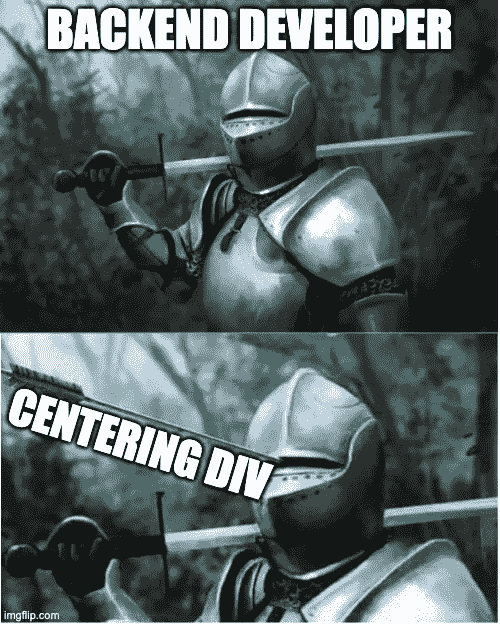

# 亲爱的开发者:这就是你如何将一个 DIV 居中

> 原文：<https://javascript.plainenglish.io/dear-developer-this-is-how-you-center-a-div-e526e7cfcc9d?source=collection_archive---------0----------------------->

## 一起终结迷因吧。

如果有一个迷因总能让我开怀大笑。是关于把一个`div`居中的。但是我花了很长时间才达到可以一笑置之的地步。有时候我不得不无休止地浏览编程论坛。花几个小时尝试不同的解决方案。

我做了选择。我决定学习 CSS 居中的来龙去脉。我赢得了笑的权利。或者至少当我看到这个迷因的时候会咯咯地笑。今天，你也将赢得它。

你将学会三种居中的方法。每一个之后，我会给你们展示不同的迷因。如果学习过程有效，每一个图像都应该比上一个图像更让你发笑。

在我展示第一个方法之前。让我们来看看自愿参与这个展示的 HTML 代码。

现在我们已经熟悉了 HTML 部分，让我们深入第一个方法。

# 绝对位置居中

有些时候，没人会在乎反应速度。这种心态是非常合理的。只有一种类型的监视器。它看起来像这样。

Photo by [Senad Palic](https://unsplash.com/@retrokram?utm_source=medium&utm_medium=referral) on [Unsplash](https://unsplash.com?utm_source=medium&utm_medium=referral)

在这段时间里，你绝对可以定位几乎所有的元素。不用担心移动优先的方法。事实上，一开始就没有手机。

因为每个元素都是绝对定位的。对中方法必须考虑到这一点。幸运的是，只需几行 CSS 就可以实现这一点。

不错，但是对于这样一个简单的任务来说，10 行代码似乎太多了。让我们看看我们是否能减少它们。但首先，有一件事我们需要处理。

既然我们已经讨论了第一种方法。是时候检查一下你的幽默感是否开始发展了。

我不指望在这一点上看到泪流满面。但是如果你脸上有一丝笑容。我们正朝着正确的方向前进。方向是第二种方法。

# 使用 Flexbox 居中

随着 flexbox 的推出，恐惧和泪水从开发者的脸上消失了。Flexbox 很快被开发人员采用。他们中的许多人开始使用它，包括你的 truly。

这些天来，我几乎在所有事情上都使用 flexbox。你猜对了，我也用它来定心。

您可以通过这 5 行代码使用 Flexbox 将元素居中。

我说与第一种方法相比，这是一个很好的改进。但是我们可以做得更好。我们可以编写更少的代码并获得相同的结果。请继续阅读，了解如何…

但是，还是该快速检查一下，看看下一个迷因了。当你笑完了，我们会看看下一个方法。

# 使用网格居中

现在是 2021 年，你可以使用 CSS grid 或 flexbox 来实现任何形式的布局。CSS Grid 与 Flexbox 有点不同，因为它使用二维来定位元素。它由行和列组成。相反，flexbox 将元素彼此相邻放置。

简单指出这两者的区别。我通常说网格更复杂，应该用于更复杂的布局。但是，它也可以用于使元素居中。在我看来，这是实现它的最快方法。

就这样，你刚刚学会了使用 2 个 CSS 属性来居中放置一个元素。我喜欢这种方法有两个简单的原因:

*   **2 行代码很好写**
*   **2 行代码难以忘记**

恭喜你，你刚刚发现了一种方法来统治他们。在这一点上，你基本上是一个 CSS 大师。当你看到迷因时，你赢得了神圣的笑声。

为了测试一切是否如预期进行，是时候开最后一个玩笑了。或者最后的测试。

我很想知道你的反应。如果你有几秒钟的空闲时间，请在评论中告诉我。

# 总结想法

正如生活中的许多事情一样，有多种方法可以达到同样的结果。对于 CSS 来说尤其如此。你的工作就是知道做一件特定事情的最快方法。

今天，你学习了 CSS 中最可怕的任务。希望能从中得到一点乐趣。我希望你喜欢我选择的迷因。如果你有更优惠的，请随时告诉我。

*更多内容尽在*[***plain English . io***](http://plainenglish.io/)