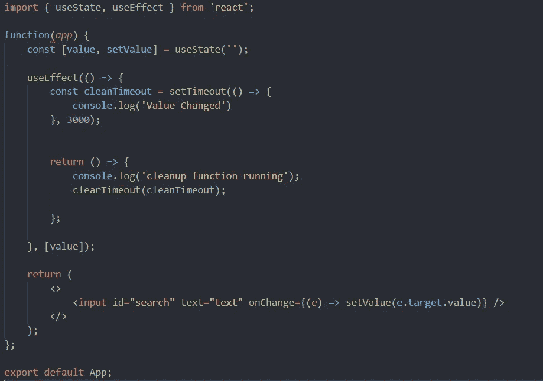
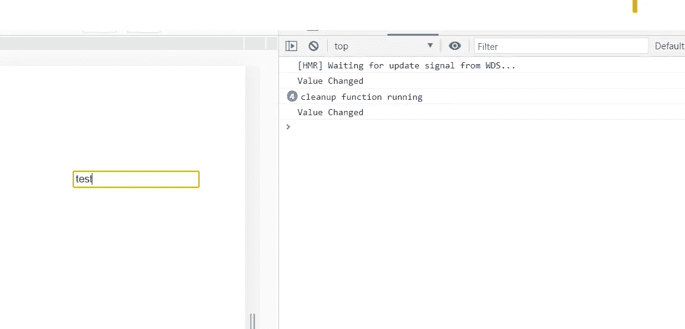
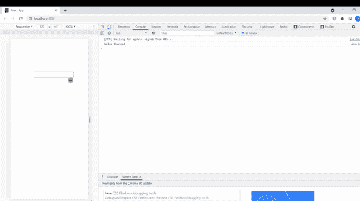

# React 中的反跳 API 请求

> 原文：<https://javascript.plainenglish.io/debouncing-api-requests-in-react-using-useeffect-with-cleanup-function-explanation-c747e95493c?source=collection_archive---------5----------------------->

## 使用 useEffect React 钩子，通过反跳 API 请求来提高应用程序的效率

在这篇文章中，我们将讨论如何在每次用户输入改变时避免不必要的 API 调用请求，以使你的应用程序更加高效和可伸缩。

首先，我想给你一个关于使用效果钩子的简介。useEffect 挂钩是最有用的 React 函数挂钩之一，如果您已经熟悉基于类的 React 组件，那么您可以认为它几乎类似于 componentDidMount 挂钩，后者用于进行 API 调用，因为它是在组件首次加载时触发的。

因此，useEffect 钩子也用于在 React 功能组件中进行 API 调用，但是它有两个吸引人的特性

1.  **依赖数组—**useEffect 钩子将在组件加载时第一次运行，但除此之外，我们有能力在组件中的某个东西改变时运行它，所以我们可以在依赖数组中添加改变的东西，每当依赖改变时，我们将看到 use effect 将自动调用。(通常有助于在某些组件数据发生变化时发出请求)。
2.  **清理功能-** 该功能在 useEffect 组件运行之前运行，但在第二次运行时运行，之后不会在组件的初始加载期间运行。不要在这个问题上花费太多精力，你会在文章的前面了解到更多。

语法:`useEffect(() => {}, [])`

第二个参数:依赖数组。

因此，总之，无论何时我们在搜索栏或任何其他输入字段中输入内容，都可以使用 useHooks 来防止 API 调用，例如在搜索栏中，您向某个作业 API 发出请求以获取作业数据，并说您想要获取 React 数据作业，当您开始键入时，甚至当您写入第一个字母“R”时，API 也会被触发以获取带有“R”的作业，每次输入更改都会发生同样的情况。所以，如果我们想让 API 只在写完整的单词时触发，那么我们将使用带有清理功能的钩子。

看，上面的代码，在这段代码中我们有一个输入字段，每当数据改变时，组件在 useState 的帮助下重新呈现，并且因为值在 useEffect 钩子中用作依赖项，所以每当值改变时，useEffect 也调用。

在 useEffect 函数内部，useEffect 返回的函数是 cleanup 函数，它在 useEffect 每次运行之前运行，但从第二次开始运行。

假设您要在 useEffect 内部进行 API 调用，那么我已经设置了一个计时器，在 3 秒钟之后，计时器将调用回调函数，并且 API 将使用该值进行调用，但是由于在 3 秒钟之前该值发生了变化，因此 API 没有被调用，但是计时器仍然存在，现在我们想要去掉这个计时器，因为随着下一个输入的变化，将会创建另一个计时器， 因此，在下一次运行 useEffect 之前，清理函数将在它之前运行，并删除之前设置的计时器，这个过程将继续，直到我们输入查询的最后一个字，因为在这之后，3 秒钟的计时器将完成，带有所需输入的 API 调用将进行。

这有助于我们不要在每次击键/输入改变时调用 API，也可以调用去抖，其次，通过清理，我们也可以通过使用 useEffect 清理函数来消除以前创建的超时。

***注意:****useEffect 的清理功能也在组件卸载前运行，这是非常有益的，因为我们可以移除所有的超时或任何其他组件卸载时创建的东西，我们的应用不会随着用户流量的增加而崩溃，我们的应用现在也变得更加精简、高效和可伸缩。*

第一个改变的值是当组件装载并运行 useEffect 时，然后在每次输入改变之后，清理运行，最后当我们写完查询时，改变的值显示，这意味着在查询的最后一个字之后超时完成。

希望你能从这篇文章中学到一些东西！谢谢你的阅读。

*更内容于* [***通俗地说就是***](http://plainenglish.io)