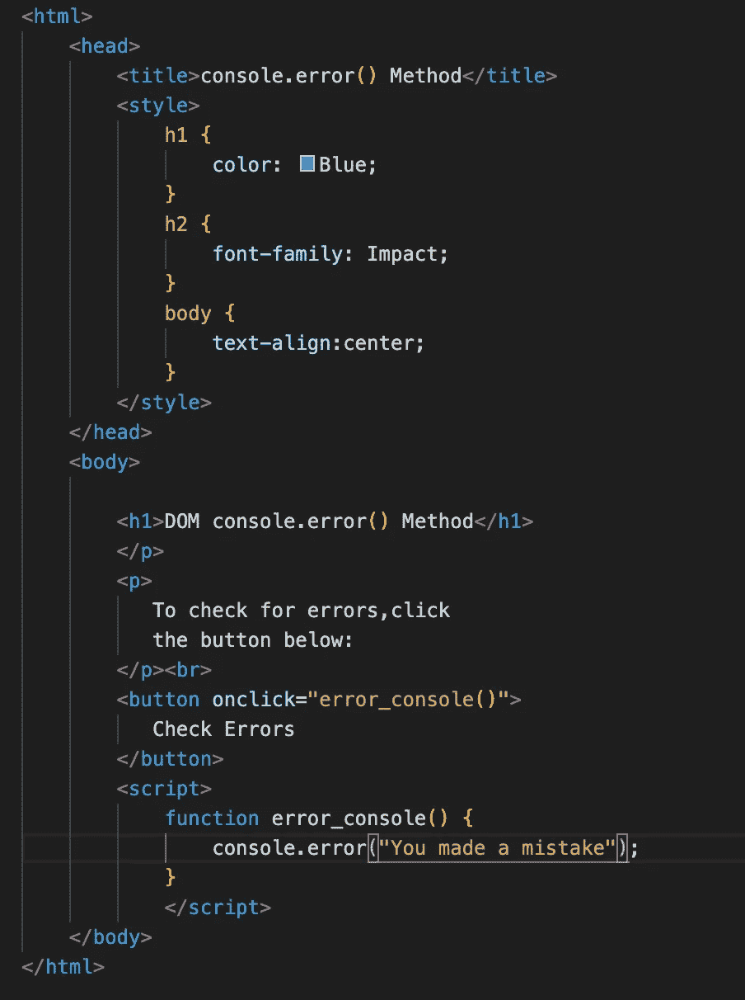

# 在 JavaScript 中调试更快！

> 原文：<https://javascript.plainenglish.io/debug-faster-in-javascript-26d2ad3942d9?source=collection_archive---------4----------------------->

Photo by [Sigmund](https://unsplash.com/@sigmund?utm_source=medium&utm_medium=referral) on [Unsplash](https://unsplash.com?utm_source=medium&utm_medium=referral)

*“如果调试是去除 bug 的过程，那么编程就一定是把 bug 放进去的过程，”*已故计算机科学家[埃德格·w·迪克斯特拉](https://en.wikipedia.org/wiki/Edsger_W._Dijkstra)说。

这很有趣，因为这是真的！尽管不是有意的，我们在编码时还是会引入错误。有时，当一些相关的参数发生变化时，即使是无错误的代码也可能开始失败。即使是将它推广到不同地理位置的一个简单方面也会混淆代码。它可以在 Chrome 上运行——太棒了！但它在 Internet Explorer 上失败了(我知道，没有人使用它，但是，如果有人错误地打开它会怎么样)。

无论如何，底线是开发人员应该知道如何调试代码。大多数优秀的开发人员都非常擅长调试。所有的调试都需要很好地掌握基础知识和批判性思维技能。然而，我们可以有一些合适的方法，并使用一些很酷的工具来帮助调试。这篇文章的目的是回顾一些策略和掩饰一些帮助我们生活更容易的工具。

在深入 Javascript 调试策略之前，让我们看看什么是错误。

在任何程序中，当代码不按预期工作时，它会产生不正确的结果或没有结果，导致**错误**。但是错误是如何发生的呢？许多来源都会在程序中引入错误。这里有一些:需求收集，架构/设计，编码。理解错误的来源很重要，但是在调试过程中这是不够的。

对于本文档的上下文，我们将关注基于类型的分类。

# 错误类型

**语法错误**是通常由编译器捕获并通过错误消息报告的错误。这些消息指出了导致错误的原因。

Will display output as :

Syntax Error!!

正如您在这个示例中所看到的，编辑器显示了错误消息以及导致错误的原因。

**逻辑错误:**这些错误发生在算法或其实现不正确的情况下。在这些情况下，程序员必须重新考虑算法的逻辑或算法本身。这一次考虑到了极限情况，以确保涵盖所有场景，稍后将对此进行详细介绍。

**错别字和其他简单错误:**编译器不会检测到丢失的括号或拼写错误的关键字，一旦发现，很容易修复。但是识别它们，嗯，我们可以就此写一部小说。很多程序员都能讲出因错别字而彻夜难眠的故事。有一些护栏我们可以用来尽量避免。

# **调试错误的策略**

一些策略可以帮助定位错误并找出导致错误的症状。请记住，没有一刀切！！然而，一个好的经验法则是在代码中插入一些调试工件。编写强调调试的代码有两方面的好处。

*它有助于在出现错误时进行调试。*

*我们不太可能引入编码错误。*

因此，让我们讨论一下有哪些工具可以用来调试我们的程序。

**1。console.error()**

此方法用于测试目的，并在控制台的 HTML 错误消息中使用。通过将`console.error()`放在代码中的正确位置，您可以识别代码的哪个部分抛出了错误。

console.error() will display the error

Displays the error in the console of the browser's dev tools.

**2。console.warn()**

`console.warn()`用于在控制台中写入警告信息。这个方法不会中断代码，开发人员可以使用这个代码对任何用户操作发出警告。

console. error() will display the warning if the button is clicked more than 6 times

**3。console.table()**

有时您正在处理一些复杂的对象，这种方法不是滚动列表，而是以表格形式显示数据！

Will output

**4。回溯问题**

一种选择是从代码的指定行开始跟踪错误，并一直工作到开始，这有助于解决错误。

**5。调试器**

另一个可以用来调试错误的工具是调用**调试器语句**。当执行到达该语句时，执行在此处停止。

使用调试器，您还可以设置断点。当代码到达断点时，执行停止。我们可以检查多个函数，变量和程序表达式，在执行期间会给出关于代码的所有信息。

**6。尽可能插入 console.log()**

在代码中插入`console.log()`可以清楚地了解代码正在执行什么。它有助于确定变量是返回未定义值还是预期值。

7。随着您的进展测试代码

当您正在编写十行以上的代码时，这个策略很有帮助！！！它有助于分解创建网页的过程。您可以测试代码片段，这将更容易解决错误。这使得编写代码变得更加容易，调试也变得更加容易。有了碎片化的代码，开发人员就不会被长长的错误列表淹没。

8。编写测试用例来测试代码的逻辑(断言)

断言是您可以在代码中的任何位置放置在任何数据类型上的条件。

如果条件评估为 0 或 false，断言将抛出错误或警告。

有了断言，一旦断言失败，我们就可以确定代码停止的位置。在大多数情况下，我们可以推断出是哪部分代码导致了问题。您还可以为断言使用的方法之一是`console.assert()`方法。

***其他一些帮助调试的策略:***

1.  错误可能不在您预期的位置。你可能在一段代码上花了足够多的时间。关注代码的其他部分可能有助于识别问题。
2.  向自己或他人解释代码有助于识别问题所在。这叫橡皮鸭。
3.  分而治之。首先，确定正确运行的代码部分。以此为基础，试着逐步调试，直到你彻底解决问题。

所以这是我所有的。当我发现让我夜不能寐的新错误时，我会继续更新这个文档。当然，通过学习和调试代码的新方法。

*更多内容请看*[***plain English . io***](http://plainenglish.io/)