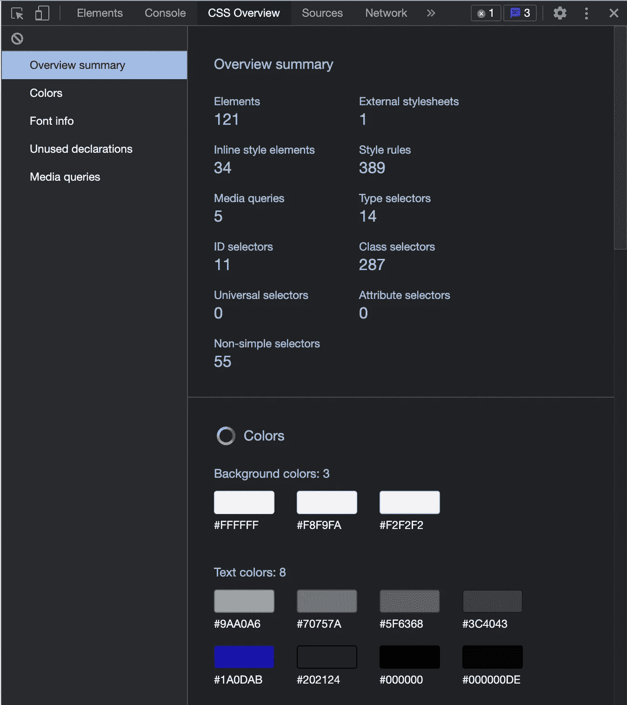

# 如何像专业人士一样调试

> 原文：<https://javascript.plainenglish.io/debug-like-a-pro-7749db57b4b1?source=collection_archive---------0----------------------->

## 作为 web 开发人员，您应该了解的调试技术。

作为一名 web 开发人员，你必须了解一些很棒的调试技术。说实话，我一直在用 console.log()和 debugger 一起调试我的代码，但是调试并不局限于这两个。我看到一些很棒的文章，告诉你还有更多。现在，我将下面解释的许多技术结合起来使用，相信我，我的生活变得更容易了😇

*让我们从在控制台显示一条消息开始:*

*   日志()
*   错误()
*   警告()
*   表格()
*   计数()
*   时间()和时间结束()

> 几个方便使用的键盘快捷键

*清除控制台****ctrl L****(Windows)或****cmd K(****Mac OS)*

*显示控制台* ***ctrl `***

*检查一个元素时，选中该元素，按* ***f2*** *编辑为 HTML*

记录多个变量时，跟踪单个变量会变得很困难。我们要么用不同的 console.log()编写它们，要么给它们指定特定的字符串。

在这里，使用对象文字很方便。

# *我个人使用的几个开发者工具设置*

## CSS 概述—这将在一个地方显示所有颜色、字体和媒体查询的摘要。

*   *在谷歌 Chrome 上，打开* ***开发者工具*** *。*
*   打开**设置。**
*   点击**实验**选项卡。
*   启用 **CSS 总览。**
*   重新装载**开发工具**。
*   DevTools 中将出现一个新的标签，名为 **CSS Overview** 。

## 字体编辑器工具——这个特性让我们不用写一行代码就可以尝试不同的字体。

*   通过 Chrome DevTools **进入**实验**选项卡。**
*   检查**在样式面板**中启用新的字体编辑器工具。
*   重新装载**开发工具**。
*   选择 HTML 元素，其中包含要更改的字体属性。
*   您会注意到**样式**窗格中的**字体编辑器**图标。

# *我经常使用的几个快捷键*

**获取当前选中的标签** 转到 chrome dev tools，在控制台中键入 [**$0**](https://medium.com/@amnah.k/debug-like-a-pro-7749db57b4b1) 。这将给出对当前所选节点的引用。

**在控制台
中获取最后评估的值**转到 chrome 开发工具，在控制台中键入 **$_** 。这将始终打印最后评估的值。

**从网络选项卡将请求复制为 cURL** 直接从网络选项卡将请求复制为 cURL。

**打开** 设计模式，编辑整个页面，进入 chrome 开发工具，输入`**document.designMode=”on”**`。这将使您无需刷新页面即可进行修改。

我希望这对你有帮助，就像它对我有帮助一样。

如果你知道其他的诀窍或捷径，并想帮助社区，请在✌️.评论区告诉我

快乐编码。

*更多内容看* [***说白了。报名参加我们的***](https://plainenglish.io/) **[***免费周报***](http://newsletter.plainenglish.io/) *。关注我们关于* [***推特***](https://twitter.com/inPlainEngHQ) ，[***LinkedIn***](https://www.linkedin.com/company/inplainenglish/)*，*[***YouTube***](https://www.youtube.com/channel/UCtipWUghju290NWcn8jhyAw)*，以及* [***不和***](https://discord.gg/GtDtUAvyhW) *。对增长黑客感兴趣？检查出* [***电路***](https://circuit.ooo/) *。***