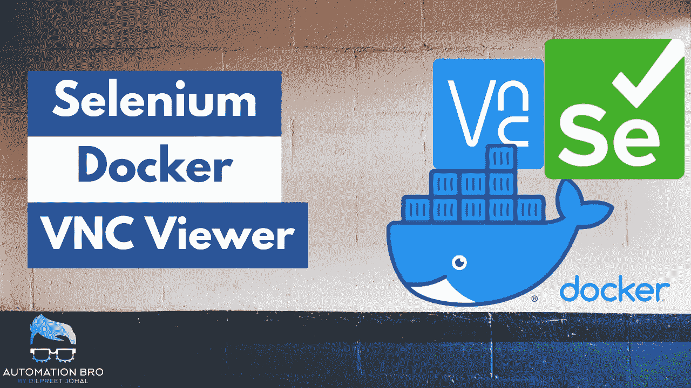
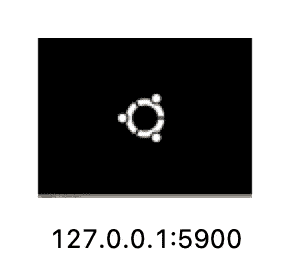
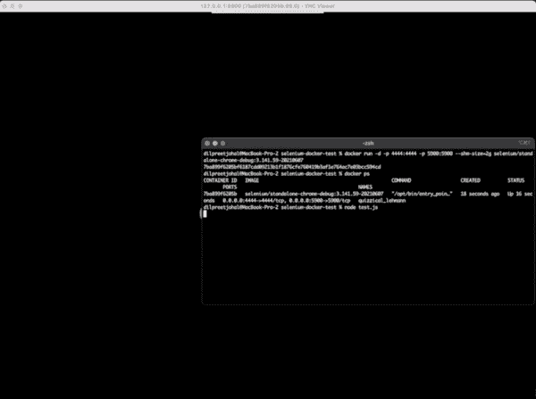

# 使用 VNC 浏览器在 Docker 中调试 Selenium 测试

> 原文：<https://javascript.plainenglish.io/debug-selenium-tests-in-docker-using-vnc-viewer-de6c58f0f7f2?source=collection_archive---------5----------------------->



[https://youtu.be/SCHs3XMf1yY](https://youtu.be/SCHs3XMf1yY)

在[之前的帖子](/selenium-docker-tutorial-how-to-run-selenium-tests-in-do-8f86b999d318?source=your_stories_page-------------------------------------)中，我们学习了如何将 Selenium 测试与 Docker 集成。在本教程中，我们将看看如何集成 VNC 浏览器与 Docker 和调试硒测试在 Docker 使用 VNC 浏览器。我们还将了解通过 VNC 浏览器运行测试的重要性。

# 为什么要使用 VNC 浏览器在 Docker 中运行 Selenium 测试？

最初，当我准备这篇文章时，我打算将标题命名为“使用 VNC 浏览器在 Docker 中查看 Selenium 测试”。因为我认为我们的目标是能够看到在 VNC 进行的测试。

然而，**我们想在 VNC 浏览器中查看测试的主要原因是能够调试 Docker 中发生的任何测试问题**。通常，当测试在 Docker 容器中被触发时，您看不到里面发生的任何事情。但是，在 VNC 浏览器的帮助下，您可以直观地看到 Docker 内部到底发生了什么，这使得调试您的测试问题变得更加容易。

# 先决条件

*   **安装一个 VNC 客户端:**我在本教程中使用的是 [RealVNC](https://www.realvnc.com/en/connect/download/viewer/)
*   **使用 Selenium 调试映像:**为了能够看到 Docker 容器内部的情况，您需要使用安装了 VNC 服务器的映像。任何以`-debug`结尾的[映像](https://github.com/SeleniumHQ/docker-selenium/tree/selenium-3)都将安装一个 VNC 服务器
*   **将外部 VNC 端口映射到 Docker VNC 端口(5900):** 运行 Docker 映像时，您需要将本地 VNC 端口映射到 Docker VNC 端口(5900)

# **运行 Selenium 独立调试 Docker 映像**

让我们运行 selenium/standalone-chrome-debug 映像，并用它映射 VNC 端口

```
docker run -d -p 4444:4444 -p 5900:5900 --shm-size=2g selenium/standalone-chrome-debug:3.141.59-20210607
```

*   -p 4444:4444 是本地机器映射到 Docker Selenium 服务器端口 4444 的端口
*   -p 5900:5900 是本地 VNC 服务器映射到 Docker VNC 服务器的端口

# **打开皇家 VNC 客户端**

现在我们有了一个映射到端口 5900 的 docker 映像，我们可以在 VNC 查看器中打开该端口。为此，打开 RealVNC 客户端，键入 URL — *127.0.0.1:5900，*并按回车键。

当提示输入密码时，键入*秘密*并继续。



VNC server pointed to port 5900

# 在 Docker 中运行测试

现在是在 docker 中运行测试的时候了，确保您的测试指向端口 4444，因为这是我们为 Docker 容器设置的(您可以查看我以前的帖子以了解更多信息)。

运行测试后，您会发现测试可以在 VNC 查看器中查看。🙌🏼



Viewing Docker tests in VNC viewer

**观看下面的视频，了解如何在 Docker 中执行 Selenium 测试，并在 VNC 浏览器中查看—**

在下一篇教程中，我将向您展示如何设置 Selenium Grid 并在 Docker 中运行它。

感谢阅读。

*更多内容尽在*[***plain English . io***](http://plainenglish.io/)