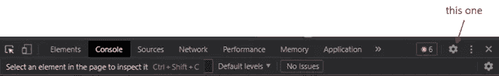
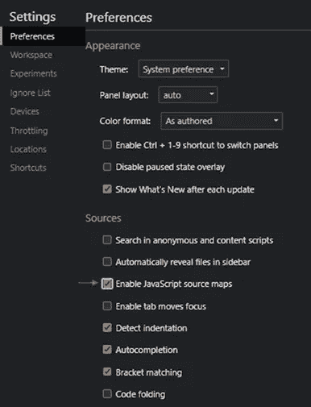
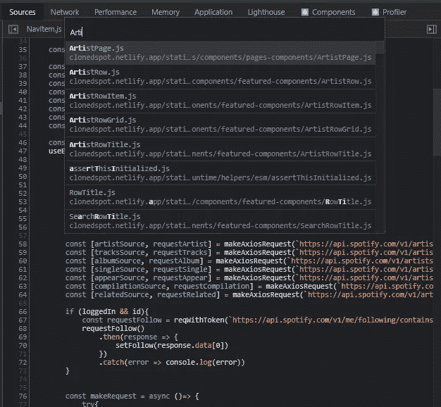
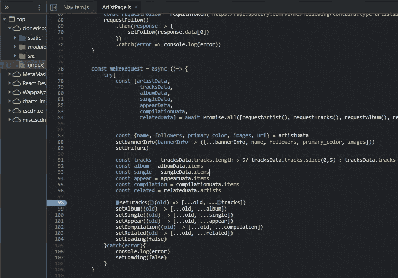
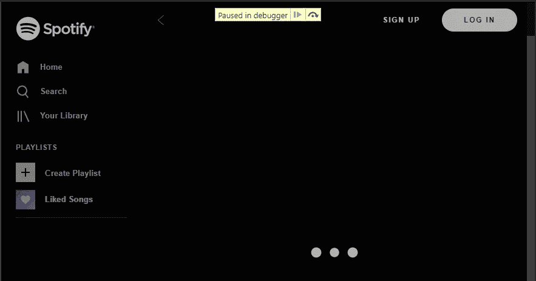
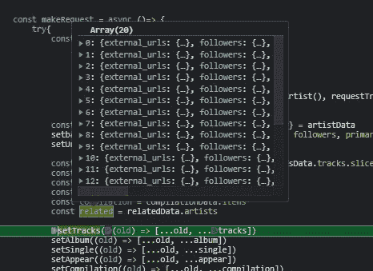
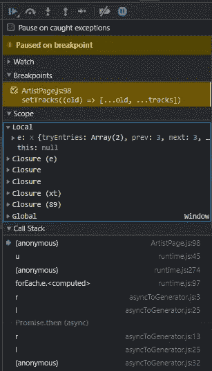

# 调试你的 React 应用程序，就像一个忍者用源代码地图

> 原文：<https://javascript.plainenglish.io/debug-your-react-app-like-a-ninja-with-source-maps-c63010b3a6e7?source=collection_archive---------5----------------------->

## 如何使用源代码地图轻松调试 React 应用程序(不再为繁琐的 console.logs 而烦恼)。

当我还是一名自学成才的开发人员时，在我有第一份开发工作之前，登录控制台是我经常提取应用程序中的变量值以进行调试的方式。我发现随着时间的推移，这个过程变得越来越乏味，因为为了找到一个 bug，console.log()语句被编写和删除了数百次。在 VSCode 和 Chrome 的控制台之间来回切换也是我工作流程中的一大烦恼。

作为一名全职开发人员，在最初的几周内，我学习了调试技术，这确实改变了我的生活。令我困惑的是，我读过的每一篇关于 React 调试的文章都只谈到了同样的几件事——React dev tool、控制台日志和内联“调试器”断点。

虽然所有这些工具都很棒，而且作为 React 开发人员，我确实每天都在使用其中一些工具，但是我在这里将要谈到的技术已经成为我作为 React 开发人员遇到的大多数问题的首选解决方案。

## 输入源地图

来源地图是通过 YouTube 上的一个名为[成为 Chrome 开发者工具忍者的技巧](https://youtu.be/jFbeUaWbbjM?t=197)的视频引起我注意的，作者是[克里斯·霍克斯](https://www.youtube.com/c/noobtoprofessional)(顺便说一下，这是一个很棒的 YouTube 编程频道)。出于某种真正的巧合，仅仅几天后在工作中，我就看到了如何真正使用源代码地图来通过我们的大型 React 代码库进行断点。

据我所知，源代码映射基本上让你看到原始形式的代码——不像你经常在浏览器的检查器工具的源代码标签中看到的编译和缩小的代码。这允许您像在浏览器的 inspection source 选项卡内的文本编辑器中一样导航您的代码。从那里，您可以找到您想要调试的问题区域，并为您的应用程序设置断点，就像您如何调试 VSCode 中的代码以查看您需要查看的任何变量一样——不再到处都是随机的 console.logs。

关于源码图的更多详细信息——Ryan Seddon 写了一篇相当全面的介绍 JavaScript 源码图的文章。

## 好的，那么你如何使用源地图呢？

源地图可以由您正在使用的任何 Javascript 编译器生成。如果您正在使用 Create React App，您应该已经启用了它。如果您已经创建了自己的 Webpack 配置，您需要按照 [Webpack 文档](https://webpack.js.org/configuration/devtool/)的指示，将行`devtool: “source map”`包含在您的配置文件中。现在，在 Chrome 中，确保通过`ctrl+shft+i`或`right-click -> inspect`打开检查器工具来启用源地图设置。在检测工具中，单击窗口右上角的齿轮图标，打开如下所示的设置页面。

在 preference 选项卡的 Sources 子标题下，确保`Enable JavaScript source maps`已启用。

## 像专家一样调试

现在，您可以通过查看自己的源代码来进行调试了。要找到你正在寻找的代码，当聚焦在检查器窗口时按下`ctrl+p`。将弹出一个输入栏，您可以开始输入您正在寻找的组件文件名，然后在您需要的文件上按 enter 键。例如，在我的 Spotify 克隆应用程序中，我想看看`ArtistPage`中的代码。

然后，我想在第 98 行的代码上设置断点，所以我将鼠标悬停在数字 98 上，单击它来激活断点。

Clicking on line 98 also allows you to breakpoint at other points on the line as well

每当代码执行到该行时，断点将被激活。您将在应用程序顶部看到`Paused in debugger`,以及单步调试代码的按钮。

当您在断点上时，您可以通过悬停在代码中任何先前的变量上来检查它们，如下所示。

You can expand the objects within this window to see more information

右边还会有更多关于变量的信息，你拥有的断点数量，以及右边的调用栈。

最后，您甚至可以刷新页面，当您的代码到达该行时，断点仍将存在并执行。

## 现在去调试你的应用程序，像一个真正的反应忍者

正如您可能想象的那样，这种调试技术对于我们 React 开发人员来说是一个非常强大的工具——我可以想象其他前端开发人员也是如此。对我来说，这是一个真正改变生活的技巧，我希望我能早点学会，但尽管如此，我还是很高兴能说出这些话。

## 资源

[成为 Chrome 开发者工具忍者的技巧](https://youtu.be/jFbeUaWbbjM?t=197)

[JavaScript 源码介绍图](https://www.html5rocks.com/en/tutorials/developertools/sourcemaps/)

[Webpack devtool 文档](https://webpack.js.org/configuration/devtool/)

[试试我的 Spotify 克隆网站](https://clonedspot.netlify.app/)

*更多内容请看*[***plain English . io***](http://plainenglish.io/)