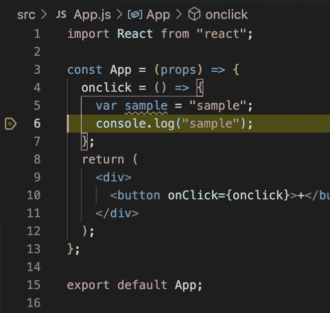

# Chrome 调试器已经死了

> 原文：<https://javascript.plainenglish.io/debugger-for-chrome-is-dead-4f2c1175c26c?source=collection_archive---------1----------------------->

## 这就是如何在 VSCode 中调试你的 React 应用程序

Photo by [Sigmund](https://unsplash.com/@sigmund?utm_source=medium&utm_medium=referral) on [Unsplash](https://unsplash.com?utm_source=medium&utm_medium=referral)

在编写 web 前端时，我非常喜欢在`VSCode`中调试。本文面向喜欢在 VSCode IDE 上调试和添加断点的人。

以前这可以通过 Chrome 插件的[调试器来完成。但是这个插件现在被弃用，不能正常工作。](https://marketplace.visualstudio.com/items?itemName=msjsdiag.debugger-for-chrome)

那现在怎么办？让我们开始在 VSCode 中设置调试过程的过程。

## 第一步

安装过程中必需的东西。

*   打开扩展视图(ctrl+shift+x)并搜索`@builtin @id:ms-vscode.js-debug`
*   右键点击`JavaScript Debugger`扩展和`Disable`它。
*   在扩展视图中搜索`@id:ms-vscode.js-debug-nightly`。
*   安装该扩展。

## 第二步

View -> Command Palette (shortcut — cmd+shift+p)

然后:

debug: Javascript debug terminal

这将打开一个终端，并在新打开的终端中启动您的应用程序。[通过`npm start`或`yarn start`。

## 最后

再次启动应用程序后，打开`View -> Command Palette`并搜索:

Open link

现在复制 url 应用程序正在运行的端口号如下:

My app is running in localhost:3000

输入你的应用 url 并开始调试你的应用。

Breakpoint in Action !

感谢阅读。干杯！

*更多内容请看*[***plain English . io***](http://plainenglish.io)