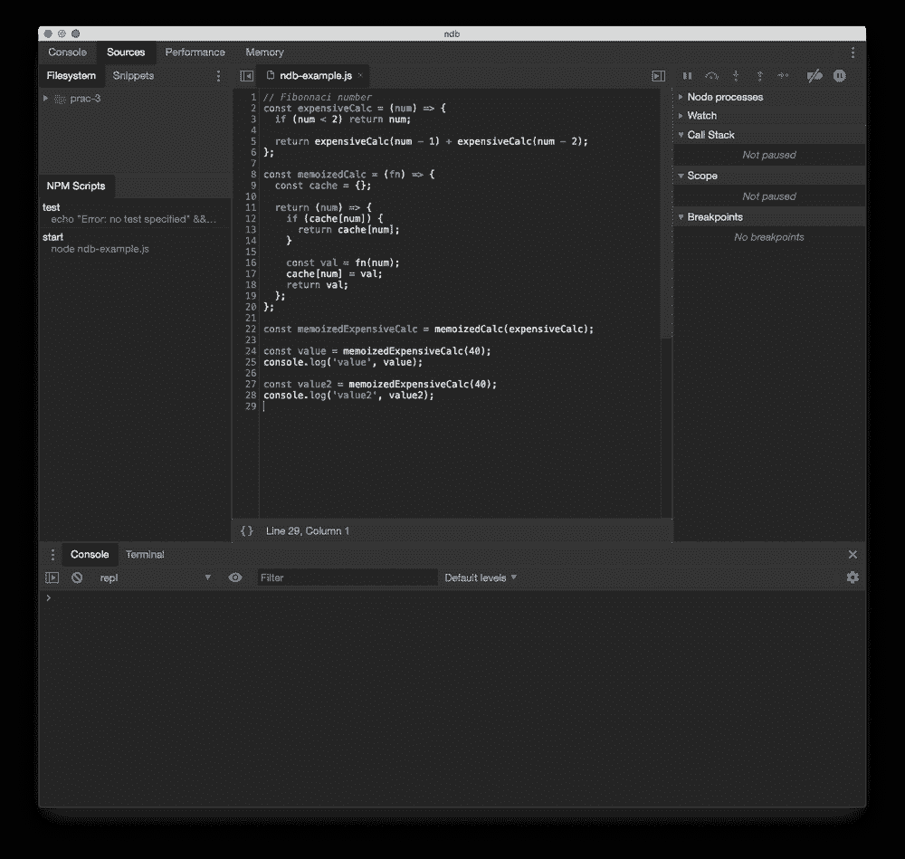
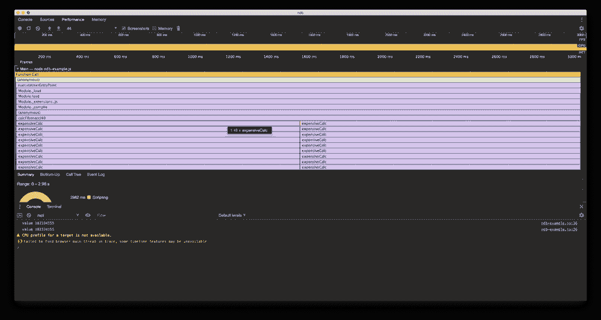
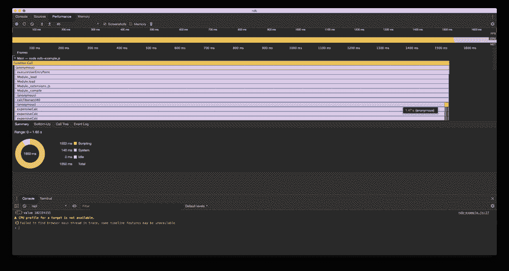
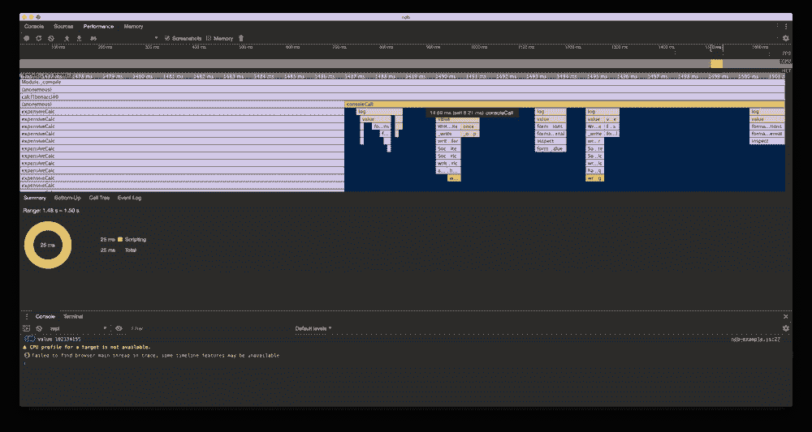

# 用 NDB 调试 JavaScript 性能

> 原文：<https://javascript.plainenglish.io/debugging-javascript-performance-with-ndb-3c1816c6a09c?source=collection_archive---------15----------------------->

[ndb](https://github.com/GoogleChromeLabs/ndb) 将自己描述为“由 Chrome DevTools 实现的 Node.js 的改进调试体验”。

它使 Chrome DevTools 的一些最佳功能在调试 Nodejs 应用程序时成为盟友。

在之前的博文中，我们通过 VSCode 进行了调试。在本文中，我将展示 ndb 的分析器如何帮助您识别和解决可能的瓶颈。

## 入门指南

全局安装 ndb，初始化一个新项目，并为示例创建一个新文件:

在`package.json`中，更新脚本以包含一个`start`脚本:

## 我们的第一个例子

我们将计算[斐波纳契数](https://en.wikipedia.org/wiki/Fibonacci_number)并以一种花费`2^n`的方式对其进行编码，其中计算时间加倍，我们需要递归调用该数的次数越多(不包括基本情况)。

在`ndb-example.js`内，添加以下内容:

我们将运行相同的计算来获得 40 的斐波那契数(102334155)。为此，在控制台的基本目录下运行`ndb .`来启动 ndb。您应该面对以下情况:

在左侧面板的`NPM Scripts`下，您会看到我们的`start`脚本可用。悬停在它上面，我们可以看到按钮高亮显示，使我们能够“播放”或“录制”脚本。假设我们的`start`脚本将在`ndb-example.js`文件中运行，我们可以点击 record 来查看执行过程中发生了什么:

在分析器上，它向我们显示了`calcFibonacci40`下的两个不同的调用栈，最大的两个`expensiveCalc`直接位于下面，是我们从`calcFibonacci40`发出的两个调用。两个都花了我 1.49 秒在这个硬件上！事实上，目前我们的代码是，如果我们不断地调用`calcFibonacci40`，那昂贵的计算将总是被重新计算！

那么我们能做什么呢？我们将记住这个函数。

## 记忆功能

记忆该函数将“缓存”我们以前的结果，并使用相同的参数进行任何调用，返回存储在缓存中的内容，而不是重新计算那个昂贵的计算。

让我们通过更新代码来实现这一点:

这里我们添加了一个简单的 memoisation 函数，它本质上使用闭包来“维护”一个缓存，并使用传递的参数返回原始函数。我不会对记忆说太多，但是更多的信息可以在这个[博客](https://scotch.io/tutorials/understanding-memoization-in-javascript)上找到。

最后，我们用函数的记忆版本替换昂贵的函数。

为了增加戏剧性的效果，我们现在要迭代这个函数 100 次。在我目前的机器上，我预计这个函数在没有记忆的情况下运行大约需要 2 分钟！

让我们重新录制表演，看看会发生什么。

分析性能，我们看到我们仍然进行了昂贵的计算(仍然花费了 1.49 秒)，但是我们也在控制台上看到我们记录了 100 次答案？发生了什么事？

如果我们放大到最末端，我们会看到在调用的末端,`calcFibonacci40`有一个直接的子调用`console.log`!

这是我们工作中的回忆！因为我们不断地传递相同的参数，我们的缓存会发现这一点，我们不再调用`expensiveCalc`来获取答案！

我们实际上可以看到，第一次调用用了 1.49 秒，其余 99 次调用总共用了 14.69 毫秒！就性能而言，这是一个巨大的成功！

## 摘要

在今天的帖子中，我们安装了 ndb，用于帮助分析和精确定位昂贵的计算。

最后，我们通过记忆功能和直观地看到我们的改进来结束！

ndb 是一个很好的调试工具，尤其是在调试性能和内存问题时。

## 资源和进一步阅读

1.  [ndb — Github](https://github.com/GoogleChromeLabs/ndb)
2.  [JavaScript 中的记忆化](https://scotch.io/tutorials/understanding-memoization-in-javascript)

*图片来源:* [*西格蒙德*](https://unsplash.com/@sigmund)

*原贴于我的* [*博客*](https://blog.dennisokeeffe.com/blog/2021-02-12-debugging-performance-with-ndb/) *。*