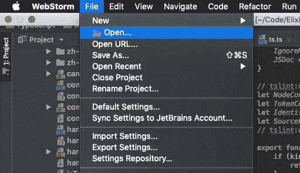
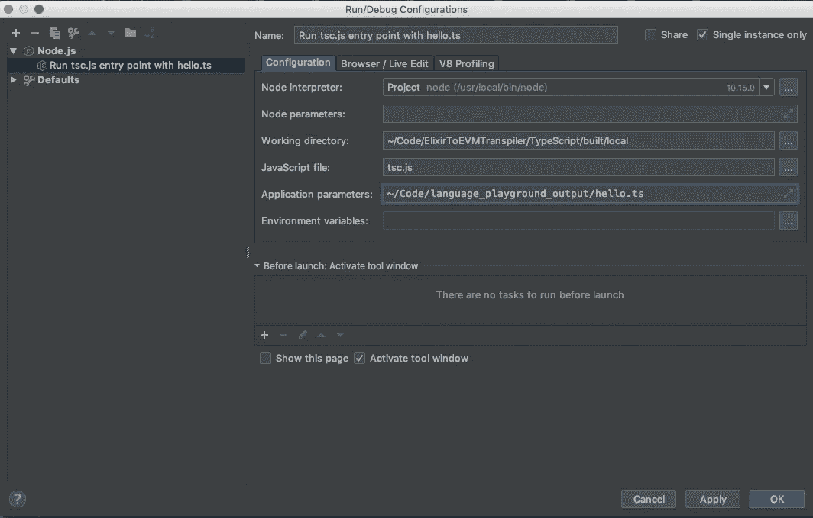
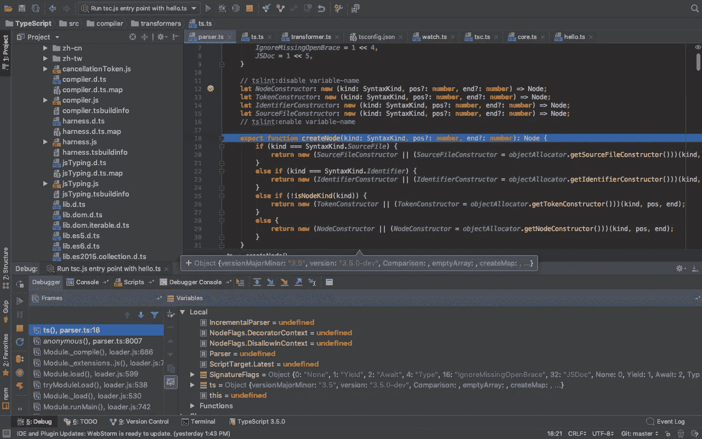

# 用 WebStorm 调试服务器端类型脚本

> 原文：<https://javascript.plainenglish.io/debugging-server-side-typescript-with-webstorm-b9d661f64d5?source=collection_archive---------10----------------------->


[https://flic.kr/p/fBpBZY](https://flic.kr/p/fBpBZY)

世界似乎正朝着结合 Node.js 使用 TypeScript 的方向发展。从另一个角度来看，如果您可以假装[【任何】](https://github.com/Microsoft/TypeScript/blob/master/doc/spec.md#3.1)类型不存在，那么 TypeScript 几乎就像是一种强类型语言。

这篇博文向您展示了如何在 WebStorm 中为服务器端 TypeScript 项目设置调试器。如果您希望调试 TypeScript 编译器本身或使用 TypeScript 的 node js 项目，这篇文章中的说明应该有用。这两者并不完全相同，但出于某种原因，我很想花时间来检查 TypeScript 项目的内部结构。我将在以后的博客中详细介绍标准 TypeScript node js 项目的问题解决和调试。

从 https://github.com/Microsoft/TypeScript获取打字稿源

****如果您想调试使用 TypeScript 编写的客户端应用程序，请查看:****

**[https://www . jetbrains . com/help/idea/running-and-debugging-typescript . html](https://www.jetbrains.com/help/idea/running-and-debugging-TypeScript.html)**

****使用 Visual Studio 代码调试 TypeScript:****

**[https://code . visual studio . com/docs/TypeScript/TypeScript-调试](https://code.visualstudio.com/docs/TypeScript/TypeScript-debugging)**

# **为服务器端 TypeScript 应用程序设置调试的一般步骤**

**—在 tsconfig.json 文件的 compilerOptions 部分添加`"sourceMap":true`。
—ts config . JSON 文件应提及输出文件或输出文件夹。如果未指定，则假设其为`<base directory>/build`。输出目录是生成的 js 文件所在的位置。
—在运行>编辑配置窗口中，点击+号并选择节点。Js 选项。
—在弹出的模态中添加输出目录作为工作目录。
—将生成的 index.js 或 main.js 文件添加到 javascript 文件字段的输出文件夹中。如果一切都做得正确，你现在应该能够在你的类型脚本代码中设置断点，并通过调试器命中它们。**

# **让断点在 TypeScript 编译器源代码中工作**

****可选:设置 HelloWorld 类型脚本项目。****

**如果您已经有了想要使用的 typescript 代码，就没有必要设置 hello world 项目。typescript 编译器需要传递一些东西来命中断点并完成它的工作。**

**创建一个文件夹，并在其中进行更改。这个文件夹叫什么并不重要，所以你可以随意把“例子”改成最适合你的。**

```
mkdir examples && cd examples
```

**创建一个名为“hello.ts”的新文件，并粘贴以下代码。**

```
interface Person {
  firstName: string;
  lastName: string;
}

function greeter(person: Person) {
  return "Hello, " + person.firstName + " " + person.lastName;
}

let user = { firstName: "Jane", lastName: "User" };

console.log(user);
```

**在同一个文件夹中创建另一个名为“tsconfig.json”的文件。将下面的内容复制粘贴到其中。**

```
{
  "compilerOptions": {
    "removeComments": false,
    "target": "es6",
    "module": "commonjs",
    "declaration": false,
    "sourceMap": true,
    "lib": ["es6", "scripthost"],
    "strictNullChecks": true,
    "newLine": "lf",
    "types": ["node"]
  },
  "files": [
    "produceLKG.ts",
    "buildProtocol.ts",
    "processDiagnosticMessages.ts",
    "generateLocalizedDiagnosticMessages.ts",
    "configurePrerelease.ts",
    "word2md.ts"
  ]
}
```

# **克隆并设置类型脚本报告**

**从[https://github.com/Microsoft/TypeScript](https://github.com/Microsoft/TypeScript)克隆 TypeScript repo，并按照说明进行设置。您最好将它放在另一个目录中，而不是放在您在上一步中创建的目录中。**

```
git clone https://github.com/Microsoft/TypeScript && cd TypeScript
```

**README.md 中包含了构建 TypeScript 编译器的说明，但这里是您主要需要做的事情。一旦切换到 TypeScript 目录，如果还没有 Gulp.js，就安装它。**

```
npm install -g gulp
npm install
```

**最后构建编译器——运行**

```
gulp local
```

**一旦这一步完成，我们就可以通过运行下面的代码来测试编译器了。我假设您的 hello.ts 文件在 examples 目录中，并且只是上一级。**

```
node built/local/tsc.js ../examples/hello.ts
```

**上述命令的输出应该是一个 hello.js 文件。不要期望看到代码的输出。记住这是编译器，所以如果 hello.js 文件成功生成，那么一切都很好，一切都正常工作。**

# **在 WebStorm 中打开 TypeScript 源**

**在 WebStorm 中打开您的本地 TypeScript repo。这应该相当简单。使用欢迎屏幕上的打开按钮，或者从文件菜单中选择打开。**

****

**Open TypeScript source in Webstorm**

**请参考[此链接](https://www.jetbrains.com/help/webstorm/opening-reopening-and-closing-projects.html)了解 WebStorm 中打开项目的更多详细信息。**

# **设置运行>编辑配置**

**是时候设置运行/调试配置了。**

****节点解释器****

**应该指向您选择的节点解释器。我用的是版本`10.15.0`。任何 10 或以上的都可以。**

****工作目录****

**应该指向你的输出文件夹。除非你改变了什么，否则这个应该是`built/local`。**

****Javascript 文件****

**应该指向输出目录中生成的 tsc.js 文件。这个文件应该是在本地运行 gulp 时生成的。**

****应用参数****

**应该指向您开始时生成的 hello.ts 文件。完成后，单击确定。**

****

**Run/Debug Configuration**

# **试运行**

**你已经准备好做测试了。在 parser.ts 中设置一个应该在`TypeScript > src > compiler > parser.ts`的断点，然后点击 debugger 按钮。调试器窗口应该会打开，并向您显示类似下面的内容。**

****

**Debugging in action.**

**如果你已经走到这一步，恭喜你！感谢您的阅读。希望这篇文章让您对新的调试能力感到兴奋。**

# **有用的链接**

*   **[TypeScript 官方 Github 回购](https://github.com/Microsoft/TypeScript)**
*   **[Jetbrains——在 WebStorm 中创建定制项目](https://www.jetbrains.com/help/webstorm/creating-projects-in-product.html)**
*   **[调试客户端打字稿应用](https://www.jetbrains.com/help/webstorm/running-and-debugging-typescript.html#ws_ts_run)**
*   **[用于打字应用的约曼生成器](https://yeoman.io/learning/resources.html)**

# **封面图像源**

**预览图片来源:[https://flic.kr/p/fBpBZY](https://flic.kr/p/fBpBZY)**

***原载于*[*https://servingniches.org*](https://servingniches.org/posts/2019-05-28___debugging_serverside_typescript_with_webstorm/)*。***