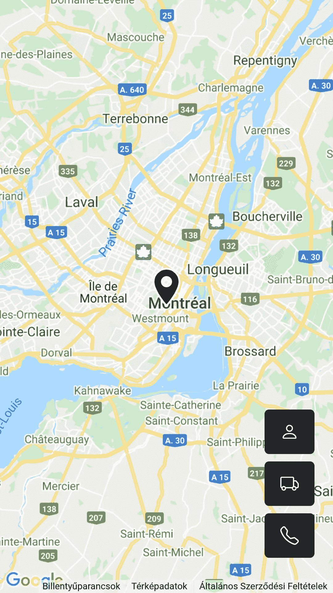

# 去中心化的优步:我如何用 Status.im、Waku 和 Vue.js 构建它

> 原文：<https://javascript.plainenglish.io/decentralized-uber-heres-how-i-built-it-with-status-im-waku-and-vue-js-719b0b998387?source=collection_archive---------12----------------------->


> 区块链没有让出租车司机失业，而是让优步失业，让出租车司机直接与顾客打交道。维塔利克·布特林

当我第一次读到 Vitalik Buterin 的上述引用时，我开始思考如何实现一个分散的优步式的汽车共享应用程序。区块链价格昂贵，并不是为了存储汽车位置等临时数据而发明的。答案是，答案不是区块链。我们必须更深入。

p2p 汽车共享应用的基本机制是乘客用她的坐标广播汽车请求。司机们收到这个请求，谁有免费的车，谁就回答这个请求。乘客收到答案并选择司机。如您所见，我们需要的是一个具有广播功能的消息协议。类似的东西被用于在区块链网络中广播完成的块。

以太坊有自己的消息协议，叫做[耳语](https://eth.wiki/concepts/whisper/whisper)。不幸的是，它并不真正为人所知，并且在以太坊客户端中也不被默认支持。幸运的是，有一个名为 [Status.im](https://status.im/) 的项目有一个名为 [Waku](https://github.com/status-im/js-waku) 的协议来取代 Whisper。Waku 基于 [libp2p](https://libp2p.io/) ，通过 [gossipsub](https://docs.libp2p.io/concepts/publish-subscribe/) 支持话题消息传递，所以完全满足我们的需求。(我有[一篇关于 libp2p 的文章](https://hackernoon.com/writing-decentralized-applications-in-javascript-libp2p-basics)。建议看一下，了解一下基础。)

现在我们有了一个基本的概念和一个发布/订阅协议。让我们为它设计一个极简的 UI。我的极简 UI 看起来是这样的:



一个简单的谷歌地图有 3 个按钮。第一个按钮是个人资料按钮。我试图找到最简单的配置文件管理解决方案。Gravatar 是一个简单的通用配置文件服务，您可以将配置文件图像和一些配置文件数据分配到您的电子邮件地址。

它被用于许多服务，如 GitHub、WordPress 等。它可以存储基本的个人资料，所以对我们有好处。在 profile 面板上，您只需给出您的电子邮件地址，应用程序就会从 gravatar 下载您的所有个人资料数据。设置电话号码或 Skype 帐户非常重要，因为您的潜在乘客可以通过它联系到您。


第二个按钮是汽车共享的切换按钮。如果你点击它，按钮的颜色会变成绿色，应用程序将订阅广播主题。如果有来电，应用程序会显示一个蓝色标记。如果你点击标记，你可以向可能的乘客出价。


最后一个按钮是乘客叫车用的。如果乘客点击这个按钮，应用程序将向司机广播请求。如果司机出价，就会显示一个绿色标记。乘客可以选择其中一名司机，然后用给定的 Skype 帐户或电话号码给她打电话。


仅此而已。正如我之前写的。这完全是这个概念的最小实现。其目的是帮助理解 p2p 发布/订阅系统如何在应用程序下工作。让我们看看代码。

初始化 Waku 真的很简单。

```
this.waku = await Waku.create({ bootstrap: true }); await this.waku.waitForConnectedPeer();
```

这两行代码将下载 Waku 引导节点的实际列表，并等待一些对等节点被连接。初始化之后，我们的应用程序将成为 Gossipsub 网格的一部分，并准备好发送和接收消息。

```
let privateTopicName = "/waku-uber/1/" + parsedAvatarData.hash + "/proto";this.waku.relay.addObserver(
  (wakuMessage) => {
    this.processPrivateMessage(wakuMessage);
  },
  [privateTopicName]
);
```

每个客户端都订阅一个特殊的私有主题，该主题是从电子邮件哈希中生成的，以使其具有唯一性。当司机向可能的乘客发出邀请时，该应用程序将使用该主题。订阅由`waku.relay.addObserver`完成。主题名可以是任何东西，但是 [Waku 有一个关于主题名格式的建议](https://github.com/status-im/js-waku/blob/main/guides/choose-content-topic.md)。

```
const payload = proto.WakuUberMessage.encode({ 
  type: proto.Type.REQUEST, 
  lat: this.myPosition.lat, 
  lng: this.myPosition.lng, 
  avatarHash: parsedAvatarData.hash, 
}); const wakuMessage = await WakuMessage.fromBytes( 
  payload, 
  broadcastTopicName 
); await this.waku.relay.send(wakuMessage);
```

可以通过 waku.relay.send 方法发送消息。该方法只有一个参数，即从有效负载和主题名构建的 WakuMessage。Waku 使用二进制有效载荷。可以将字符串作为消息发送，但是推荐使用二进制格式，因为它更紧凑。有一个叫做[协议缓冲区](https://developers.google.com/protocol-buffers)的工具，用于定义消息结构并对其进行编码/解码。我们简单的消息格式定义如下:

```
enum Type { 
  REQUEST = 1; 
  RESPONSE = 2; 
} message WakuUberMessage { 
  Type type = 1; 
  float lat = 2; 
  float lng = 3; 
  string avatarHash = 4; 
}
```

它包含一个类型字段，可以是请求(客户叫车)或响应(司机出价)，也可以是 lat。/长。地理坐标和发件人电子邮件地址的散列。应用程序可以通过电子邮件散列获得 gravatar 信息，私有主题也是从它生成的。

简而言之，这些是应用程序的重要部分。你可以在 [GitHub](https://github.com/TheBojda/waku-uber) 上找到完整的代码。

我知道，这是一个汽车共享应用程序的最小实现，但经过一些改进，它可以发展成为一个真正的应用程序。让我们来看看其中的一些改进:

*   真实身份管理。基于区块链的身份识别系统可以确保司机和乘客之间的信任。可以用对等体的公钥/私钥对消息进行加密和签名，并且可以由第三方身份提供者来识别对等体，该第三方身份提供者可以证明简档数据的有效性、检查驾驶执照的有效性等。
*   基于位置的广播。在当前的实现中，即使乘客离司机很远，每个司机都会收到每个请求。这可以通过更多基于 [geohash](https://en.wikipedia.org/wiki/Geohash) 的广播主题来管理。

正如您所看到的，当您构建一个分散的应用程序时，区块链并不总是答案。有时候深入挖掘 p2p 堆栈是值得的。像 Waku 这样的点对点 pubsub 服务可以用在很多方面。你可以建立分散的优步或分散的 Airbnb，你可以建立分散的数据库或你自己的区块链。

快乐编码…

*本文原载* [*此处*](https://hackernoon.com/decentralized-uber-heres-how-i-built-it-with-statusim-waku-and-vuejs) *。*

*更多内容看* [***说白了。*** *报名参加我们的*](http://plainenglish.io/) [***免费每周简讯这里***](http://newsletter.plainenglish.io/) ***。***