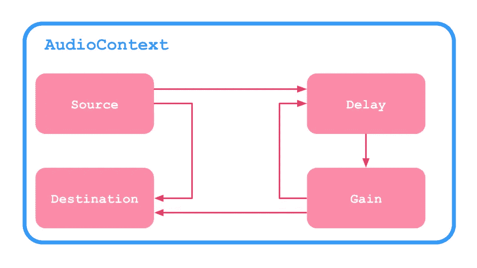

# 声明性网络音频 API

> 原文：<https://javascript.plainenglish.io/declarative-web-audio-api-ad98b9b49d7e?source=collection_archive---------11----------------------->

## 用 Web 组件构建 AudioNodes 的更好方法！

Photo by [Daniel Schludi](https://unsplash.com/@schluditsch) on [Unsplash](https://unsplash.com/search/photos/typing?utm_source=unsplash&utm_medium=referral&utm_content=creditCopyText)

[网络音频 API](https://developer.mozilla.org/en-US/docs/Web/API/Web_Audio_API) 是现代浏览器拥有的丰富的多媒体特性。它允许我们处理音频信号，构建从有趣的游戏到完整的数字音频工作站的惊人应用。但是在其原始范例中使用复杂的可重用代码结构是很困难的。让我们来看看基本的回声效果示例:

一切都发生在`[AudioContext](https://developer.mozilla.org/en-US/docs/Web/API/AudioContext)`之内。该图由一个链接到`[AudioDestinationNode](https://developer.mozilla.org/en-US/docs/Web/API/AudioDestinationNode)`的源节点组成。它还有一个反馈环`[DelayNode](https://developer.mozilla.org/en-US/docs/Web/API/DelayNode)`来引入延迟，还有`[GainNode](https://developer.mozilla.org/en-US/docs/Web/API/GainNode)`来控制回声衰减的速度。这个循环也连接到目的地。

设置包括 3 个步骤:

1.  创建节点
2.  配置参数
3.  将图表连接在一起

对于任何复杂的处理模块，这很快就会变得乏味，尤其是如果我们想要实时控制参数的话。这是一种势在必行的方法。我们编写了一组命令，这些命令按照改变程序状态的顺序执行。

这让我想起了很多用 [Canvas API](https://developer.mozilla.org/en-US/docs/Web/API/Canvas_API) 画图。我们可以通过给出坐标的连续命令来手动绘制形状。还有另一种方法来绘制形状，即使是非常复杂的形状，那就是[SVG](https://developer.mozilla.org/en-US/docs/Web/SVG)——可缩放矢量图形。让我们试着为 Web Audio API 构建我们自己的“SVG”——一种基于声明性 XML 的方式，用于构建节点图、更改参数和轻松重用代码！

# 准备

我们的解决方案将基于本地 Web 组件。作为概念验证，让我们创建一个简单的音量控件:

当我们的组件准备就绪，HTML5 音频标签作为自定义组件充当源时，此图看起来是这样的:

为了能够将所有这些节点链接在一起，我们将使用*依赖注入*模式。简而言之，这很简单。父母为孩子提供依赖，孩子可以注入依赖，这将从拥有它的最近的父母请求。

对于我们的演示，我们将使用自定义 DOM 事件。因为它们是同步的、有作用域的，只需要几行代码就可以实现。我在 Justin Fagnani talk 上看到了这种模式，它很适合我们的情况。

由于 Web 组件扩展了本地 HTML 元素，并且 JavaScript 中没有多重继承——我们将制作一个 *mixin* :

`provide`方法将接受一个`Map`令牌密钥和提供者值。它将侦听自定义事件*“inject”*，如果请求的令牌出现在给定的映射中，它将停止传播，并将映射中的值分配给事件。

而`inject`方法将接受一个令牌，分派一个自定义事件并返回结果。

# Web 组件

我们的音量控制有 4 个组成部分。

1。最顶层的组件是**上下文**。所有 web 组件都有一个在初始化时被调用的`connectedCallback`方法。我们将使用一个映射图`AudioContext`作为令牌，使用`new AudioContext()`实例作为值来调用`provide`。这将允许所有孩子注入相同的音频环境:

2。 **源节点**将扩展`HTMLAudioElement`。在它的`connectedCallback`中，它将注入上下文并创建一个新的`MediaElementAudioSourceNode`实例。它会将它作为`AudioNode`放入该元素提供的映射中:

3。 **增益**稍微复杂一点，因为它有参数。我们将用`GainNode`创建一个私有属性。在`connectedCallback`中，我们将注入父`AudioNode`并将其连接到我们的`GainNode`。我们还将为所有孩子提供`GainNode`作为`AudioNode`:

Web 组件有一个静态 getter，它返回您可以更改的可能属性的数组。在这种情况下，应该是`gain`。当增益属性改变时，我们将其解析为 float 并更新`AudioParam`。

> 不要忘记，这是一个概念验证，所以我们现在将忽略参数自动化。

4。的**目的地**的组件很简单。我们只是注入父节点`AudioNode`和`AudioContext`，并将节点连接到目的节点:

现在剩下要做的就是注册我们的 Web 组件:

# 结果

您可以在此处查看该自定义控件:

 [## Web 组件驱动的声明性 Web 音频-概念验证

water lea . github . io](https://waterplea.github.io/declarative-web-audio/) 

一旦你启动`AudioContext`，你会看到一个连接到自定义音量控制的输入滑块。本机 HTML5 音频控件位于下方，两者都是功能性的。

虽然这可能看起来不怎么样，但它概述了这个概念。只需相对较少的代码，我们就可以将所有 web 音频 API 特性转换为 Web 组件。我是一个非常视觉化的人。对我来说，这比普通的网络音频 API 要干净和容易理解得多。我知道很多音乐家也和我一样。它们用于从物理块中构建处理链，将它们相互连接起来。所以这种方式对目标受众是有意义的。

我是一个角度爱好者，所以当我用普通 JavaScript 创建这个概念证明时，我已经将 Web 音频 API 完全转换为声明性角度指令:

 [## GitHub - ng-web-apis/audio:这是一个用于声明性使用 web 音频 API 和 Angular 的库

### 这是一个用于 Angular 7+的 Web 音频 API 声明性使用的库。这是一个完整的…

github.com](https://github.com/ng-web-apis/audio) 

如果你对 Angular 感兴趣，可以看看[这篇文章](https://medium.com/its-tinkoff/writing-retrowave-in-angular-4e1ff80798a8)覆盖了这个库，还有[这篇跟进](https://medium.com/its-tinkoff/jam-on-your-midi-keyboard-in-angular-2a2c3f91ad75)关于 Web MIDI API 的文章。有了这两个库，我做了一个基于浏览器的吉他英雄游戏，可以和真正的合成器一起玩。它还具有卡拉 ok 模式，可以跟着唱，看看你的音调匹配得如何。欢迎您尝试一下:

 [## Jamigo.app

### Jamigo 是一款音乐游戏。它帮助你使练习变得有趣和容易。从目录中选择一首歌曲，用…

jamigo.app](https://jamigo.app/) 

我希望这是一个有趣的角度。声明式方法可以使复杂的任务更容易管理，也更容易理解。

*更多内容请看*[***plain English . io***](http://plainenglish.io)