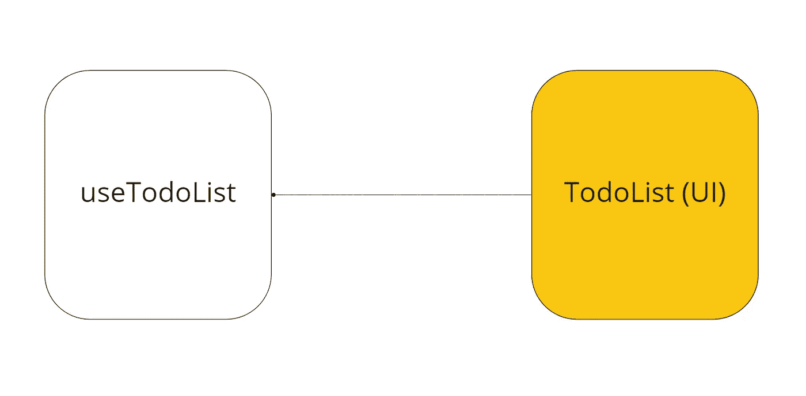

# 如何用 React 组件将逻辑与 UI 分离

> 原文：<https://javascript.plainenglish.io/decoupling-logic-from-ui-create-react-components-like-a-boss-7ebde91671c8?source=collection_archive---------3----------------------->

> 分离逻辑和 UI 使得编写和测试组件更加容易。

Separating logic from UI

本文的主要目标是确保我们编写新组件时，每个组件只关心它的数据、错误处理、加载和任何其他需要的逻辑(我们将在另一篇文章中讨论组件之间的数据共享)。

# 为什么这很重要？

*   **可扩展性**:确实是高可扩展性。
*   **可移除性**:删除一个组件在今天之后应该不是问题，不会发生突破性的变化或倒退。
*   可移动性:在任何地方使用组件的能力，可能跨越使用相同 API 的项目。

# **动手**

让我们深入代码，展示重构前后的两个例子。

让我们以下面的例子为例，试着理解如何让它发生:

正如您在上面看到的，我们有一个通过使用 axios 通过远程 API 配置请求数据来实现待办事项列表的简单示例。

您是否注意到提取 status = TODO 项的简单计算？如果你的答案是肯定的，那么我们就在同一页上。

正如我们在文章开头所解释的，我们的任务是将逻辑从 UI 中分离出来，但是在上面的例子中，我们在同一个 JS 文件中有逻辑，让我们看看应该做些什么来实现我们的任务。

因此，首先，我们需要从组件中取出逻辑。

如你所见，我们称之为**“useTodoList”**。这个钩子应该包含 TodoList 组件的逻辑。

你可以注意到我们在文件中没有 UI，这是一个自定义的钩子。

但是主要组件**“TodoList”**应该是什么样子的呢？

简单，哈？这就是为什么在业务逻辑不是 UI 的一部分的情况下构建组件，并将自定义钩子作为组件的 API 来处理是非常重要的。

当每个组件都在独立模式下工作时，组件之间的通信如何？这将是我们在下一篇文章中讨论的有趣话题。

*更多内容请看*[*plain English . io*](http://plainenglish.io/)