# 深度潜入摇树

> 原文：<https://javascript.plainenglish.io/deep-dive-into-tree-shaking-ba2e648b8dcb?source=collection_archive---------3----------------------->


在 JavaScript 世界中，术语“树摇动”指的是删除死代码的**。**但是这个术语并不局限于 JavaScript，“摇树”这个词来自于 20 世纪 90 年代的 Lisp 社区。

感谢阿克塞尔·劳施迈尔 ，他把自己变成了印第安纳·琼斯，并在推特上找到了这个词的确切来源。

当我第一次听到这个话题的时候，我非常兴奋地学习摇树。所以我谷歌了一下。

根据[维基百科](https://en.wikipedia.org/wiki/Tree_shaking)的说法，dart 中使用了摇树算法来移除死代码。

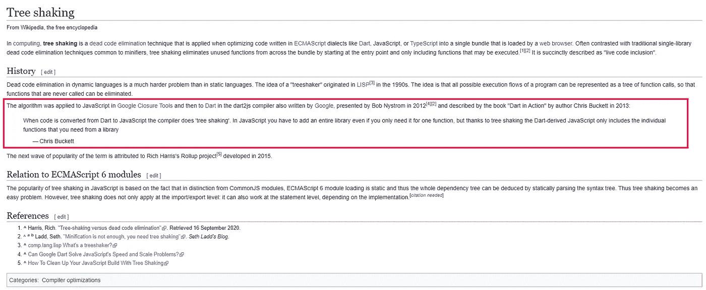

[https://en.wikipedia.org/wiki/Tree_shaking](https://en.wikipedia.org/wiki/Tree_shaking)

我冲进 [Dart GitHub repo](https://github.com/dart-lang/site-www/search?q=tree-shaking&unscoped_q=tree-shaking) 发现了这个。

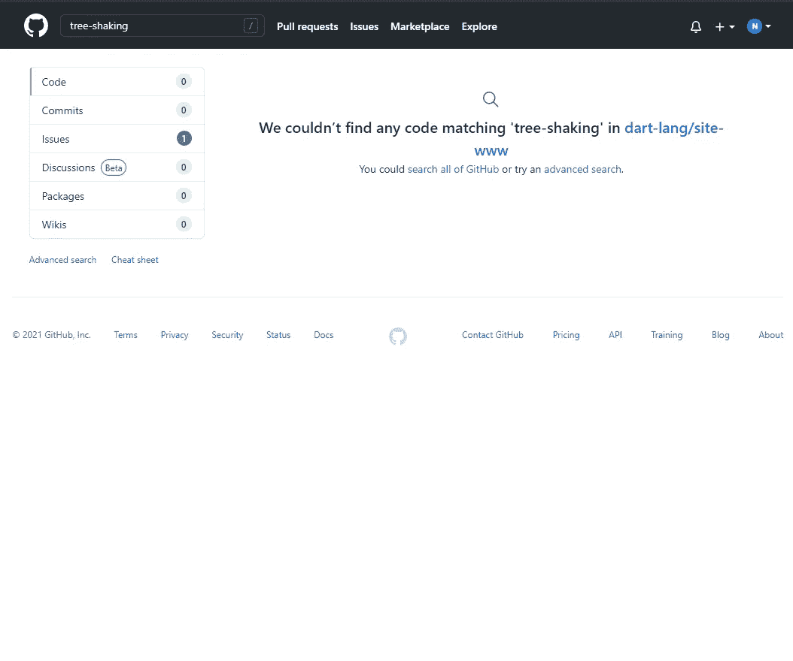

[https://github.com/dart-lang/site-www/search?q=tree-shaking&unscoped_q=tree-shaking](https://github.com/dart-lang/site-www/search?q=tree-shaking&unscoped_q=tree-shaking)

**谢谢谷歌！**

StackOverflow 有一个关于摇树的问题，有一个很好的答案。

[](https://stackoverflow.com/questions/45884414/what-is-tree-shaking-and-why-would-i-need-it) [## 什么是树摇动，为什么我需要它？

### 我看到你有三个问题:1.什么是树摇动？2.有什么必要呢？3.还有，你怎么用？树…

stackoverflow.com](https://stackoverflow.com/questions/45884414/what-is-tree-shaking-and-why-would-i-need-it) 

在这一点上，我意识到只有几篇文章是关于摇树和它的方法论的。

在阅读了大量关于树摇动的文章后，我决定写一篇关于 3 种不同方法的文章。

1.  进口摇树
2.  环境变量摇树
3.  CSS 摇树

# 为什么叫摇树？

让我们以下面的代码为例:

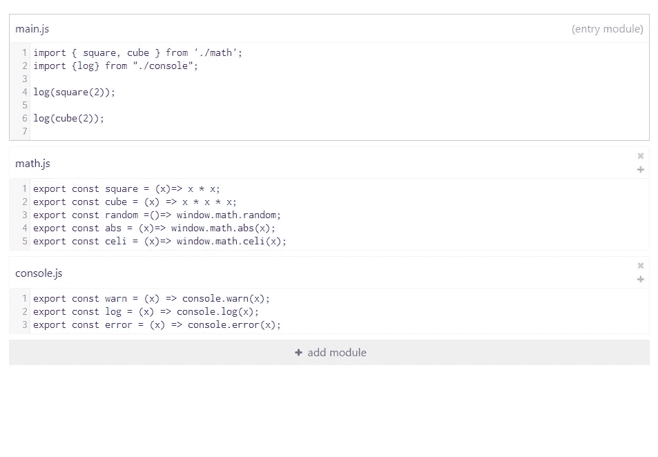

https://bit.ly/2UaKxTV[REPL](https://bit.ly/2UaKxTV)

文件`main.js`使用了两个文件中的 3 个方法(`square` `cube` `log`)，这些文件有一些额外的方法，这些方法没有被使用，也不会运行。因此，这些代码是**死代码**我们需要删除它们。

为了便于理解，我们需要将这些依赖转换成一棵树或者技术上的抽象语法树。

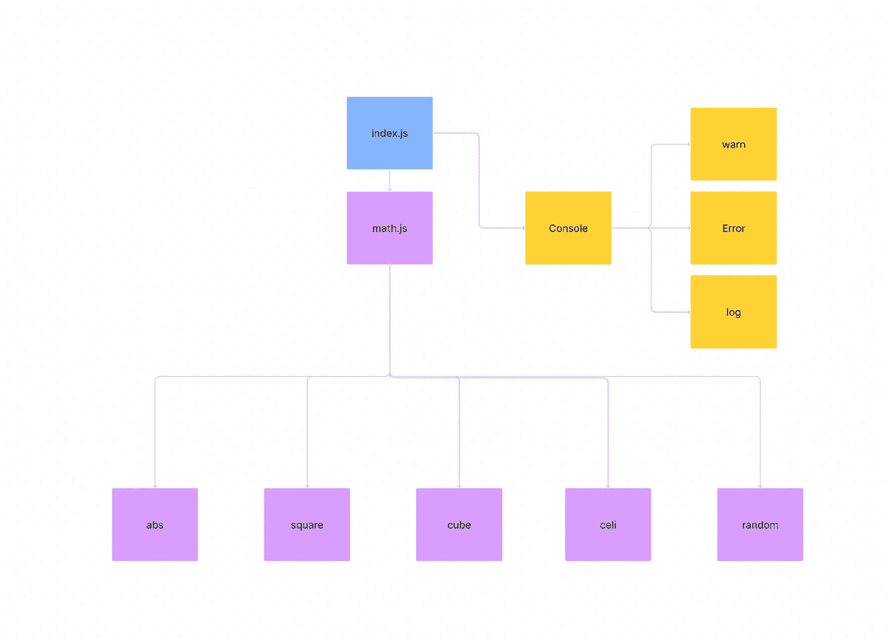

让我们假设这些依赖图是一棵有分支、主干等的普通树。如果你觉得很难把这些图想象成一棵树，没关系，我会为你做的。

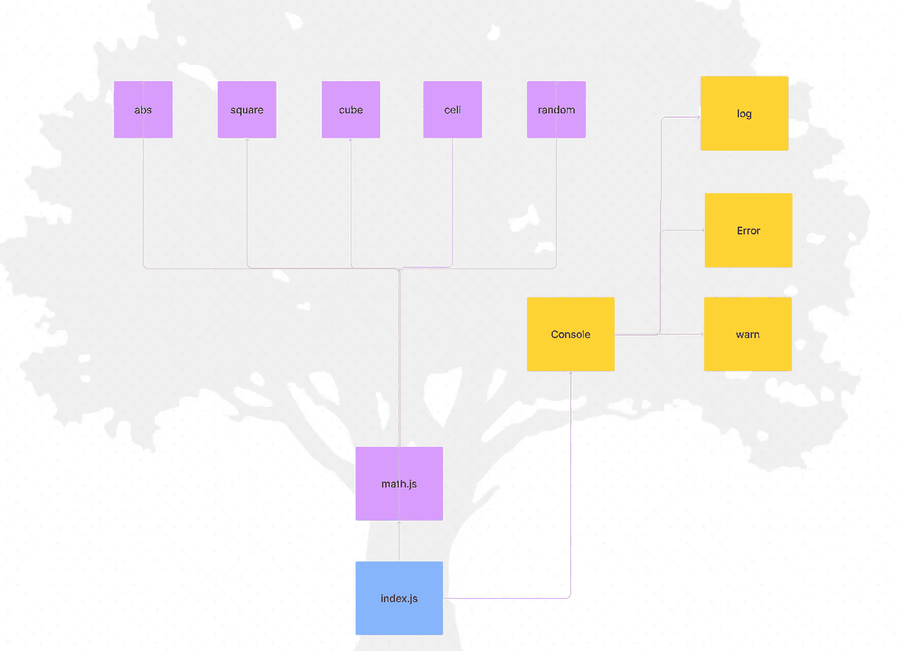

好多了！

现在用红色标记所有失效代码，用蓝色代码更好理解。

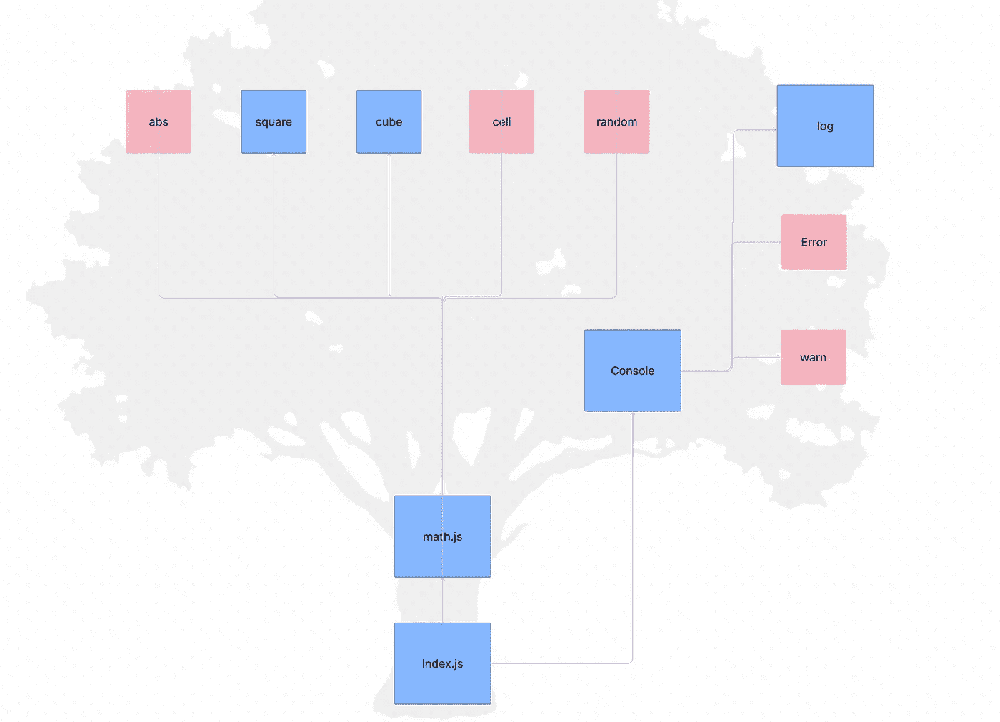

如果我们使劲摇晃一棵树，所有的枯枝都会倒下，这也是我们在代码库中需要做的事情。

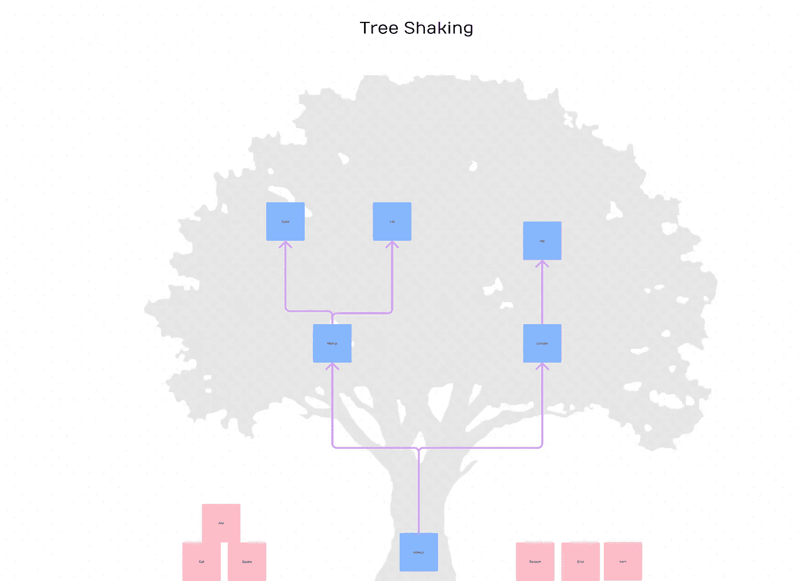

Tree-Shaking

好，现在让我们摇摇树。

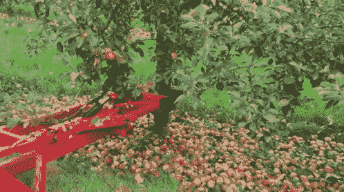

[https://tenor.com/view/tree-shaking-shaking-cutting-trees-leaves-gif-15973840](https://tenor.com/view/tree-shaking-shaking-cutting-trees-leaves-gif-15973840)

# **进口摇树**

摇树的概念从 20 世纪 90 年代就存在了，但是由于 ES 静态导入，我们最近才在 JavaScript 中使用它。

ES 静态导入或和谐导入允许从不同的文件导入特定的函数或变量。

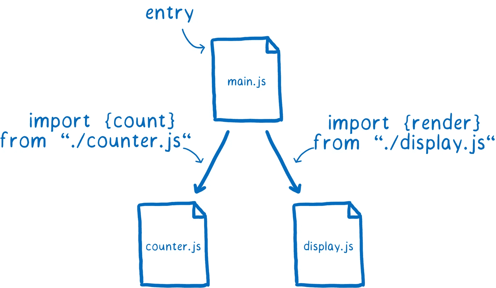

[https://hacks.mozilla.org/2018/03/es-modules-a-cartoon-deep-dive/](https://hacks.mozilla.org/2018/03/es-modules-a-cartoon-deep-dive/)

如果你想了解更多关于 es-modules 的信息，请查看这篇关于 [Mozilla Hacks](https://hacks.mozilla.org/2018/03/es-modules-a-cartoon-deep-dive/) 的文章，作者是[林克拉克](https://medium.com/u/d3391efe481a?source=post_page-----ba2e648b8dcb--------------------------------)。

让我们使用相同的代码来表示树。

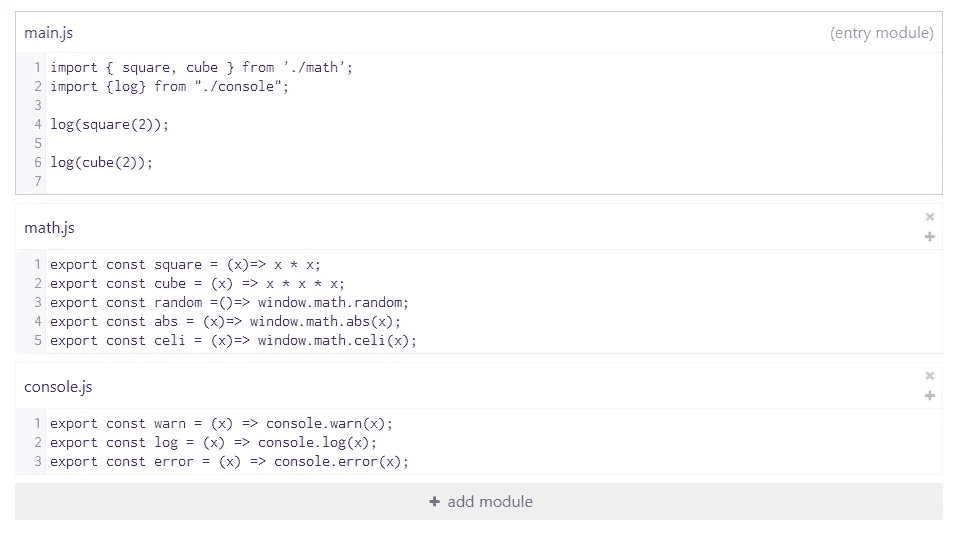

文件`main.js`是我们的入口模块，在这个页面中，我们只使用了 8 个方法中的 3 个。而且所有的方法都是纯函数，意味着它没有任何额外的依赖和副作用。

如果我们删除所有未使用的方法，我们的最终输出将如下所示。

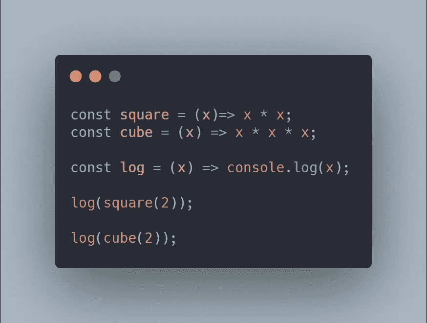

With Tree-Shaking

如果没有发生树抖动，最终输出将是这样的。

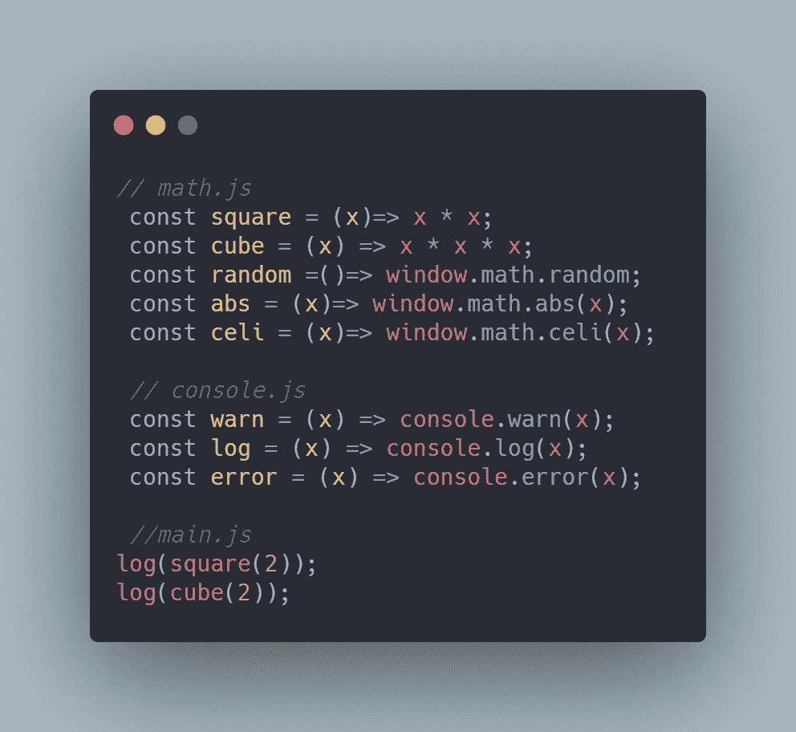

## **如何删除死代码**

现在是价值百万的问题:“如何删除死代码？”

大多数现代构建工具都会进行树抖动来减小最终包的大小。通过分析它们，我们可以了解它们是如何工作的。

一般来说，树抖动将移除没有连接到根节点的节点(方法/变量)。

让我进一步解释一下。

现在，让我们回到语法树(在头脑中将代码转换成语法树)。如果抽象语法树中没有使用方法或变量，这些函数将不会连接到根节点。

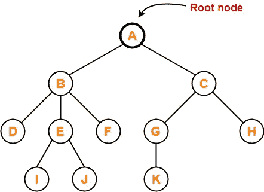

[https://www.gatevidyalay.com/tree-data-structure-tree-terminology/](https://www.gatevidyalay.com/tree-data-structure-tree-terminology/)

我们需要做的就是删除没有连接到根节点的节点。大多数打包程序使用一种算法来查找并删除死代码，这种算法类似于[标记和扫描](https://en.wikipedia.org/wiki/Tracing_garbage_collection)算法。

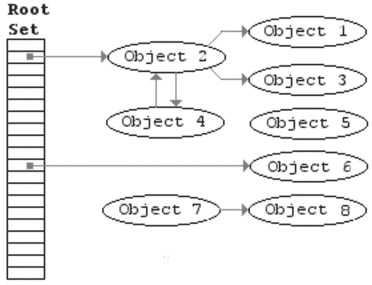

[https://en.wikipedia.org/wiki/Tracing_garbage_collection](https://en.wikipedia.org/wiki/Tracing_garbage_collection)

垃圾收集器中通常使用标记和清除算法来识别活的和死的对象，并从内存中移除死的对象。

在[汇总捆绑器](https://rollupjs.org/guide/en/)中默认启用树抖动，因此我们可以在[汇总 REPL](https://rollupjs.org/repl) 上测试我们的代码

以下输出由 es-build 的汇总生成。

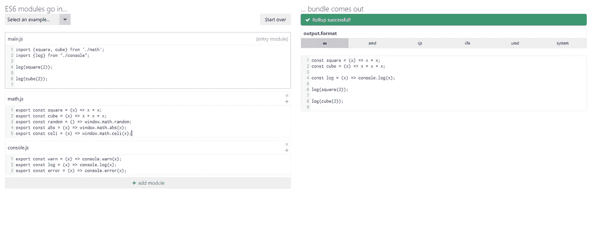

## 如果函数使用另一个函数呢？

让我们通过添加依赖项来改变我们的方法`square`。在使用`isNumber`方法的`square`方法中增加了一个验证方法。

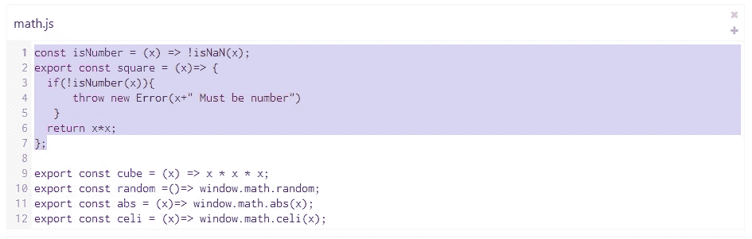

所以我们的最终输出也应该包括`isNumber`方法。

汇总输出。

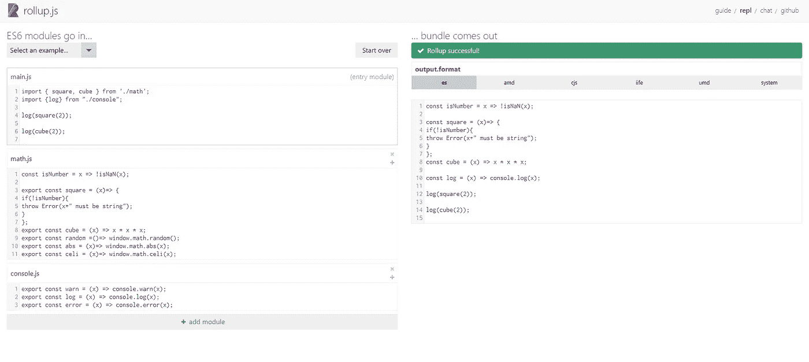

打包程序可以识别依赖的方法，并将它们包含在最终的构建中。

**注意:**导入树抖动也可以用 commonJS 格式完成，但 es 导入格式的效果更好。

更多信息:请参考本报告:[https://github . com/roll up/plugins/tree/master/packages/commonjs](https://github.com/rollup/plugins/tree/master/packages/commonjs)

## 上课摇树

和一个班一起摇树就是另一回事了！

让我们通过使用包含静态方法的类来重构代码(非静态方法也可以)。

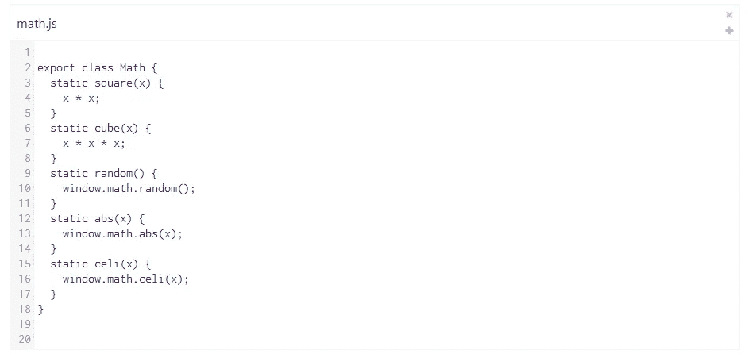

在抽象树中，类将连接到其方法的根节点。

所以即使我们没有使用所有的方法，它们也会被包含在最终的构建中。

同样的事情也适用于对象。

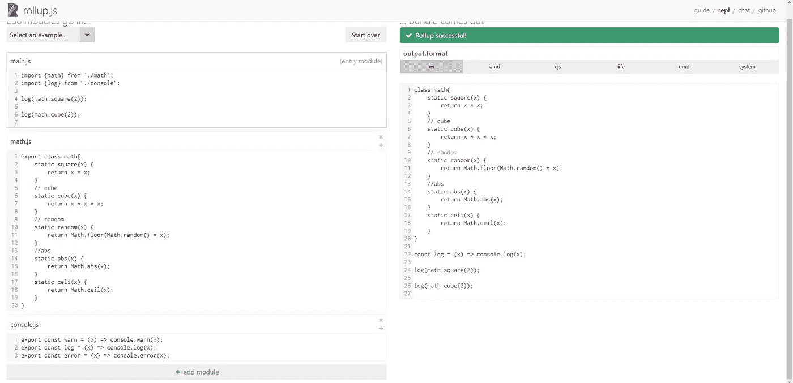

当编写模块化代码时，为特定的代码创建一个抽象的思维图，这样你就知道最终的输出。

# **环境变量**

环境变量在运行时不会改变，所以大多数绑定器会根据值进行树抖动。

在构建过程中。

如果`NODE_ENV`是`true`，则不需要 else 部分，因此打包程序会将其移除。没有必要使用`if-check`,因为它永远是真的。

如果`NODE_ENV`是`false`，捆绑做同样的事情。

如果配置会在运行时改变，考虑将它们转换成环境变量，并根据值使用`if-checks`。

# CSS 摇树

我们不能直接对 CSS 应用标记扫描算法。是的，CSS 很难做。


[https://www.reddit.com/r/ProgrammerHumor/comments/8tnztu/backend_developer_doing_css/](https://www.reddit.com/r/ProgrammerHumor/comments/8tnztu/backend_developer_doing_css/)

做 CSS 对前端和后端开发来说都很难，因为有很多方法可以做同样的事情。

幸运的是！一些现代的 CSS 框架将帮助我们解决这个问题，他们也在 JavaScript 的帮助下做了树摇动。

## 净化


[Purge](https://purgecss.com/) 是一套工具，用于检测并删除未使用的 CSS。它可以和`webpack` `postCSS` `grunt` `gulp` `gatsby`一起使用

webpack 的示例配置文件。

一些现代的 CSS 框架会清理“引擎盖下”来提高它们的性能。

## 顺风摇树


[顺风](https://tailwindcss.com/)搭载了数吨性能特征，其中之一就是**摇树。**

清除使用这个正则表达式`/[^<>"'`\s]*[^<>"'`\s:]/g`来获取类名，所以当您有条件地构造类名时，请构造一个完整的字符串，而不是部分字符串。

不要这样做:

```
<div class="text-{{  error  ?  'red'  :  'green'  }}-600"></div>
```

请改为执行以下操作:

```
<div class="{{  error  ?  'text-red-600'  :  'text-green-600'  }}"></div>
```

要启用清除，您需要在配置文件中指定路径。

详情请查阅[公文](https://tailwindcss.com/docs/optimizing-for-production)

我希望你能稍微理解一下摇树的概念。如果你想知道，请使用以下链接。

1.  [网络包中的摇树](https://webpack.js.org/guides/tree-shaking/)(官方文档)
2.  [用树摇动减少 JavaScript 有效负载](https://developers.google.com/web/fundamentals/performance/optimizing-javascript/tree-shaking) (Chrome Dev 文章)
3.  [摇树:参考指南](https://www.smashingmagazine.com/2021/05/tree-shaking-reference-guide/)(粉碎杂志文章)
4.  [/*# __PURE__*/](https://twitter.com/iamakulov/status/1353650650438119424) (一个关于 PURE 的非常棒的推特帖子)

如果你对这篇文章有任何疑问/建议，请留下评论。

还有，看看我最近的文章

1.  [您应该将 JSON 网络令牌存储在哪里(JWT)？](/where-to-store-the-json-web-token-jwt-4f76abcd4577)
2.  [JavaScript 内存管理入门指南](/how-memory-management-works-in-javascript-f07ccd544190)
3.  [调用 API 时使用查询代替获取](/usequery-instead-of-fetch-while-calling-an-api-ef12964457c5)

**开心树摇❤️**

*更内容见于* [***普通英语中***](http://plainenglish.io/)