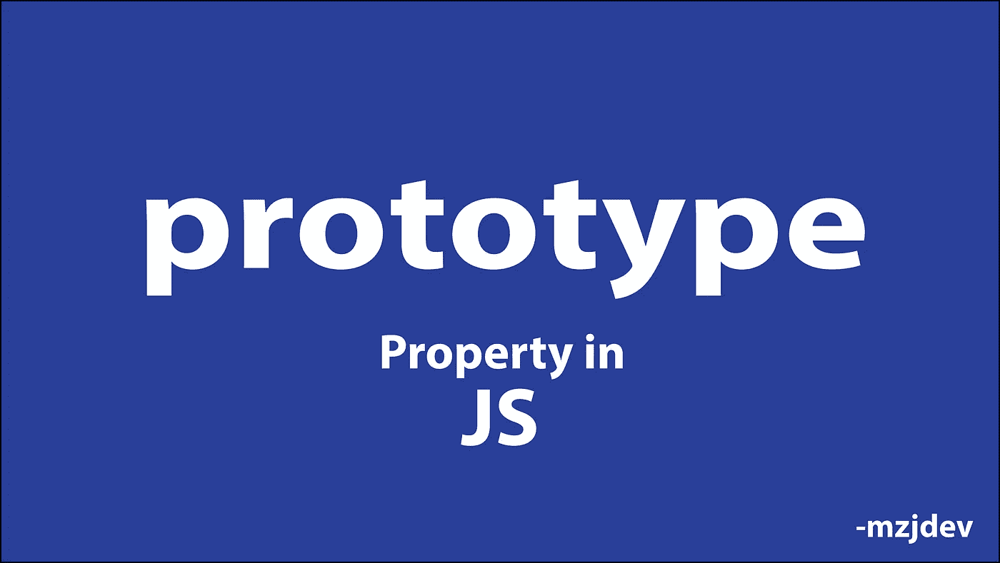
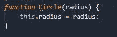
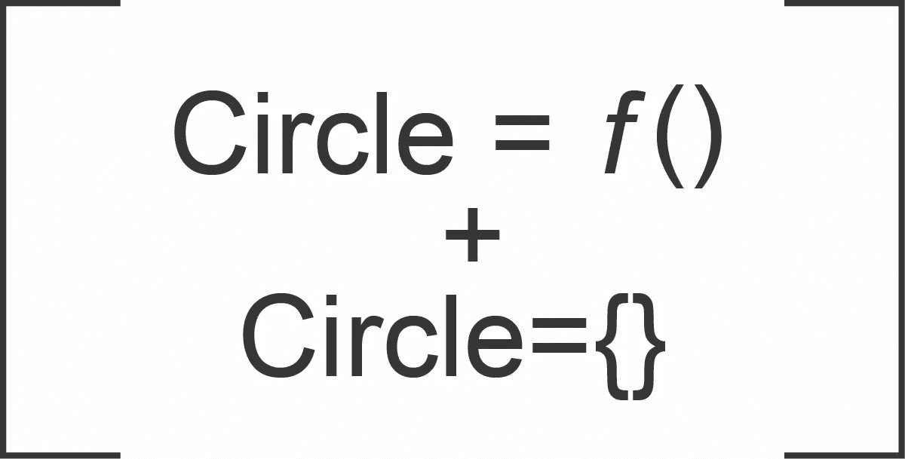
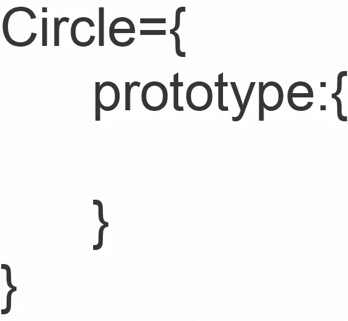
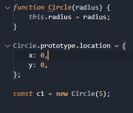
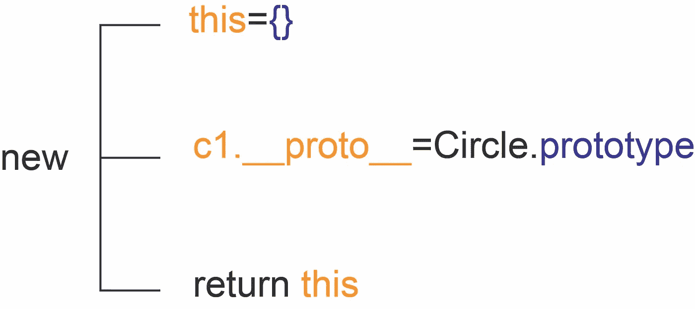
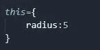
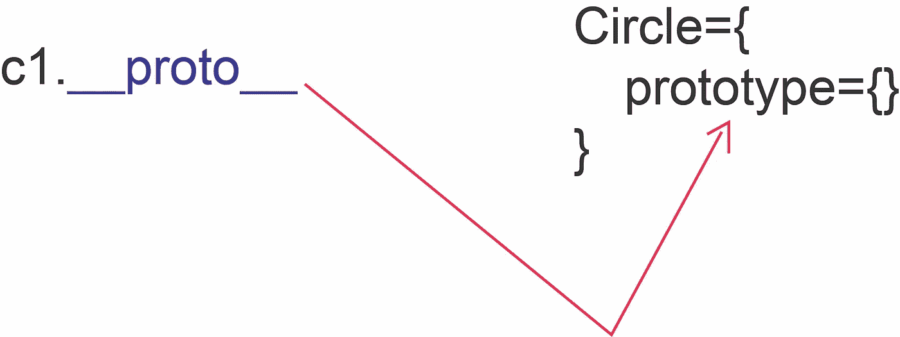
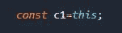
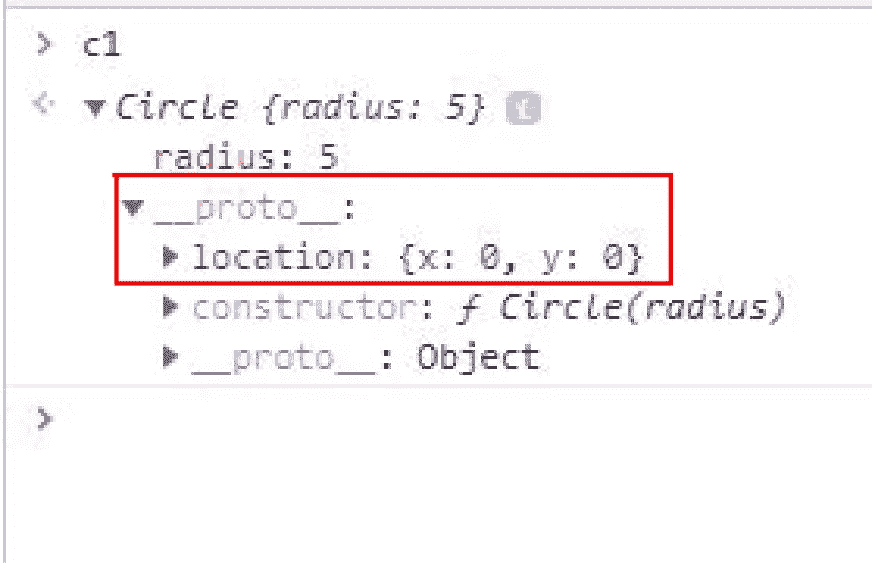

# Javascript 中的原型

> 原文：<https://javascript.plainenglish.io/deep-understanding-of-prototypes-in-javascript-367a81f98847?source=collection_archive---------9----------------------->

# 获得深刻而清晰的理解

到这个故事结束时，你会对 JavaScript 中的 __proto__ 和原型有很好的理解。

我们都知道函数是 JavaScript 中的对象。当你创建一个函数时，你得到了函数和函数的对象。我们将该函数称为“构造函数”。所以，当你创建一个函数时，有两件事需要考虑:

1.  函数(构造函数)
2.  该对象

Image 1

当你声明一个如“图 1”所示的函数时，你会得到如下结果:

Image 2

在该对象圆中，有一个名为“原型”的属性，如下图所示:

Image 3

现在，让我们看看用“new”关键字实例化 Circle 会发生什么。当实例化一个函数时,“new”关键字做三件事:

**1。**创建一个空对象，并将该空对象分配给“this”

这={}

**2。**将已创建对象的“__proto__”属性链接到“原型”

**3。**返回“本”

让我们看一个例子。

Image 4

当您运行“图 4”中给出的上述代码时，会发生以下情况:

Image 5

“new”关键字执行以下操作:

1st step

然后:

2nd step

然后:

3rd Step

现在您可以访问该对象了。您将在 c1 对象的 __proto_ property 内的“Image 4”中显示“location”。

Image 5

就是这样。我希望这让您对 JavaScript 中的原型有了清晰的理解。

*更多内容请看*[***plain English . io***](http://plainenglish.io/)