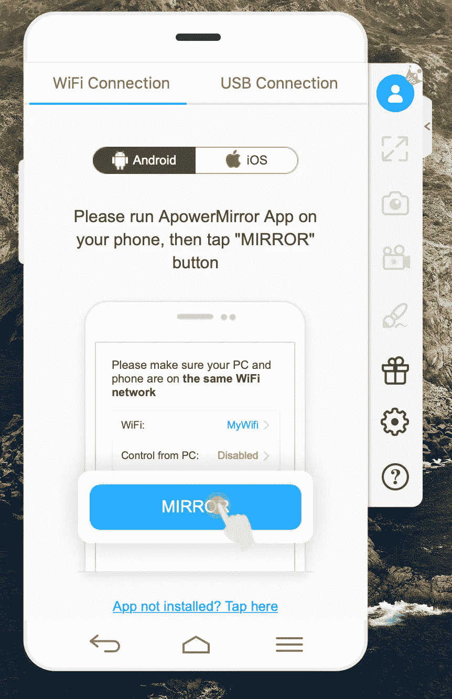
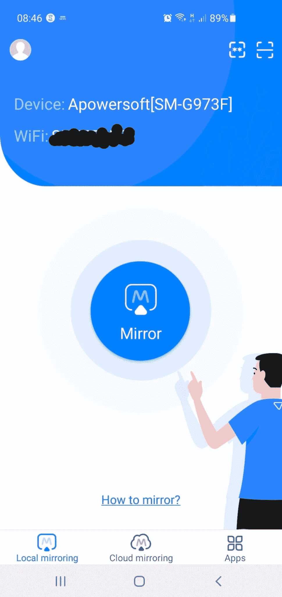
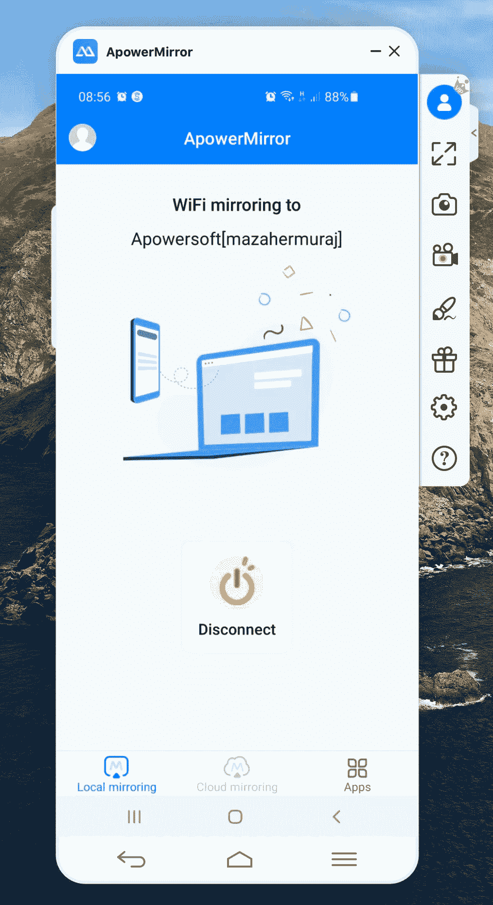
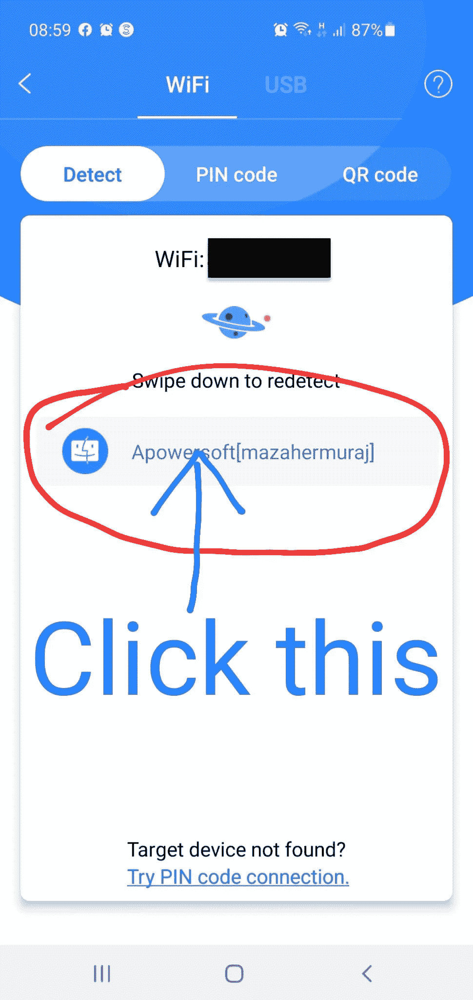
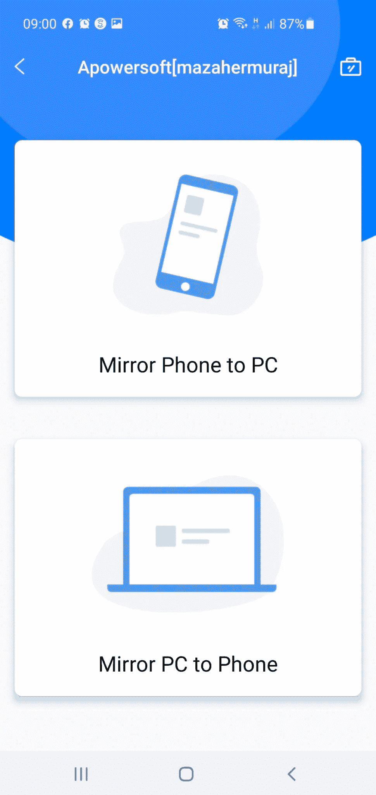

# 在家工作时，在自己的手机上演示 React 原生应用

> 原文：<https://javascript.plainenglish.io/demo-your-react-native-app-from-your-own-phone-while-working-from-home-40436649526c?source=collection_archive---------14----------------------->

体验和响应好 10 倍。

Photo by [Tim Bennett](https://unsplash.com/@timbennettcreative?utm_source=medium&utm_medium=referral) on [Unsplash](https://unsplash.com?utm_source=medium&utm_medium=referral)

在 2020 年 3 月疫情袭击之前，我已经远程工作了一两天，但从那以后，像大多数科技公司一样，我一直在家里全职工作。

在家工作的想法吸引了大多数人，虽然有很多好处，但在软件开发中，当你遵循敏捷工作流程时，有一些仪式与 Zoom 电话会议或微软团队会议不一样。

常见的挫折包括在不得不重复自己之前在静音状态下讲了一千年，屏幕共享导致我的 MacBook 变慢，风扇发出飞机般的噪音，以及当你意识到电池没电时突然进入睡眠模式。*(我有一台 15 寸的 Macbook Pro，2017 btw* 😀*)。*

对于基于 web 或浏览器的项目，演示您的项目并不困难。react-native 项目通常使用模拟器，这也不难演示。

但是，真实的体验比模拟的体验更好，尤其是对于 react 原生/移动应用程序演示。**使用真实的设备对你的演示来说更好。你有机会给你的经理留下深刻印象。**

# 如何用你自己的手机演示你的 react-native 项目

实际上有一个应用程序。它叫做 [ApowerMirror](https://www.apowersoft.com/phone-mirror) 。

有点像投屏，它允许你把手机屏幕投射到笔记本电脑屏幕上。然后，您可以在演示时进行屏幕共享，您实际上是在共享手机屏幕。

## 第一步:下载 ApowerMirror

你需要将 ApowerMirror 应用程序下载到你的手机和笔记本电脑上。

完成后，打开笔记本电脑上的应用程序。您应该会看到下面的屏幕:

选择你手机的操作系统 iOS 或 Android。

## 第二步:连接你的无线网络

确保手机的 wifi 连接与笔记本电脑的 wifi 连接相同。

## 备选步骤 2:通过 USB 将手机连接到笔记本电脑

或者，您不需要通过 wifi 连接，因为您可以使用 USB 电缆将手机连接到笔记本电脑。

## 第三步:点击镜像按钮

连接后，打开手机上的 ApowerMirror 应用程序。您应该会看到以下内容:

轻敲**镜子**和中提琴！您现在正在将您的手机与笔记本电脑进行屏幕共享。现在，您可以使用您使用的电话会议应用程序来共享您的屏幕——MS Teams、Zoom、Slack、thurry 等。

## 连接时

成功连接后，您应该会看到以下屏幕:

现在你的手机屏幕被镜像到你的笔记本电脑或个人电脑上。

# 解决纷争

有时它可能无法连接..😢。技术问题！别害怕，我有解决办法。当您看到下方显示“向下滑动以重新检测”的屏幕时，单击以下按钮:

然后你应该来到下面的屏幕。选择“镜像手机”到电脑，你应该设置和准备去！

这个应用程序最好的部分是它是免费的。有一个专业版本，但你可能不需要它。

你通常如何演示你的项目？有没有你知道的比较好的 app 或者方法？请在评论中分享你的想法。

如果这是有帮助的，如果你给这篇文章一个👏如果你还不知道，那就来一个吧。

考虑订阅 Medium。这很棒，当然也是我用来了解技术领域最新动态以及学习其他开发人员经验的一种方式。你的订阅将直接支持我和许多其他媒体作家。

 [## 阅读马札赫·穆拉杰(以及媒体上成千上万的其他作家)的每一个故事

### 作为一个媒体会员，你的会员费的一部分会给你阅读的作家，你可以完全接触到每一个故事…

mazaher-muraj.medium.com](https://mazaher-muraj.medium.com/membership) 

*更多内容看*[***plain English . io***](http://plainenglish.io/)