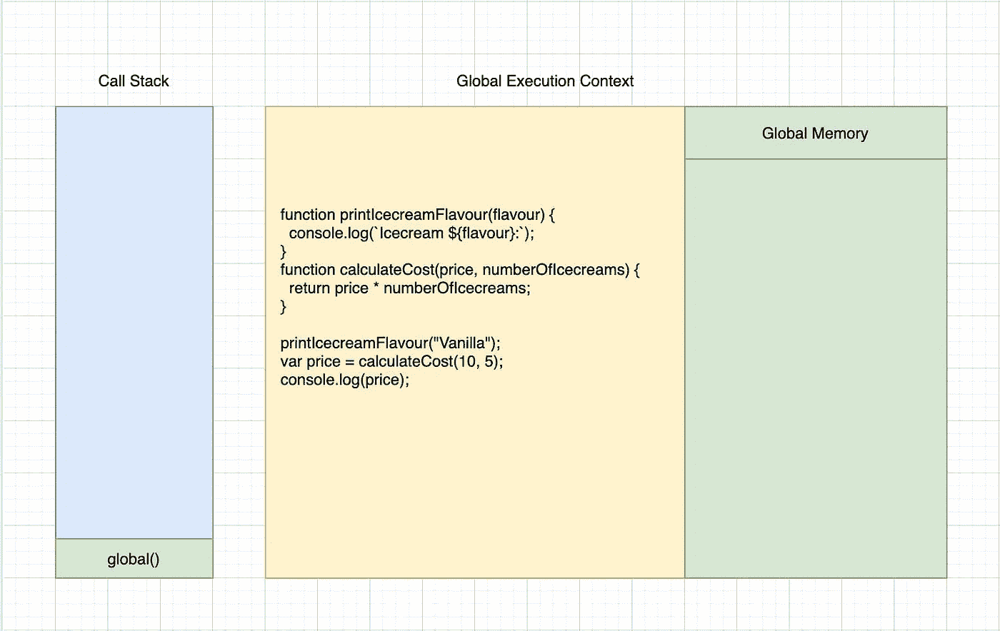
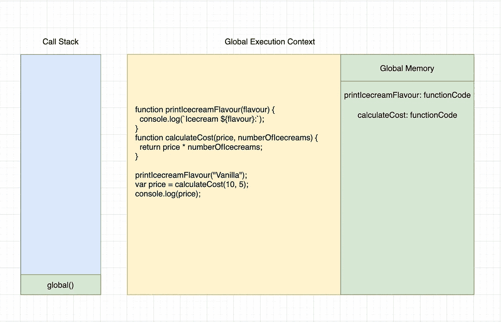
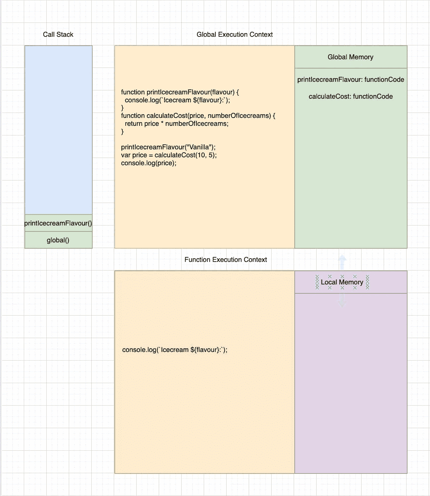
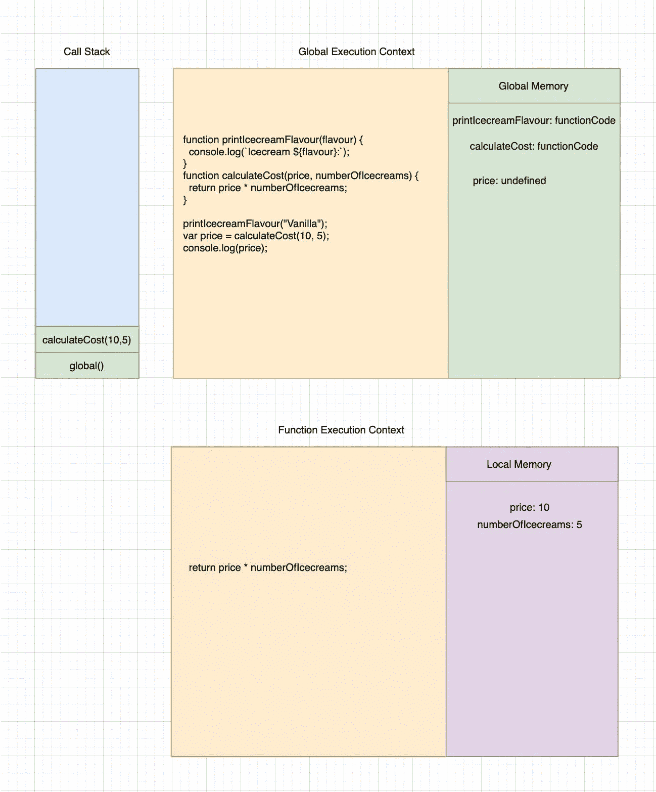
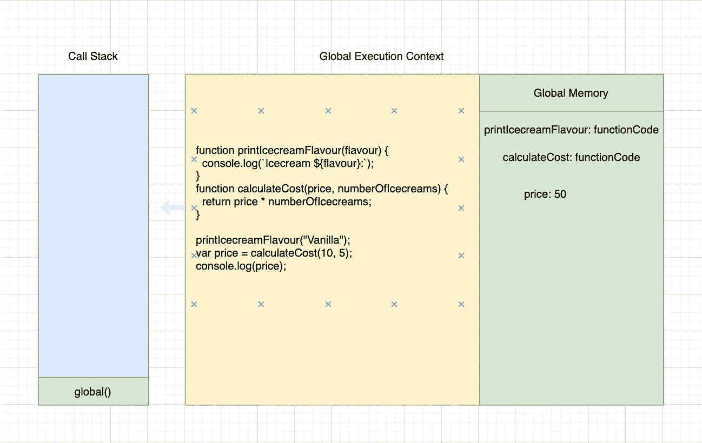

# 揭开 JavaScript 中函数的神秘面纱

> 原文：<https://javascript.plainenglish.io/demystifying-functions-in-javascript-791d7d66e72f?source=collection_archive---------13----------------------->


函数本身就是小程序，有助于提高代码的可读性和可重用性。函数有自己的执行上下文，函数中的所有代码都在上下文中执行。与全局执行上下文类似，函数执行上下文也由两个阶段组成——创建阶段和执行阶段。创建阶段是将创建 arguments 对象的阶段，该变量被声明并引用到全局对象，最后创建函数中的所有其他变量并将其存储到内存堆中。执行阶段是将所有变量分配给它们的实际值并执行函数的阶段。现在让我们试着借助一个例子深入挖掘一下。

```
 function printIcecreamFlavour(flavour) {
 console.log(`Icecream ${flavour}:`);
}
function calculateCost(price, numberOfIcecreams) {
 return price * numberOfIcecreams;
}
printIcecreamFlavour(“Vanilla”);
var price = calculateCost(10, 5);
console.log(price);
```



当 Javascript 引擎运行上述代码时，首先它会创建一个全局执行上下文。全局执行上下文包含两部分——一部分包含整个代码，另一部分是存储变量和函数的地方。创建执行上下文之后，创建阶段就开始了。在此阶段，函数 **printIcecreamFlavour** 和 **calculateCost** 以各自的函数代码作为其值存储在内存中，而变量 **price** 将以 **undefined** 作为其默认值存储在内存中。



在创建阶段之后不久，执行阶段就开始了。在这个阶段，JS 引擎逐行执行代码。一旦遇到第 8 行，它就检查这个标识符是否存在于本地内存中，如果存在，它将获取值，在本例中是整个函数代码，并执行它。JS 引擎一执行该函数，就会将该函数推送到调用堆栈，并为函数 **printIcecreamFlavour** 创建一个新的执行上下文。这个执行上下文将包含两个部分——一部分是函数代码所在的位置，另一部分是所有变量和函数的存储位置。在创建执行上下文后不久，创建阶段就开始了。在这个阶段，将创建 arguments 对象，包含传递给函数的值。因为没有更多的声明语句，所以它进入执行阶段。在这个阶段，当它遇到**console . log(` icecream $ { flavor } `)**时，它将首先检查本地内存中是否存在一个名为 console 的标识符。因为它不在本地内存中，所以它将移动到全局执行上下文并检查其内存。这基于 Javascript 中定义的范围规则。如果你很难理解 JS 中 scope 是如何工作的，你可以查看一下 [**这个**](https://themallu.dev/demystifying-scopes) 。



当它找到对象**控制台**时，它将搜索该对象中定义的方法**日志**，并以类似的方式执行**日志**函数，其中日志函数被推送到调用堆栈，并为**日志**函数创建一个新的执行上下文。执行该功能时，**冰淇淋香草**将打印在控制台上。执行后不久，**日志**的执行上下文将被删除并从调用堆栈中弹出。由于**printicecreamflavor**函数中已经没有要执行的语句，因此**printicecreamflavor**的执行上下文将被删除并从调用堆栈中弹出。现在，当前执行上下文将成为全局执行上下文，JS 引擎将继续执行下一条语句。当它遇到语句**var price = calculated cost(10，5)** 时，它将首先检查标识符 **price** 。当它存在时，它将指定**计算成本**的值。由于**计算成本**是一个函数，在**计算成本**函数完成后，价格将只被赋值。当 **calculateCost** 被执行时，该函数将被推送到调用栈，并为 **calculateCost** 创建一个新的执行上下文。与前面的功能相似，首先开始创建阶段。在这个阶段，将创建 arguments 对象，它将包含作为参数传递给函数的 price 和 **numberOfIcecreams** 的值。由于不再有声明语句，它开始执行阶段。在这个阶段，JS 引擎开始逐行执行代码。一旦遇到语句**return price * numberOfIcecreams**，它将从内存中获取 **price** 和 **numbeOfIcecreams** 的值，对表达式**price * numberOfIcecreams**求值并返回该值，然后将该值赋给变量 **price** 。

由于函数中不再有要执行的语句，函数执行上下文将被销毁，并且 **calculateCost** 函数将从调用堆栈中弹出，其中全局执行上下文将是当前执行上下文。现在 JS 引擎继续下一条语句，这条语句将是 **console.log(price)** 。在执行此操作时，它将从内存中获取**价格**的值，并将其打印到控制台。由于没有更多要执行的语句，JS 引擎将销毁全局执行上下文，并从调用堆栈中弹出它。

那么函数表达式呢？？？。好吧，我很快会在我的下一篇博客《坚持住》中对此进行详细报道。在那之前，如果你觉得这篇文章有用，请展示你的爱，并通过你的社交媒体与你的同伴分享，他们可以最大限度地利用这篇文章。随时联系我在 [**Twitter**](https://twitter.com/ajojm) ， [**LinkedIn**](https://www.linkedin.com/in/ajojohn/) 或者邮箱。

直到我们再次见面，**Mallu Dev**结束👋干杯！🥂

*更多内容请看*[***plain English . io***](http://plainenglish.io/)