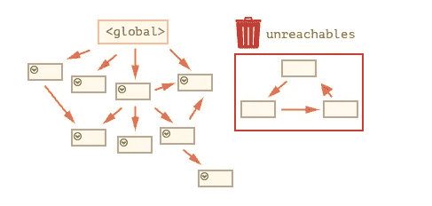
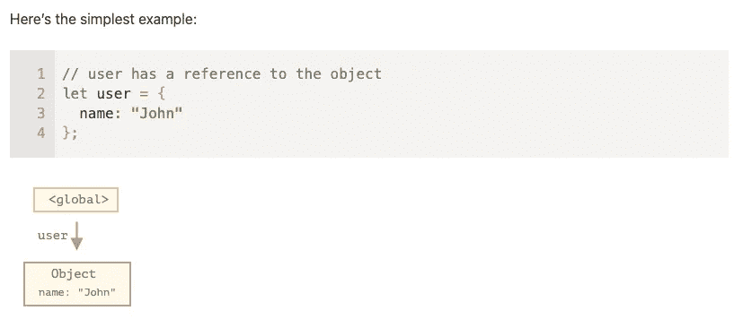
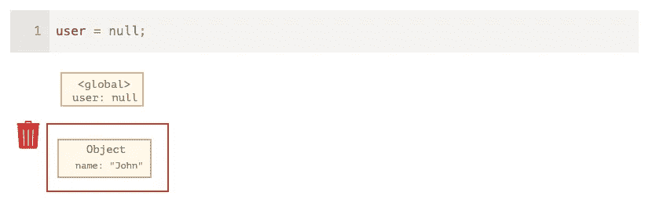
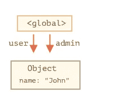
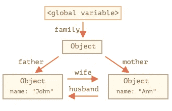
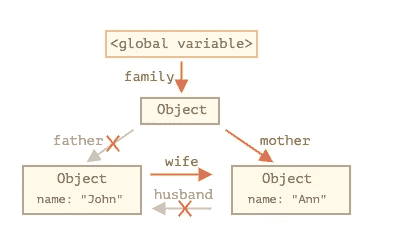
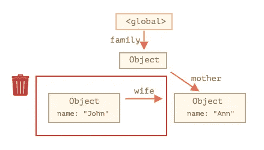
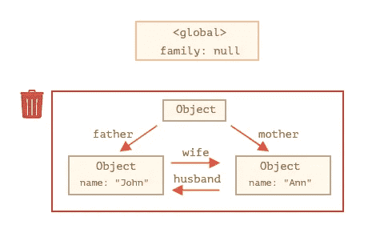
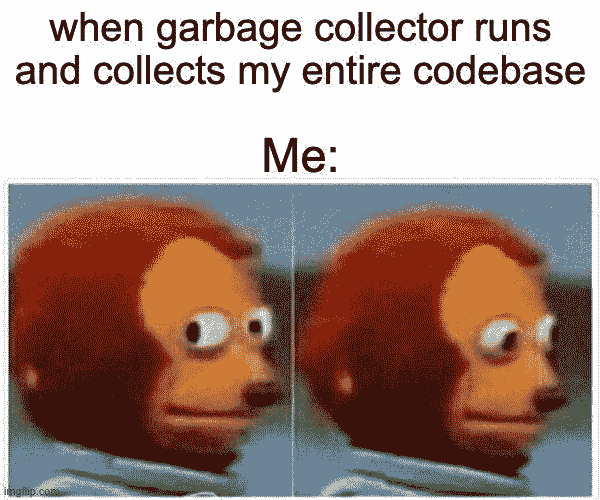

# 让我们揭开 JavaScript 中垃圾收集的神秘面纱

> 原文：<https://javascript.plainenglish.io/demystifying-garbage-collection-in-javascript-3d5c94dea99f?source=collection_archive---------20----------------------->

垃圾收集是 Java 和 C++等一些高级语言中非常基本的功能。但是当涉及到 JavaScript 中的垃圾收集和内存管理时，混乱就开始了，因为没有显式的方法来销毁对象，也没有定义每次销毁对象时的流程。我将试着对这个难以捉摸的过程进行更多的阐释。


# **内存管理**

内存管理有 3 个非常简单的阶段:

1.  分配您需要的内存
2.  使用分配的内存(读、写)
3.  当不再需要分配的内存时，释放它

## **1。分配内存**

这在 JavaScript 中非常简单。

```
var num= 123; // allocates memory for a number
var str = 'sumeet'; // allocates memory for a string

var obj = {
  fName: "Sumeet",
  lName: "Bhalla"
}; // allocates memory for an object and contained values

var arr = [123, null, 'sumeet',"bhalla]; // allocates memory for the array and contained values

function myFunc(val1,val2) {
  return val1+ val2;
} // allocates a function (which is a callable object)
```

## **3。释放分配的内存**

JavaScript 用来决定何时释放内存的算法称为 ***标记和清除*** 算法。

*该算法假设了一组称为根的对象的知识。在 JavaScript 中，根是全局对象。周期性地，垃圾收集器将从这些根开始，找到从这些根引用的所有对象，然后是从这些根引用的所有对象，等等。从根开始，垃圾收集器将找到所有可到达的对象并收集所有不可到达的对象。*

定期执行以下“垃圾收集”步骤:

*   垃圾收集器提取根并“标记”(记住)它们。
*   然后，它访问并“标记”来自它们的所有引用。
*   然后它访问被标记的对象并标记它们的引用。所有访问过的对象都记住了，以免以后两次访问同一个对象。
*   …依此类推，直到每个可到达的(从根)引用都被访问过。
*   除标记的对象外，所有对象都将被删除。



[source](https://javascript.info/garbage-collection)

> **例题**

这里的箭头描述了一个对象引用。全局变量`"user"`引用了对象`{name: "John"}`。约翰的`"name"`属性存储了一个原语，所以它被绘制在对象内部。来源

下面是一个**的简单例子**



[source](https://javascript.info/garbage-collection)

如果`user`的值被覆盖，参考丢失:



[source](https://javascript.info/garbage-collection)

现在约翰变得遥不可及。没有办法访问它，也没有引用它。垃圾收集器将丢弃数据并释放内存。[ [来源](https://javascript.info/garbage-collection)

现在，如果有**多个引用**指向该用户对象，

```
// user has a reference to the object 
let user = {   
  name: "John" 
};  
let admin = user;
```

现在如果我们设定



[source](https://javascript.info/garbage-collection)

```
user = null
```

该对象仍然可以通过 admin 访问，因此只有当 admin 也将其设置为 null 时，它才会被标记为由垃圾收集器清理。

你也有下面的**互连参考的例子。**

```
function marry(man, woman) {   
  woman.husband = man;   
  man.wife = woman;    
  return {     
    father: man,     
    mother: woman   
  } 
}  
let family = marry(
  {   name: "John" }, 
  {   name: "Ann" }
);
```



[source](https://javascript.info/garbage-collection)

现在所有的对象都是可到达的，所以它们被标记为从根可到达。

假设现在我们移除一些对象引用

```
delete family.father; 
delete family.mother.husband;
```



[source](https://javascript.info/garbage-collection)

向外引用并不重要。只有传入的可以使对象可达。因此，John 现在是不可访问的，并且将从存储器中移除，其所有数据也变得不可访问。

同样，如果您设置

```
family = null;
```



[source](https://javascript.info/garbage-collection)

这被称为**无法到达的岛屿。**

**截至 2012 年***，所有现代浏览器都配备了标记-清除垃圾收集器。
*截至****2019****，无法在 JavaScript 中显式或编程触发垃圾回收。**

## ***总结***

*需要了解的主要事项:*

*   *垃圾收集是自动执行的。我们不能强迫或阻止它。*
*   *对象在可访问时保留在内存中。*
*   *被引用与可到达(从根)是不同的:一组相互链接的对象可以作为一个整体变得不可到达。[ [来源](https://javascript.info/garbage-collection#interlinked-objects)*

**

## ***好的读数***

*   *[https://JavaScript . info/garbage-collection # interlinked-objects](https://javascript.info/garbage-collection#interlinked-objects)*
*   *[https://developer . Mozilla . org/en-US/docs/Web/JavaScript/Memory _ Management](https://developer.mozilla.org/en-US/docs/Web/JavaScript/Memory_Management)*

**更多内容请看*[***plain English . io***](http://plainenglish.io/)*