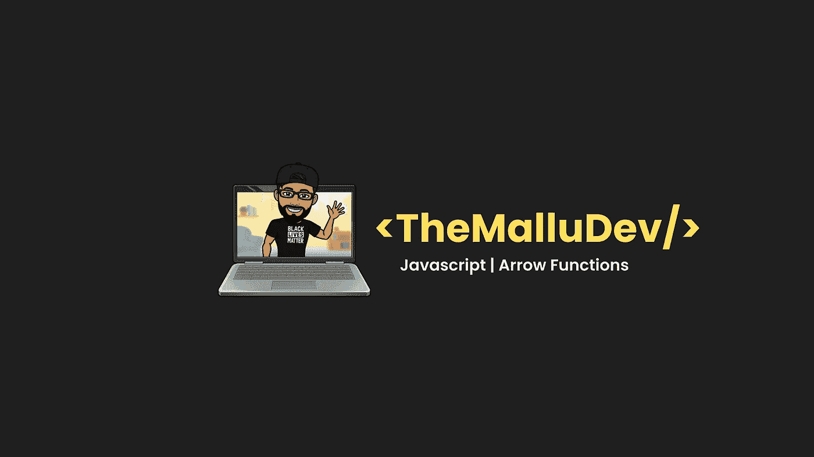

# 揭开 JavaScript 箭头函数的神秘面纱

> 原文：<https://javascript.plainenglish.io/demystifying-javascript-arrow-functions-7b2a0908a2b3?source=collection_archive---------7----------------------->



arrow 函数是函数表达式的替代形式，但语法不同，不能在所有情况下使用。如果你还没有读过 JavaScript 中的函数表达式，我建议你在继续学习之前先阅读一下 [**这个**](https://themallu.dev/demystifying-function-expressions) 。

现在，让我们试着理解一个箭头函数的**语法、执行、作用域和提升**以及代码示例。

# 1.句法

```
const arrowFunctionSyntax = () => {
 console.log(“Hi, I am an arrow function”);
}
arrowFunctionSyntax();
```

在上面的代码示例中，我们可以看到 arrow 函数类似于函数表达式，因为它们是作为一个值赋给变量的。主要的区别在于编写函数的方式。以下是我们根据语法从上述代码中得出的观察结果:

1.它不包含**函数**关键字。
2。它没有**函数名**，这意味着这些是匿名函数。
3。箭头符号`**=>**`正在被引入

```
const arrowFunctionWithOneParam = number => number + 1;
const arrowFunctionWithMultipleParams = (numberOne, numberTwo) => {
 let sum = numberOne + numberTwo;
 return sum;
}
console.log(arrowFunctionWithOneParam(5));
console.log(arrowFunctionWithMultipleParams(5,6))
```

如果我们同时观察`**arrow function with one param**和`**arrow function with multiple params**，我们可以发现三点不同——括号` **()** 、块` **{}** 、以及` **return** 关键字的用法。根据 arrow 函数的语法，如果函数只接受一个参数，括号` **()** `可以忽略；如果函数只包含一个语句，block` **{}** `可以忽略；最后，如果函数只包含一个语句，return `也可以忽略。

# 2.执行

```
const arrowFunctionExecution = () => {
 console.log(“Hi, my execution is similar to normal function”);
}
arrowFunctionExecution();
```

在执行箭头函数时，它们的执行方式与任何普通函数相似。当 JS 引擎执行`**arrow function execution()**'时，它创建一个函数执行上下文，并被推送到调用堆栈。一旦创建了执行上下文，它就开始创建阶段。在这个阶段，它将创建 arguments 对象，并在其本地内存堆中声明所有变量。与普通函数相比，主要的区别在于“ **this** 的声明。箭头函数没有自己的“ **this** ”变量；“this”在箭头函数中使用时会得到词法解析。在创建阶段之后不久，执行阶段就开始了。这是它执行语句` **console.log()** 并向控制台打印`**“嗨，我的执行类似于正常函数”**的阶段。

# 3.范围

```
const arrowFunctionScope = () => {
 console.log(“Hi, my scoping rules works similar to function expression”)
}
```

这些函数遵循与任何函数表达式相同的作用域规则。这些函数有自己的作用域，在函数内部声明的任何变量都不能在函数外部访问。这些函数也不适合`**调用**`、`**应用**和`**绑定**的方法，这些方法一般依靠建立作用域。如果你还没有读过 javascript 中的作用域，我会推荐你阅读 [**this**](https://themallu.dev/demystifying-scopes) **。**

# 4.提升

```
amIGoingToBeHoisted();
var amIGoingToBeHoisted = () => {
 console.log(“The answer is NO”);
}
```

箭头函数没有被提升，因为它们也是函数表达式，其中函数作为一个值被分配给变量。当 JavaScript 引擎执行上述代码时，在创建阶段，声明语句`**var amigoingtobehosted**'将被移动到顶部并用值` **undefined** 初始化，留下初始值。在执行阶段，当遇到语句` **amIGoingToBeHoisted** '时会抛出类型错误，因为其值未定义，提升后不是函数类型。想了解更多关于 JavaScript 中的提升，我推荐你阅读 [**这个**](https://themallu.dev/demystifying-hoisting) 。

我希望这能弄清楚 JavaScript 中箭头函数的工作方式。如果你觉得这篇文章有用，请表达你的爱，并与你的同伴分享。随时在 [**Twitter**](https://twitter.com/ajojm) 、 [**LinkedIn**](https://www.linkedin.com/in/ajojohn/) 与我联系，或者通过电子邮件。

直到我们再次见面，**Mallu Dev**结束👋干杯！🥂

*更多内容请看*[***plain English . io***](http://plainenglish.io/)