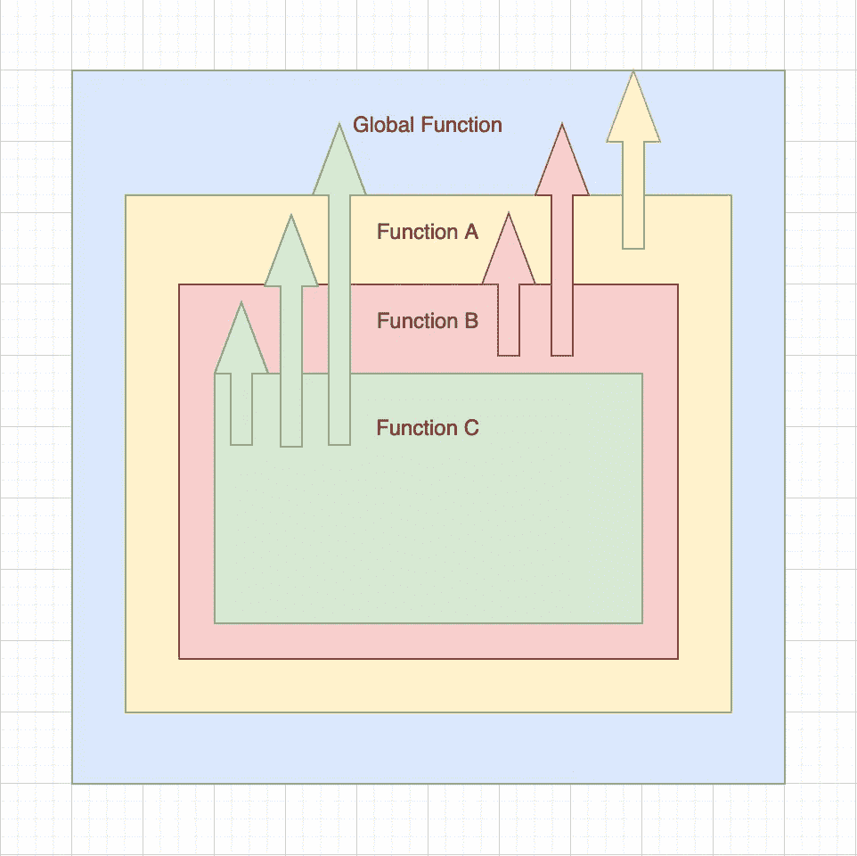
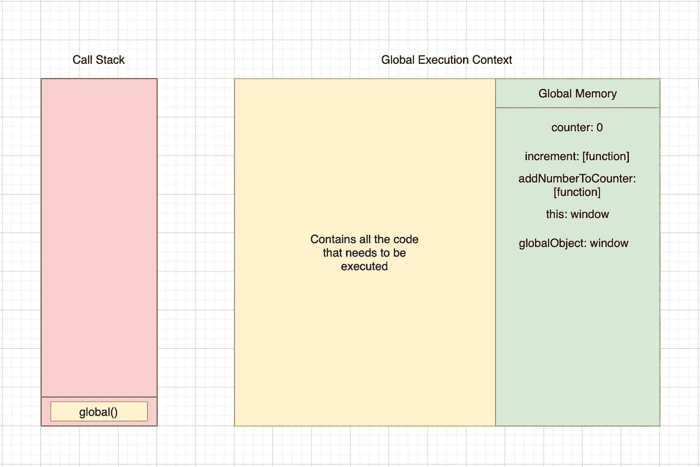
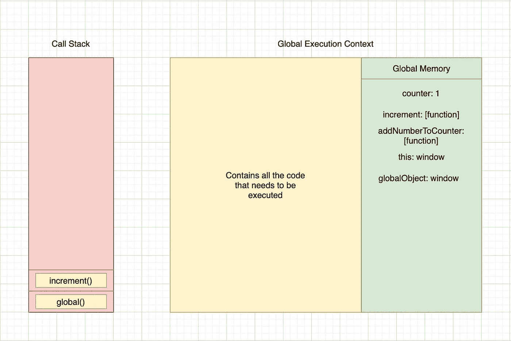
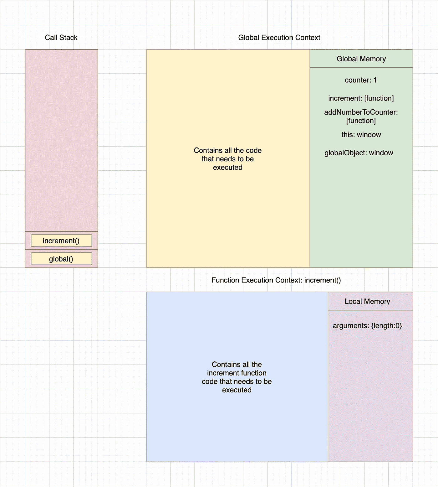
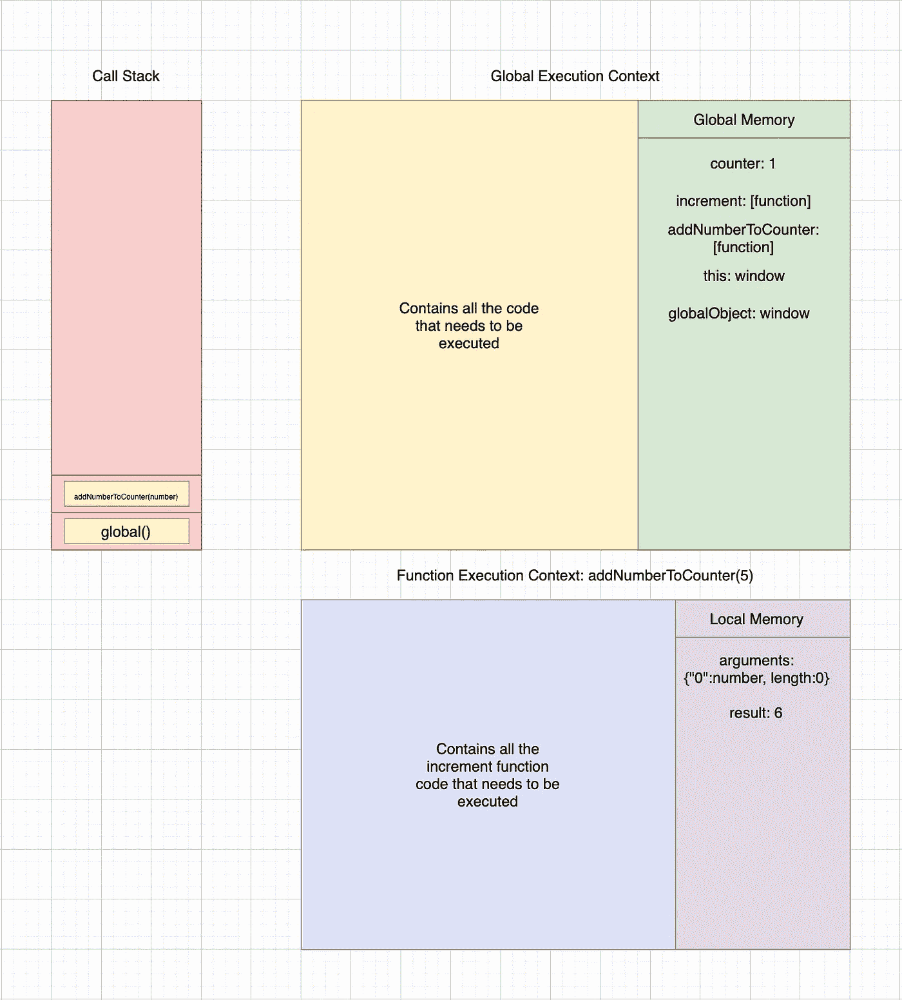

# 揭秘 JavaScript 代码执行

> 原文：<https://javascript.plainenglish.io/demystifying-javascript-code-execution-b9f99b98485b?source=collection_archive---------15----------------------->


Photo by [Christopher Robin Ebbinghaus](https://unsplash.com/@cebbbinghaus?utm_source=medium&utm_medium=referral) on [Unsplash](https://unsplash.com?utm_source=medium&utm_medium=referral)

JavaScript 是一种**单线程**、**动态类型化、**和**词汇作用域**语言。我知道这对你来说可能听起来像术语，但是让我们试着通过分解来理解它。

**单线程**是指 JavaScript 在给定时间内只能执行一条语句。换句话说，JavaScript 是一种**同步语言**。

**动态类型化**意味着变量的类型完全取决于存储在变量内部的值的类型。

```
 var variableOne = 1;
console.log(typeof variableOne) // Prints “number”
variableOne = “Hello”;
console.log(typeof variableOne) // Prints “string” 
```

上面的代码片段清楚地展示了变量的类型是如何根据被赋值的值而变化的。

**词汇作用域**是子函数访问变量直到其父作用域的能力，反之亦然。



Scope chain

上图是词法作用域的清晰表示，其中**函数 C** 可以访问**函数 C、函数 B、函数 A 和全局函数中存在的所有变量；** **函数 B** 可以访问**函数 B、函数 A 和全局函数**中存在的所有变量；**函数 A** 可以访问**函数 A 和全局函数**中的所有变量，而**全局函数**只能访问**全局函数**中的变量。这清楚地证明了子函数可以访问父函数的范围，而父函数不能访问子函数的范围。

在继续之前，让我首先介绍理解 JavaScript 代码执行所需的两个重要组件。

**执行上下文** —这些是每当 Javascript 引擎执行代码时创建的部分。有两个执行上下文——**全局执行上下文**和**函数执行上下文**。

**全局执行上下文**是引擎开始执行代码时创建的第一个上下文。这被称为**全局()**或**主()**函数。**函数执行上下文**是在代码中遇到函数调用语句时创建的上下文。这两种上下文都有两个阶段——创建阶段和执行阶段。创建阶段是 JavaScript 创建一个**全局对象的阶段——在浏览器的情况下是窗口，在 Node.js** 的情况下是全局，一个类型为 **object** 的变量，称为 **this** ，引用**全局对象**，并分配一个**内存堆**存储所有变量和函数声明，其中变量的值被设置为 **undefined** 。函数执行上下文的创建阶段略有不同。代替**全局对象，**创建了**参数对象**，该对象引用了传递给函数的所有参数。执行阶段是 Javascript 逐行执行代码的阶段。这也是变量被赋予实际值并执行代码中所有函数调用的阶段。

**调用栈** —这是 Javascript 管理全局和函数执行上下文的部分。从名字本身就很清楚这一段是用**栈**的原理工作的。当 Javascript 开始执行代码时，第一个上下文(全局执行上下文)被推入堆栈。此后，每当遇到函数调用时，它就将该函数的函数执行上下文推入堆栈。类似地，每当一个函数完成时，该函数的函数执行上下文将从堆栈中弹出。当调用堆栈完全为空时，代码执行停止。

现在让我们试着理解 Javascript 代码执行的端到端流程。

```
var counter = 0;
function increment() {
 counter++
}function addNumberToCounter(number) {
 var result = counter + number;
 console.log(result);
}increment();
addNumberToCounter(5);
```

首先，Javascript 引擎创建一个全局执行上下文，并开始创建阶段。


Creation Phase

在这个阶段，JavaScript 引擎解析代码，识别所有变量和函数声明，并将它们存储在内存堆中，所有变量的值都设置为 **undefined** 。

创建阶段结束后，它开始执行阶段。



Execution Phase

现在，JavaScript 引擎开始逐行执行代码。在我们的例子中，它将从 **var counter = 0** 开始。当它遇到这个语句时，它检查内存中是否存在该变量，并根据语句将值设置为 0。执行完这条语句后，它移动到下一行，在我们的例子中是**函数 increment(){…}** 。因为这是一个声明语句，所以它跳过了整个功能块(第 3–6 行)。这里需要注意的一点是，函数只有在被调用时才会被执行。因为下一行也是一个函数声明，所以它跳过了整个函数块(第 7 到 10 行)。



当它遇到标识符**增量**时，它检查该标识符是否存在于存储器中，并执行存储在存储器中的功能代码。当引擎在标识符后遇到 **()** 时，它识别函数执行。当调用该函数时，它会创建一个函数执行上下文，并将其推送到调用堆栈。在创建阶段，arguments 对象被创建，**这个**变量将引用全局对象(窗口)并检查函数代码中是否存在任何其他声明语句。在这个阶段之后，执行阶段开始。当它遇到语句 **counter++** 时，它检查该变量是否存在于函数执行上下文的本地内存中。当它没有找到变量时，它向上移动一级，这是全局执行上下文，并搜索变量**计数器**。当它找到变量时，它获取值并执行 **++** 操作，这将变量的当前值增加 1。现在，计数器变量将被更新为新值 1。



随着函数中所有语句的执行，增量函数的函数执行上下文从调用堆栈中弹出并销毁。



现在，引擎返回到当前位于调用堆栈顶部的全局执行上下文。它移动到下一行并执行下一个函数调用(addNumberToCounter(number))，类似于 increment 函数。这里唯一的区别是 addNumberToCounter(number)函数由传递给该函数的参数值 5 组成。在创建阶段，创建 arguments 对象，它将包含传递给函数的所有参数。在这种情况下，number 将是 arguments 对象中的一个值。在执行阶段，它在函数执行上下文的本地存储器中检查变量“result”。当它存在时，它将计算表达式 **counter + number** ，其中它分别从全局和本地内存中获取 counter 和 number 的值。评估结果 6 将被分配给存在于本地存储器中的结果变量。然后，它移到下一行并执行 **console.log(result)** 语句。这将打印该函数本地存储器中的**结果**的值。


一旦执行阶段结束，函数执行上下文(**addNumberToCounter(number)**)从堆栈中弹出，销毁并移回全局执行上下文。当引擎确定不再有要执行的行时，它从调用堆栈中弹出全局执行上下文并销毁执行上下文。

#谢谢你！

如果你觉得这篇文章有用，请表达你的爱，并通过你的社交媒体与你的同伴分享，这样其他人可以最大限度地利用它。请随时通过 Twitter、LinkedIn 或电子邮件与我联系。

直到我们再次见面，**Mallu Dev**结束👋干杯！🥂

*更多内容请看*[***plain English . io***](http://plainenglish.io/)