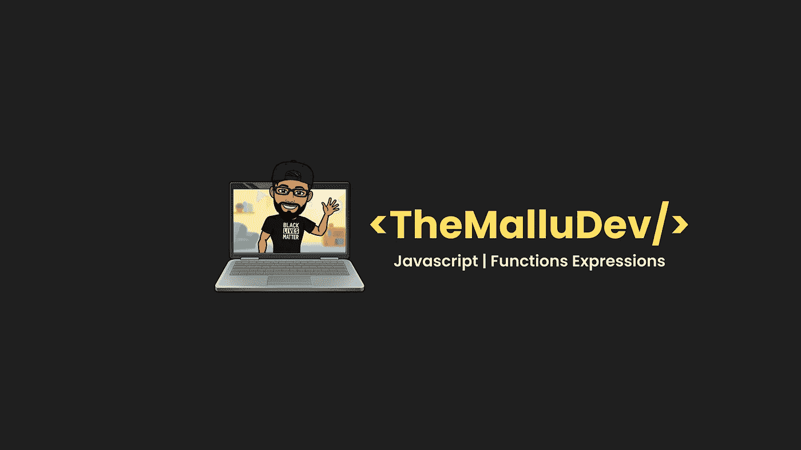
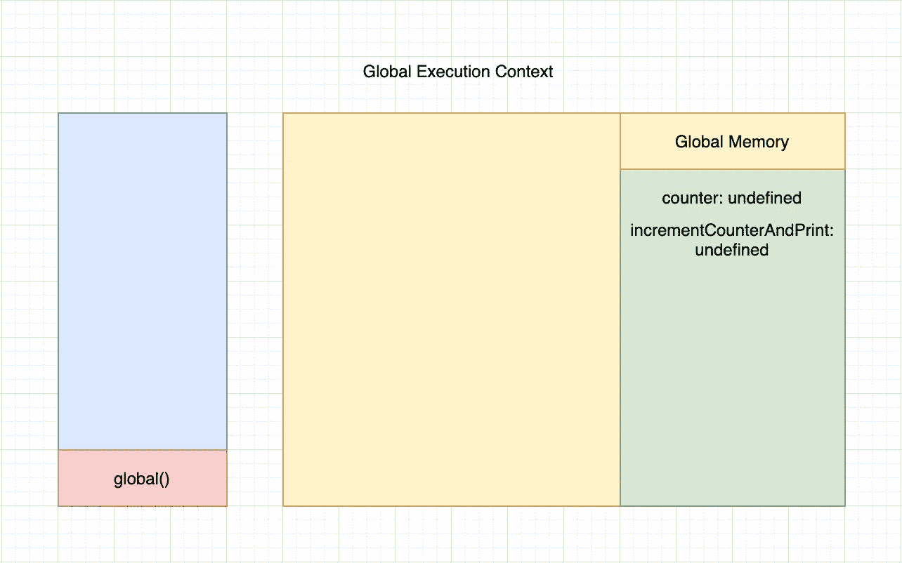
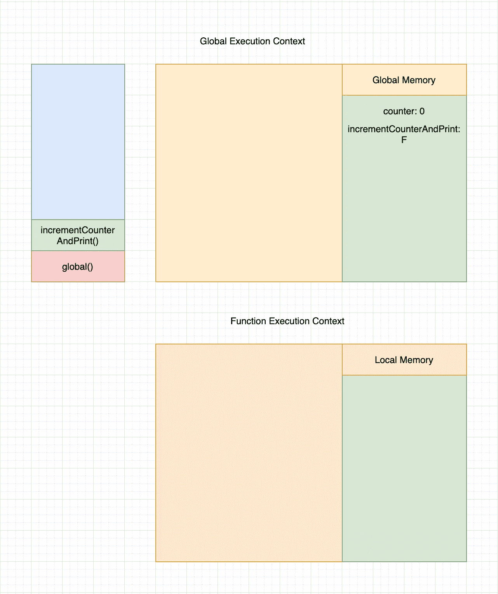

# 揭开 JavaScript 函数表达式的神秘面纱

> 原文：<https://javascript.plainenglish.io/demystifying-javascript-function-expressions-4135a64b4c65?source=collection_archive---------20----------------------->



被赋值给变量的函数称为**函数表达式**。如果你还没有读过 JavaScript 中的函数，我会推荐你在继续下一步之前阅读一下 [**这个**](https://themallu.dev/demystifying-functions-in-js) 。让我们借助一个例子来尝试理解函数表达式。

```
var counter = 0
var incrementCounterAndPrint = function () {
  counter++;
  console.log("Incremented Counter", counter);
}
incrementCounterAndPrint()
```



当 JS 引擎遇到这段代码时，首先它会创建一个全局执行上下文，并启动创建阶段。在创建阶段，它将遍历所有的声明语句，并将它们放入内存中。在这种情况下，变量` **counter** 和` **incrementCounterAndPrint** '将被存储在内存中，并被赋予默认值“未定义”。



由于没有更多的声明语句，它将进入第二阶段，即执行阶段。执行阶段是逐行执行代码的阶段。在这种情况下，首先，`**计数器**将被赋值为值` **0** ',而` incrementCounterAndPrint '将被赋值为整个函数的值。当 JS 引擎遇到语句`**incrementCounterAndPrint()**时，它将首先检查内存中是否存在这个特定的变量。当它存在时，它将从内存中获取值并执行它。在执行函数时，函数“**incrementCounterAndPrint**”将被推入调用堆栈，并创建一个新的函数执行上下文。一旦创建了执行上下文，它将启动创建阶段。因为没有这样的声明语句，所以它将进入第二个阶段，称为执行阶段。在这个阶段，首先，JS 引擎将执行语句` **counter++** `。在执行时，它将检查变量是否存在于本地内存中，如果不存在，它将移动到全局执行上下文并检查它的内存。一旦找到变量，它将执行操作并移动到下一行。在执行语句` **console.log('递增计数器'，counter)** '时，它会将值` **1** '打印到控制台。

现在，显而易见的问题是函数表达式是否被提升？好吧，让我们通过修改上面的代码来检查一下。

```
 var counter = 0
incrementCounterAndPrint() // TypeError: incrementCounterAndPrint is not a function
var incrementCounterAndPrint = function () {
 counter++;
 console.log(“Incremented Counter”, counter);
}
```

当 JS 引擎运行上述代码时，它将抛出一个类型错误。能告诉我为什么会这样吗？如果我们仔细观察代码，我们可以看到 function 被赋值给变量` **incrementCounterAndPrint** `。在根据提升特性的创建阶段，所有的变量声明将被移动到顶部，留下分配给它的值。在这种情况下,` **incrementCounterAndPrint** '将被移动到顶部，留下函数代码，并且默认情况下将被设置为值`**未定义**,因为它是使用` **var** 声明的。当 JS 引擎遇到语句`**incrementCounterAndPrint()**时，将首先检查内存中的变量。当它存在时，它将获取存储的值，该值是“未定义的**”。由于 undefined 不是一个`**函数**`类型，它将抛出一个类型错误。这就给我们带来了一个结论，函数表达式是不吊的。函数表达式有其作用域。函数表达式通常是匿名的，但是我们也可以给它命名，这对调试很有帮助。**

那么箭头函数呢？？？。好吧，我很快会在我的下一篇博客《坚持住》中详细讨论这个问题。在那之前，如果你觉得这篇文章有用，请展示你的爱，并通过你的社交媒体与你的同伴分享，他们可以最大限度地利用这篇文章。请随时在 [**Twitter**](https://twitter.com/ajojm) 、 [**LinkedIn**](https://www.linkedin.com/in/ajojohn/) 或电子邮件上与我联系。

直到我们再次见面，**Mallu Dev**结束👋干杯！🥂

*更多内容请看*[***plain English . io***](http://plainenglish.io/)