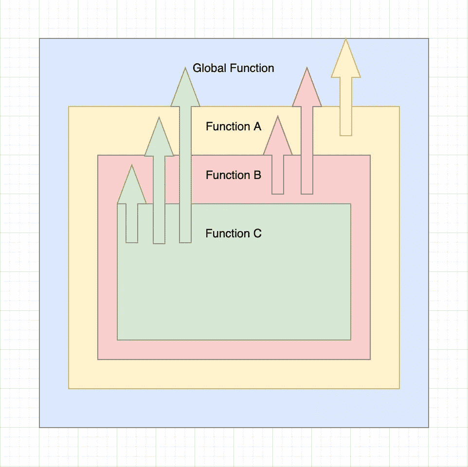

# 揭开 JavaScript 范围的神秘面纱

> 原文：<https://javascript.plainenglish.io/demystifying-javascript-scope-abdbe68914fd?source=collection_archive---------4----------------------->

作用域是名称绑定的属性，它告诉我们哪些名称绑定在程序的特定部分或给定时间点是可访问的。名称绑定是指与实体相关联的名称。实体可以是变量、函数等。定义这些范围的规则称为范围规则。

通常，有两种类型的作用域——词法作用域和动态作用域。词法范围根据名称绑定的定义位置(词法上下文)及其在源代码中的位置来解析名称绑定。动态范围根据程序状态解析名称绑定，程序状态由执行上下文(运行时上下文)决定。

JavaScript 是一种词汇范围的语言。所有与变量、函数等相关联的名字都是基于它们被定义的位置以及它们在源代码中的位置来解析的。

通常在词法范围内，子函数在本地词法上下文中搜索名字，如果失败，它就转移到外部函数并搜索其本地词法上下文。

这种情况一直持续到最外层的函数。



上图是词法作用域的清晰表示，其中**函数 C** 可以访问**函数 C、函数 B、函数 A 和全局函数**中存在的所有变量；**函数 B** 可以访问**函数 B、函数 A 和全局函数**中存在的所有变量；**函数 A** 可以访问**函数 A 和全局函数**中的所有变量，而**全局函数**只能访问**全局函数**中的变量。

我希望现在您对 JavaScript 中的词法范围有了一个清晰的了解。让我们在一个真实的代码片段中应用这些知识，并尝试更深入地理解它。

# 案例 1

```
 var myCar = {
 model: “Nissan”,
 type: “XUV”,
 color: “black”,
 price: 1500000
}
function calLoanPercentage(number) {
 return myCar.price * number/100;
}
console.log(calLoadPercentage(25)); 
```

当 JavaScript 引擎解析上面的代码片段时，它为代码中出现的所有名称绑定准备了一个范围计划。在这种情况下，从 **myCar** 开始。它检查这是否存在。如果它不存在，它为这个名称绑定( **myCar** )创建一个作用域(**全局作用域，因为它是最外层的函数**)并继续前进。

现在，它遇到了一个新的名称绑定，就是函数，**calloan percentage(number)**。这个名称绑定也将与 **myCar** 具有相同的范围，因为它们都在同一级别。在函数的情况下，还将创建一个称为局部作用域的附加作用域，其中函数中存在的所有参数和其他变量都属于该作用域。

这些名称绑定不能从外部函数调用。
在执行阶段，JavaScript 引擎开始逐行执行代码。首先，它将检查是否有一个名为 **myCar** 的名称绑定，如果存在，它将赋值。然后它直接转到控制台语句。

在控制台语句中，我们调用参数值为 25 的函数 **calLoanPercentage(25)** 。一旦 JavaScript 执行了这个，它就在内存中检查名称绑定 **calLoanPercentage()** ，如果存在，它就获取函数定义并开始执行。

首先，它将定义它的参数，并为它分配参数值 25。之后会返回 **myCar.price * number/100** 。在执行该语句时，它将首先尝试在本地内存中查找 **myCar** 。当它没有找到时，它将移动到外部函数并在内存中搜索。

当它找到时，它将获取该值并检查属性**价格**，这是存在的，因此返回值 1500000。类似地，它在本地存储器中搜索变量**编号**。

当它找到时，它将获取值并对表达式求值。评估后的值作为参数传递给 **console.log()** 方法，该方法将该值打印到控制台。

# 案例 2

```
 var functionExpression = function printOne() {
 var text = “hello”;
 console.log(text);
}
functionExpression() // prints “hello”
printOne() // ReferenceError: printOne is not defined 
```

在上面的代码中，我们使用了命名函数表达式。在这种情况下，名称 **printOne** 将在函数的局部范围内，而不在全局范围内。

这就是为什么当我们试图通过函数名 **printOne** 调用函数时会出现引用错误的原因。

那么在 **const** 和 **let** 声明的情况下，作用域是如何工作的呢？好吧，我很快会在我的下一篇博客《坚持住》中对此进行详细报道。在此之前，如果你觉得这篇文章有用，请表达你的爱，并在社交媒体上分享这篇文章。请随时通过 Twitter、LinkedIn 或电子邮件与我联系。

*更多内容请看*[***plain English . io***](http://plainenglish.io)