# 使用 Google 云计算引擎部署 Node.js 服务器

> 原文：<https://javascript.plainenglish.io/deploy-a-node-js-server-using-google-cloud-compute-engine-87268919de20?source=collection_archive---------1----------------------->

## 开始使用一个最小的 node . js“ping”应用程序

这篇文章展示了如何从零开始将一个最小的 Express.js 应用程序部署到生产环境中。它可以是任何节点项目的起点。

最小安装。最小代码。

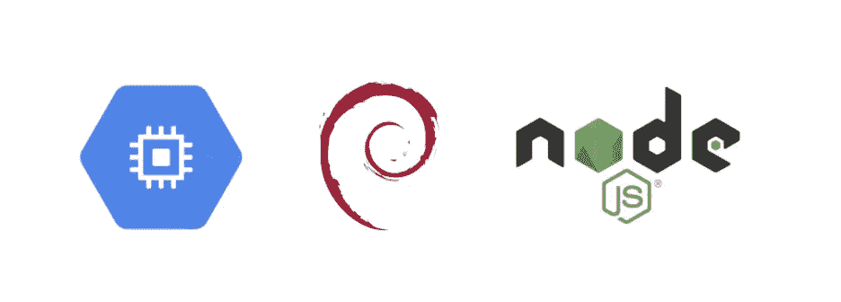

# 骨架代码

我讨厌类似“如何在仅仅 5 分钟内构建<a-super-long-and-difficult-task>”的教程当我实际上必须克隆一个存储库并运行`npm start`时。</a-super-long-and-difficult-task>

好吧，有效(有时无效)。

但是我什么都没学到。

因此，我提供了**最小** Node.js 框架，从简单的东西开始。

该服务器仅在调用[http://localhost:8080/API/v1/ping](http://localhost:3000/api/v1/ping)时返回“pong”。

仅此而已。

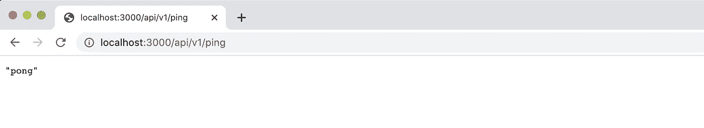

在这里检查并克隆[的框架代码。](https://github.com/BerangerNt/nodejs-express-skeleton)

```
sudo apt install git # if you don't have git installedgit clone [https://github.com/BerangerNt/nodejs-express-skeleton.gi](https://github.com/BerangerNt/nodejs-express-skeleton.git)t
```

我假设您已经安装了 Node.js 和 npm。如果没有，请遵循以下说明:[https://www.npmjs.com/get-npm](https://www.npmjs.com/get-npm)

克隆后，在终端中运行:

```
cd nodejs-express-skeletonnpm install
```

并且:

```
npm run start
```

您应该得到以下结果:“在本地主机上运行的节点应用程序:8080”:

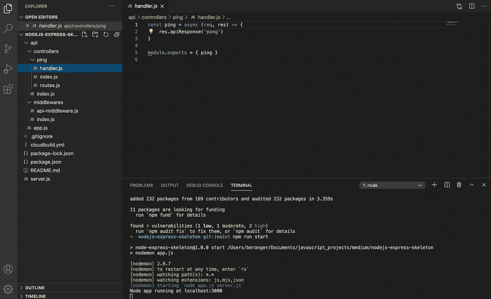

粘贴[http://localhost:8080/API/v1/ping](http://localhost:3000/api/v1/ping)在浏览器中，应该会显示“pong”。

同样，这里没有逻辑，只有结构。

我们现在有一个本地运行的服务器。是时候上线了。

为此，我们需要创建一个虚拟机。

## 创建虚拟机

点击此链接:[https://console.cloud.google.com/compute/instances](https://console.cloud.google.com/compute/instances)

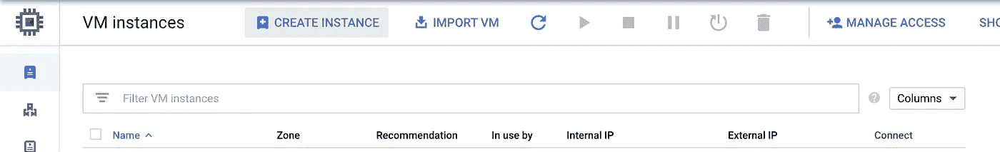

点击“创建实例”并复制以下配置以使用 Ubuntu 映像(您可能需要创建一个新项目) :

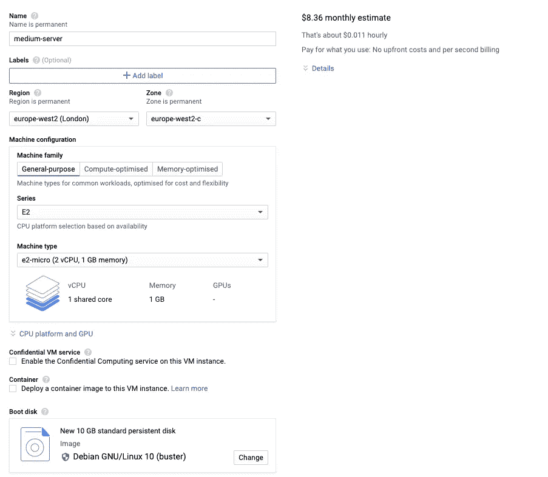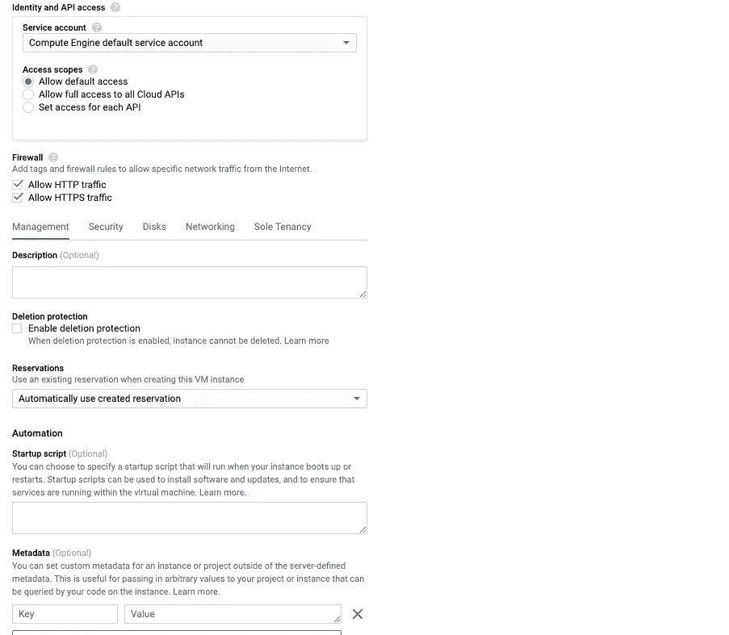

创建过程大约需要 10 分钟。

## 安装节点

要从浏览器直接连接到您的服务器，请单击虚拟机右侧的 SSH 按钮:

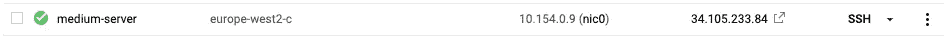

应该会弹出一个终端:

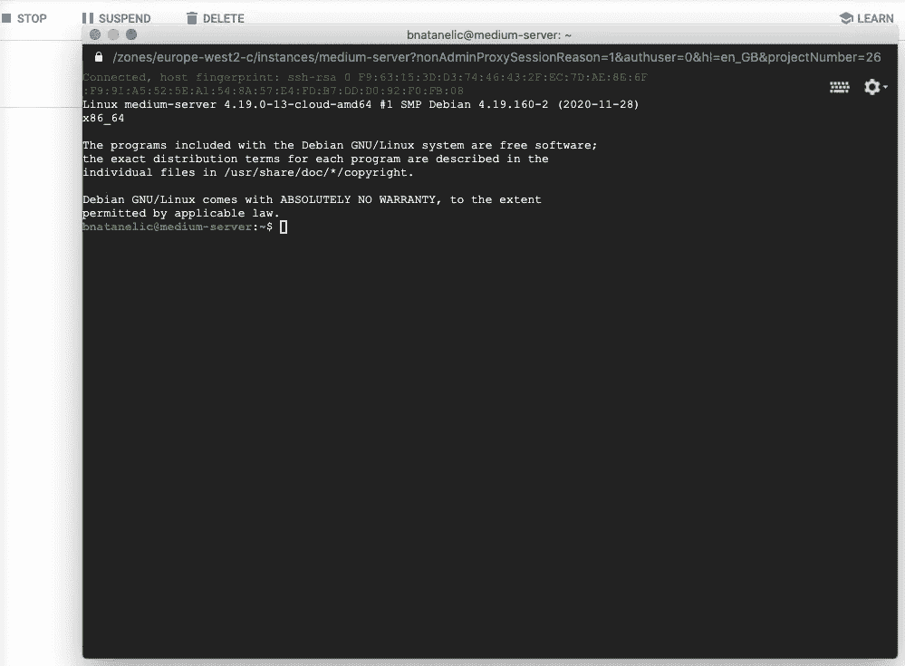

目前，服务器只包含 Debian 10 的映像，我们需要安装 npm 和 node，运行以下命令:

```
sudo apt-get -y updatesudo apt-get install -y nodejs npmsudo apt install git
```

检查安装:

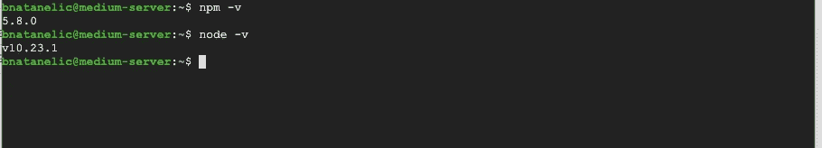

## 克隆并安装节点框架代码

现在运行:

```
git clone [https://github.com/BerangerNt/nodejs-express-skeleton.git](https://github.com/BerangerNt/nodejs-express-skeleton.git) cd nodejs-express-skeleton/ npm install npm run start
```

如果您看到下面的屏幕，那么您就走对了路:

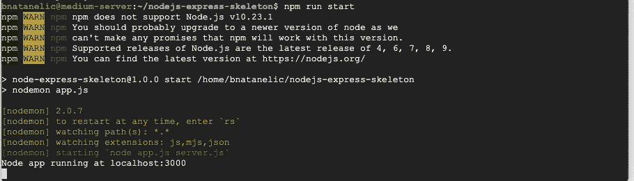

## 配置 Nginx

Nginx 将作为我们的反向代理。这允许从端口 80 访问我们的节点应用程序，运行:

```
sudo apt-get install -y nginx
```

Nginx 已经安装，我们现在必须为我们的节点应用程序配置它:

导航到 Nginx 的“站点-可用”文件夹。

```
cd /etc/nginx/sites-available
```

并更改默认文件，粘贴下面这段代码(获取您的 _ 服务器 _ IP _ 地址[此处](https://console.cloud.google.com/compute/instances)):

```
sudo vim default
```

并重新启动 nginx:

```
sudo service nginx restart
```

## 安装 PM2

PM2 是一个著名的进程管理器，将帮助我们启动，监控和重启我们的服务器，以防崩溃。我们在这个示例应用程序上没有太多的日志，但是如果你打算创建多条路线，我强烈推荐 PM2。

```
cd ~/nodejs-express-skeletonsudo su rootsudo npm install -g pm2
```

安装完成后，您就可以启动服务器了:

```
pm2 start server.js
```

应该显示一个令人满意的表

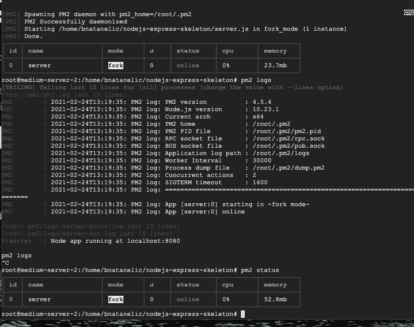

你可以玩 pm2 状态，pm2 日志来查看你的服务器工作，显示日志等。

## 享受一杯茶

服务器已经完全设置好了，现在您可以在浏览器中查看您得到的答案:[http://SERVER _ NAME/API/v1/ping](http://35.246.127.111/api/v1/ping)

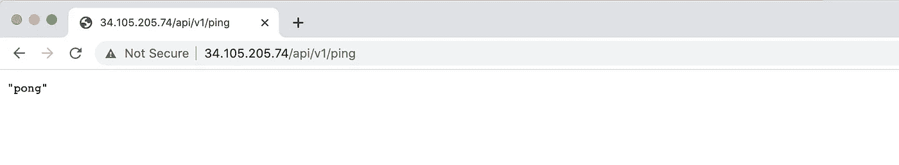

BOOM

如果您从 Github push 自动化部署并启动更多测试(也称为持续部署持续集成(或 CI/CD))，您甚至可以走得更快。

查看本系列的下一篇文章，在该服务器上实现自动化部署:

[](https://beranger.medium.com/automate-deployment-with-google-compute-engine-and-cloud-build-cccd5c3eb93c) [## 使用 Google 计算引擎和云构建实现自动化部署

### 和一杯茶

beranger.medium.com](https://beranger.medium.com/automate-deployment-with-google-compute-engine-and-cloud-build-cccd5c3eb93c)