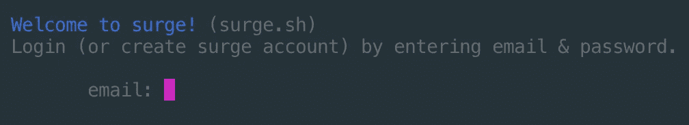

# 使用 Surge 部署 React 应用程序

> 原文：<https://javascript.plainenglish.io/deploy-a-react-app-using-surge-1061a626794c?source=collection_archive---------8----------------------->

## 了解如何使用这个神奇的工具快速发布 React 应用程序


Surge 是一款用于部署静态网站的优雅工具。它使部署变得如此简单，您可能不会相信。今天，我们将学习如何部署一个功能完整的 React 应用程序，只需运行几个命令。

这里有一个 Surge 网站的链接，供那些想了解更多信息的人使用。

[](https://surge.sh/) [## 汹涌

### 现在就免费部署任何东西:在你和部署之间只有六次击键:键入 surge 和…

surge.sh](https://surge.sh/) 

# 让我们部署一个 React 应用程序

我们可以从打开命令行开始(取决于操作系统的终端或命令提示符)。

您需要做的第一件事是通过运行这个命令来安装 Surge。

```
npm install surge --global
```

安装了 surge 之后，现在是时候通过运行这个命令来创建 React 应用程序了。

在运行之前，请确保导航到您希望项目所在的目录。

```
npx create-react-app surge-deploy-demo
```

信不信由你，我们快完成了。创建了 React 项目后，用这个命令导航到它。

```
cd surge-deploy-demo
```

现在您已经在目录中，您可以运行下面的命令来构建我们的 React 项目。

```
npm run build
```

或者你用的是纱线。

```
yarn build
```

随着项目的构建，我们需要导航到构建目录。

```
cd build
```

现在我们在构建目录中，我们还有一个命令要运行，这就是 Surge 发挥作用的地方。

```
surge
```

如果您是第一次使用 surge，在运行上面的命令后，您应该会看到一个类似这样的屏幕。



***重要提示*** *:在您输入创建新帐户的凭据后，您必须验证您的电子邮件，然后 Surge 才会允许您部署您的站点。*

这样一来，您应该会看到几个提示。第一个是您想要部署的目录。您可以继续并同意，因为它将是当前目录。下一个提示将询问您希望域是什么(它将生成一个随机的)，您可以继续使用它在这种情况下生成的默认域，然后按 enter 键。完成这两个步骤后，站点应该被部署到上面指定的 URL。当你打开它时，你会看到你的功能齐全的 React 应用程序。

现在还有最后一个问题。我们可能应该启用重定向，这将迫使我们的网站去 HTTPS 版本。要做到这一点，真的很简单。您只需重新运行 surge 命令，只是这一次，您将向该命令传递一个标志。

*将****surge-domain-此处*** *替换为您的 surge 网站的域名。*

```
surge --domain https://surge-domain-here
```

运行此命令后，您可以同意前面的提示。我们现在已经有了一个全功能的 React 应用程序，其中包含 HTTPS 重定向。

# 文档和参考资料

 [## 前端开发人员部署。*激增

### 编辑描述

surge.sh](https://surge.sh/help/) [](https://create-react-app.dev/docs/getting-started) [## 入门|创建 React 应用程序

### Create React App 是官方支持的创建单页 React 应用程序的方式。它提供了一个现代建筑…

创建-反应-应用程序.开发](https://create-react-app.dev/docs/getting-started) 

# 结论

希望这篇教程能让你明白使用 surge 和部署 React 应用程序是多么容易。现在，走出去，与世界分享你的惊人的反应项目。

*更多内容看*[***plain English . io***](https://plainenglish.io/)