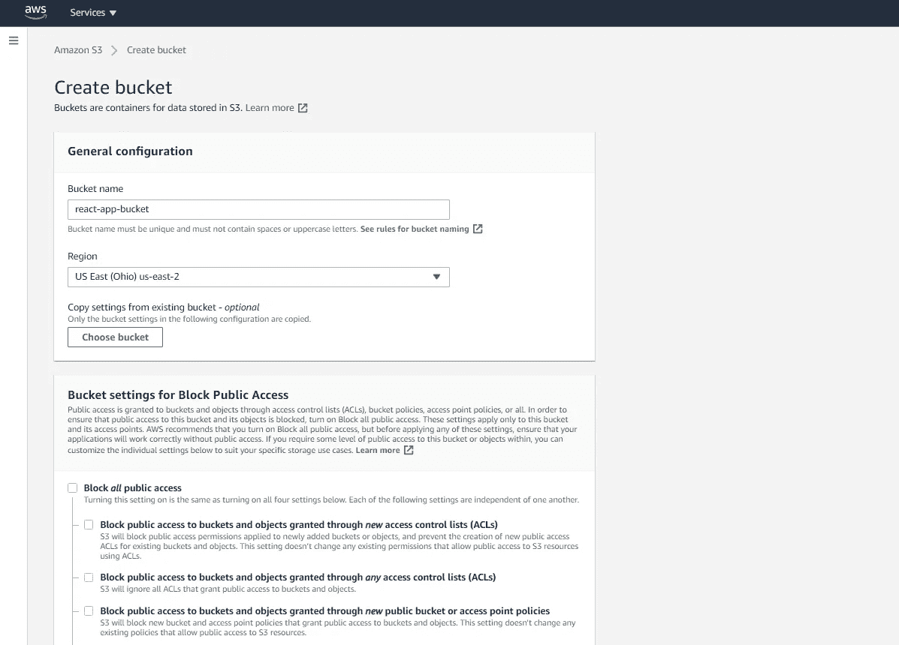

# 使用 AWS S3 部署 React 应用程序

> 原文：<https://javascript.plainenglish.io/deploy-a-react-app-with-aws-s3-e0a7bccd3790?source=collection_archive---------6----------------------->


部署 React 应用程序需要几个包来捆绑文件并将代码转换成 JavaScript。

在本 React 教程中，我们将首先把我们的 [React 聊天机器人](../../../../../blog/article/reactjs-chatbot)与 webpack 和 Babel 捆绑在一起。然后在后面的部分中，我们将把它部署到 AWS S3 存储桶。

## **捆绑一个 React App 需要什么？**

*   React 应用程序
*   安装和配置 webpack 和 webpack-cli
*   安装和配置 Babel
*   安装和配置 HTML webpack 插件
*   安装和配置 webpack 开发服务器

所有这些包都将在下面详细讨论。

**创建 React 应用**

本教程假设您已经使用[脸书的 create-react-app](https://github.com/facebook/create-react-app) 创建并配置了 React 应用。但是，任何 React 应用程序都可以使用这种方法部署。

# **Webpack 和 webpack CLI**


## **什么是 webpack？**

Webpack 是一个 JavaScript 模块捆绑器。它于 2012 年发布，是一款开源软件，专为现代 JavaScript 应用而设计。

Webpack 捆绑了 HTML、CSS、JS 和图像，生成表示这些原始模块的静态资产。

## **为什么要将 webpack 与 React 一起使用？**

Webpack 将把所有的 React 组件捆绑成易于 web 浏览器阅读的压缩资产。

## 安装 webpack 和 webpack-cli

*安装 webpack 和 webpack-cli — Windows 命令提示符*

```
C:\Users\Owner\desktop\react\react-chatbot> npm install webpack webpack-cli --save-dev
```

*安装 webpack 和 webpack-cli — macOS 终端*

```
User-Macbook:react-chatbot user$ npm i webpack webpack-cli --save-dev
```

在你的应用目录中安装`webpack`和`webpack-cli`。安装将需要几分钟时间。

## **更新 packages.json**

*react-chatbot>package . JSON*

```
...
"scripts": {
    "start": "react-scripts start",
    "build": "webpack --mode production",
    "test": "react-scripts test",
    "eject": "react-scripts eject"
  },
...
```

接下来，转到文件 *package.json* ，用`"build":"webpack --mode production"`替换`"build":"react-scripts build"`，如上图。

# **巴别塔**


现在是时候安装[巴贝尔](https://babeljs.io/)了。

## **巴别塔是什么？**

Babel 是一个 JavaScript 编译器，它将下一代 JavaScript 代码转换成浏览器兼容的 JavaScript。

## **为什么用 Babel with React？**

Babel 将把 React 类组件、ES6 变量和 JSX 代码转换成常规的 JavaScript，这样旧的浏览器就可以正确地呈现组件。

## **安装巴别塔**

*安装 Babel 及其依赖项——Windows 命令提示符*

```
C:\Users\Owner\desktop\react\react-chatbot> npm i @babel/core babel-loader @babel/preset-env @babel/preset-react --save-dev
```

*安装 Babel 及其依赖项— macOS 终端*

```
User-Macbook:react-chatbot user$ npm i @babel/core babel-loader @babel/preset-env @babel/preset-react --save-dev
```

我们将安装`babel-loader`，Babel 的 webpack 加载器，将 JavaScript 编译成 ES5 的`babel/preset-env`和将 JSX 编译成 JS 的`babel/preset-react`。

## **创建一个名为。babelrc**

*react-chatbot >(新文件)。babelrc*

```
{
  "presets": ["@babel/preset-env", "@babel/preset-react"]
}
```

安装完成后，创建名为。在你的应用程序目录中。这和 *package.json* 是同一个目录。

## **创建一个名为 webpack.config.js 的新文件**

*react-chatbot >(新文件)webpack.config.js*

```
module.exports = {
  module: {
    rules: [
      {
        test: /\.(js|jsx)$/,
        exclude: /node_modules/,
        use: {
          loader: "babel-loader"
        }
      }
    ]
  }
};
```

另外，创建另一个名为 *webpack.config.js* 的文件。同样，在应用程序的目录中创建这个文件，与 *package.json* 在同一个文件夹中。

上面的代码是一个说明文件是否以*结尾的文件。js* 或*。jsx* ，让 webpack 通过`babel-loader`发送代码。

# **创建捆绑包**

现在我们可以创建包了。

## **运行构建命令**

`*npm run build*` *— Windows 命令提示符*

```
C:\Users\Owner\desktop\react\react-chatbot> npm run build
```

`*npm run build*` *— macOS 终端*

```
User-Macbook:react-chatbot user$ npm run build
```

运行命令 npm run build， *package.json* 文件中的脚本`"webpack --mode production"`就会运行。

然后命令提示符会说资产 *main.js* 已经创建并且 webpack 已经成功编译。

## **查看 dist > main.js**

*react-chatbot>dist>main . js*

```
/*! For license information please see main.js.LICENSE.txt */
(()=>{var e={669:(e,t,n)=>{e.exports=n(609)},592:(e,t,n)=>{"use strict";var r=n(867),o=n(26),i=n(372),a=n(327),l=n(97),u=n(109),s=n(985),c=n(61);e.exports=function(e){return new Promise((function(t,n){var f=e.data,p=e.headers;r.isFormData(f)&&delete ...(e.Component);t.render(e.createElement(j,null),document.getElementById("root"))})()})();
```

如果你查看应用程序的文件结构，你会注意到一个名为 *dist* 的新目录，其中有一个名为 *main.js* 的文件。文件 *main.js* 是整个 React app 的捆绑版本。

# **将包添加到 HTML 页面**

创建好包之后，让我们将它加载到 HTML 文件中。

## **为 webpack 再安装两个包**

*安装 html-webpack 和 html-loader — Windows 命令提示符*

```
C:\Users\Owner\desktop\react\react-chatbot> npm install html-webpack-plugin html-loader --save-dev
```

*安装 html-webpack 和 html-loader — macOS 终端*

```
User-Macbook:react-chatbot user$ npm install html-webpack-plugin html-loader --save-dev
```

运行命令`npm install html-webpack-plugin html-loader --save-dev`来安装 html-webpack-plugin 和 html-loader。

## **更新 webpack.config.js 文件**

*react-chatbot>web pack . config . js*

```
const HtmlWebPackPlugin = require("html-webpack-plugin");

module.exports = {
  module: {
    rules: [
      {
        test: /\.(js|jsx)$/,
        exclude: /node_modules/,
        use: {
          loader: "babel-loader"
        }
      },
      {
        test: /\.html$/,
        use: [
          {
            loader: "html-loader"
          }
        ]
      }
    ]
  },
  plugins: [
    new HtmlWebPackPlugin({
      template: "./public/index.html",
      filename: "./index.html"
    })
  ]
};
```

然后用在`plugins`下调用的名为`HtmlWebPackPlugin`的新`const`变量更新 *webpack.config.js* 文件。

还要添加另一个规则，声明文件是否以*结尾。html* ，让 webpack 通过`html-loader`发送代码。

如果你使用 create-react-app 来制作你的 React app，那么*index.html*在*公共*文件夹中。用`template:"./public/index.html"`链接到文件，如上面的例子所示。

否则，如果你的*index.html*在 *src* 目录中，使用`template:"./src/index.html"`。

## **再次运行构建命令**

*npm 运行构建— Windows 命令提示符*

```
C:\Users\Owner\desktop\react\react-chatbot> npm run build
```

*npm 运行构建— macOS 终端*

```
User-Macbook:react-chatbot user$ npm run build
```

再次运行命令`npm run build`来捆绑您的*index.html*文件，并在*区>index.html 创建捆绑资产。*

## **查看 dist>index.html 文件**

*react-chatbot>dist>index.html*

```
<!doctype html><html lang="en"><head><meta charset="utf-8"/><link rel="icon" href="%PUBLIC_URL%/favicon.ico"/><meta name="viewport" content="width=device-width,initial-scale=1"/><meta name="theme-color" content="#000000"/><meta name="description" content="Web site created using create-react-app"/><link rel="apple-touch-icon" href="%PUBLIC_URL%/logo192.png"/><link rel="manifest" href="%PUBLIC_URL%/manifest.json"/><title>React App</title></head><body><noscript>You need to enable JavaScript to run this app.</noscript><div id="root"></div><script src="main.js"></script></body></html>
```

如果你在 *dist* 文件夹中查看名为*index.html*的新文件，你会看到它是来自【index.html】public>的*HTML 代码的编译版本。*

# **使用 webpack 配置开发服务器**

我们的项目现在是捆绑的，所以为了避免每次都不得不使用`run npm build`来推送变更，请安装`webpack-dev-server`。

## **安装 webpack-dev-server**

*安装 webpack-dev-server — Windows 命令提示符*

```
C:\Users\Owner\desktop\react\react-chatbot> npm install webpack-dev-server --save-dev
```

*安装 webpack-dev-server — macOS 终端*

```
User-Macbook:react-chatbot user$ npm install webpack-dev-server --save-dev
```

运行`npm install webpack-dev-server`。

## **更新 packages.json**

*react-chatbot>package . JSON*

```
...
"scripts": {
    "start": "webpack-dev-server --open --mode development",
    "build": "webpack --mode production",
    "test": "react-scripts test",
    "eject": "react-scripts eject"
  },
...
```

接下来，用`npm start`的新脚本更新 *package.json* 文件。

## **运行开发服务器**

*安装 webpack-dev-server — Windows 命令提示符*

```
C:\Users\Owner\desktop\react\react-chatbot> npm start
```

*安装 webpack-dev-server — macOS 终端*

```
User-Macbook:react-chatbot user$ npm start
```

现在，当您`run start`web pack 开发服务器将在浏览器中启动捆绑的应用程序版本。

# **将 React 应用部署到 AWS S3 存储桶**


*如果你有兴趣阅读更多 AWS 相关内容，一定要查阅* [***AWS 直白英语***](https://aws.plainenglish.io) *。*

既然我们的应用程序已经打包，我们可以将压缩文件部署到 AWS S3 存储桶中。

## **将 React 应用部署到 S3 存储桶需要什么？**

*   创建免费的 AWS 帐户
*   创建 S3 存储桶
*   安装和配置 AWS CLI

## **创建一个 AWS 账户**

在 https://aws.amazon.com/free/[创建一个免费的 AWS 账户](https://aws.amazon.com/free/)。

## **使用 IAM 授予您的用户名 AWS S3 权限**

在创建 S3 存储桶之前，您需要授予您的用户对 AWS S3 的权限。

要授予用户 S3 权限:

1.  登录 AWS
2.  在 *AWS 管理控制台*页面上，通过在搜索栏中输入 *IAM* 找到 *IAM* 服务(a)在*安全、识别、&合规*部分下的*所有服务*或(b)
3.  点击 *IAM* 链接
4.  点击左侧菜单中*访问管理*部分下的*用户*选项卡
5.  单击您想授予访问权限的用户名
6.  单击“添加权限”按钮
7.  选择“直接附加现有策略”并输入 *AmazonS3FullAccess*
8.  点击“下一步:回顾”按钮
9.  检查“权限摘要”页面上的权限是否已添加到正确的用户
10.  单击“添加权限”保存更改

## **为你的 React 应用创建一个 S3 桶**

现在，添加了适当的权限后，您就可以创建您的 S3 桶了。

AWS 简单存储服务(S3)使用可扩展的存储基础架构存储文件和对象。S3 桶充当这些文件的容器，甚至可以用来托管一个静态网站。

要创建 S3 存储桶，请执行以下操作:

1.  在 AWS 管理控制台页面上，通过以下方式找到 S3 服务:( a)在所有服务的存储部分下，或(b)在搜索栏中键入 S3
2.  点击 S3 链接
3.  点击屏幕右侧的“创建存储桶”按钮

在“创建存储桶”页面上:

1.  在常规配置下:

*   命名您的存储桶并划分您的区域

1.  在“阻止公共访问的存储桶设置”下:

*   取消选择“阻止所有公共访问”复选框
*   选择警告框“关闭阻止所有公共访问可能会导致此存储桶和其中的对象成为公共的”

1.  保持其余的默认配置不变
2.  点击页面底部的按钮“创建存储桶”



## **更新 S3 斗权限**

现在我们有了我们的 bucket，让我们为匿名用户添加只读权限。

要添加权限:

1.  点击你的 S3 桶
2.  选择“权限”选项卡
3.  单击“存储桶策略”按钮
4.  在*存储桶策略编辑器*中添加以下代码，用您的存储桶名称替换`"Resource"`

*   `{ "Version": "2012-10-17", "Statement": [ { "Sid": "AllowPublicReadAccess", "Effect": "Allow", "Principal": "*", "Action": "s3:GetObject", "Resource": "arn:aws:s3:::name-of-your-bucket/*" } ] }`

1.  完成后，单击“保存”按钮。

## **添加 CORS 配置**

我们还将把 CORS 配置添加到 S3 存储桶，以允许跨产地请求。

要添加 CORS 配置:

1.  点击你的 S3 桶
2.  选择“权限”选项卡
3.  点击“CORS 配置”按钮
4.  在 *CORS 配置编辑器*中添加以下代码

*   `<?xml version="1.0" encoding="UTF-8"?> <CORSConfiguration > <CORSRule> <AllowedOrigin>*</AllowedOrigin> <AllowedMethod>GET</AllowedMethod> <AllowedMethod>PUT</AllowedMethod> <AllowedMethod>POST</AllowedMethod> <MaxAgeSeconds>3000</MaxAgeSeconds> <ExposeHeader>x-amz-meta-custom-header</ExposeHeader> <AllowedHeader>*</AllowedHeader> </CORSRule> </CORSConfiguration>`

1.  完成后，单击“保存”按钮。

## **安装 AWS CLI**

创建并配置了 bucket，现在我们可以将 React 应用包上传到 S3 bucket。

我们将通过 AWS 命令行界面上传。

在继续之前，请遵循适用于您的特定操作系统的 [AWS CLI 安装说明](https://docs.aws.amazon.com/cli/latest/userguide/install-cliv2.html)。


## **检查是否安装了 AWS CLI**

*安装 webpack-dev-server — Windows 命令提示符*

```
C:\Users\Owner\desktop\react\react-chatbot> aws --v
aws-cli/2.0.47 Python/3.7.4 Windows/10 botocore/2.0.0
```

*安装 webpack-dev-server — macOS 终端*

```
User-Macbook:react-chatbot user$ aws --v
aws-cli/2.0.47 Python/3.7.4 Darwin/18.7.0 botocore/2.0.0
```

一旦安装过程完成，继续运行命令`aws --v`来检查安装工作。

## **创建一组 AWS 访问密钥**

使用 AWS CLI 时，您需要提供一组 AWS 访问密钥，以便 CLI 可以正确连接到您的 AWS 帐户。

要创建一组密钥:

1.  点击右上角的用户名
2.  从下拉菜单中选择*我的安全凭证*
3.  点击【CLI、SDK、& API 访问的*访问密钥*部分下的“创建访问密钥”按钮
4.  两个访问键将出现在弹出菜单中
5.  点击“下载。csv 文件"按钮并保存密钥

在下一步配置 AWS CLI 时，您将需要保存在文件中的两个密钥。


如果您碰巧丢失了访问密钥，只需创建另一组。

## **配置 AWS CLI**

*配置 AWS CLI — Windows 命令提示符*

```
C:\Users\Owner\desktop\react\react-chatbot> aws configure
AWS Access Key ID:****************
AWS Secret Access Key:****************
Default region name [us-west-1]:
Default output format [None]:
```

*配置 AWS CLI — macOS 终端*

```
User-Macbook:react-chatbot user$ aws configure
AWS Access Key ID:****************
AWS Secret Access Key:****************
Default region name [us-west-1]:
Default output format [None]:
```

在项目的命令提示符下，运行命令 aws configure。然后输入您在上一步中创建的 AWS 访问密钥和 AWS 秘密密钥。

然后，您可以跳过剩余的配置部分，对每个部分单击 Enter。

## **更新 package.json 文件**

*react-chatbot>package . JSON*

```
...
"scripts": {
    "start": "webpack-dev-server --open --mode development",
    "build": "webpack --mode production",
    "test": "react-scripts test",
    "eject": "react-scripts eject",
    "deploy": "aws s3 sync dist/ s3://name-of-your-bucket"
  },
...
```

转到 package.json，添加一个新的部署脚本:`"deploy": "aws s3 sync webpack/dist/ s3://name-of-your-bucket"`。

确保用正确的桶名替换`name-of-your-bucket`并保存文件。

## **部署到 AWS S3 存储桶**

*部署到 S3 铲斗— Windows 命令提示符*

```
C:\Users\Owner\desktop\react\react-chatbot> npm run build

C:\Users\Owner\desktop\react\react-chatbot> npm run deploy
```

*部署到 S3 木桶— macOS 终端*

```
User-Macbook:react-chatbot user$ npm run build

User-Macbook:react-chatbot user$ npm run deploy
```

返回到您的 CLI 并运行 npm run build 以捆绑任何更改，然后使用 `npm run deploy`将捆绑包上传到您的 S3 存储桶。

在 *dist* 目录中的所有文件都将上传到 S3 存储桶。

## **让你的 S3 斗一个域**

要使您的 S3 成为一个域:

1.  点击你的桶
2.  你应该看到*index.html*、 *main.js、*和 *main.js.LICENSE.txt* 文件
3.  选择“属性”选项卡
4.  点击“静态网站托管”卡
5.  选择“使用此存储桶托管网站”按钮
6.  键入*index.html*作为“索引文件”和“错误文件”
7.  点击“保存”按钮完成


如果您再次检查卡，您应该注意到一个 URL 端点。

点击此 URL，您的应用将出现在新的浏览器选项卡中。

# **解决可能出现的常见错误**

`ERROR: 'MODULE_NOT_FOUND" webpack-dev-server`

```
code: 'MODULE_NOT_FOUND',
  requireStack: [
    'C:\\Users\\Owner\\Desktop\\react\\react-chatbot\\node_modules\\webpack-dev-server\\bin\\webpack-dev-server.js'
  ]
}
npm ERR! code ELIFECYCLE
npm ERR! errno 1
npm ERR! react-tutorial@0.1.0 start: `webpack-dev-server --open --mode development`
npm ERR! Exit status 1
npm ERR!
npm ERR! Failed at the react-tutorial@0.1.0 start script.
npm ERR! This is probably not a problem with npm. There is likely additional logging output above.
```

如果您在安装`webpack-dev-server`后运行`npm start`时出错，您需要降级您的 webpack-cli 版本。

1.更新 package.json

*react-chatbot>package . JSON*

```
...
 },
  "devDependencies": {
    ...
    "webpack-cli": "^3.3.12",
    ...
  }
}
```

将 *package.json* 中的`"webpack-cli"`版本更改为`"^3.3.12"`，一个没有 bug 的 webpack-cli 版本。

请务必保存该文件。

2.重新安装 webpack-cli

*安装 webpack-dev-server — Windows 命令提示符*

```
C:\Users\Owner\desktop\react\react-chatbot> npm install
```

*安装 webpack-dev-server — macOS 终端*

```
User-Macbook:react-chatbot user$ npm install
```

然后运行`npm install`安装 *package.json* 中指定的版本。

3.再次运行开发服务器

*运行 webpack 开发服务器— Windows 命令提示符*

```
C:\Users\Owner\desktop\react\react-chatbot> npm start
```

*安装 webpack 开发服务器— macOS 终端*

```
User-Macbook:react-chatbot user$ npm start
```

现在，当您运行`npm start`时，开发者服务器应该会打开。

`ERROR: Failed to parse json; Unexpected token } in JSON`

```
npm ERR! code EJSONPARSE
npm ERR! file C:\Users\Owner\Desktop\code\react\react-chatbot\package.json
npm ERR! JSON.parse Failed to parse json
npm ERR! JSON.parse Unexpected token } in JSON at position 662 while parsing near '...y-react-example",
npm ERR! JSON.parse   },
```

如果您在尝试运行`npm run build`时收到此错误，请确保最后添加的脚本末尾没有逗号。

`ERROR: fatal error: An error occurred (NoSuchBucket) when calling the ListObjectsV2 operation: The specified bucket does not exist`

```
fatal error: An error occurred (NoSuchBucket) when calling the ListObjectsV2 operation: The specified bucket does not exist
npm ERR! code ELIFECYCLE
npm ERR! errno 1
npm ERR! react-chatbot@0.1.0 deploy: `aws s3 sync dist/ s3://deploy-react-example`
npm ERR! Exit status 1
```

如果在尝试部署到您的 S3 存储桶时出现此错误，您可能在 *package.json* 中拼错了存储桶名称。

*最初发表于*[*【https://ordinarycoders.com】*](https://www.ordinarycoders.com/blog/article/deploy-reactjs-webpack-aws-s3)。