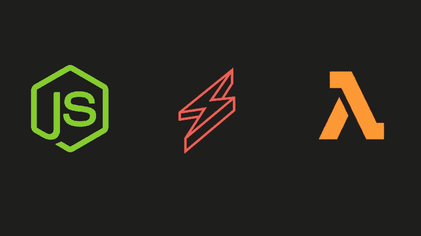
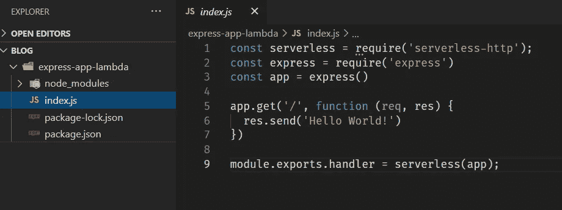
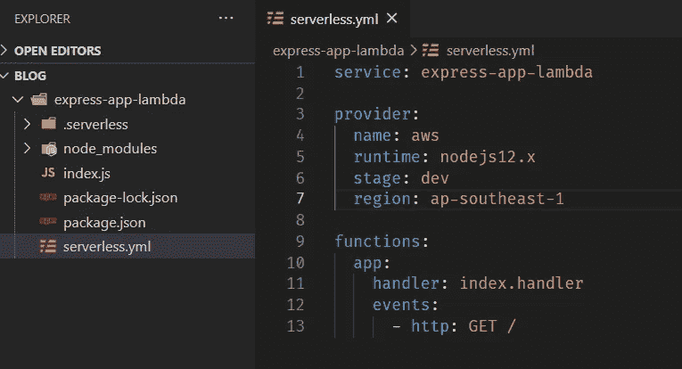
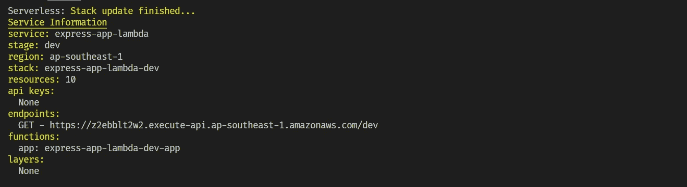
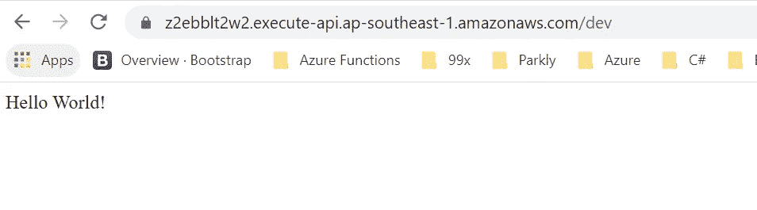
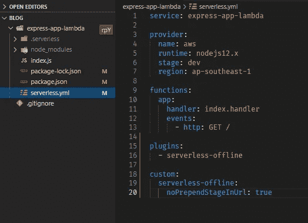
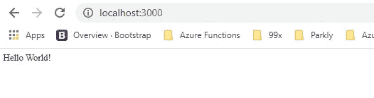

# 使用无服务器将 Express 应用程序部署到 AWS Lambda

> 原文：<https://javascript.plainenglish.io/deploy-express-app-to-aws-lambda-with-serverless-6b65e56c40c7?source=collection_archive---------5----------------------->

## 我们如何在几分钟内将 Node Express 应用程序部署到 AWS lambda 功能中



首先，我们需要用 AWS 凭证配置我们的环境。您可以从[这里的](https://www.serverless.com/framework/docs/providers/aws/guide/credentials/)找到配置 AWS 凭证的方法。

一旦您为您的环境配置了 AWS 凭证，我们就需要安装 AWS 无服务器框架。因此，让我们从 npm 安装它

```
$ npm install -g serverless
```

我们的环境已经设置好了，我们可以开始了。让我们创建一个简单的 express 应用程序，其中一个端点返回“Hello World”文本。

```
$ npm init -f
$ npm install --save express serverless-http
```

我们安装了所需的依赖项，让我们创建 [index.js](https://github.com/prahveent/blog/blob/master/express-app-lambda/index.js) ，它公开了我们上面讨论过的一个端点。



index.js

为了部署这个应用程序，让我们在工作目录中创建一个[***server less . yml***](https://github.com/prahveent/blog/blob/master/express-app-lambda/serverless.yml)。



serverless.yml

现在让我们部署该功能。

```
$ sls deploy
```



嘣！现在你的函数部署到 AWS Lamba 函数。



endpoint

我们的应用程序部署了 AWS lambda，我们可以如何设置本地开发的应用程序。

首先，让我们使用无服务器离线插件。这个插件有助于模拟本地开发的 API 网关环境。

```
# npm install --save-dev serverless-offline
```

然后将插件添加到您的[***server less . yml***](https://github.com/prahveent/blog/blob/master/express-app-lambda/serverless.yml)



serverless.yml with serverless-offline plugin

然后启动无服务器脱机服务器

```
$ sls offline start
```

我们的离线服务器已经准备好，并在您的浏览器中导航到您在 [http://localhost:3000](http://localhost:3000) 的根页面:



## 结论

我希望您现在对如何将 Express 应用程序部署到 AWS Lambda 以及如何设置本地环境有了更好的了解。如果你有进一步的澄清，留下你的评论，或者通过 LinkedIn 联系我。