# 将 React SSR 部署到生产中

> 原文：<https://javascript.plainenglish.io/deploy-react-ssr-to-production-26350e9985d1?source=collection_archive---------2----------------------->

## 如何在谷歌云平台上部署 React SSR 应用

这是[介绍 React 服务器端渲染](https://www.suhanwijaya.com/posts/intro-to-react-server-side-rendering)的续集，所以如果你还没有看的话，可以看看。

让我们在谷歌云平台(GCP)上部署一个基本的 React SSR 应用程序。

在本文中，我将部署一个 *Web 应用服务器*，将 webpack 包上传到*云存储*，并通过 *CDN 提供这些包。*我使用的斜体术语是乔纳森·富尔顿(Jonathan Fulton)在这篇出色的文章 [Web Architecture 101](https://engineering.videoblocks.com/web-architecture-101-a3224e126947) 中定义的。

让我们分两部分来完成这个任务。

*第 1 部分:在本地构建并启动应用程序。*

*第 2 部分:部署到云。*

# 第 1 部分:在本地构建并启动应用程序

这是大图:

1.  通过 webpack 传输客户端和服务器端捆绑包。
2.  启动一个静态服务器来服务客户端包。
3.  作为 Web 应用服务器启动服务器端包。

作为参考，这里是本节使用的代码的 [Github repo](https://github.com/suhanw/blog-react-ssr/tree/local-build) 。

## 反应组分

让我们创建一个简单的 React 组件`App`，它用一些基本样式呈现我们最喜欢的问候语，以及一个单击时显示警告对话框的按钮。我们将在服务器端呈现这个组件，并在客户端合成它。

## webpack 配置

我们不是使用`webpack-dev-server`在内存中构建客户端包(就像[Intro to React Server Side Rendering](https://www.suhanwijaya.com/posts/intro-to-react-server-side-rendering)中一样)，而是将包输出写入文件，并启动一个本地静态服务器来服务这些文件。请注意下面的注释行。

上面代码注释的注释:

**【A】**保存客户端捆绑输出到`./build/client`

**【B】**将 JavaScript 代码写入`./scripts/bundle.js`

**【C】**将 CSS 代码写入`./styles/bundle.css`

其他设置与我们在这里要完成的任务没有太大关系，但是更多细节可以在[React 服务器端渲染简介](https://www.suhanwijaya.com/posts/intro-to-react-server-side-rendering)中找到。

## HTML 响应

虽然 HTML 标记将在服务器端呈现，但我们需要确保捆绑的 JS 和 CSS 文件被下载到客户端，以“水合”标记。

上面代码注释的注释:

**【A】**这将 React 组件`App`转换成一个 HTML 字符串，然后我们将它插入到 ID 为**“SSR-app”**的`div`中。即 SSR 标记。

这将加载 CSS 代码来样式化我们的 SSR 标记中的 DOM 元素。

**【C】**这会加载 JS 代码来“水合”具有交互性的标记。在本例中，它将 click 处理程序附加到按钮上。

**【D】**这是服务于客户端捆绑包的本地静态服务器。

酷毙了。

## 构建和启动脚本

让我们定义几个`npm`脚本来本地构建和启动我们的应用程序。请将这些视为启动和运行我们的应用程序的步骤。

*   `build:client` —这告诉 webpack 构建客户端代码并将包输出保存在`./build/client`中。
*   `build:server` —这告诉 webpack 构建服务器端代码并将包输出保存到`./build/server/bundle.js`。
*   `prebuild` —使用 [rimraf](https://github.com/isaacs/rimraf) 删除`./build`文件夹。
*   `build` —并行运行`build:client`和`build:server`。
*   `start:client` —这将`./build/client`作为`[http://localhost:5000](http://localhost:5000.)`上的静态文件，使用恰当命名的库[服务](https://github.com/vercel/serve)。注意，这是我们在上面的 HTML 响应中插入的`cdnHost`。
*   `start:server` —这将在`http://localhost:3000`启动快速服务器。
*   `start:local` —并行运行`start:client`和`start:server`。

## 把所有的放在一起

在终端中，让我们按以下顺序运行 npm 脚本:

1.  `npm run build`
2.  `npm run start:local`

我们的 SSR 应用程序现已在`http://localhost:3000`上线运行！🎉

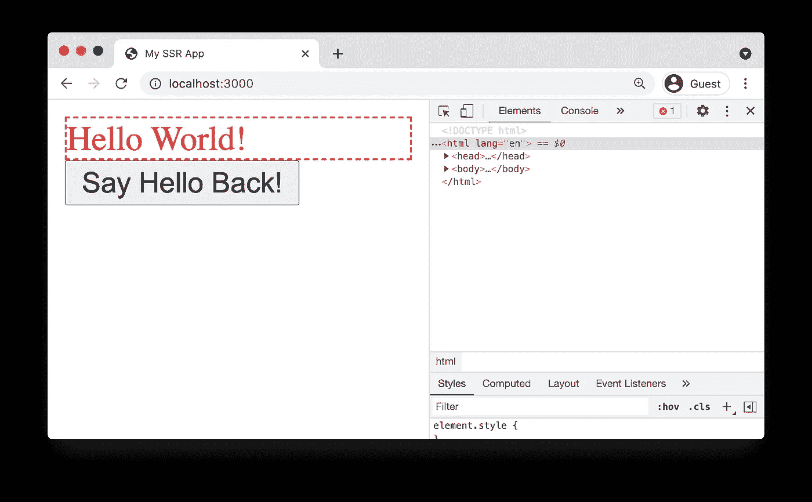

点击按钮应该会触发警告对话框！🙌

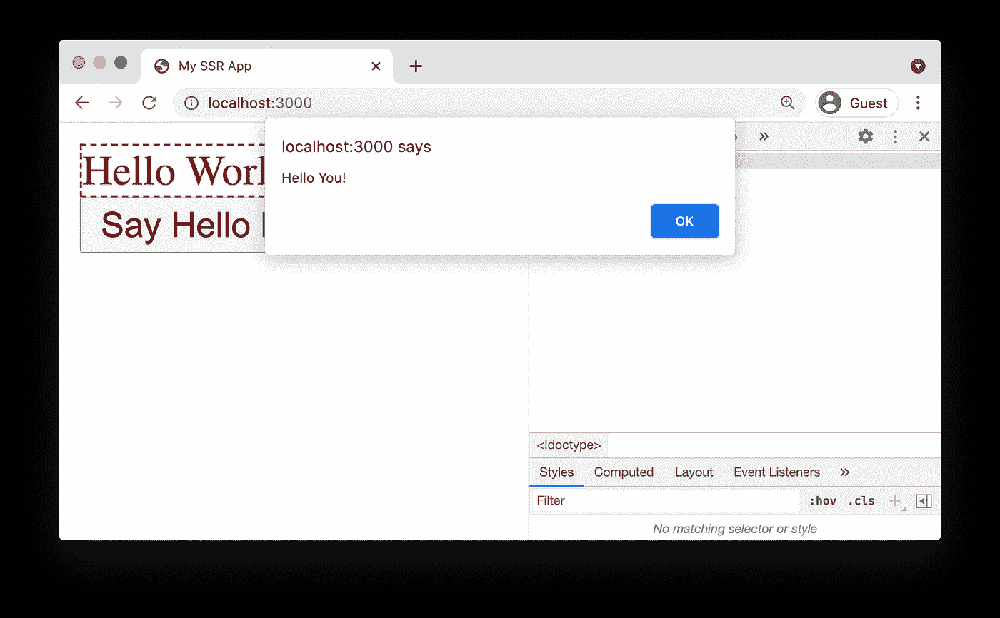

# 第 2 部分:部署到云

我们现在将在云中复制我们刚刚在本地做的事情，**！**

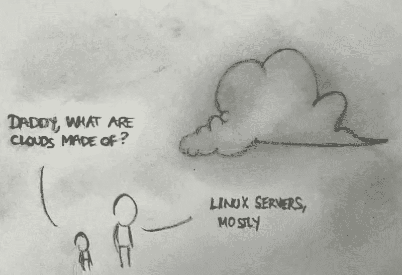

Source: [Reddit](https://www.reddit.com/r/ProgrammerHumor/comments/6cer5t/what_are_clouds_made_of/)

再说一遍，这是大图:

1.  使用 GCP 云构建来执行以下构建步骤。
2.  通过 webpack 传输客户端和服务器端捆绑包。
3.  将客户端捆绑包上传到 GCP 云存储，这些捆绑包将作为 CDN 上的静态文件。
4.  将服务器端捆绑包作为 Web 应用服务器部署到 GCP 应用引擎。

作为参考，这里是本节使用的代码的 [Github repo](https://github.com/suhanw/blog-react-ssr/tree/deploy) 。

对于本节，我假设您对 GCP 有一定程度的了解，包括您已经注册了一个帐户。

**请注意，当您使用 GCP 产品/服务时，可能会收取账单费用！**

深呼吸，我们开始吧！

## 创建新的 GCP 项目

转到 [IAM & Admin >管理资源](https://console.cloud.google.com/cloud-resource-manager)并创建一个新项目。我们把这个项目命名为`react-ssr`。

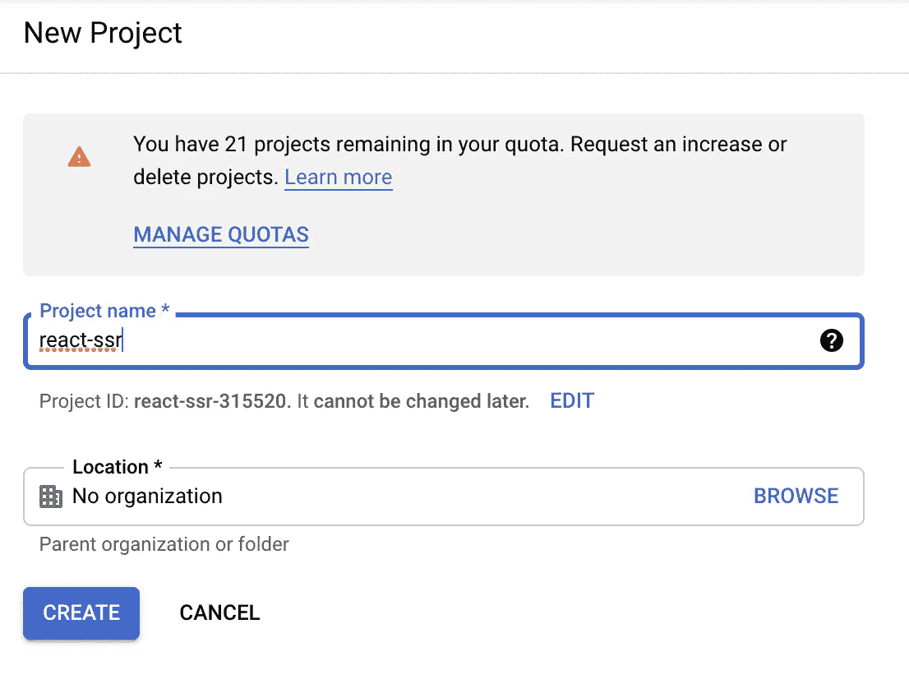

确保新创建的项目`react-ssr`被选中。

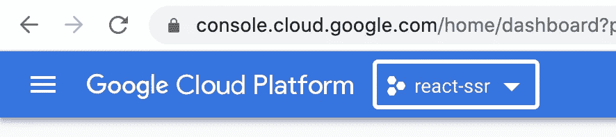

## 云存储

创建一个存储桶来上传客户端包。这些将作为静态文件通过一个由 GCP 支持的真实 CDN 提供。

进入[云存储>浏览器](https://console.cloud.google.com/storage/browser)新建一个桶。为了一致，还是取名`react-ssr`吧。其余选项使用默认设置。

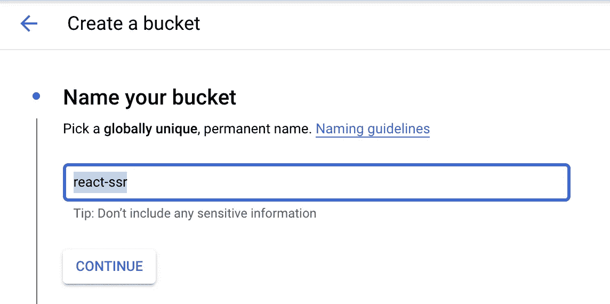

一旦创建了 bucket，您应该会看到类似这样的内容。

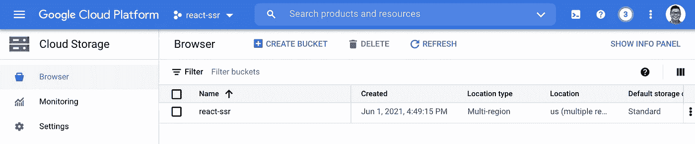

钻入`react-ssr`桶，点击`Configuration`选项卡，编辑`Permissions > Access Control`，并将其设置为`Fine-grained`。

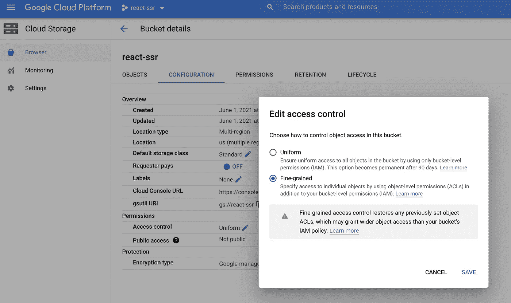

点击`Permissions`选项卡，点击`Permissions > ADD`，添加角色为`Storage Legacy Object Reader`的用户`allUsers`，使该存储桶中的文件公开可读。

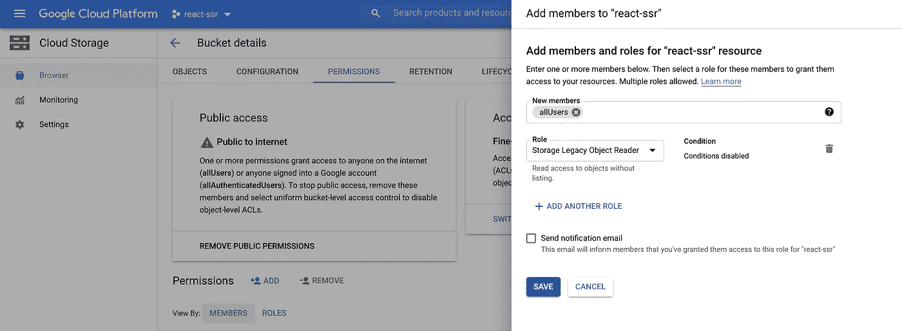

## 应用引擎

这项服务将管理集装箱化和扩展。为了说明的目的，这仅仅意味着我们的应用程序将通过 URL 在互联网上可用。

转到[应用引擎>仪表板](https://console.cloud.google.com/appengine)并创建一个新应用。相应地选择你的地区。

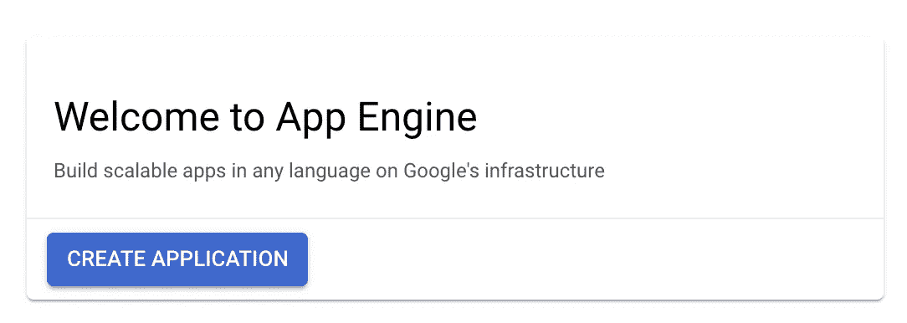

成功创建应用程序后，您应该会在仪表板上看到类似这样的内容。

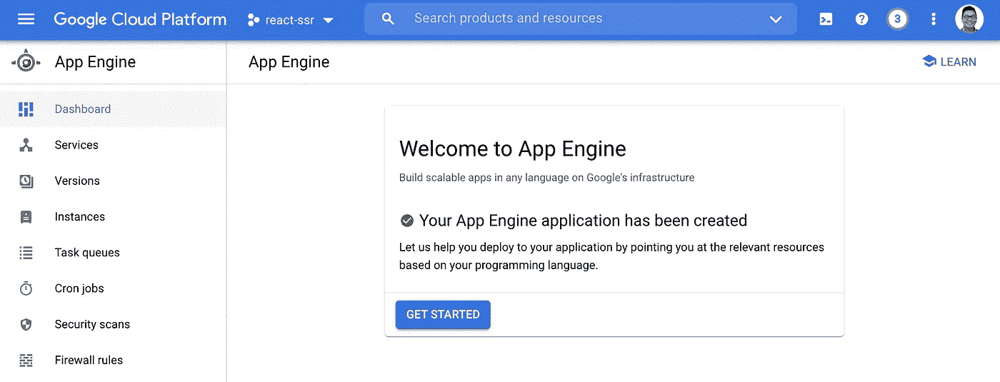

接下来，启用[应用引擎管理 API](https://console.cloud.google.com/marketplace/product/google/appengine.googleapis.com) 。

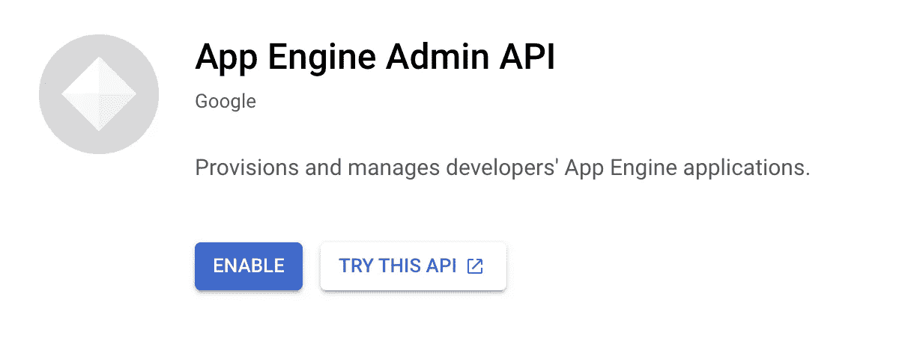

一旦启用，您应该会看到类似这样的内容。

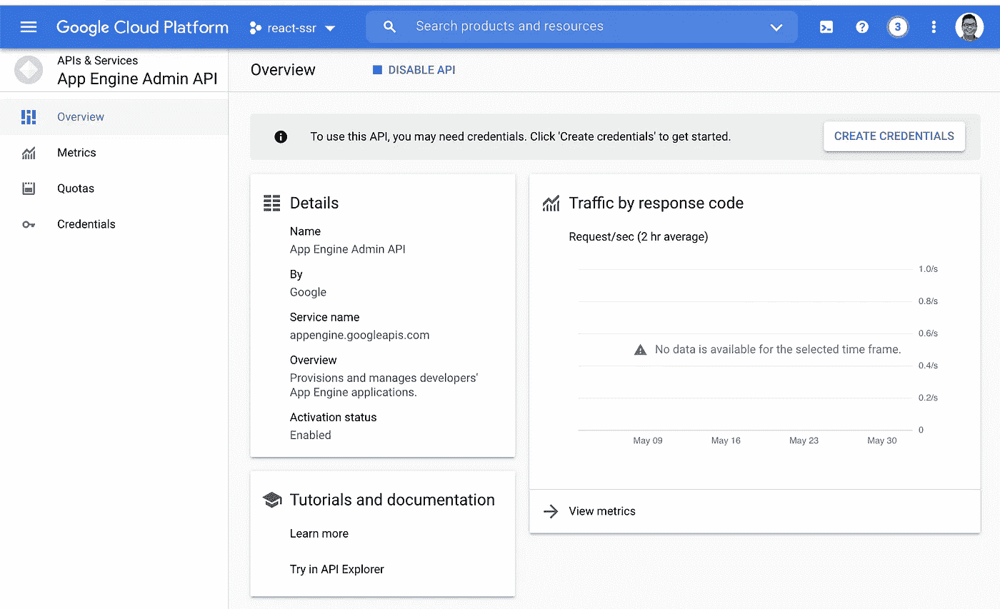

接下来，我们需要通过代码库中的`app.yaml`文件定义[运行时设置](https://cloud.google.com/appengine/docs/standard/nodejs/configuring-your-app-with-app-yaml)，以便我们的 Node.js 应用程序托管在 App Engine 上。

上面代码注释的注释:

**【A】**这告诉 App Engine 你要为你的 App 使用的 Node.js 版本。

**【B】**这将运行时环境变量`NODE_ENV`设置为值“production”，我们可以通过`process.env.NODE_ENV`在代码中访问它。

最后，App Engine 通过运行`npm start`来启动应用程序，所以让我们将那个`npm`脚本添加到我们的`package.json`中。

## 云构建

我们将在每次提交源代码时使用云构建来自动化应用部署。

首先，让我们启用[云构建 API](https://console.cloud.google.com/marketplace/product/google/cloudbuild.googleapis.com) 。

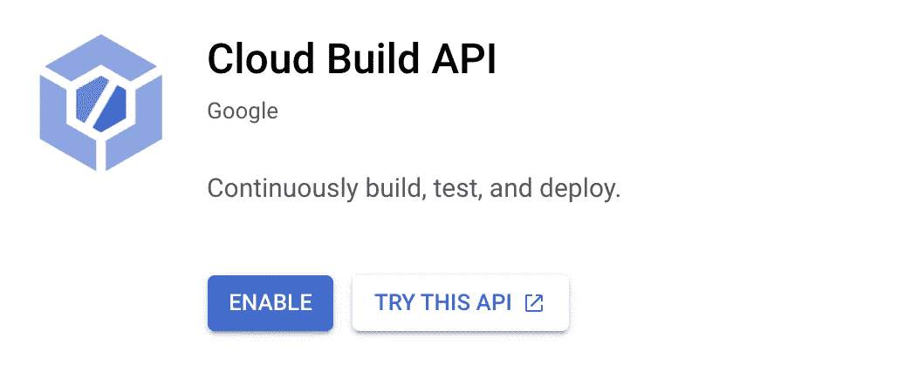

一旦启用，您应该会看到类似这样的内容。

接下来，进入[云构建>设置](https://console.cloud.google.com/cloud-build/settings/)，将 **App Engine Admin** 角色和 **Service Account User** 角色的状态设置为 **Enabled** 。

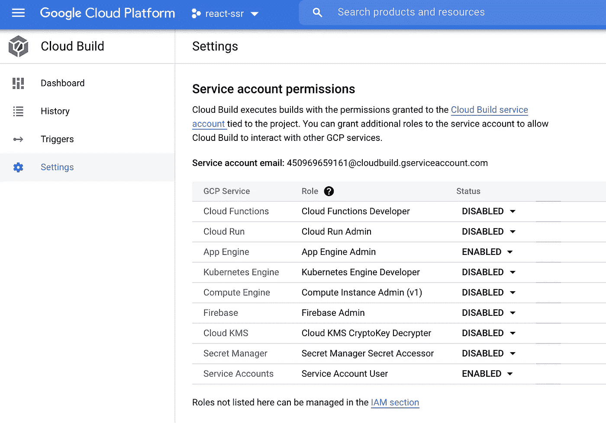

出于这个示例的目的，只需将[云构建服务帐户](https://cloud.google.com/build/docs/securing-builds/configure-access-for-cloud-build-service-account)想象成自动执行我们的构建步骤、将文件上传到云存储并部署到 App Engine 的机器人。

最后，我们在代码库中的`cloudbuild.yaml`文件中定义了一系列构建步骤，以将我们的应用程序部署到云中。云构建将连续执行这些步骤。

上面代码注释的注释:

**【A】**这会运行`npm install`在云中安装我们所有的依赖项，就像我们在本地开始一个新项目一样。

**【B】**这运行`npm run build`通过 webpack 传输我们的客户端和服务器端包，并将输出保存到`./build`，将构建时环境变量`NODE_ENV`设置为“生产”，我们可以通过`process.env.NODE_ENV`在我们的代码中访问它。

**【C】**这将`./build`目录中的文件上传到我们之前创建的云存储桶`react-ssr/build`中。

**【D】**这会将云构建[超时设置为 1600 秒](https://cloud.google.com/build/docs/deploying-builds/deploy-appengine#configuring_the_deployment)，并将应用部署到应用引擎。

最后，让我们通过创建一个构建触发器，在每次向源 repo 推送一个新的 git commit 时开始自动化构建。转到[云构建>触发器](https://console.cloud.google.com/cloud-build/triggers)，创建一个触发器。我们将其命名为`deploy-react-ssr`，并选择`Push to a branch`作为 repo 事件来启动自动化构建。

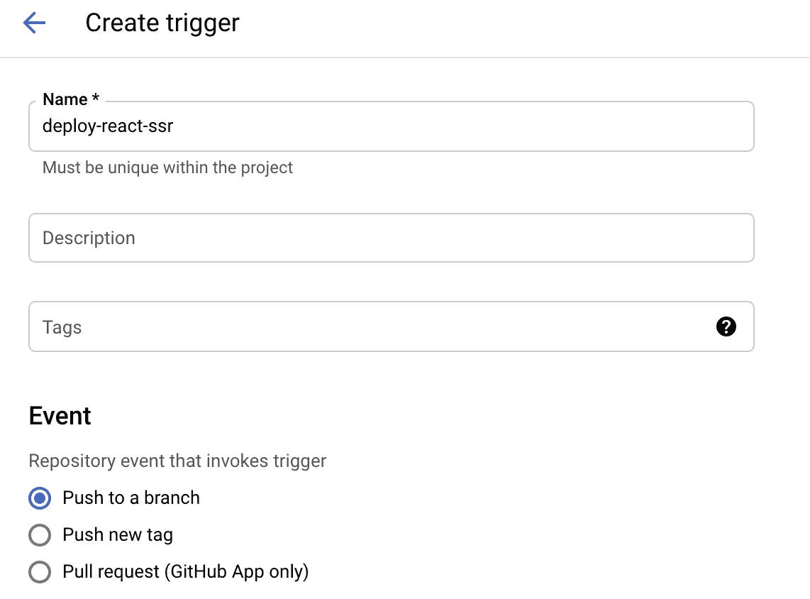

选择包含构建配置文件`cloudbuild.yaml`的源代码报告。为将启动触发器的分支指定正则表达式。在我的例子中，我想在每次提交到`deploy`分支时触发自动构建。

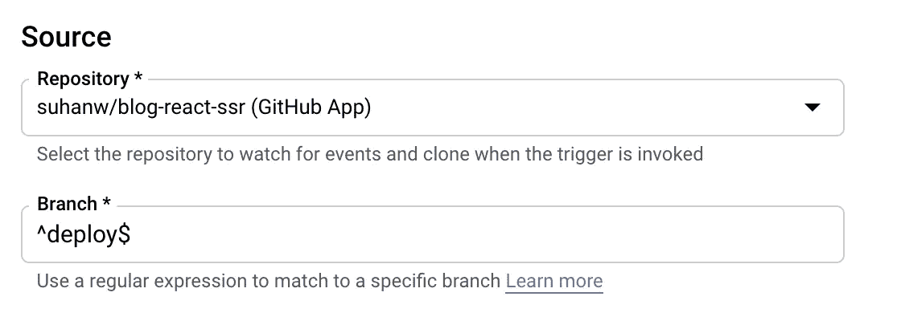

一旦触发器成功创建，您应该会看到类似这样的内容。

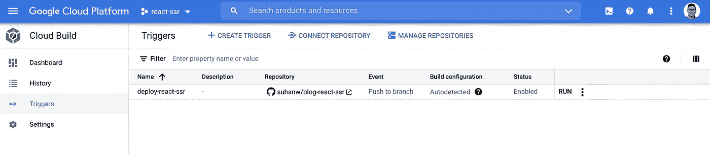

## HTML 响应

与上面的第 1 部分类似，我们需要确保捆绑的 JS 和 CSS 文件被下载到客户端，以“水合”SSR-ed 标记。下面的注释行与第 1 部分中的略有不同。

上面代码注释的注释:

**【A】**在生产中，App Engine 会将`process.env.PORT`环境变量设置为通过互联网接收 HTTP 请求的端口。

**【B】**在生产中，这是为上传到云存储的客户端捆绑包提供服务的静态服务器。注意:实际启用云 CDN 服务还有一些额外的步骤，但与此图没有太大关系。

## 把所有的放在一起

你还在这里？厉害！

以下是将上述所有内容整合在一起的工作流程:

1.将提交推送到源代码仓库中的`deploy`分支。

2.提交会触发云构建来启动自动化构建。转到[云构建>历史](https://console.cloud.google.com/cloud-build/builds)了解构建和相关提交的历史。

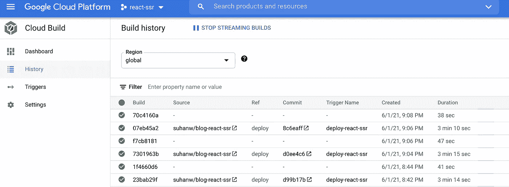

3.在给定的构建中，执行`cloudbuild.yaml`中定义的步骤。

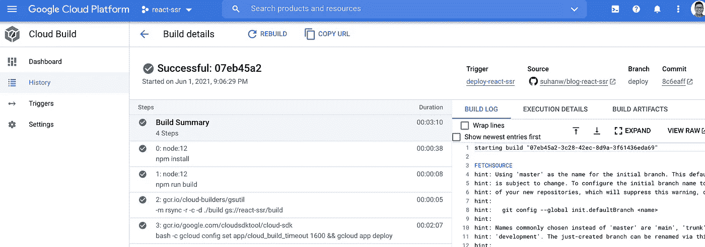

4.客户端捆绑包被上传到云存储。

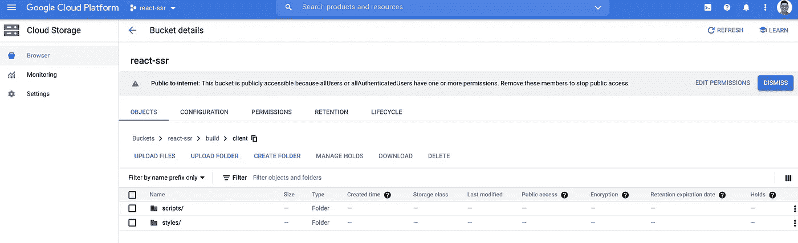

5.Web 应用服务器部署到 App Engine。

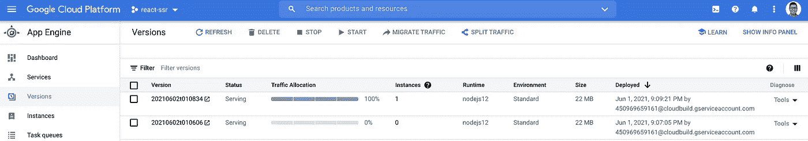

6.SSR 应用程序现在已经在云中运行了！😍

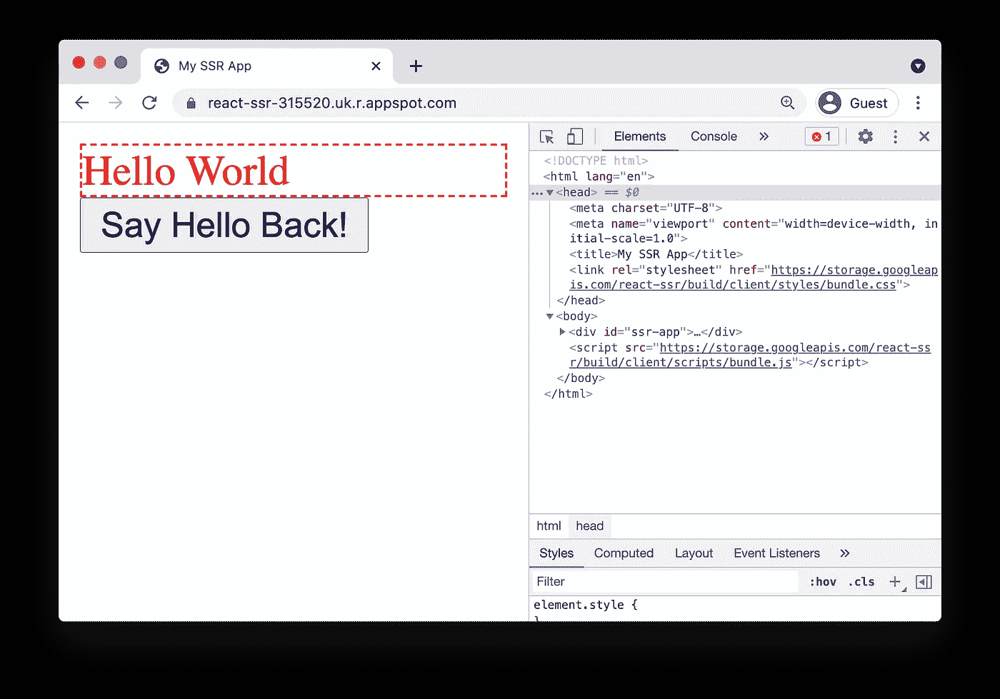

# 资源

*   [云构建:构建 Node.js 应用](https://cloud.google.com/build/docs/building/build-nodejs?hl=en)
*   [云构建:使用云构建的自动化静态网站发布](https://cloud.google.com/community/tutorials/automated-publishing-cloud-build)
*   [应用引擎:在应用引擎上构建 Node.js 应用](https://cloud.google.com/appengine/docs/standard/nodejs/building-app)
*   [App 引擎:使用云存储](https://cloud.google.com/appengine/docs/standard/nodejs/using-cloud-storage)
*   [云存储:访问公共数据](https://cloud.google.com/storage/docs/access-public-data#api-link)

# 阅读更多

 [## React 服务器端渲染简介

### 如何在没有任何工具或框架的情况下构建一个 React SSR app？

javascript.plainenglish.io](/intro-to-react-server-side-rendering-3c2af3782d08)  [## 用 React 钩子将数据从 UI 解耦

### 以及我如何用 JavaScript 函数“编程到一个接口”

javascript.plainenglish.io](/decouple-data-from-ui-with-react-hooks-6f7fe968c3e3)  [## 如何在 React 第 2 部分中将数据与 UI 解耦

### 对钩子、渲染道具和特设模式的进一步探索

javascript.plainenglish.io](/how-to-decouple-data-from-ui-in-react-d6b1516f4f0b) 

📫*我们来连线上*[*LinkedIn*](https://www.linkedin.com/in/suhanwijaya/)*或者*[*Twitter*](https://twitter.com/suhanw)*！*

*更多内容请看*[*plain English . io*](http://plainenglish.io/)