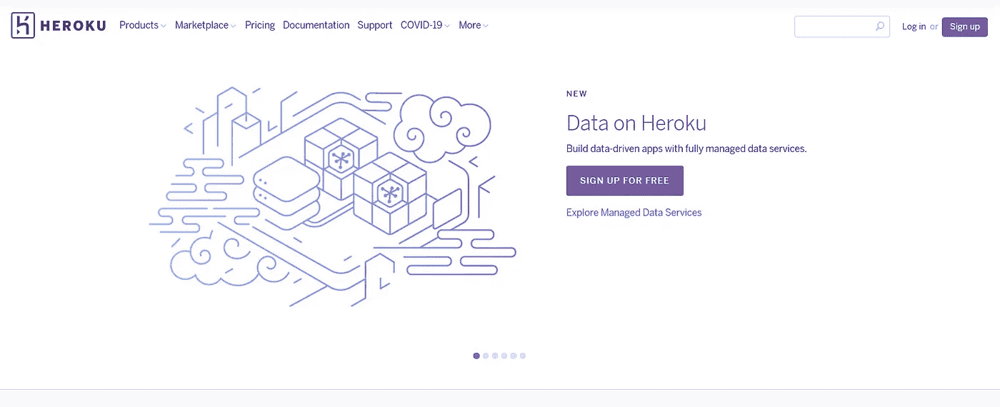
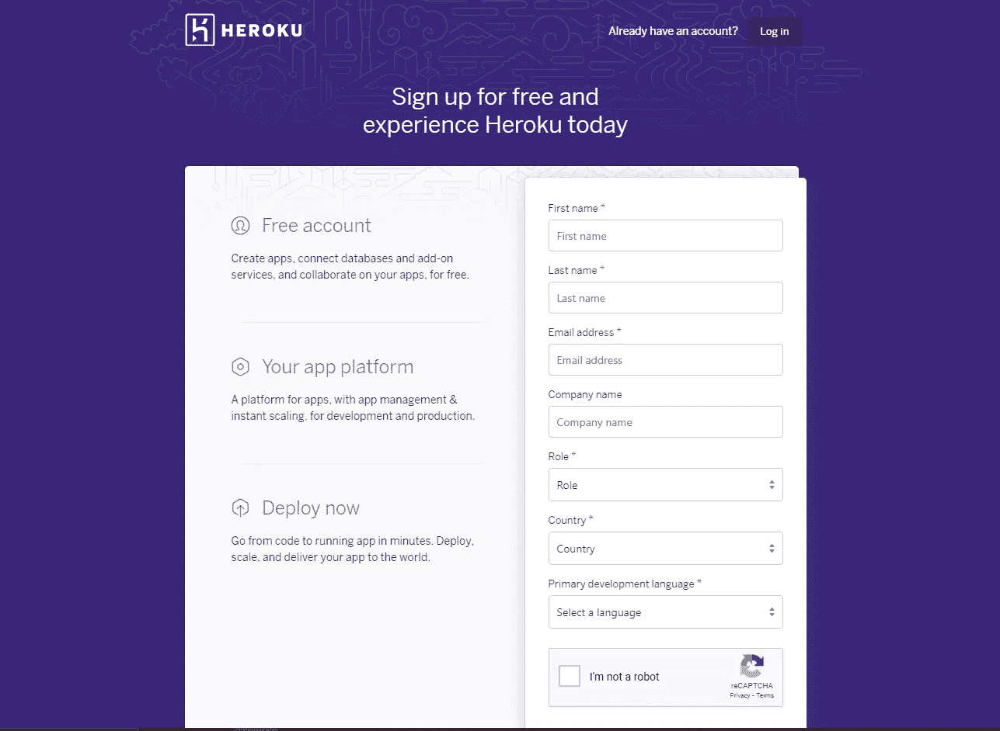
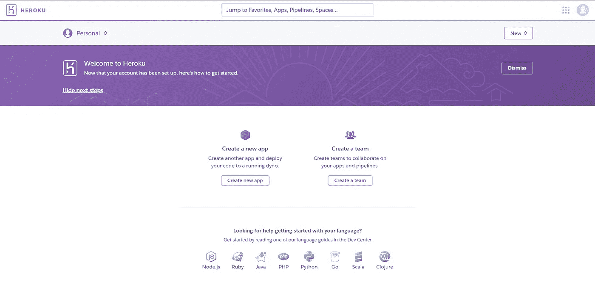
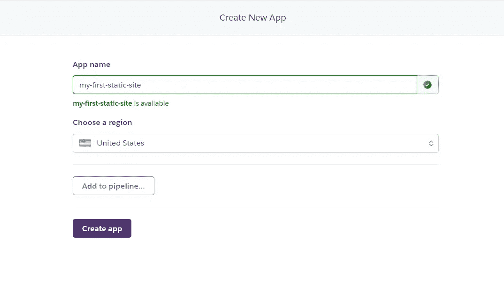
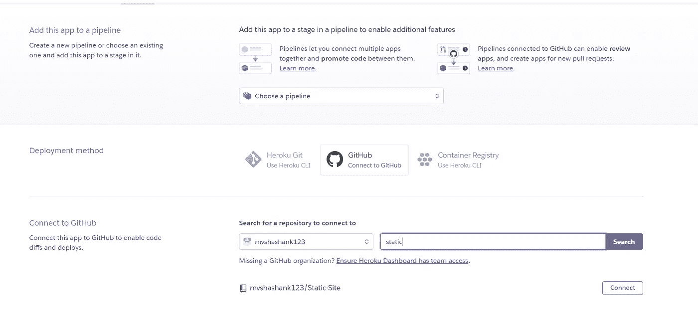

# 几秒钟内在 Heroku 上免费部署您的静态站点

> 原文：<https://javascript.plainenglish.io/deploy-your-static-sites-for-free-on-heroku-in-seconds-7644959356a7?source=collection_archive---------10----------------------->

## 在 Heroku 上部署静态网站的分步指南

Photo by [panumas nikhomkhai](https://www.pexels.com/@cookiecutter?utm_content=attributionCopyText&utm_medium=referral&utm_source=pexels) from [Pexels](https://www.pexels.com/photo/bandwidth-close-up-computer-connection-1148820/?utm_content=attributionCopyText&utm_medium=referral&utm_source=pexels)

# 什么是静态站点？

静态意味着不变的东西。您当前所在的这篇文章的内容在您刷新页面时不会改变，因此该内容可以被视为网页的静态元素。所以这里文章的内容不会改变，但是当你刷新一些动态元素时，比如鼓掌的次数可能会改变。所以在过去，万维网的大部分内容基本上都是静态网页。而现在，由于电子商务、社交媒体、媒体流等的扩展，动态网页的数量在增加。

所以静态网页是直接从服务器获取的，没有任何修改。而在动态网页的情况下，服务器根据请求创建网页。基本上是从数据库或其他网站获取数据并创建网页。

您也可以将 Medium 主页视为一个动态网页，它的内容会根据每个请求而变化。那么，为什么你会有一个静态的网站，你想把它放到网上？假设你是一个网络开发新手，并且已经建立了一个新的网页，你可以免费托管 Heroku。因此，在本教程中，我将带您了解如何做到这一点。

# 入门指南

您所需要的只是一个 Heroku 帐户、一个 Github 帐户和一个包含 HTML、CSS 和 JavaScript 的项目。它可以是任何静态站点。

# **为静态站点设置后端**

Heroku 默认不允许你部署没有后端的应用。所以我们需要先设置后端。别担心，这真的很简单。

因此，转到您的项目并创建一个 index.php 的**文件。**

该文件必须看起来像这样，在 **include_once()** 函数中，我们只需指定应用程序的入口点。这可以是任何其他的文件，在我的例子中是 index.html 的文件。

确保提交您的更改并将代码推送到 Github。

# 设置 Heroku 帐户

## **第一步。**进入 Heroku 的 [**网站**](https://www.heroku.com/) ，点击**注册**按钮。

## **第二步。**输入所需的详细信息并点击**创建自由账户**按钮。

## **步骤三。**通过验证电子邮件地址完成注册过程。

## **第四步。**然后**登录**到 Heroku。

# 设置应用程序:

## **第一步。**点击**创建新应用**。

## **步骤二。**给你的应用取一个合适的名字，然后选择一个地区，点击**创建应用**按钮。

## **第三步。**选择 **Github** 作为部署方式。

## **第四步。**通过登录连接您的 Github 帐户。

## **第五步。然后选择您的帐户，搜索存储库并连接它。**

## **第六步。**点击部署

Photo by [Bill Jelen](https://unsplash.com/@billjelen?utm_source=medium&utm_medium=referral) on [Unsplash](https://unsplash.com?utm_source=medium&utm_medium=referral)

然后，我们完成了您的应用程序在线部署。

感谢您的阅读！

如果您想要部署 React 应用程序:

 [## 如何在 Firebase 上免费部署 React 应用程序

### 完全初学者的循序渐进教程

medium.com](https://medium.com/javascript-in-plain-english/how-to-deploy-your-react-applications-for-free-on-firebase-ffb3e6dcddf5) 

👋嘿，我们做朋友吧！在 [LinkedIn](https://www.linkedin.com/in/shashank-mv/) 上联系我。别忘了在 [Medium](https://medium.com/@mv.shashank123) 上关注我，获取更多类似的内容。