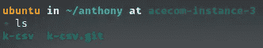

# 将 Node.js 应用程序部署到 Oracle 云

> 原文：<https://javascript.plainenglish.io/deploying-a-node-js-app-to-oracle-cloud-c6f783cb98d7?source=collection_archive---------8----------------------->


Deploying a Node.js App to Oracle Cloud

作为开发人员，我们可能需要经常部署应用程序，用于 MVP、个人项目或者工作中的一些项目。在本文中，我将逐步指导您如何部署您的应用程序并在互联网上共享它。

**先决条件:**

1.  使用 Ubuntu 在 Oracle cloud 上运行实例。
2.  让它的 ssh 私钥连接到实例。
3.  使用 Linux 终端(我将使用 zsh)。

在本教程中，我将为我所属的组织配置一个实例， [ACECOM](https://acecom.dev) 。我们开始吧。

## 生成公钥并配置 ssh

我假设您在创建实例时有 Oracle cloud 提供的私钥(在我的例子中是`acecom-server-3`)，并且您将它存储在 PC 上的某个地方。现在我们必须将它移动到正确的位置，`.ssh`文件夹(它应该位于您的主目录中)，您可以通过运行:

```
cp acecom-server-3 ~/.ssh/
```

现在，您必须给它适当的权限(超级用户的读取权限)，您可以通过运行以下命令来实现这一点:

```
chmod 400 acecom-server-3
```

现在，进入你的`.ssh`文件夹，运行`cd ~/.ssh`，然后运行`ls -la`，看起来应该是这样的:


Example of correctly located ssh key with its right permissions,

然后，您必须创建它的公共对，为此您可以运行以下命令:

```
ssh-keygen -y -f acecom-server-3 > ./acecom-server-3.pub
```

关于`ssh-keygen`命令的更多信息，可以看看[这个](https://www.man7.org/linux/man-pages/man1/ssh-keygen.1.html)。现在，在您再次运行`ls -la`之后，您可能看起来像这样:


Example of correctly generated public key pair for your private key.

## 配置"`config"`文件

到目前为止，一切顺利。现在，我将向您展示一个技巧，为了更快地连接到我们的实例，只需输入(至少对于我的例子来说)`ssh acecom-3`。

首先，让我们通过键入`nano config`创建一个配置文件，在这个文件中，我们将为我们的 ssh 命令添加一些配置:

*   主机(我们希望通过 ssh 访问的实例的名称)。
*   主机名(实例的公共 IP)。
*   用户(我们希望用来访问实例的用户)。
*   身份文件(用于 ssh 连接的相应 ssh 私钥)。

最后，它看起来会像这样:

```
Host acecom-3 
        Hostname 0.0.0.0 (your public instance IP)
        User ubuntu
        IdentityFile ~/.ssh/acecom-server-3
```

此时，您必须保存您的文件，然后退出 nano。

在 Oracle Cloud 的情况下，默认用户名是它的`ubuntu`，除非您手动更改它(通过创建新用户、组等)。)，您必须使用这个用户访问您的实例。

最后，我们可以在终端中输入`ssh acecom-3`。我们第一次这样做时，会收到一条消息，内容是:

```
The authenticity of host '0.0.0.0 (0.0.0.0)' can't be established. 
ED25519 key fingerprint is SHA256:/QIh1Zg/1234... 
This key is not known by any other names 
Are you sure you want to continue connecting (yes/no/[fingerprint])?
```

您只需键入“yes”并按下回车键，就像变魔术一样，我们与实例连接起来，它看起来可能如下所示:


Example of message for when we successfully connect to our instance.

## 第一次连接

一旦连接上，您必须更新和升级软件包列表来进行全新安装。所以第一次运行:`sudo apt update`，一旦它结束你必须运行`sudo apt upgrade`，你将准备好去。

## 安装 zsh、oh-my-zsh 和 spaceship(可选)

我是 zsh 的超级粉丝，我总是在我拥有的每台 Linux 机器上安装它，甚至在虚拟机和实例中。我发现它非常有用——它有扩展、自动完成、主题等等。因此，如果您想尝试一下，请继续阅读这一部分，如果您不想，请跳过这一部分，但是请考虑在接下来的部分中，来自实例的终端的所有屏幕截图都将使用 zsh 而不是 bash。

首先我们要安装 zsh(我会按照[这个指南](https://github.com/ohmyzsh/ohmyzsh/wiki/Installing-ZSH)来)，所以你要运行`sudo apt install zsh`。然后，安装后，如果你运行`zsh --version`，你会看到如下输出:

```
zsh 5.8 (aarch64-unknown-linux-gnu)
```

然后，我们必须将它设为默认 shell，为此我们将运行`chsh -s $(which zsh)`。在这里，有些人可能被要求输入密码，但是什么密码呢？由于我们还没有配置任何密码，这可能看起来很奇怪，但不要担心，你可以修复它。要修复它，您必须编辑您的`/etc/pam.d/chsh`文件，它可能看起来像这样(要查看其内容，只需运行`cat /etc/pam.d/chsh`):

```
# 
# The PAM configuration file for the Shadow `chsh' service 
# 

# This will not allow a user to change their shell unless 
# their current one is listed in /etc/shells. This keeps 
# accounts with special shells from changing them. 
auth       required   pam_shells.so 

# This allows root to change user shell without being 
# prompted for a password 
auth            sufficient      pam_rootok.so 

# The standard Unix authentication modules, used with 
# NIS (man nsswitch) as well as normal /etc/passwd and 
# /etc/shadow entries. 
@include common-auth 
@include common-account 
@include common-session
```

因此，在这里你必须将“必需的”改为“足够的”,这样就行了。您可以通过使用`sudo nano /etc/pam.d/chsh`编辑该文件来完成此操作。

然后你可以运行`chsh -s $(which zsh)`，但是什么都不会发生，放心，你要关闭连接再打开。一旦你这样做了，你会看到一个配置菜单，要求你为你的 zsh 添加一些配置，我建议你选择默认配置，但你可以随意定制。一旦您完成了 zsh 的配置，您将会注意到您的 shell 已经发生了变化，如果您运行`echo $SHELL`，您将会看到类似`/bin/zsh`的输出。

现在我们已经安装了 zsh，我们可以通过运行以下命令继续安装 [oh-my-zsh](https://ohmyz.sh/) :

```
sh -c "$(curl -fsSL [https://raw.github.com/ohmyzsh/ohmyzsh/master/tools/install.sh](https://raw.github.com/ohmyzsh/ohmyzsh/master/tools/install.sh))"
```

如果一切正常，你会看到你的外壳又变了，看起来非常好，但我们可以通过安装[飞船](https://github.com/spaceship-prompt/spaceship-prompt)来进一步改进。因此，根据它的文档，您必须运行以下命令来克隆 repo 并将其保存在 zsh 主题中:

```
git clone https://github.com/spaceship-prompt/spaceship-prompt.git "$ZSH_CUSTOM/themes/spaceship-prompt" --depth=1
```

然后，您必须创建一个符号链接，通过运行以下命令将主题链接到 oh-my-zsh 自定义主题文件夹:

```
ln -s "$ZSH_CUSTOM/themes/spaceship-prompt/spaceship.zsh-theme" "$ZSH_CUSTOM/themes/spaceship.zsh-theme"
```

现在，您必须编辑您的`.zshrc`文件并设置`ZSH_THEME="spaceship"`，您可以通过运行`nano ~/.zshrc`来完成，一旦您修改了主题，我建议您转到文件的末尾，取消示例别名的注释并添加一些新的别名(那些可能对您有用的)，在我的例子中，我总是添加一个:

```
# Example aliases 
alias zshconfig = **"nano ~/.zshrc"**   
alias ohmyzsh = **"nano ~/.oh-my-zsh"**   
alias ra = **"source ~/.zshrc" # to update the .zshrc file**
```

我们成功了！我们有一个自动完成的漂亮外壳。还有，我们可以添加很多[插件](https://github.com/ohmyzsh/ohmyzsh/tree/master/plugins)，比如 nvm、node、wakatime、git、Python 等等。如果你已经取消了我建议你的别名注释，现在无论何时你想添加一个新的插件、别名或定制命令，你只需运行`zshrc`，它将打开你的`.zshrc`，在那里你可以定制你想要的一切。一旦完成，您只需运行`ra`，所有的更改都将被更新。


Example of the Spaceship terminal configured in the instance.

## 安装 Node.js

现在，我们将采取最重要的步骤:安装 Node.js。为此，我们将使用 nvm。首先，您需要安装它，为此我们将运行:

```
curl -o- https://raw.githubusercontent.com/nvm-sh/nvm/v0.39.0/install.sh | bash
```

安装完成后，您将看到如下输出:

```
...

=> Appending nvm source string to /home/ubuntu/.zshrc 
=> Appending bash_completion source string to /home/ubuntu/.zshrc 
=> Close and reopen your terminal to start using nvm or run the following to use it now: 

export NVM_DIR="$HOME/.nvm" 
[ -s "$NVM_DIR/nvm.sh" ] && \. "$NVM_DIR/nvm.sh"  # This loads nvm 
[ -s "$NVM_DIR/bash_completion" ] && \. "$NVM_DIR/bash_completion"  # This loads nvm bash_completion
```

为了验证安装是否正确，请关闭并重新打开您的 ssh 连接，然后输入`nvm -v`，如果您得到一个版本的输出，那么一切正常。如果你有任何问题，请查阅文件。

现在，我们将安装节点，您可以使用`nvm i 10`安装您需要的任何版本，以防您想要安装节点版本 10，但在我的情况下，我将安装 LTS 版本，如果您也是这种情况，请运行:`nvm i --lts`。如果一切正常，您应该得到以下输出:

```
...
Checksums matched! 
Now using node v16.13.0 (npm v8.1.0) 
Creating default alias: default -> **lts/*** (-> v16.13.0)
```

我们差不多完成了，现在要验证安装是否正确，请关闭并重新打开您的 ssh 连接并键入`node`，如果打开了一个`node.js`终端，一切正常(您可以通过键入`ctrl + D`关闭它)。

你可能想安装`yarn`(如果你不想的话，请跳过这一部分)，所以只要运行`npm i -g yarn`就可以了，`yarn`在你的实例中是可用的。

最后，让我们安装`[pm2](https://pm2.keymetrics.io/)`来部署我们的服务。你必须跑`npm i -g pm2`，就是这样。

恭喜您，您已经完成了 50%的流程！现在，我们将在 Oracle 实例中进行一些额外的配置，并部署我们的第一个应用程序作为示例！

## 在实例中部署您的应用程序

现在，几乎所有配置都已完成，我们的实例中安装了 node.js，我们必须部署我们的应用程序，为此，请创建一个您的项目所在的文件夹，如“dev”、“development”或“projects ”,或者只选择主文件夹，在我的情况下，我将使用`mkdir anthony`创建一个包含我的应用程序的文件夹，然后使用`cd anthony`移动到该文件夹，这就是神奇开始的地方。

以下摘自本[教程](https://www.youtube.com/watch?v=H6UU7TsyrGs)和[本](https://gist.github.com/noelboss/3fe13927025b89757f8fb12e9066f2fa#file-)。首先，在您的文件夹中运行以下命令(用您的项目名替换`k-csv`):

```
git init --bare k-csv.git
```

这将创建一个空存储库，您可以链接到您的本地 repo，您可以将该存储库视为一个远程配置存储库，您可以在其中推送您的更改并执行项目中的一些操作(通过使用钩子)。

然后你创建你的项目文件夹，这里是你将从本地机器推送的真正的项目文件，要做到这一点，请运行`mkdir k-csv`，最后，你的文件夹应该看起来像这样:



Example of how your project folder should look like.

到目前为止，一切顺利，现在我们将创建一个自定义挂钩，准确地说是接收后挂钩，这个挂钩将在您对远程回购的每次推送后触发，为此请使用:`cd ./k-csv/hooks`转到您的 hooks 文件夹。

一旦有请运行`nano post-receive`，这将创建后接收文件，并打开纳米编辑器，在那里你必须添加以下内容:

```
#!/usr/bin/bash 

PATH="/home/ubuntu/.nvm/versions/node/v16.13.0/bin:/home/ubuntu/bin:/usr/local/bin:/usr/local/sbin:/usr/local/bin:/usr/sbin:/usr/bin:/sbin:/bin:/usr/games:/usr/local/games:/snap/bin" WORK_TREE="/home/ubuntu/anthony/k-csv"GIT_DIR="/home/ubuntu/anthony/k-csv.git" while read oldrev newrev refname
do 

        git --work-tree=$WORK_TREE --git-dir=$GIT_DIR checkout -f $refname 

        cd $WORK_TREE 

        pm2 stop k-csv 

        yarn install --prod 

        yarn add webpack webpack-node-externals -D 

        yarn build 

        pm2 start 

        cd $GIT_DIR 

        git --work-tree=$WORK_TREE --git-dir=$GIT_DIR branch | grep -v "undeleted" | xargs git --work-tree=$WORK_TREE --git-dir=$GIT_DIR branch -D 

done
```

然后保存您的文件，您准备好推送您的更改，但是我们在这里做什么呢？好吧，让我一行一行地解释给你听:

1.  我们正在指定使用哪个 bash，它位于`/usr/bin/bash`中。
2.  我们正在重新声明路径，但是为什么呢？嗯，在使用 Oracle 实例时，我了解到在每次推送中，shell 都不能正确获取路径，它的路径非常有限([这里](https://stackoverflow.com/questions/54870771/path-in-post-receive-hook-doesnt-contain-path-as-set-in-bashrc)是一个与此相关的 StackOverflow 问题)，所以我能找到的唯一解决方案是在我的 post-receive 钩子中重新声明路径。如果您想知道我是从哪里得到这个路径的，您可以在您的终端中键入`echo $PATH`来找到它。
3.  我们正在为我们的项目指定工作目录和 git 目录。
4.  我们正在声明一个循环，但是为什么呢？好吧，每当一个 post-receive 钩子被触发时，它接收 3 个参数`oldrev newrev refname`，我们只关心最后一个，它指向正在被推送的当前分支。我们将在完成我们必须做的其余事情后删除它，因为我们希望能够随时推送我们想要的任何分支。
5.  现在，我们的循环被声明了，让我们把注意力集中在里面，首先，我们检查当前分支中的内容，然后我们移动到我们的工作目录，在那里使用`pm2`我们将停止当前正在运行的进程(在第一次推送中不会有任何进程，它会抛出一个错误，但没什么好担心的)，然后我们将安装我们的生产依赖项。在我的例子中，我还将安装`webpack`和`webpack-node-externals`作为开发依赖项(因为我使用`webpack`来构建我的项目)。然后我们构建我们的项目并再次运行我们的项目。
6.  最后，我们移动到 git 目录并删除我们正在工作的当前分支，正如我上面提到的，这允许我们在任何时候推送我们想要的任何改变。

此时，我们必须向脚本添加执行权限，我们已经准备好了，为此请运行:`chmod +x post-receive`。

现在，我们将在一小时内将您的本地 PC，所以移动到您的项目文件夹，并在那里添加遥控器如下:

```
git remote add deploy acecom-3:anthony/k-csv
```

您可以随意命名远程项目，只需在“:”后面键入远程项目在实例中所在的目录。要验证一切正常，请运行:

```
git remote -v
```

它必须向你展示这样的东西:

```
deploy  acecom-3:anthony/k-csv (fetch) 
deploy  acecom-3:anthony/k-csv (push) 
origin  git@github.com:AnthonyLzq/k-csv.git (fetch) 
origin  git@github.com:AnthonyLzq/k-csv.git (push)
```

到目前为止，一切顺利。现在，您必须将您的存储库推送到实例，post-receive 钩子将完成这项工作。请运行(在我的例子中，我正在部署我的测试分支，但是您可以部署您想要的任何分支):

```
git push deploy test
```

然后，您将在提示符下收到大量输出，这是执行我们声明的脚本的 post-receive 钩子。


Example of the output after we triggered the post-receive hook.

最后，在这一点上，如果我们回到我们的实例并运行`pm2 status`，我们应该会看到我们的进程在我们指定的端口上正确运行，但是如果你试图通过 Postman、nimbless 或浏览器访问你的应用程序，它将无法访问它，这就是我们接下来要看到的。

## 配置 Oracle 实例

最后一步:在这里，我们将介绍如何打开端口并在互联网上公开我们的应用程序。本节改编自本[教程](https://youtu.be/Jxs9M8qZkRM)。

转到 Oracle Cloud 中您的实例的仪表板。


Example of the instance dashboard.

在那里，转到主 VNIC 部分并单击子网。它会将您重定向到子网仪表板。您会发现其中包含了我们将编辑的安全规则，以允许人们连接到我们的应用程序。


Example of subnet dashboard.

向下滚动到安全列表，并单击第一个选项。


Example of the security list.

在那里，你会看到一个基本规则的列表。在那里，你可以添加你想要的每条规则，在这种情况下，我将添加 3 条规则。点击“添加入口规则”。


Example of the ingress rules section.

一旦你点击它，在源 CIDR 中添加`0.0.0.0/0`,这样你的应用就可以在互联网上的任何地方使用了。然后在目的端口将其设置为`80`，以允许 HTTP 连接。最后，单击“Add Ingress Rules”并对端口`443`重复该过程，以允许 HTTPS 连接。


Example of the “Add Ingress Rules” menu.

然后，再次向相同的进程打开自定义端口，但在目的地端口中，指定一个端口或一系列您想要向互联网开放的端口，在我的示例中，我将放置`3000-9000`。最后，单击“添加入口规则”，您的规则就准备好了。


Example of how your rules should look like.

使用这种配置，您的端口几乎暴露在互联网中，但是还有最后一步。要完成配置，请返回到您的终端并通过 ssh 连接到您的实例。一旦到了那里，我们需要移除`netfilter-persistent`包，并使用`ufw`激活防火墙。为此，请运行:

```
sudo apt remove netfilter-persistent
```

卸载后，我们必须允许 ssh 与`ufw`的连接，为此，请运行:

```
sudo ufw allow 22/tcp
```

现在，我们必须添加在上一步中打开的端口，我们可以通过运行以下命令来实现:

```
sudo ufw allow 80/tcp
sudo ufw allow 443/tcp
sudo ufw allow 3000:9000/tcp
```

我们快完成了，现在如果你跑了:

```
sudo ufw status numbered
```

您将获得如下输出:

```
status: inactive
```

因此我们必须启用它，为此请运行:

```
sudo ufw enable
```

完成后，如果再次检查状态，您将收到以下输出:

```
Status: active 

     To                         Action      From 
     --                         ------      ---- 
[ 1] 22/tcp                     ALLOW IN    Anywhere                   
[ 2] 80/tcp                     ALLOW IN    Anywhere                   
[ 3] 443/tcp                    ALLOW IN    Anywhere                   
[ 4] 3000:9000/tcp              ALLOW IN    Anywhere                   
[ 5] 22/tcp (v6)                ALLOW IN    Anywhere (v6)              
[ 6] 80/tcp (v6)                ALLOW IN    Anywhere (v6)              
[ 7] 443/tcp (v6)               ALLOW IN    Anywhere (v6)              
[ 8] 3000:9000/tcp (v6)         ALLOW IN    Anywhere (v6)
```

但是，如果您试图通过浏览器中的`public-ip:port`访问您的应用程序，您可能看不到任何东西，因此最后一步将是重新启动您的实例，您可以在您的实例的仪表板中这样做，或者手动键入`sudo reboot`。一旦你重新启动了你的实例，再次将你的修改推送到你的`deploy`遥控器，现在，你的应用程序应该可以运行并通过互联网公开了。


Example of our app running and exposed through the internet.

希望对你有帮助！

最后，如果你有空，看看我的 npm CLI 工具， [simba.js](https://www.npmjs.com/package/@anthonylzq/simba.js) 。它有点像 [cra](https://create-react-app.dev/) ，但用于后端开发。它使用 MongoDB、Express 和 TypeScript。只需一个简单的命令，您就可以让服务器运行一些您可能会觉得有用的端点。还有感谢 [@kaloray.th](https://www.instagram.com/karolay.th/) 开头的照片，在 Instagram 上关注她:)。

编码快乐！

*更多内容请看*[***plain English . io***](http://plainenglish.io/)