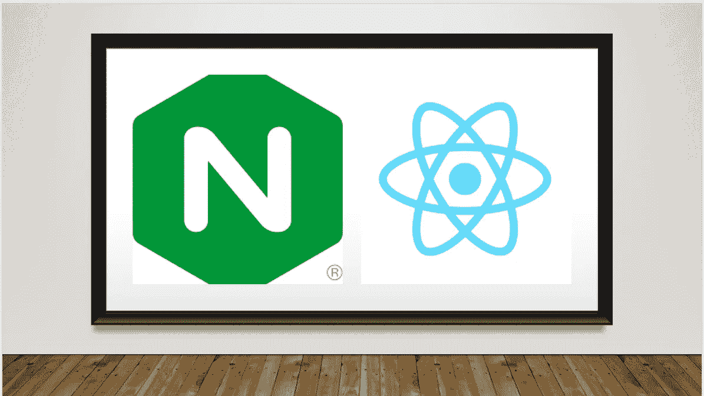
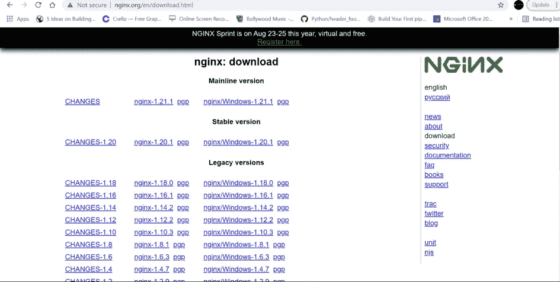
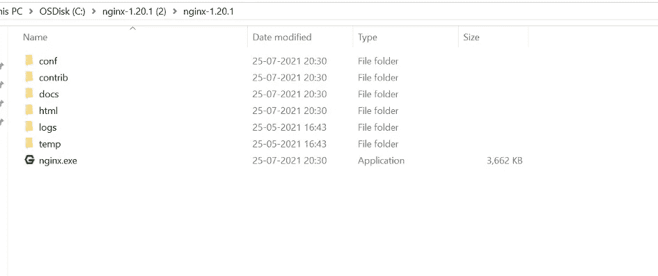

# 使用 NGINX 部署 React

> 原文：<https://javascript.plainenglish.io/deploying-a-react-application-with-nginx-45e84b91051e?source=collection_archive---------11----------------------->

## 用 nginx 托管 reactJS 应用程序

在本文中，我们将讨论使用 nginx 服务器部署 React 应用程序。



Deploy a React app with ngnix

**nginx 是什么？** nginx 是一款开源、免费的高性能 HTTP webserver，用于网站托管、反向代理、缓存、负载均衡。最初，它被设计为 we webserver，除了它的 HTTP 服务器功能之外，它还可以作为电子邮件(IMAP、POP3 和 SMTP)的代理服务器，以及 HTTP、TCP 和 UDP 协议的反向代理和负载平衡器。

**将 React 应用部署到 ngnix**

**第一步:下载 ngnix**
你可以从 ngnix 的[http://nginx.org/en/download.html](http://nginx.org/en/download.html)官网下载 ngnix



在您的服务器中解压缩 nginx，如下所示



**第二步:配置 nginx** 打开**../nginx-1 . 13 . 8/conf/nginx . conf "**，并在 http { … }部分中添加以下脚本。**“试试..如果使用散列位置策略，则不必更改文件"**。

```
server {
 listen 9090;
 server_name localhost;
location / {
 root html;
 index index.html index.htm;
 try_files $uri $uri/ /index.html;
 }error_page 500 502 503 504 /50x.html;
 location = /50x.html {
 root html;
 }
 }
```

**第 3 步:创建和构建 react 应用** 在这一步中，我们将讨论如何创建 React 应用

```
npx create-react-app react-deploy
```

请打开你的浏览器，输入你的 ip 地址**<http:your IP address>**

通过这篇文章，我们已经学会了使用 nginx 服务器部署 react 应用程序。

亲爱的读者，感谢您的支持和您宝贵的时间。我希望这是有用的，并有助于发现角度应用的基础。如果你喜欢这篇文章并在评论中留下你的想法，请鼓掌。

***请关注我，成为*** [***中的一员，获取更多文章。干杯！！***](https://medium.com/@technicadil_001/membership)

*更多内容请看*[***plain English . io***](https://plainenglish.io/)*。报名参加我们的* [***免费周报***](http://newsletter.plainenglish.io/) *。关注我们关于*[***Twitter***](https://twitter.com/inPlainEngHQ)[***LinkedIn***](https://www.linkedin.com/company/inplainenglish/)*[***YouTube***](https://www.youtube.com/channel/UCtipWUghju290NWcn8jhyAw)*[***不和***](https://discord.gg/GtDtUAvyhW) ***。*****

*****对缩放您的软件启动感兴趣*** *？检查* [***电路***](https://circuit.ooo/?utm=publication-post-cta) *。***