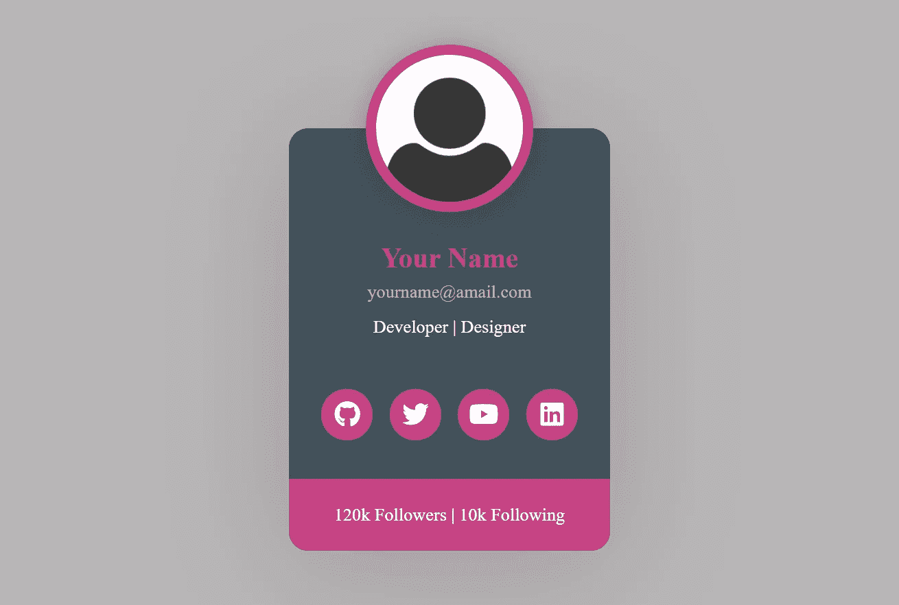
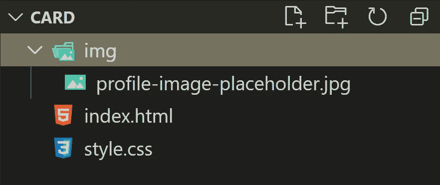
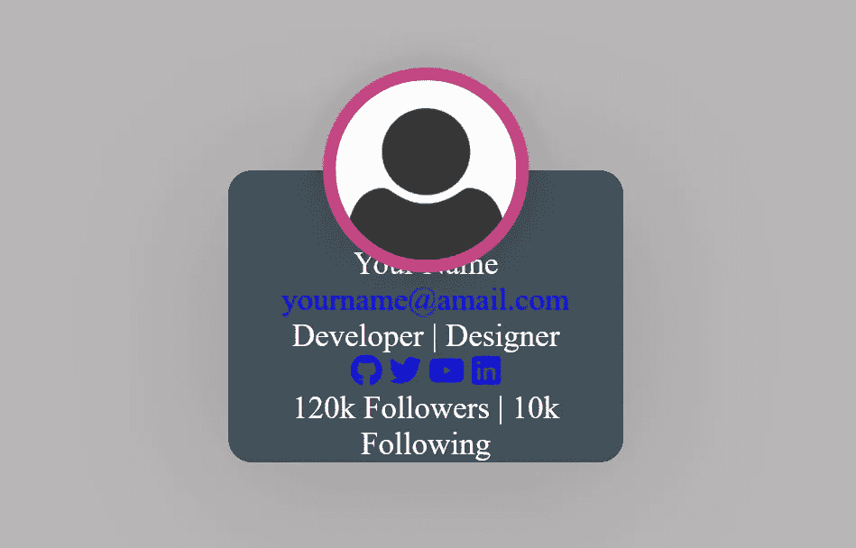

# 用 CSS 设计一个漂亮的简介卡

> 原文：<https://javascript.plainenglish.io/design-a-beautiful-profile-card-with-css-4407c558b733?source=collection_archive---------5----------------------->

## 使用一些简单的 CSS 为你的网站创建一个带有悬停效果的简介卡

Image by author

我们可以只用 CSS 为我们的网站做一些很棒的设计。在这篇文章中，我将向你展示我们如何制作一个带有一些很酷的悬停效果的简介卡片。让我们开始吧。

# 文件结构

在我们的项目文件夹中，我们需要一个 HTML 文件，一个 CSS 文件和一个文件夹来存储配置文件图像。

The file structure

# HTML

首先，我们必须制作基本的 html 结构。让我们把下面的代码放在`index.html`里面。

我们需要将 T1 添加到我们的 T2 中。我们还需要社交链接图标的`font-awesome`。

接下来是时候给我们的卡片添加样式了。从现在开始我们将使用`style.css`文件。

# 基本造型

首先，我们将添加一些基本的样式，将适用于任何地方。

如果没有 CSS，卡片看起来会像这样。我们会把它变成美好的东西。

Card without style

现在我们将添加背景颜色，字体大小，位置等。为了这张卡。

# 个人资料图像

然后，我们将添加样式到配置文件图像。还有一些简单的悬停效果。

现在，我们应该看到我们的卡发生了一些重大变化。它正在变成很酷的东西。

Profile image styling

# 卡体

`card-body`类包含姓名、电子邮件和职业。我们将为它们添加不同的样式。当然还有一些悬停效果。

更改后，卡片看起来会像这样。

Card body styling

# 社会联系

现在是定制社交链接的时候了。我们在 HTML 中使用了`font-awesome`作为图标。我们将使用 CSS 使图标变得漂亮。

看看图标现在的样子。

Social icons styling

我们的卡快好了。我们将添加一些简单的 CSS 到页脚，我们应该准备好了。

# 页脚

我们将对我们的`card-footer`类做一些小的改动。

之后，我们应该看到我们的卡的期望外观。

The final design

我们将通过一些媒体提问来完成我们的设计。

当在网站中使用此卡时，我们将不得不根据我们的需要更改媒体查询。也许我们需要多张这样的卡片。然后我们将在网格系统中使用它们。如何卡将在大，中，小屏幕上看起来，我们需要根据需要添加样式。

# 在 GitHub 上找到它

您可以在 GitHub 上找到代码，并将其用作我们项目的模板。请随意使用代码，并添加您自己的风格。

这里是 [**GitHub 仓库**](https://github.com/FahadulShadhin/Profile-Card) 你可以在这里找到代码。

该页面在 GitHub 页面上是实时的。如果你点击下面的链接，你会看到一个卡的现场演示，还有我在截图中无法展示的悬停效果。

*   [fahadulshadhin.github.io/Profile-Card](https://fahadulshadhin.github.io/Profile-Card/)

我写了一篇关于如何在 GitHub 上发布网站的文章。你可以在这里查看—

 [## 如何在 GitHub 上发布你的静态网站

### 免费在 GitHub 上托管一个静态网站

medium.com](https://medium.com/dev-genius/how-to-publish-your-static-website-on-github-c7797a1d8cfd) 

## 结论

我希望这对你有帮助。期待您的反馈和改进建议。感谢阅读。

*更多内容尽在*[***plain English . io***](https://plainenglish.io/)

如果你喜欢阅读这样的文章，考虑成为一个媒体成员。这样你就可以无限制地访问媒体上的所有故事。如果你使用我下面的推荐链接注册，我将从你每月 5 美元中赚取一小笔佣金。这样你就可以支持我这个作家了。

 [## 通过我的推荐链接加入 Medium-Fahadul shad hin

### 作为一个媒体会员，你的会员费的一部分会给你阅读的作家，你可以完全接触到每一个故事…

fahadulshadhin.medium.com](https://fahadulshadhin.medium.com/membership)