# 设计可扩展的 React 应用程序架构

> 原文：<https://javascript.plainenglish.io/design-extensible-react-application-architecture-1c491e9ed525?source=collection_archive---------2----------------------->

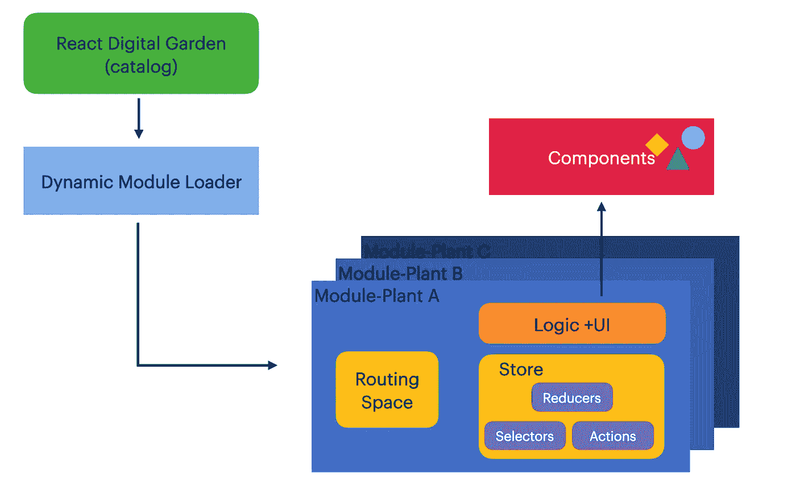

My Digital Garden Architecture ([https://onurdayibasi.dev/](https://onurdayibasi.dev/))

## 我的 React 数字花园

## 我开始为我的学习之旅建造一个数字花园。我尝试不同的组件、布局、算法、风格来提高我的前端技能。制作一个数字花园有一些困难和挑战。每个实验(我的数字花园中的植物)都必须被抽象和封装，并且可以重用。

在数字花园([https://onurdayibasi.dev/](https://onurdayibasi.dev/))中，我建立不同的 UI 实验并及时改进。实验(植物)将如何独立和扩展？

在讲建筑学之前，我想解释一些术语；

**数字花园**

> “数字花园”一词是对写作和创作的一种隐喻，它不太关注最终的“展示品”，而更关注实现它的过程、关怀和工艺。乔尔·胡克斯

**扩展性**

> **可扩展性**是软件工程和系统设计的原则，为未来的发展做准备。可扩展性是对扩展系统的能力和实现扩展所需的工作量的度量。(维基百科)

# 快速查找

在数字花园中，我开发了许多实验性的迷你应用程序，可以在其他迷你应用程序中重用。例如，下图是我的数字花园的第一页。我们需要两种类型的组件来构建这个页面:“导航卡”和“过滤按钮”

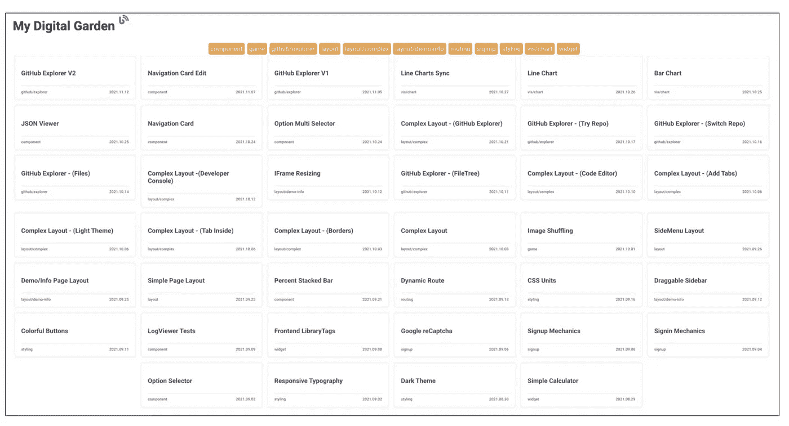

MainPage ([https://onurdayibasi.dev/](https://onurdayibasi.dev/))

我不直接开始开发这个页面。首先，我问一些问题。

*   导航卡和过滤按钮是可重用的组件吗？
*   我如何存储它们的状态？
*   如何开发泛型？

回答完这些问题后，例如，如果我回答这些组件应该是可重用的，我就写一个故事/用例。首先，我为 NavigationCard 迷你应用程序打开了一个实验沙箱，它抽象了其他应用程序。然后我写一个故事。

> 我需要一个包含标题、标签和出版日期的导航卡。当用户将鼠标放在上面时。可以悬停。当用户单击此导航卡时，它会将用户重定向到内部或外部页面。

首先，我准备测试数据，用 react 组件进行渲染，并生成一个简单的 NavigationCard 结果。

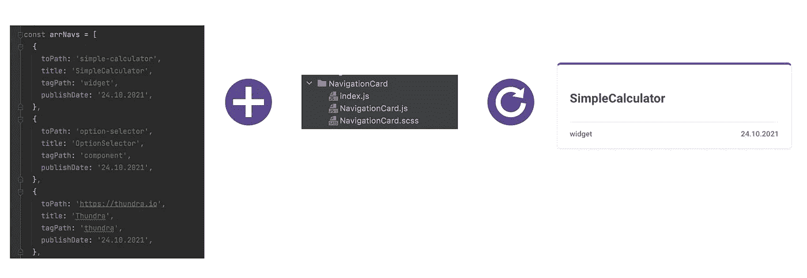

render (Data + Component) = SimpleCalculator

在我们抽象的沙箱中，我尝试了组件的所有可能性和情况。在下图中，你可以看到内部链接和外部链接卡

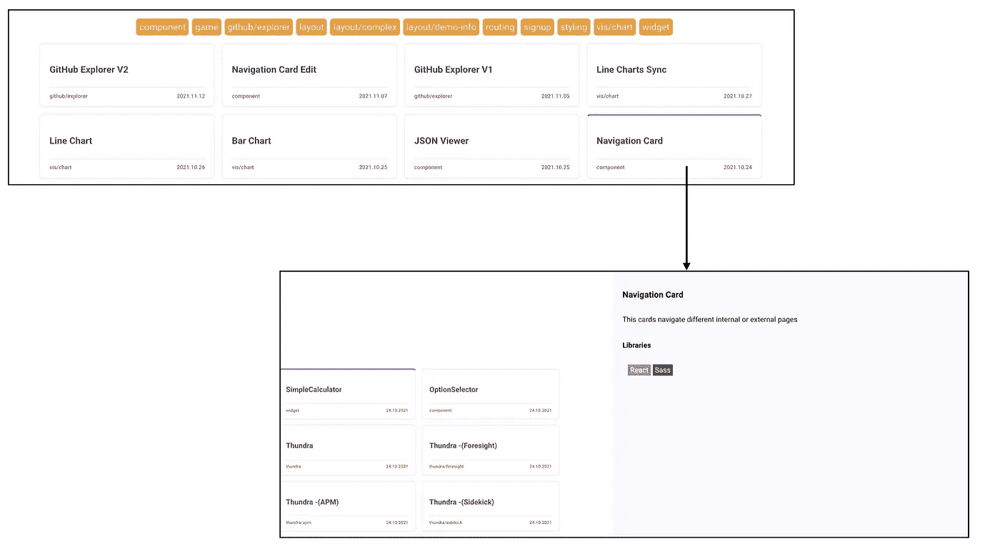

Navigation Card ([https://onurdayibasi.dev/navigation-card](https://onurdayibasi.dev/navigation-card))

我们将同样的技术应用于过滤组分。首先，我们创建自己的沙盒，并思考如何做出一个例子。

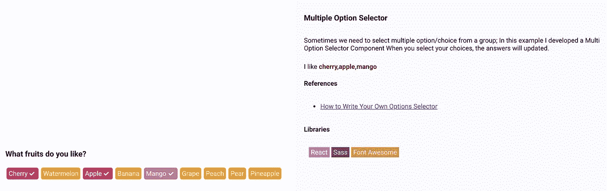

Multiple Option Selector ([https://onurdayibasi.dev/option-multi-selector](https://onurdayibasi.dev/option-multi-selector))

毕竟，我们可以在主页上使用 *NavigationCard* 和 *MultipleOptionSelector* 。我们应该分别考虑每一个组成部分。主页只知道所有的逻辑。

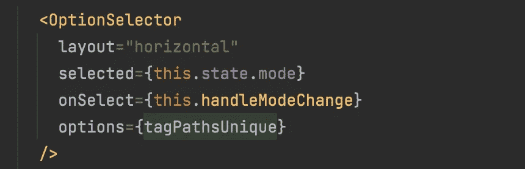

OptionSelector Render

Navigation Cards Render.

在导航卡呈现之前，它们根据 OptionSelector 状态进行排序和过滤。

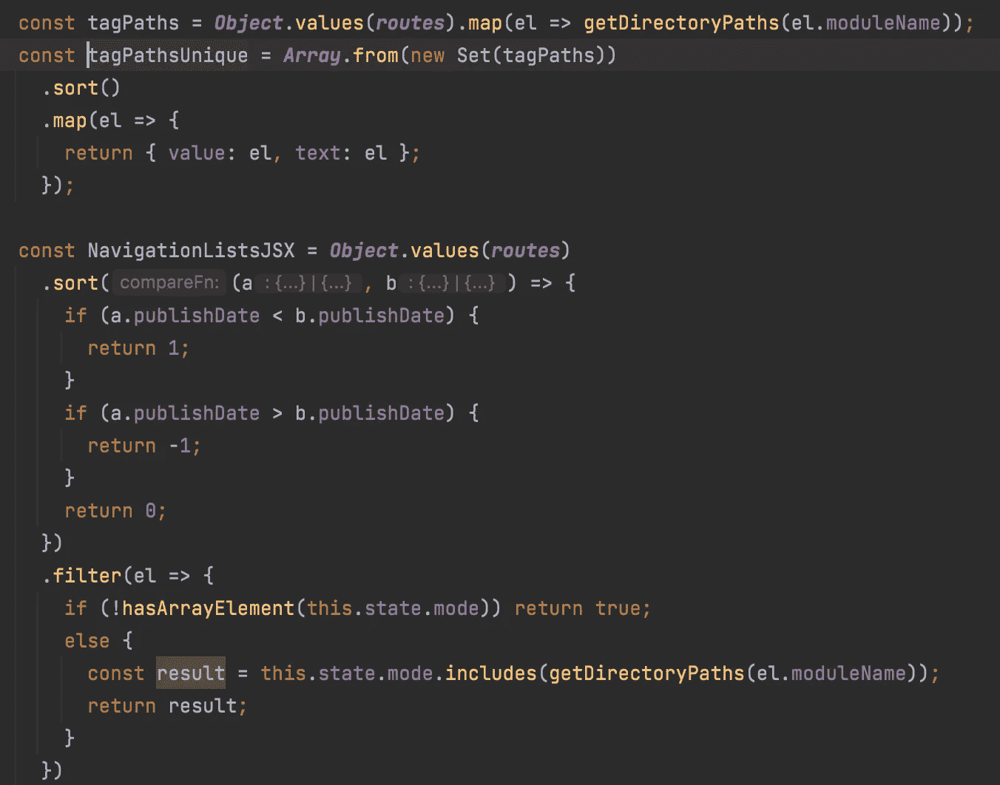

Navigation Cards sort and filtered

在上面的部分中，我试图告诉你我在开发新东西时是如何思考的。但是在后台，我们需要一些架构为我们提供一个抽象的沙箱。

# 背景(建筑)

我们需要一个抽象的沙箱，这样我们的迷你应用程序就不会互相影响。下面，建筑告诉我如何开发我的动态环境。

My Digital Garder Architecture

# 动态模块装入程序

当用户点击导航卡时，每个模块(迷你应用程序/实验/工厂)都应该延迟加载，并在该时间后重定向模块加载。但是怎么做呢？

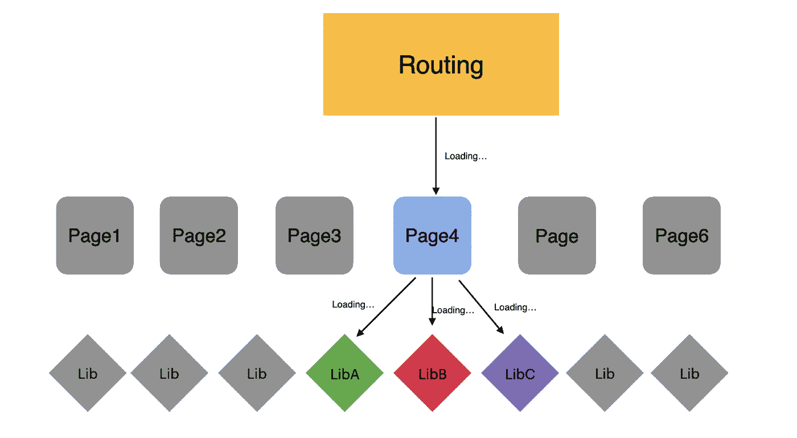

Lazy Loading

React Lazy 提供了通过暂停包装来延迟加载组件的功能。所以首先，用 React Lazy 定义你的路由。

> [*https://reactjs.org/docs/code-splitting.html#reactlazy*](https://reactjs.org/docs/code-splitting.html#reactlazy)

*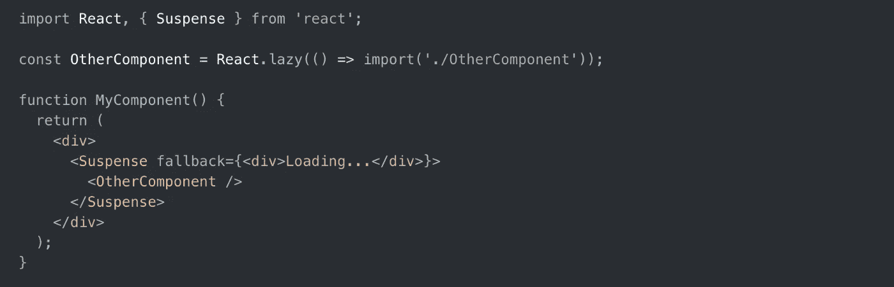*

*React Lazy Code Sample from Reactjs.org*

*首先，我们定义路线数据，并将所有路线提供给应用程序。我用惰性导入更改路由代码。更改 lazy 后，不需要定义静态页面，因为 **Route** 也可以通过编程获取组件。当用户点击带有相关迷你应用程序的导航卡时，应用程序会呈现详细信息*

*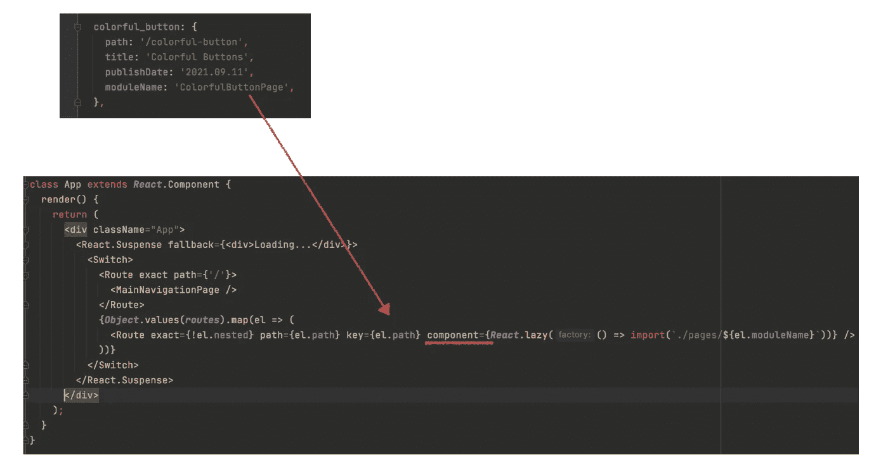*

*[https://onurdayibasi.dev/](https://onurdayibasi.dev/).*

# *路由空间*

*Evey 迷你 app 需要自己的路由空间。这个空间只有迷你 app 知道和管理。但是怎么做呢？*

*针对这些，我开发了一个 [*动态嵌套页面和路由生成*](https://onurdayibasi.dev/dynamic-route) 的例子来创建你的页面。*

*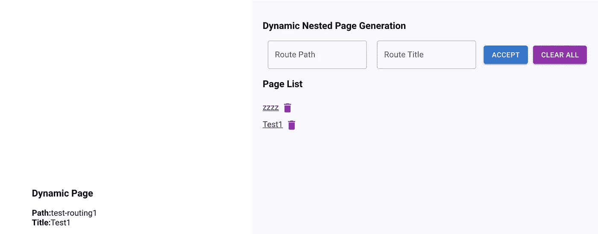*

*Dynamic Route Generation ([https://onurdayibasi.dev/dynamic-route](https://onurdayibasi.dev/dynamic-route))*

*我用 React-Router v5 路由*匹配。路径*和*路线。*能够在迷你应用程序中定义子路线。*

*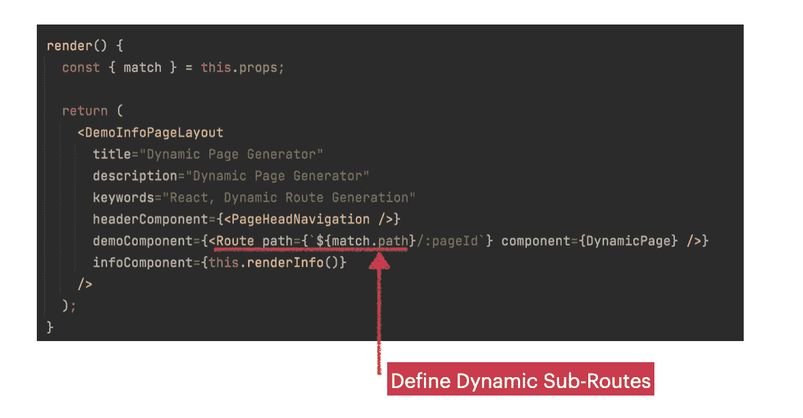*

*Define Dynamic Sub-Routes*

# *商店空间*

*我用 ***redux*** 来管理客户端 app 状态。在我们的例子中，我们需要将所有存储在一起的模块分开。例如，上个月，我开发了 4 或 5 个不同的 GitHub Explorer 迷你应用程序，以及它们存储 GitHub 回购信息的需求。当我们看 Redux Store 的时候，所有的模块都会分开。*

*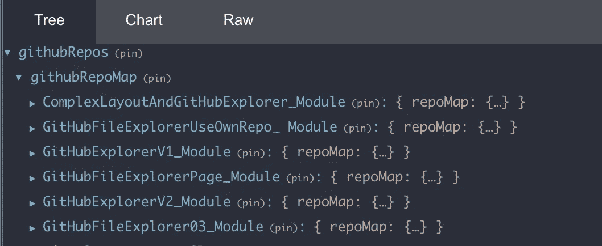*

*GitHub RepoMap*

*当用户单击导航卡时，相关模块将 GitHub 树加载到 GithubRepoMap。*

*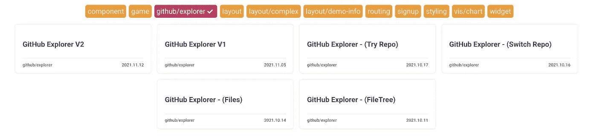*

*GitExplorer Examples ([https://onurdayibasi.dev/github-explorer/v2](https://onurdayibasi.dev/github-explorer/v2))*

*为了识别 RepoMap，我们需要将模块标识符传递给 reducers。我使用**redux*动作。*meta**给还原者赋予标识符。*

*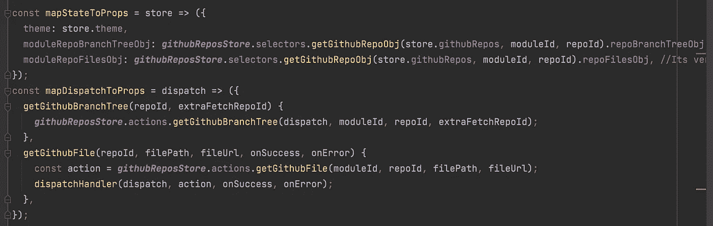*

*Module Identifier In Redux*

# *让我们继续阅读😃*

*你可以在这个链接 找到类似的样本和著述 [**。如果你喜欢这个故事。请👏👏和分享。**](https://onurdayibasi.com/react-lab/?39b495f1c74)*

## *延伸阅读:*

* [## 可扩展的 UI 组件

### 我最近受命为 bit.cloud 平台构建一个用户卡组件。我还负责建造…

比特云](https://bit.cloud/blog/extendable-uis-how-to-build-better-uis-for-developers-l1jkl1pc) 

*更多内容请看*[***plain English . io***](https://plainenglish.io/)*。报名参加我们的* [***免费周报***](http://newsletter.plainenglish.io/) *。关注我们关于*[***Twitter***](https://twitter.com/inPlainEngHQ)[***LinkedIn***](https://www.linkedin.com/company/inplainenglish/)*[***YouTube***](https://www.youtube.com/channel/UCtipWUghju290NWcn8jhyAw)***，以及****[***不和***](https://discord.gg/GtDtUAvyhW) *对成长黑客感兴趣？检查* [***电路***](https://circuit.ooo/) ***。******