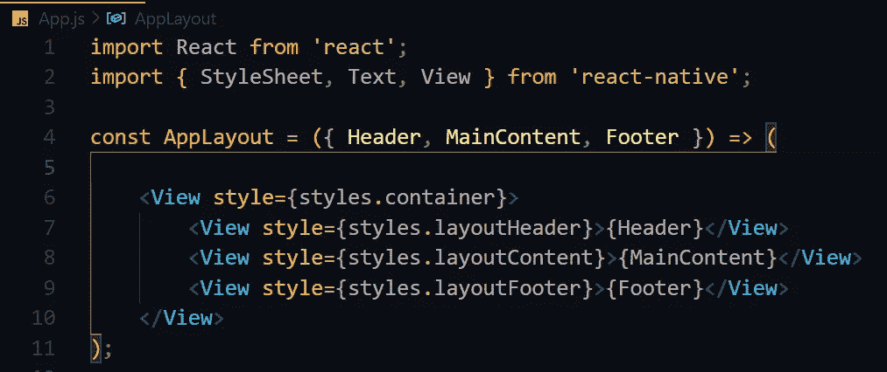
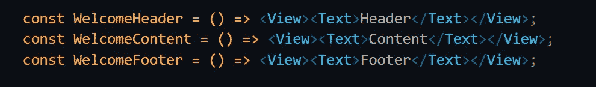
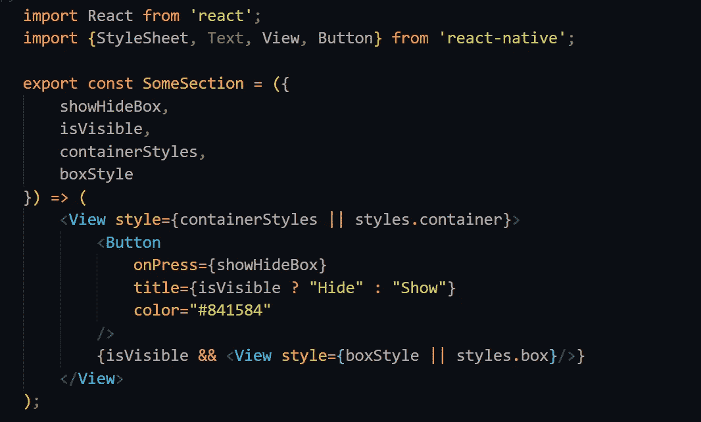
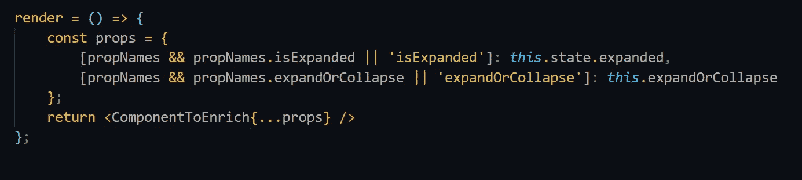

# React Native 中的设计模式:组件模式

> 原文：<https://javascript.plainenglish.io/design-patterns-in-react-native-component-patterns-785d585ac3f?source=collection_archive---------8----------------------->

## 学习在 React Native & More 中创建可重用的表示组件

开发 Android & **iOS** 应用程序对于向最终用户交付合适的产品来说从未如此简单。 **React-Native** 自推出以来彻底改变了这个问题，了解 React-Native 中的设计模式是开发人员应该知道的基本技能。在 React-Native 生态系统中，我们设计应用的方式总是更容易，因为由于有大量的社区支持，你可以很容易地选择其他优秀开发人员所做的一些工作。我将讨论 React-Native 中的一些设计模式，它们将帮助您用示例编写更易维护的代码。

# React-Native 中的组件

React 大部分时间都在使用组件，以正确的方式编写组件非常重要，因为你开始制作真实世界和更大的应用，这些应用需要长时间的实际维护。专业开发人员仍在使用这些实践来制作令人敬畏的 React-Native 应用程序，我也将讨论为什么在我们的例子中学习 React 或 React-Native 中的设计模式如此重要

当谈到组件时，使它们可重用是非常重要的，因为随着时间的推移，你会发现每次都很难制作新的组件用于其他地方，并最终遵循众所周知的程序员原则- **不要重复自己(干)。表示组件就是用来做这个的。**

## 我将在本文中讨论以下实践:

1.  ***无状态和有状态的组件*** ，有更短更复杂的例子。
2.  ***创建易于配置的表示组件*** 。
3.  ***容器组件。***
4.  以及如何创建(***【HOC】)***-**高阶组件。**

# 无状态和有状态组件

如果您使用**Create React-Native App(CRNA)**创建一个简单的 React-Native 项目，您将会看到简单的 React 组件已经写入文件 ***App.js*** 中。该组件是使用 **ES6** 中引入的类语法创建的，此类组件称为**类组件。**

***你可以深入看看下面的例子:***

**Class Component**

类组件可以用来创建有状态组件，在这种情况下，类组件是不必要的，我们可以使用无状态组件来代替。

> 让我们了解如何将它转换成一个**无状态组件。**

最常见的方法是通过使用***【ES6】***箭头语法，因为这样的组件被称为**功能**组件。 ***(如果不习惯箭头语法，可以使用常规语法)***

**Functional Component**

想到的问题是为什么**无状态**？因为它不包含任何内部状态，这意味着我们没有在其中存储任何私有数据，组件呈现的所有内容都是从外部世界提供的，在这种情况下，组件并不关心这些。

到目前为止，我们没有向组件传递任何类型的外部数据。为了传递一些数据，我们将创建另一个名为 ***HelloText*** 的新组件，它使用属性来显示一些文本。为此，用于将文本传递给这种组件的通常惯例是在开始和结束标记之间放置一个文本，

例如: **< HelloText >待传文本< /HelloText >**

但是要在我们的功能组件中检索这样一个道具，我们仍然需要使用一个名为 ***子*** 的特殊键。

在我们的功能组件中实现了这些道具之后，它看起来会是这样的:

**Functional Component With Props**

使用**子**道具使得 **HelloText** 组件更加强大，因为道具是灵活的，你可以发送任何有效的 **JavaScript** 类型。在这种情况下，我们只发送了一个**文本**，但是您也可以发送其他组件。

现在是时候给我们的组件添加更多的功能了，我们将在按下标题文本后展开第三个文本块。为了实现这个功能，我们需要存储一个**状态**，它会记住组件是展开还是折叠。

## 以下是我们需要做出的改变:

1.  首先，我们需要将组件更改为一个**类语法。**
2.  为了利用 React 库中的状态对象，我们必须在类构造函数中初始化状态，并在默认情况下使**文本**折叠。
3.  给组件 ***添加条件渲染*** 功能。
4.  添加新闻处理程序，一旦我们点击标题或文本，它将改变状态。

在这里做了这些更改后，我们的代码看起来会是什么样子。

> 现在为了理解设计模式，我们将做一些更有挑战性的事情(任务列表)

要创建以下功能，构造函数应该在其状态下初始化任务列表，在本例中，任务列表将是一个字符串数组。它将迭代任务，为每个任务&创建 ***文本*** 组件，这应该发生在**应用**组件的渲染函数中。

**注意，您可以简单地使用 map 函数迭代，而不是使用 *for* 循环。**

> 在这里做了修改后，它看起来会是什么样子。

# 为什么是无状态组件？

您可能会选择使用有状态类组件，并用它开发一个完整的应用程序，但为什么我们还要为此费心呢，答案是性能。无状态功能组件可以更快地呈现，因为无状态功能组件不需要一些生命周期挂钩。

> F 功能性组件速度更快，在大多数情况下都优于扩展***react . pure component .***的类组件

# React 中的成分组成是什么？

在任何其他的 **OOP** 语言中，你必须广泛使用继承。但是在 **JavaScript** 中，继承是基于 **proptypes** 的，我们称之为**原型继承。**功能不会复制到对象中，而是从对象的原型中继承，甚至可能通过原型树中的其他原型继承。

在 *React* 中，继承不是一个非常常见的概念，因为我们有组件，这里我们采用另一种模式，称为**组件组合。我们不是创建一个新类并从基类继承，而是创建一个新的父组件，它将使用它的子组件来使自己更强大。**

例如:

**Component Composition**

**App** 组件是使用: **View，Text & WarningText** 构建的，这是一个完美的例子，展示了一个组件如何通过组件组合来重用其他组件的功能。

**警告文本**组件使用合成来使用**文本**组件中的橙色文本颜色，这使得通用**文本**组件更加具体。我们现在可以在应用程序中任何需要的地方重用**警告文本**。

> 如果你正在做一个真正的 **React-Native 项目**并且设计师打算改变颜色，你可以使用这些**设计模式**实践来快速适应新的设计。

# 撰写应用程序布局

我们将在应用程序中创建一个简单的欢迎屏幕。

分为 3 个部分:

1.  **表头。**
2.  **主要内容。**
3.  **页脚。**

目的是为登录用户和匿名用户创建一致的边距和样式。要创建这样的组件:

1.  创建执行某些样式的 **AppLayout** 组件，它应该接受三个道具: ***header，MainContent & Footer。***

2.现在我们将为页眉、页脚和内容创建占位符。这些被命名为 **WelcomeHeader，welcome content&welcome footer。**

3.现在我们必须将 **AppLayout** 与我们的占位符组件连接起来，并创建 **WelcomeScreen** 来将占位符组件作为道具传递给 AppLayout。

4.在为我们的应用程序的根组件创建一些样式的最后一步。

**WelcomeScreen**

# 表示组件模式

现在，我们将学习创建可重用的组件，使它们可以灵活使用，为了实现这一点，最好的模式是 ***表示组件模式。***

> 如果你在某个地方熟悉使用 Redux，那么你一定经常听到这个模式。

每个网站都有 3 个主要模块: **CSS，HTML & JavaScript。然而，在 **React** 中，方法有点不同，因为基于 JavaScript 的 HTML 自动生成使 HTML 变得虚拟。(你可能听说过**虚拟文档对象模型——虚拟 DOM)。****

概念的分离——HTML、CSS 和 JavaScript 应该只存在于 JavaScript 世界中，这就是为什么我们使用表示组件来模拟逻辑的 HTML 和容器组件。要理解这一点，请看下面的例子:

**Presentational Component**

1.  我们将标记移到了单独的表示组件中。
2.  之后我们更换了**渲染**功能。

但是，如果您运行代码，您将在 **HelloText** press 事件上收到一个错误，这是由于 **JavaScript** 如何处理 ***这个*** 关键字。我们将 **expandOrCollapse** 函数传递给另一个对象，这里 ***指的是一个不同的对象(它不能访问状态的原因)。***

> 为了解决这个错误，我们将坚持使用箭头函数，考虑到应用程序的最佳性能，这是最好的方法。

> ***所以现在我们成功地将一个组件重构为两个(一个负责表示，一个负责逻辑)。***

# 分离风格

在上面使用的例子中，样式与表示组件紧密耦合，因为我们通过使用 **style={styles.container}** 显式地包含它们，因为样式对象是不可配置的，所以我们不能替换任何**样式道具**。在某些情况下，这是理想的实现，但这对开发人员来说是一个麻烦，因为他们必须查找特定的**样式道具**来进行任何进一步的新更改。

为了解决这个问题，我们将使用的方法是非常可取的，那就是使样式成为可选的道具，如果没有提供样式，我们可以回到默认值。

观察 **||操作符**在 styles ***(conatinerStyles | | styles . container)*中的使用。**它首先检查 **conatinerStyles** 是否被定义，如果它没有返回任何值，那么它返回 styles.container，默认情况下这是我们硬编码的。

**Decoupling Styles**

# 高阶组件(HOC)模式

这种模式的存在是为了用额外的道具或功能来增强组件，或者如果你想让它们变得可有可无。

我们不只是创建一个有状态容器，而是使用 HOC 模式来实现，让我们将**有状态**容器组件重构为一个 HOC，并将其命名为 ***makeExpandable。***

**HOC**

makeExpandable 组件接受 ComponentToEnrich，因此我们可以创建一个根组件(App ),如下所示:

> **导出默认 make expandable(hello box)；**

为了更好地理解这一点，我们创建了一些其他组件，并用我们的 **HOC** 来丰富它，它将是一个显示文本 hide 或 show 的小按钮(它将显示或隐藏一个小的彩色框)。

以下是解决方案:

**HOC Hide Button**

在前面的示例中，SomeSection 组件由 **makeExpandable** HOC 包装，并接收 **isExpanded** 和**expander collapse**属性。

***为了让它更加灵活，我将使用一个非常有用的技巧:***

例如，我们有一个包含以下属性的组件:

使用以下渲染模式:

这部分有点棘手，因为它提供了重命名传递给 HOC 的属性的能力，要重命名它，我们需要传递一个名为 **propNames** 的配置对象给 HOC，如果传递了这样一个对象，并且它包含 s key，那么我们覆盖这个名称。

此外，我们必须确保在 ***渲染*** 函数中创建变量时的性能影响，因为这会降低应用程序的速度。

使用模式可能会牺牲一点性能，但有时不会，所以要明智地使用它们。

**感谢阅读；**