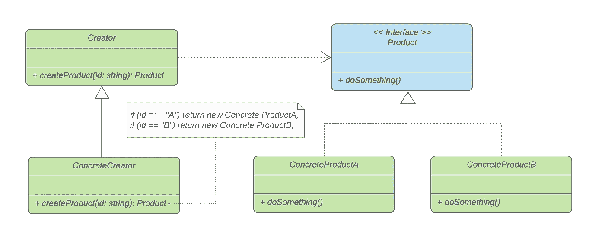
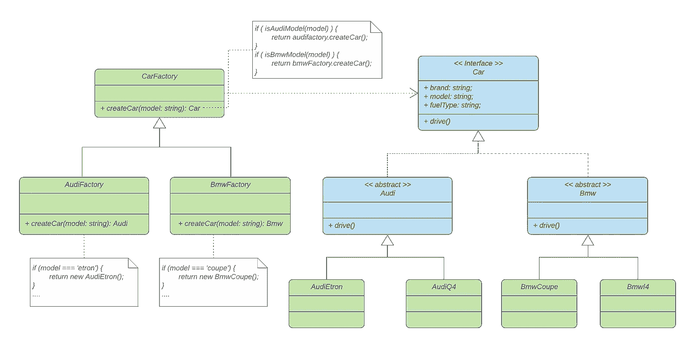
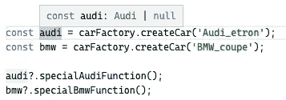
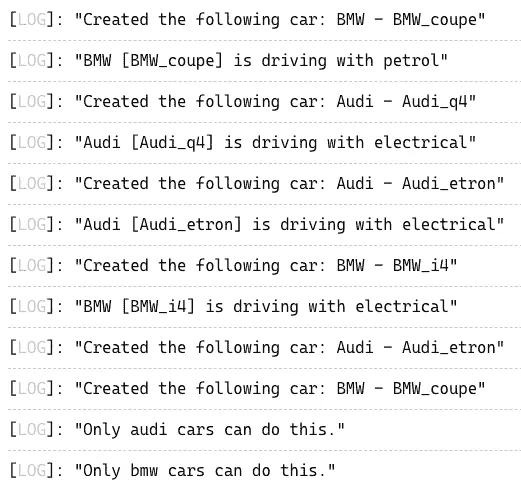

# 带有类型脚本示例的设计模式:工厂方法

> 原文：<https://javascript.plainenglish.io/design-patterns-with-typescript-examples-factory-method-4d145887b141?source=collection_archive---------2----------------------->

## 工厂方法有助于将程序 p **到接口，而不是实现**。

Photo by [Tom Fisk](https://www.pexels.com/@tomfisk?utm_content=attributionCopyText&utm_medium=referral&utm_source=pexels) from [Pexels](https://www.pexels.com/photo/aerial-view-of-the-biggest-sugar-factory-in-asia-5470452/?utm_content=attributionCopyText&utm_medium=referral&utm_source=pexels)

**创造**工厂方法模式是最流行和最常用的模式之一。在本文中，我们将详细阐述该模式的目的和结构，并通过一个实际的例子解释如何使用它。此外，我们将使用高级的**类型脚本**创建一个代码示例。

# 什么是设计模式？

设计模式是针对不同环境中反复出现的问题的通用的、可重用的解决方案。在软件工程中，他们帮助你更快地写出更好的代码。使用这些通用解决方案可以节省我们的时间和工作，因为我们重用了许多其他开发人员积累的知识和经验。

> “[……]对我来说，遇到没有听说过模式运动的开发人员是不常见的”“ *Grady Booch 在* [设计模式:可重用面向对象软件的元素](https://amzn.to/3i6iIIk)

也许你做了多年的程序员，却没有应用甚至不知道任何一种模式。我敢打赌，许多开发人员正是这样做的。如果是这样，我强烈推荐你先阅读这篇文章，让你的大脑相信软件设计模式是必不可少的。

 [## 为什么你必须学习软件设计模式

### 设计模式让你更快地写出更好的代码。

javascript.plainenglish.io](/why-you-must-learn-software-design-patterns-befd77f88713) 

## 模式的类别

1994 年，由 Erich Gamma、Richard Helm、Ralph Johnson 和 John Vlissides 四位作者出版了《设计模式:可重用面向对象软件的元素》一书，这本书也被称为“四人帮”。

尽管这本书是在 25 年前出版的，但它仍然是与软件工程最相关的书籍之一。阅读它可能是丰富您的开发人员工具包的一笔可观的投资。假设你喜欢不会让你睡着的读物。既然如此，我先推荐 [***头像图案由 Eric Freeman***](https://amzn.to/3Q9O6Ch) 设计。这本书以视觉丰富的形式解释了四人帮(g of)描述的 23 种设计模式，“为你的大脑工作方式而设计。”

如上所述，**四人帮(GoF)** 定义了 23 种设计模式。为了组织他们，他们把他们分成三类:**创造性的**、**结构性的**和**行为性的**。

> "**创建**模式关注对象创建的过程。**结构化**模式处理类或对象的组成。**行为**模式描述了类或对象交互和分配责任的方式— [设计模式:可重用面向对象软件的元素](https://amzn.to/3i6iIIk)

这里是由 GoF 定义的所有模式的概述。另外，看看我的其他文章，在表格中有链接。

如果你更喜欢通过视频课程学习，我推荐你查看 Skillshare 上的这个 [**Typescript 设计模式课程**](https://skillshare.eqcm.net/vnLkyj) 。它涵盖了所有 23 种 GoF(四人帮)设计模式，并教你如何使用 TypeScript 实现它们。

 [## TypeScript 中的设计模式

### 解锁无限制访问此技能共享课程以及由来自世界各地的创作者讲授的数千门课程…

skillshare . eqcm . net∨](https://skillshare.eqcm.net/vnLkyj) 

# 工厂方法模式

从表中可以看出，工厂方法模式被归类到**创建**模式的类别中。考虑到这一事实，它的目的必然在于对象的创建过程。

## 目的🎯

也许你听说过这句话:**编程到一个接口，而不是一个实现**。这意味着我们应该关注代码做什么，而不是我们如何实现它。

遵循这条规则将你的代码从实现中分离出来，这使得它成为“松散耦合”。解耦的代码不依赖于具体的实现，这对于编写易于维护的代码是必不可少的——**干净的代码**。

> 当两个对象松散耦合时，它们可以交互，但是对彼此了解甚少— [由 Eric Freeman 首先设计的头像图案](https://amzn.to/3Q9O6Ch)

糟糕的反例是紧耦合代码。将代码绑定到具体的类会使它更脆弱，灵活性更差。

> "制作对象不仅仅是使用新的操作符."—[Eric Freeman 的 Head First 设计模式](https://amzn.to/3Q9O6Ch)

工厂方法模式的目的是为创建对象提供一个接口。通过这种方式，我们对一个接口进行编程，使我们的代码松散耦合。此外，我们遵循开闭原则，因为我们总是可以在不改变现有代码的情况下添加新类型的对象。

> "定义一个创建对象的接口，但让子类决定实例化哪个类。工厂方法让类将实例化推迟到子类。— [设计模式:可重用面向对象软件的元素](https://amzn.to/3i6iIIk)

## 适应性💡

每当一个类不能预见它必须创建的具体类时，就使用工厂方法模式。这将对象的创建与代码的其余部分分离开来。

## 结构📐

当应用工厂方法模式时，有不同种类的结构。我们将构建一个参数化的工厂方法，该方法采用一个参数来标识要创建的对象的种类。

> 参数化工厂方法。该模式的另一个变化是让工厂方法创建多种产品。工厂方法接受一个参数，该参数标识要创建的对象的种类。工厂方法创建的所有对象将共享产品接口。— [设计模式:可重用面向对象软件的元素](https://amzn.to/3i6iIIk)

Factory Method structure

工厂方法的结构很简单。它包含一个声明工厂方法的`Creator`类。这个方法负责返回匹配公共`Product`接口的对象。因为我们使用了参数化的工厂方法，它将一个`id`作为参数，有条件地实例化一个正确的`ConcreteProduct`类的对象。每个`ConcreteCreator`类都可以覆盖`createProduct()`方法。

> “重写参数化工厂方法使您能够轻松地、有选择地扩展或更改创建者生产的产品。您可以为新产品引入新的标识符，也可以将现有的标识符与不同的产品相关联。”— [设计模式:可重用面向对象软件的元素](https://amzn.to/3i6iIIk)

## 参与者🚻

从结构中，您可以派生出以下参与者:

*   **创建者:**声明工厂方法，返回与公共`Product`接口匹配的对象
*   **ConcreteCreator:** 覆盖`createProduct()`工厂方法以返回一个`ConcreteProduct`类的实例。
*   **产品:**定义工厂方法创建的对象的接口。
*   **ConcreteProduct:** 实现了`Product`接口。

## 真实世界的例子🚗

Photo by [Vlad Alexandru Popa](https://www.pexels.com/@vladalex94?utm_content=attributionCopyText&utm_medium=referral&utm_source=pexels) from [Pexels](https://www.pexels.com/photo/photo-of-audi-parked-near-trees-1402787/?utm_content=attributionCopyText&utm_medium=referral&utm_source=pexels)

想想汽车。你想订购一辆新车。汽车还没有造出来，需要相应的工厂来造。工厂取决于汽车的品牌和型号。

你会去当地的零售商，告诉他你想买什么样的车。他将订购汽车，某个工厂将负责制造汽车。看看这个例子的结构。

Car factory structure

注意，我们有一个`CarFactory`类，它是我们的创建者，包含工厂方法。我们可以用现有的所有汽车模型来调用它，它会使用相应的 ConcreteCreator。在这个例子中，要么是`AudiFactory`类，要么是`BmwFactory`类。这些将为给定的汽车型号创建正确的汽车。

我们的产品类是`Car`接口。我们的产品分为两个抽象类别。`Audi`和`Bmw`级。具体产品是每个汽车品牌的具体车型。

让我们通过将它应用到一个使用高级 TypeScript 特性的示例来分解它。

## 代码示例💻

让我们从现实世界的例子中建立汽车工厂。看一下代码。你也可以在 [TypeScript 游乐场](https://www.typescriptlang.org/play?#code/C4TwDgpgBAggrgEwJYCEBOBDAdgqBeKAcnmUIG4AoUSKFAWwHd1tcDCUBZAdXKvGmY4AzvliJUmHFAA+tRoISVq0AMIY0HAPYIIAGwA8CqBAAewCMNqSEQgHyiABgBIA3goC+AfVdDgaJFgA5u4OSvxQAGJwegAq4Wx6EADGfkhJGLqEMkSQfpqZYTQkSGoa2noiBM4uxR6eEHlYDtnVtdZeAI4ALKF8NPQMpVo6upVQ1QN1SZpwkM2yE-Ltnkg9hdAwurpD5aOixTsjIrIDhxWUfdDDsZqlCvrXusZmFjawW2ej9ngUUH9Qj2e5ksB3UjxEAH4xMgoAAuX7-QGmYFvU5g3aQuQMOEIv4DbLFC4BcxoABmGCS0AAkqUIhTgJo0CAHrsga8RJttuijvYXLioEk0BAMOZSrCoAAKOi7cWPACU+Hsjxit3U90e9lkWDgWwo7goFAA9AAqY2-Y1QGIACyQIltUBmaCgKiFIsZ5sNFCSugwQhEtPpjJAUCQdDAuggdAswBENPUdJSQf0nM+digfP+UDA-gAbiLoBhxAmGUzRFgINjisWgxK5ZRM9mkHnzFAAEaMaulgjl7EDTsgWsXBu5-MhoQAZUgSSQpLSjxZIzZII+3Iqtgl6TKI3FKdXowANFBfOoY1wkMAreLfP4gnLxZvAfbARnM-8hcA4GgsAK9wA6Y9oKe55WhKAFARedb8vq-KCsKorqAuehLm8u5bmuG57rKux3gCuwqnc1iIbompQNqWzpgar7-DOkoXrav62pOyQznOuzJuIqbrg+uyHsQ4iEHKCovlRmbvp+350UIv6Fsg-a-rB+alBhaG6Aqvq4SM+FqoRGr1iJ0EiSGpK0TaUmMVOLFJPOaIqXYymPLxnA8IJFGGaJDTiVAkm-u2DByQp8FoPZ2FQOpyqqmg6q7LYelUQZIliV+pE6rosVQNB0EmmaUAWta9r2hgzqaFgsGiq6JYel6Pp+tCSD9iGYYRlGWAxlAcZoP27HIJxrn-AFEBKdx261amOHFNkZFPMJr5CAw55JFakpDXoQn8oZ6RCNAfHIPUjSEPCbkJR5SU9rVACijSDmtIkbVtxSeN0+3XYdiXfqdxQAIpdFdh1-Do5I6sAB2-e5H4nSlaWZvqUMGplprmpapljqFRUle+A3le6OWet6voiH2galqG4aRtGsYBomTKGIwPV8jB5UDeowXDTZ4I4fiWopRRz1HnNwALUte6rSDt1EE5njTLMEBPSDoOeadpwzJAP2-aL7DcCsXQy7LfyvaRFZYlS32QSD-2FroQM84ZeuTZD-zQ-bsMGllCN5XaIiOlAAAKaDaHAKSVRgrbXvSArVf6CFGMi7JWCwabTdMWDXv7JYSmAcCtroaRttY4oKIe6eZ9n0rDZ8hjWLYBcZ1nSRQKS0S6HEkDilEsT8MLN3FUI+QQL+uiaIEEoOC6cEQLgF7QKS+T93NQQ-mg4quK27RQAAtFArjeSXeghCbjv8oXNdQAguYQLWvVUYn3cRn3A9D5vpk+SvADaD-0dvujuAAusjJ9NgEgQoB80Wm-KS9c26QF3mlfU0EDRBxDikMOeNarIQjmgLqEgWC8hgl3PwKdGRp2rsXGUzo9wYIUJXLMRDa7gMbvwFuDcm4QA7lRIQUsgrbSQIQQ8H9Dy0KYXvP48U-iH2zkICyGQqxwBKsAJAxVz7TUzFfHut9B6EAAPJYF0MGGSSB54iHSN+BAmgvJWjgPRASUE9TO3hjlRG+URCFRUMVUqEAfZ+wDtjKqyDPpdFQSghOuC0D4KCiwma7CJScIelrXiiQUj+HSJkQR6VrFGlsblJGBVUauPcQgFOlVcY1WKBdX235o4gnEBfAUQSQkKJ5mwyAHD7oNFKdwogcTUiJIEtA1J8C-Ch0KfjRg-jSjUyYBXKpV88GU0IUXWuH9xRl0mBXKucy66MPoZEDZkAwmZgaRADhTk2m8PWRA5hPSD7UKPBI3QfZpEpDkVgOp60u4qP7mozR2i2zDM3AY7Ax8THeUsTDOG2UMkOJRs4tGDQ3G+zyZ440ONw6Gz8eU1EwzAlJ2manXZ-x9mHI1qsNphAOkJIyN0qxoLXaZMcdk9GuT8leMGViZxUt-H4kxcnGZuK-j4sieLSWkBiW5F9kknp0Epnz3qt2A2FMSwDkgl6XB89wQ7hXLZZ+P8CDP3VlwCWStpa8Xuo9I14hdqtMcoSrWX8LiSt+aIZaoxfx0AwGAKUrI8D2E3P5BmSkP5yghL+P+OYz6CVtcq3RDr4yExAPJX1TMoktOKhSyVvko0dRjXG0eSldX6qlhSigujA3iOYpIos9zZHyMgr5YtNy7kyMeVdA0BogA)里拿着它到处玩。

注意，我们使用了高级的类型脚本特性，如 [**类型守卫**](https://medium.com/@mariusbongarts/advanced-typescript-with-code-challenges-type-guards-a5b24bb6d46b) 和 [**条件类型**](/advanced-typescript-with-code-challenges-conditional-types-8dd4e63818a5) 。这使我们能够在开发过程中推断出正确的类型。

Type safety

例如，当调用`factory.createCar('Audi_etron')`时，我们可以直接看到我们将从抽象类`Audi`返回一辆汽车，因为我们的 TypeGuard 意识到，我们的汽车模型以“Audi”开头。这使我们能够调用仅对特定 car 接口有效的方法或属性。

看看我们代码的日志:

Logs of TypeScript example

## 相关设计模式🔗

软件设计模式通常显示不同模式之间的关系。这里有一些引用自 **GoF** 的与工厂方法模式相关的设计模式:

> "**抽象工厂** […]经常用工厂方法实现。[…]
> 
> […]
> 
> **原型** […]不需要子类化 Creator。但是，它们通常需要对产品类进行初始化操作。创建者使用 Initialize 来初始化对象。工厂方法不需要这样的操作。"

# 最后的想法

我希望你喜欢阅读这篇文章。我总是乐于回答问题，并乐于接受批评。随时欢迎联系我！通过**[**LinkedIn**](https://www.linkedin.com/in/marius-bongarts-6b3638171/)**，**关注我**[**Twitter**](https://twitter.com/MariusBongarts)或 [**订阅**](https://medium.com/subscribe/@mariusbongarts) 通过电子邮件获取我的故事。****

****[**这里是无限制访问介质上每一个内容的链接**](https://medium.com/@mariusbongarts/membership) 。如果你注册使用这个链接，我会赚一小笔钱，不需要你额外付费。****

**** [## 通过我的推荐链接加入 Medium-Marius bong arts

### 作为一个媒体会员，你的会员费的一部分会给你阅读的作家，你可以完全接触到每一个故事…

medium.com](https://medium.com/@mariusbongarts/membership) 

此外，如果你还没有，看看我的在线荧光笔铬扩展。使用 [Web Highlights](https://web-highlights.com/) ，您可以在任何网页或 PDF 上高亮显示，创建标签并做笔记。

 [## Web 亮点— PDF 和 Web 荧光笔

### 最佳网络荧光笔。就像你在书上做的那样，在任何网页或 PDF 上高亮显示，并做笔记。组织…

web-highlights.com](https://web-highlights.com/) 

**延伸阅读**

 [## 为什么你必须学习软件设计模式

### 设计模式让你更快地写出更好的代码。

javascript.plainenglish.io](/why-you-must-learn-software-design-patterns-befd77f88713)  [## 使用类型脚本的设计模式示例:适配器

### 适配器模式使两个现有的接口协同工作。通过将其应用到现实生活中的例子，它是…

javascript.plainenglish.io](/design-patterns-with-real-life-typescript-examples-adapter-d183af1f1462)  [## 带有类型脚本示例的设计模式:Singleton

### 单例模式确保一个类只有一个实例。

javascript.plainenglish.io](/design-patterns-with-typescript-examples-singleton-8add6b26d4da)  [## Web 组件会取代前端框架吗？

### 它们是为解决不同的问题而构建的。

javascript.plainenglish.io](/will-web-components-replace-frontend-frameworks-535891d779ba)  [## 用 Web 组件构建自己的博客组合:基础

### 第 1 部分—定制元素、阴影 DOM 和 HTML 模板

javascript.plainenglish.io](/showcase-your-medium-articles-with-web-components-part-1-basics-d2c6618e9482)  [## 作为全栈开发人员，你应该马上学会的 5 项技能

### 现在就学习吧，你会后悔错过的

javascript.plainenglish.io](/5-skills-you-dont-get-around-to-learn-as-a-fullstack-developer-409f13c394c7) 

*更多内容尽在*[***plain English . io***](http://plainenglish.io/)****