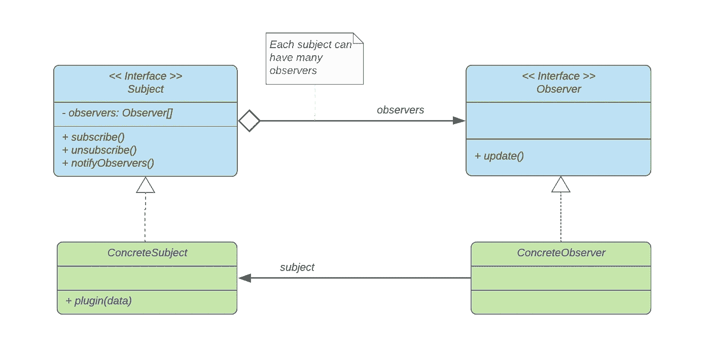
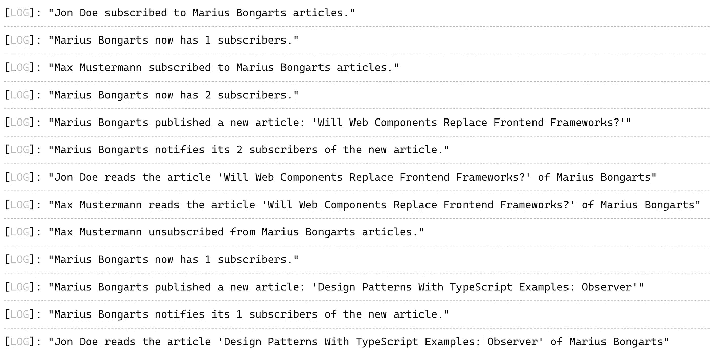

# 带有类型脚本示例的设计模式:观察者

> 原文：<https://javascript.plainenglish.io/design-patterns-with-typescript-examples-observer-22e5ae36be4c?source=collection_archive---------8----------------------->

## 观察者模式允许您定义一个订阅机制来通知多个对象。

Photo by [Andrea Piacquadio](https://www.pexels.com/de-de/@olly?utm_content=attributionCopyText&utm_medium=referral&utm_source=pexels) from [Pexels](https://www.pexels.com/de-de/foto/frau-im-gelben-langarm-halt-fernglas-3779746/?utm_content=attributionCopyText&utm_medium=referral&utm_source=pexels)

**行为**观察者模式是最流行和最常用的模式之一。在本文中，我们将详细阐述该模式的目的和结构，并通过实例说明如何使用它。

# 什么是设计模式？

设计模式是针对不同环境中反复出现的问题的通用的、可重用的解决方案。在软件工程中，他们帮助你**更快地**写出更好的代码。使用这些通用解决方案可以节省我们的时间和工作，因为我们重用了许多其他开发人员积累的知识和经验。

> “[……]我很少遇到没有听说过模式运动的开发人员”——*Grady Booch 在* [设计模式:可重用面向对象软件的元素](https://amzn.to/3i6iIIk)

也许你做了多年的程序员，却没有应用甚至不知道任何一种模式。我敢打赌，许多开发人员正是这样做的。如果是这样，我强烈推荐你先阅读这篇文章，让你的大脑相信软件设计模式是必不可少的。

 [## 为什么你必须学习软件设计模式

### 设计模式让你更快地写出更好的代码。

javascript.plainenglish.io](/why-you-must-learn-software-design-patterns-befd77f88713) 

## 模式的类别

1994 年,《设计模式:可重用面向对象软件的元素》一书由四位作者出版:Erich Gamma、Richard Helm、Ralph Johnson 和 John Vlissides，也称为“四人组”

尽管这本书是在 25 年前出版的，但它仍然是与软件工程最相关的书籍之一。阅读它可能是丰富您的开发工具包的一笔可观的投资。假设你喜欢不会让你睡着的读物。这样的话，我推荐 Eric Freeman 的 [Head First 设计模式](https://amzn.to/3Q9O6Ch)。这本书以视觉丰富的形式解释了四人帮(g of)描述的 23 种设计模式，“为你的大脑工作方式而设计。”

如前所述，**四人帮(GoF)** 定义了 23 种设计模式。为了组织他们，他们把他们分成三类:**创造型**、**结构型**和**行为型**。

> "**创建**模式关注对象创建的过程。**结构化**模式处理类或对象的组成。**行为**模式描述了类或对象交互和分配责任的方式— [设计模式:可重用面向对象软件的元素](https://amzn.to/3i6iIIk)

这里是由 GoF 定义的所有模式的概述。另外，看看我的其他文章，在表格中有链接。

如果你更喜欢通过视频课程学习，我推荐你查看 Skillshare 上的这个 [**Typescript 设计模式课程**](https://skillshare.eqcm.net/vnLkyj) 。它涵盖了所有 23 种 GoF(四人帮)设计模式，并教你如何使用 TypeScript 实现它们。作为代销商，如果你通过这个链接注册，我会收到一小笔佣金。你的支持帮助我为你创造更多有价值的内容。

 [## TypeScript 中的设计模式

### 解锁无限制访问此技能共享课程以及由来自世界各地的创作者讲授的数千门课程…

skillshare.eqcm.net](https://skillshare.eqcm.net/vnLkyj) 

# 观察者模式

> “观察者模式是一种软件设计模式，其中一个名为**主题**的对象维护一个名为**观察者**的依赖者列表，并自动通知它们任何状态变化，通常是通过调用它们的方法之一。”—[https://en.wikipedia.org/wiki/Observer_pattern](https://en.wikipedia.org/wiki/Observer_pattern)

从表中可以看出，观察者模式被归类到**行为**模式的类别中。考虑到这个事实，它的目的必须在于描述类或对象如何交互和分配责任。

## 目的🎯

Observer 模式的目的是定义一个对象之间的一对多依赖关系，该对象会自动通知其所有侦听器任何状态变化。

## 适应性💡

每当对象之间存在一对多关系时，以及更改一个对象需要更改其他对象时，都应该使用观察者模式。还有，你不知道有多少对象需要改变。这种松散耦合使对象能够通知其他对象，而无需假设这些对象是谁。

> 当更改一个对象的状态可能需要更改其他对象，并且实际的对象集事先未知或动态变化时，请使用观察者模式—[https://refactoring.guru/design-patterns/observer](https://refactoring.guru/design-patterns/observer)

## 现实生活中的例子📫

Photo by [Polina Kholodova](https://www.pexels.com/de-de/@polina-kholodova-124357393?utm_content=attributionCopyText&utm_medium=referral&utm_source=pexels) from [Pexels](https://www.pexels.com/de-de/foto/metall-italien-post-briefkasten-9965091/?utm_content=attributionCopyText&utm_medium=referral&utm_source=pexels)

> “出版商+订户=观察者模式”——[埃里克·弗里曼的 Head First 设计模式](https://amzn.to/3Q9O6Ch)

我们可以用日常生活中的例子来解释观察者模式。每个人都知道订阅报纸和杂志的工作原理:

1.  一份报纸开始发行。
2.  你订阅了出版商。每次有新的版本，它都会送到你手里。
3.  你退订不会得到进一步的版本。
4.  出版商继续出版，其他人仍然可以订阅和退订报纸。

观察者模式以同样的方式工作。

> “如果你了解报纸订阅，你就能很好地理解观察者模式，只是我们把发布者称为**主体**，把订阅者称为**观察者**。”—[Eric Freeman 的 Head First 设计模式](https://amzn.to/3Q9O6Ch)

显然，这同样适用于中等文章。我是发布者——主体**主体**。每个订阅我内容的人都是我文章的观察者，每当我发表新文章时，他们都会收到通知。如果我出于某种原因只发布无意义的内容，可能会有很多人**取消订阅**停止接收通知。尽管如此，我还是会继续发布，其他人仍然可以**订阅**我的内容。

## 结构📐

让我们通过更详细地研究 Medium 示例来推导观察者模式的结构。

媒体上的所有作者都是**主题**。Medium 提供了订阅和取消订阅它们的接口。一个特定的作者，像我一样，是一个具体的主体。订阅至少一个作者的所有媒体用户都是一个或多个主题的**观察者**。对特定作者的特定订阅是一个具体的观察者。

Observer structure

## 参与者🚻

从结构中，您可以派生出以下参与者:

*   **主体:**认识其观察者。提供订阅和取消订阅观察者对象的接口。每个主题可以有许多观察者。
*   **Observer:** 定义了一个更新接口，用于通知对象主题的变化。
*   每当状态改变时，发送一个通知给它的观察者
*   **具体观察者:**对具体主体的引用。实现观察器更新接口以对状态变化做出反应。

让我们通过将它应用到一个简单的代码示例来分解它。

## 代码示例💻

让我们构建前面的中型示例。看一下代码。你也可以在[打字游戏场](https://www.typescriptlang.org/play?#code/JYOwLgpgTgZghgYwgAgIJTMBAbFBvAKGWUzFwC5kBnMKUAcwG4CBfAg0SWRFAZQFcARgCsICMAB4AKgD5khYlSFUEdQRAAUAe0FVoAN2iUA8roPRpMgJSV9W4ABNmxfiCW7VwddrNRDUE19-SxtkO0dnZBAtTBgATw0HODA4SilQ8KdWdk5oeCRkUz0-C1l5ImR+AAckyA13UXFKARExSVkAGmRa1OR023sstg5wPJ5kAGEtEFUISABZCAdgfgBbIvMoZAgAD0gQBypCoIt0TBwIOQVK4pA4VYhKGjoQJlZmXO4CqZmoOYhFss1i1GmBtnsIAcjiC2hIzlhcFcKvxbvdHtRaAxmCxmAQAPQAKgJRAJfQAFsAjpTkFp+FsfrNIDDxCS8QQcHAqEdAStVgBVYrMsHAVZVXAPcBHBl-BZLXlC8oVBDTZ78cRaKAaKpCbBYG7QO4PJ6Y15WeTIYbEKp0fTJFA6Yr+KiUaX-HlrDYlKAAbQAusgALzIP24q06vXuFRqTQOzYu6aMgFyj0nKAZQblYjEZVuLS4AB02C09A0AAMACR4WNe-Mog1oljUZSedQOEhaZCVsAUqi11EPRtwDAIiC90tWSLZlXCqiobB-OAOOKe-yBkg9-PVp350A4fgOUc+R3QCcVYjAGDIDSUucLpcrk-IGV0kCT9eUzep3vaqhko+bU8s3fXsi3oFooy8aAqA0QCLXYMNBF1BBKjcZto3-L141+N1k3WVN00cTMsxzKg8wgQtizLSst2gPt6wHFDIxbJZkBgKAtFWTs8G7D86ygQ0IEHYcLjHWDiB43saKgI4gwkz9j2k-MYGAbAuA0bRu0fAM5BiMloGQABCAMgyksTgIosC0Mg6SYMiS1kG1RC9WiWIEiHc4KDQYTcAIttrinXMC1AqjuI3PiBMbFyL2AUdkGAMAji7DcpJAyF6G7RsmOjaSaUvTSoggAB3ZB3JHfNxzfOSUvzVY4CqDDV20mlU1rGo7Q0CSulKi4rFg+zHKQhzw1-AA5Ir4QuDRus8iafIGQj-OQEiyIskK5PChshqc38WLgArium9EAHJK0O-NSFwFgjoqs9zKi+Ipu8iA+vghybTtZBQPA5ibLNRblqCyiK1C3j+0EqItGKslOS4qqv0LNKMqbDxstEuzsnxIkSXJalqT211IAfKBWXZbBOW5XCBWgIm4tFcVIQSyYExlJMgTwhTFQC1V1U1Aa9Q2o0MReeg-rgio+eQ6pak0Bo2iwxN3VWIUuqeyhZue+a-Nui8r1l8Q4rcFIZggLRL0VqmoCFP7bq5lbguB9awcbO8jnyw7kBOvAzouwSjtyri9bAOj+IbG6gLYYg2GGEiwVqugUQAIWmeh3Jk-bkHNwUhFBDQjvmIcViOJPXlTo7T3ZadkGEaYABEtBQIMQCKjPKeKInc4AKWmZA64gMvmDjwvi5TjBeyyyCNGrkBe-LmPkFqnZ5hRLhapAEA1yb4rM+p1Nc-znYM+X6BV5AfuCEHxPk9T-Nx+8Bel5oY+4DX8vz4Ly+S9H-M+dG8ano0a4PtKBHQAOoqWwMgEBEBBBM1FNMBmRwABKEAxTjAAGLsVGAcZAGC0SFQ1AAayoAAfiOh0Vg5cL5UGHtfVwt9ND3yPlAE+lD37UKvl-H+ZIxqFXVgAioQCPY11HMAeg68AAKyQuBuEgfFMkfQ4hVAgLwTwVQwQAFEdj3DFKOQICkyEUMYEAA)用它来玩。

Code example

我们定义了四个接口:`Subject`、`Observer`、`ConcreteMediumSubject`和`ConcreteMediumObserver`。我们创建了两个类`MediumUserSubject`和`MediumUserObserver`

来自`MediumUserSubject`类的对象是可以发表文章的中级作者。此外，`MediumUserObserver`类中的对象可以通过使用其公共函数将`subscribe`和`unsubscribe`传递给作者。`MediumUserSubject`负责通知它的所有订户。

看一下日志:

Logs of the code example

## 相关设计模式🔗

软件设计模式通常显示不同模式之间的关系。这里有一些引用自 [GoF](https://amzn.to/3n4SSCY) 的与观察者模式相关的设计模式:

> "**中介**[……]:通过封装复杂的更新语义，变更管理器充当主体和观察者之间的中介."
> 
> "[**Singleton**](/design-patterns-with-typescript-examples-singleton-8add6b26d4da)[…]:change manager 可能会使用 Singleton 模式，使其具有唯一性和全局可访问性。"

 [## 带有类型脚本示例的设计模式:Singleton

### 单例模式确保一个类只有一个实例。

javascript.plainenglish.io](/design-patterns-with-typescript-examples-singleton-8add6b26d4da) 

# 最后的想法

我希望你喜欢阅读这篇文章。我总是乐于回答问题，并乐于接受批评。随时欢迎联系我！通过**[**LinkedIn**](https://www.linkedin.com/in/marius-bongarts-6b3638171/)**，**关注我**[**Twitter**](https://twitter.com/MariusBongarts)或 [**订阅**](https://medium.com/subscribe/@mariusbongarts) 通过电子邮件获取我的故事。****

****[**这里是无限制访问介质上每一个内容的链接**](https://medium.com/@mariusbongarts/membership) 。如果你注册使用这个链接，我会赚一小笔钱，不需要你额外付费。****

**** [## 通过我的推荐链接加入 Medium-Marius bong arts

### 作为一个媒体会员，你的会员费的一部分会给你阅读的作家，你可以完全接触到每一个故事…

medium.com](https://medium.com/@mariusbongarts/membership) 

此外，如果你还没有，看看我的在线荧光笔铬扩展。使用 [Web Highlights](https://web-highlights.com/) ，您可以在任何网页或 PDF 上高亮显示，创建标签并做笔记。

 [## Web 亮点— PDF 和 Web 荧光笔

### 最佳网络荧光笔。就像你在书上做的那样，在任何网页或 PDF 上高亮显示，并做笔记。组织…

web-highlights.com](https://web-highlights.com/) 

***披露*** *:本文包含附属链接。如果你通过这些链接之一购买，我可能会收到佣金。我只推荐我认为质量高、对你有益的产品。我感谢你的支持。*

# **延伸阅读**

 [## 为什么你必须学习软件设计模式

### 设计模式让你更快地写出更好的代码。

javascript.plainenglish.io](/why-you-must-learn-software-design-patterns-befd77f88713)  [## 使用类型脚本的设计模式示例:适配器

### 适配器模式使两个现有的接口协同工作。通过将其应用到现实生活中的例子，它是…

javascript.plainenglish.io](/design-patterns-with-real-life-typescript-examples-adapter-d183af1f1462)  [## 带有类型脚本示例的设计模式:Singleton

### 单例模式确保一个类只有一个实例。

javascript.plainenglish.io](/design-patterns-with-typescript-examples-singleton-8add6b26d4da)  [## Web 组件会取代前端框架吗？

### 它们是为解决不同的问题而构建的。

javascript.plainenglish.io](/will-web-components-replace-frontend-frameworks-535891d779ba)  [## 用 Web 组件构建自己的博客组合:基础

### 第 1 部分—定制元素、阴影 DOM 和 HTML 模板

javascript.plainenglish.io](/showcase-your-medium-articles-with-web-components-part-1-basics-d2c6618e9482)  [## 作为全栈开发人员，你应该马上学会的 5 项技能

### 现在就学习吧，你会后悔错过的

javascript .平原英语. I](/5-skills-you-dont-get-around-to-learn-as-a-fullstack-developer-409f13c394c7) 

*更多内容看*[***plain English . io***](http://plainenglish.io/)****