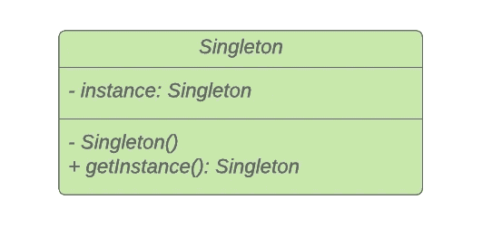

# 带有类型脚本示例的设计模式:Singleton

> 原文：<https://javascript.plainenglish.io/design-patterns-with-typescript-examples-singleton-8add6b26d4da?source=collection_archive---------3----------------------->

## 单例模式确保一个类只有一个实例。

> **问:**今天我们很高兴给大家带来一个对单身对象的采访。你为什么不先向我们介绍一下你自己呢？
> 
> **单身:**嗯，我完全是独一无二的；只有一个我！
> 
> [Eric Freeman 设计的 Head First 图案](https://amzn.to/3Q9O6Ch)

Photo by [Sebastian Voortman](https://www.pexels.com/de-de/@sebastian?utm_content=attributionCopyText&utm_medium=referral&utm_source=pexels) from [Pexels](https://www.pexels.com/de-de/foto/schwarze-holzerne-konig-schachfigur-411195/?utm_content=attributionCopyText&utm_medium=referral&utm_source=pexels)

创造的单例模式是最流行和最容易使用的软件设计模式之一。在本文中，我们将详细阐述该模式的目的和结构，并通过实例说明如何使用它。

# 什么是设计模式？

设计模式是针对不同环境中反复出现的问题的通用的、可重用的解决方案。在软件工程中，他们帮助你更快地写出更好的代码。使用这些通用解决方案可以节省我们的时间和工作，因为我们重用了许多其他开发人员积累的知识和经验。

> “[……]对我来说，遇到没有听说过模式运动的开发人员是不常见的”“ *Grady Booch 在* [设计模式:可重用面向对象软件的元素](https://amzn.to/3i6iIIk)

也许你做了多年的程序员，却没有应用甚至不知道任何一种模式。我敢打赌，许多开发人员正是这样做的。如果是这样，我强烈推荐你先阅读这篇文章，让你的大脑相信软件设计模式是必不可少的。

 [## 为什么你必须学习软件设计模式

### 设计模式让你更快地写出更好的代码。

javascript.plainenglish.io](/why-you-must-learn-software-design-patterns-befd77f88713) 

## 模式的类别

1994 年,《设计模式:可重用面向对象软件的元素》一书由四位作者出版:Erich Gamma、Richard Helm、Ralph Johnson 和 John Vlissides，也称为“四人组”

尽管这本书是在 25 年前出版的，但它仍然是与软件工程最相关的书籍之一。阅读它可能是丰富您的开发人员工具包的一笔可观的投资。假设你喜欢不会让你睡着的读物。在这种情况下，我推荐 Eric Freeman 的 [Head First 设计模式。这本书以视觉丰富的形式解释了四人帮(g of)描述的 23 种设计模式，“为你的大脑工作方式而设计。”](https://amzn.to/3Q9O6Ch)

如前所述，**四人帮(GoF)** 定义了 23 种设计模式。为了组织他们，他们把他们分成三类:**创造型**、**结构型**和**行为型**。

> 创造模式涉及到对象创造的过程。**结构化**模式处理类或对象的组合。**行为**模式描述了类或对象交互和分配责任的方式。— [设计模式:可重用面向对象软件的元素](https://amzn.to/3i6iIIk)

这里是由 GoF 定义的所有模式的概述。另外，看看我的其他文章，在表格中有链接。

如果你更喜欢通过视频课程学习，我推荐你查看 Skillshare 上的这个 [**打字稿设计模式课程**](https://skillshare.eqcm.net/vnLkyj) 。它涵盖了所有 23 种 GoF(四人帮)设计模式，并教你如何使用 TypeScript 实现它们。作为代销商，如果你通过这个链接注册，我会收到一小笔佣金。你的支持帮助我为你创造更多有价值的内容。

 [## TypeScript 中的设计模式

### 解锁无限制访问此技能共享课程以及由来自世界各地的创作者讲授的数千门课程…

skillshare.eqcm.net](https://skillshare.eqcm.net/vnLkyj) 

# 单一模式

从表中可以看出，单例模式被归入了**创造**模式的范畴。考虑到这一事实，它的目的必然在于对象的创建过程。

## 目的🎯

Singleton 模式的目的是确保在任何时候，一个类只有一个实例，并提供一个全局访问点。

## 适应性💡

有时，在一个软件程序中，类需要恰好有一个实例，因为你不希望该对象及其值有多个副本。

> 单身者:哦，我对各种事情都很在行。你知道，单身有时也有好处。我经常用来管理资源池，比如连接池或线程池。—[Eric Freeman 的 Head First 设计模式](https://amzn.to/3Q9O6Ch)

很有可能，你已经使用过一些单例类。也许甚至没有注意到它。例如，在应用程序或全局状态管理存储(如 Redux)中共享的数据库。

> "单例服务是一个应用程序中只有一个实例的服务. "— [angular.io](https://angular.io/guide/singleton-services)

如果你和 Angular 合作过，你可能使用过注射服务。在`root`中提供它们使它们遵循使用依赖注入的单例模式。

当一个类必须只有一个实例，并且需要严格控制客户端访问它的方式和时间时，使用 Singleton 模式。

## 结构📐

您可能很高兴知道，在所有模式中，单例模式的结构是最简单的。

那么，我们如何确保一个类只有一个容易访问的实例呢？

我们可以在全局变量中存储一个实例。这将使它易于访问，但它不能保证只有一个实例。

更好的解决方案是让类本身提供访问唯一实例的方法。我们可以通过将类**的构造函数设为私有**来实现这一点。这阻止了其他人创建类实例，但是我们仍然可以在其中创建类的实例。

> 问:那么，如果我们可以问，你怎么知道只有一个你？有新运营商的人就不能创造一个“新的你”吗？
> 
> 没有！我确实是独一无二的。
> 
> **问:**好吧，开发者是不是发过誓不再实例化你一次以上？
> 
> 单身者:当然不是。说实话…嗯，这有点私人化，但是…我没有公共构造函数。
> 
> [埃里克·弗里曼设计的头像图案](https://amzn.to/3Q9O6Ch)

接下来，我们将为该类定义一个私有静态`instance`字段来存储 singleton 实例。此外，我们创建一个静态的`getInstance()`方法来获取实例。该方法负责在第一次调用时创建一个新对象，并将其存储在私有的`instance`字段中。第二次调用将只返回私有实例，而不是从上的第二次调用创建新的对象。

看看我们的单例类:

Singleton structure

注意，该类包含了我们的私有静态`instance`字段、私有`Singleton()`构造函数和公共`getInstance()`方法。

让我们看看如何使用 Typescript 实现这个类:

Singleton structure

## 参与者🚻

从结构中，您可以派生出以下两个参与者:

*   Singleton:确保自身唯一实例的类。负责创建自己的实例。
*   **客户端**:可以使用它的公共`getInstance()`方法访问单例实例

## 代码示例💻

在我们开始使用 Typescript 实现之前，我想提一下，如果您正在使用 Node.js 模块，您可能会问:

**反正 node.js 模块不是单例的吗？**

这篇[文章](http://So let's dive into the code.)说 Node.js 模块可以表现得像单例一样，但是由于 Node 的缓存机制，不能保证它们就是单例。这里不想赘述。本文更多的是用一个简单的代码例子来解释单例模式。所以让我们深入研究代码。

我们将构建一个在应用程序中触发事件的事件服务。如果有事件发生，应该通知我们服务的每个侦听器。我们的服务遵循观察者模式，这是**行为**设计模式的一部分。我将在下面的一篇文章中详细介绍。

目前，我们的事件服务的独特性对于确保每个侦听器订阅接收事件的相同服务至关重要。

看一下代码。你也可以在 [TypeScript Playground](https://www.typescriptlang.org/play?#code/C4TwDgpgBAMglgZ2BAdhATlAvFAFANwEMAbAVwgC4ol04UBzASmwD4p8B7OAEwG4AofqEhQAqigSkARggDGtKdBwBvKKQnS5CynmZY2nHlAC+AwbOKEECKAFF8qYAGUM+OLOjL+UKGFpFkKGJEZDR0BCp4JFQMAG0AXWwoBLMfPw5kWWRuamBCYHcoOiRCFA8qe0cXdDcPVN9-fOhZDglgdFIsjnRcZmVjQTTpYNlc-ML6CGAASTbSj16oLx8fOAAzPABCSpRnV3cIADpivLKIZh29moPjubOktAB3Owdd6tqIXoEVqHQp0nQKBeVX2HluJTO3xMg18w0KEAAtnBgAQSOQqDQ6Ewlt4flBgAALRCHFAZdYgKKhDAIVFkc5Qga4yQyeRwRS4YLRMKREIxdCMKjiZlaNmeXE+QnEzlU8KHMCkBAEjm8sKMKE+P7AAFA5Z49TC1mKKiLfQ4vErAD0FrUGhZ2iga3UWTgrXFeMlCEO0r5NhwHq9KuphzWcGIyB6uAyBIwejYUYwUE2WBw3tV6pWxgANG7TLjGWlGoFSQU1hTA+FaejcrQGH03f7U0G1t1bIRZErlVyY6wguXK+c1Xn+Iz+C02lAIK8rh8kpd3jdJjM7gtB-wLQAqdfedd2dDobpQRSyQgK5qtGidYAHxANOABHTbqAAYXP7UvB44GwsVhsAHI56CEC-kUNh+HeTRQKUOStMQICQbIHjWGyxDQI8yJEkChLNJY1hQNwEDfug4yulA64WqOr6QcW0boAB1weA8EDPHRHxfIIFHjpOVSaKyYAFK0SRcW8gGHAa2i4EJwA9mOCAcChXocPQElTowq6SfOYKIsiuAAEQAGJwOEUmXDpq4sQuUyzBCK6HFpKI6S4Y45CZalTk4PG0HxLooIc+oeaKXxAA) 里用它来玩。

Typescript code example

您可以看到，我们创建了一个私有构造函数和一个私有实例字段。为了获得服务的实例，我们可以调用`getInstance()`，我们将接收我们的 singleton 对象。调用`new EventService()`会导致错误，因为 Typescript 认为我们的构造函数被声明为`private`。

## 相关设计模式🔗

软件设计模式通常显示不同模式之间的关系。许多模式如**抽象工厂**、**构建器**和**原型**可以参考 [GoF](https://amzn.to/3n4SSCY) 使用单例模式来实现。

# 最后的想法

我希望你喜欢阅读这篇文章。我总是乐于回答问题，并乐于接受批评。随时欢迎联系我！通过**[**LinkedIn**](https://www.linkedin.com/in/marius-bongarts-6b3638171/)**，**关注我**[**Twitter**](https://twitter.com/MariusBongarts)或 [**订阅**](https://medium.com/subscribe/@mariusbongarts) 通过电子邮件获取我的故事。****

****[**这里是无限制访问介质上每一个内容的链接**](https://medium.com/@mariusbongarts/membership) 。如果你注册使用这个链接，我会赚一小笔钱，不需要你额外付费。****

**** [## 通过我的推荐链接加入 Medium-Marius bong arts

### 作为一个媒体会员，你的会员费的一部分会给你阅读的作家，你可以完全接触到每一个故事…

medium.com](https://medium.com/@mariusbongarts/membership) 

此外，如果你还没有，看看我的在线荧光笔铬扩展。使用 [Web Highlights](https://web-highlights.com/) ，您可以在任何网页或 PDF 上高亮显示，创建标签并做笔记。

 [## Web 亮点— PDF 和 Web 荧光笔

### 最佳网络荧光笔。就像你在书上做的那样，在任何网页或 PDF 上高亮显示，并做笔记。组织…

web-highlights.com](https://web-highlights.com/) 

***披露*** *:本文包含附属链接。如果你通过这些链接之一购买，我可能会收到佣金。我只推荐我认为质量高、对你有益的产品。谢谢你的支持。*

# **延伸阅读**

 [## 使用类型脚本的设计模式示例:适配器

### 适配器模式使两个现有的接口协同工作。通过将其应用到现实生活中的例子，它是…

javascript.plainenglish.io](/design-patterns-with-real-life-typescript-examples-adapter-d183af1f1462)  [## 为什么你必须学习软件设计模式

### 设计模式让你更快地写出更好的代码。

javascript.plainenglish.io](/why-you-must-learn-software-design-patterns-befd77f88713)  [## Web 组件会取代前端框架吗？

### 它们是为解决不同的问题而构建的。

javascript.plainenglish.io](/will-web-components-replace-frontend-frameworks-535891d779ba)  [## 用 Web 组件构建自己的博客组合:基础

### 第 1 部分—定制元素、阴影 DOM 和 HTML 模板

javascript.plainenglish.io](/showcase-your-medium-articles-with-web-components-part-1-basics-d2c6618e9482)  [## 作为全栈开发人员，你应该马上学会的 5 项技能

### 现在就学习吧，你会后悔错过的

javascript.plainenglish.io](/5-skills-you-dont-get-around-to-learn-as-a-fullstack-developer-409f13c394c7) 

*更多内容看*[***plain English . io***](http://plainenglish.io/)****