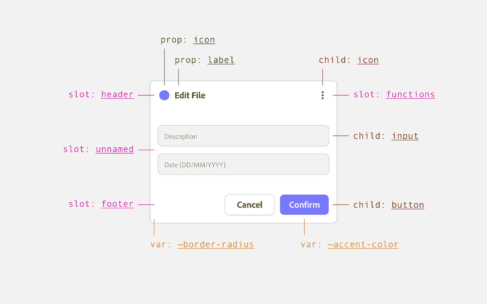
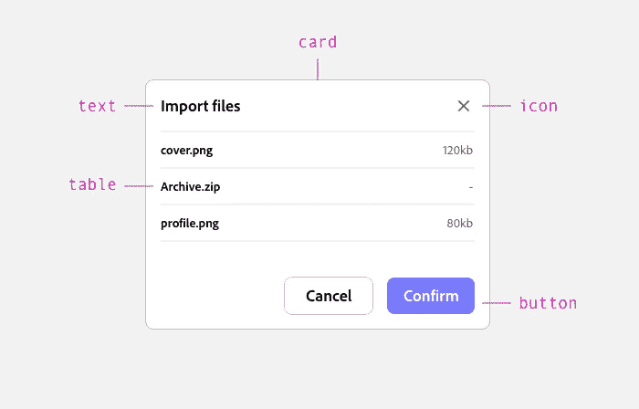
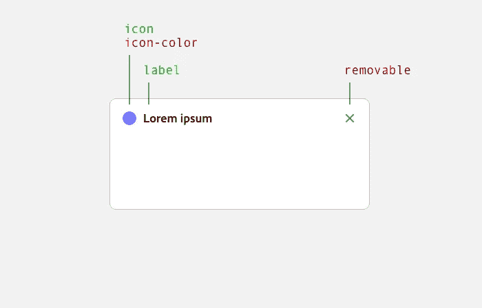
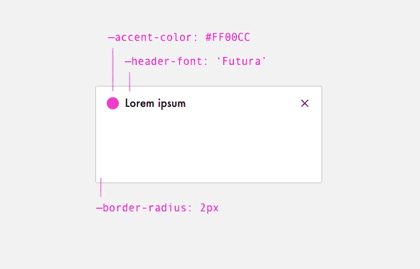
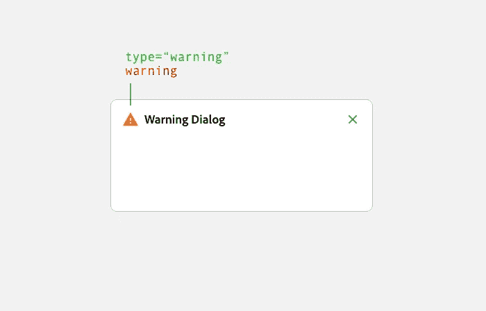
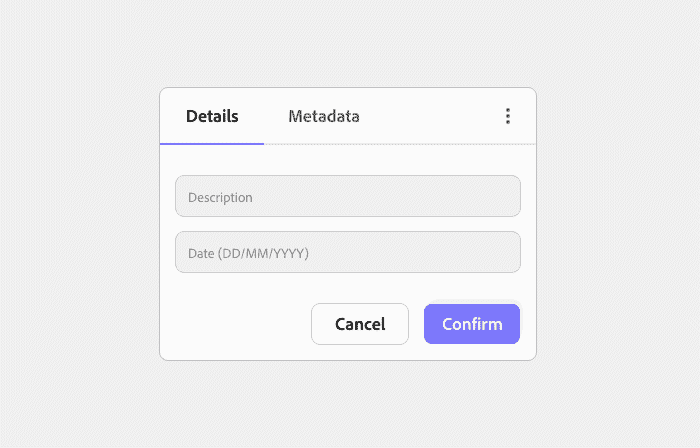

# 了解设计系统—设计组件 API

> 原文：<https://javascript.plainenglish.io/design-systems-designing-component-apis-25dcf81d26f5?source=collection_archive---------3----------------------->

不久以前，web 用户界面主要是使用标准的 HTML 和 CSS 构建的。React、Vue.js、Angular 和 Polymer 等框架的兴起，使得在同一应用程序甚至不同产品的不同部分之间**包装和重用 UI 组件**成为可能。

组件找到了与**设计系统**的完美匹配，这使得它们能够从样式指南或参考样式表发展成成熟的库，其中包含用于设置组件外观、内容和行为的**应用编程接口(API)**。

# 1.组件与仅 CSS

设计系统可以实现为组件库或纯 CSS 样式表。虽然两者各有利弊，但在这篇文章中，我将重点介绍基于组件的方法。

与仅使用 CSS 的库相比，使用组件有许多优点，其中我认为最有价值的是:

*   **设计可以保持一致**只暴露应该定制的部分。
*   **通过在组件内部封装逻辑、样式和标记，产品代码变得更容易阅读和维护**。
*   **冲突的类名和其他定义可以避免**，因为它们被隔离在组件范围内。

作为一个例子，让我们看看材质设计的按钮实现的两种方式。如果只有标签、图标和类型是可定制的，组件方法只暴露必要的 API，而纯 CSS 方法暴露所有的复杂性:

Material Design button — Web component

Material Design button — CSS-only

# 2.设计师为什么要在意？

由于 API 对最终用户来说是不可见的，所以不清楚为什么 UX 的设计者应该参与设计它们。

组件在到达最终用户之前首先由产品团队组装，API 是组件和使用它的产品设计者或开发者之间的主要接口。从这个角度来看，开发人员和设计师是设计系统的第一批用户，他们的经验也应该被考虑。

设计良好的 API 将增加开发人员的经验，降低他们实现自己的解决方案的风险，从而提高生产率并增强最终产品的一致性。

# 3.要考虑的因素

在设计组件及其相应的 API 时，应该考虑一些关键因素，以确保它们易于使用，与系统的其余部分保持一致，并且易于在将来进行扩展和维护。

—

## a)哪些部分可以隔离？

复杂的组件很难消费。为了简化它们的 API，隔离更小的、可重用的元素是一个很好的实践。

这些元素可以包装在父组件中，或者由消费者手动添加为子元素，这取决于预期的变化量(参见 d 段关于插槽的内容)。

—

## 应该提供哪些变化？

通过对所有可能用例的概述，设计师可以帮助定义组件的哪些部分应该通过使用**属性**进行定制，哪些应该保持稳定，避免不必要的变化，从而增强设计的一致性。

在下图中，`label`和`icon`是可定制的，而`icon-color`和`removable`不能改变。

—

## c)哪些风格应该是可定制的？

由于消费者无法访问封装的内容，定制风格只能通过 API 来完成。

css 变量可用于改变单个 CSS 值(如`--border-radius`)。如果对于给定的变化应该一起改变多个样式(例如，改变图标颜色和字体大小的警告类型)，可以使用属性来代替。

变量可被定义为一个全局主题(例如`--accent-color`)并针对单个组件进行修改，或者新变量可仅针对给定组件进行定义(例如`--footer-padding`)

—

## d)该组件未来将如何发展？

随着新用例的出现，组件及其 API 会随着时间的推移而发展。由于这个原因，它们应该**为变更**而设计，基于事实或者对用例如何发展的预测。

当新的用例出现时，一个没有考虑到进化而设计的 API 很可能导致**突破性的改变**。

在下图中，对话框的**警告**变化可以被定义为`warning`布尔属性，但是如果**错误**或**成功**用例预计在未来出现，它可以被定义为`type="warning"`字符串属性。

—

## e)可以在哪里插入内容？

并非组件的所有功能都需要预先定义并通过特定的 API 提供。

对于需要更多灵活性的用例，消费者应该能够在预定义的插槽(也称为门户、容器或子区域)中插入自定义内容。

Slots 可以定义其子元素的显示方式(例如，从上到下或从左到右，它们之间有 8px 的空间)，但是消费者可以完全控制插入元素的样式，因为它们没有被封装。

# 结论

虽然对于最终用户来说，组件易于使用是极其重要的，但开发人员和设计人员应该被视为设计系统和组件库的第一手用户，设计易于使用的 API 将显著改善他们的体验。

理解组件 API 如何工作的设计人员可以在定义组件时做出更有意义的决定，这也将增强与开发人员的交流。

[*更多内容看 plainenglish.io*](http://plainenglish.io/)