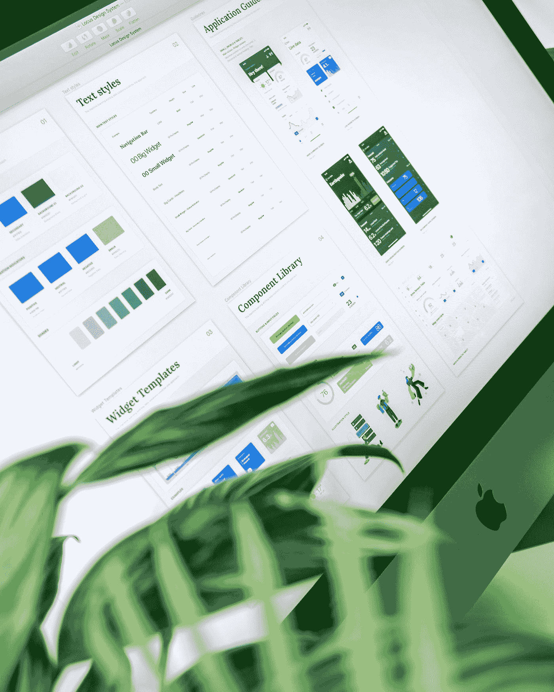
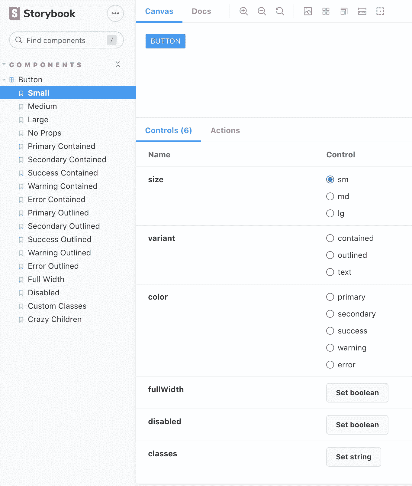
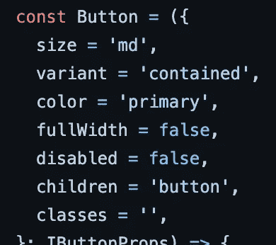

# 为什么你的产品应该有一个设计系统？

> 原文：<https://javascript.plainenglish.io/design-systems-why-aedbacf9d578?source=collection_archive---------14----------------------->

' Bootstrap 最初被命名为 Twitter Blueprint，是由 Twitter 的 Mark Otto 和 Jacob Thornton 开发的，作为一个框架，用于在内部工具之间 ***鼓励一致性*** 。'—维基百科



Photo by [Balázs Kétyi](https://unsplash.com/@balazsketyi?utm_source=medium&utm_medium=referral) on [Unsplash](https://unsplash.com?utm_source=medium&utm_medium=referral)

我通过 Bootstrap 了解了 CSS 和 UI。有了 Bootstrap，我能够快速地创建**外观一致的** UI **。**

这些组件足够通用，可以毫不费力地在多个站点使用。

我甚至认为，与 90 年代和 00 年代的网站相比，Bootstrap 让网站看起来更好、更流畅。

# 1.一致性

随着 Bootstrap 越来越受欢迎，许多自由职业者的网络项目开始变得相似。Bootstrap 包附带的原始间距单位、圆形、阴影等，大多不是为适应特定项目或需求而配置的。

我们中的一些人甚至做了额外的努力，没有费心去改变 Bootstrap 的原色蓝色。

> 万维网的很大一部分都在使用 Twitter 的设计系统，而且看起来毫无必要的一致！

在一个组织中，我们应该努力实现两种类型的统一。

1.  **单个产品**应该看起来完全一致。
2.  **代表一家公司的产品**应该带有它所代表的公司的风味或品牌标识。

当所有这些产品**使用来自同一指南的**值时，将很难使产品看起来不同。

# 2.自动驾驶模式下的工作流程

研究表明，当我们的大脑进行类似走路、开车、洗澡、吃饭等熟悉的活动时，就会进入自动驾驶模式。因此，有时我们不记得在浏览 Twitter 时吃了一大堆东西。

我们的大脑可以在自动驾驶模式下进行所有活动吗？不。在自动驾驶模式下，我们可能无法实现科学突破，或者更糟的是*破解编码面试*。

> 我们能让开发者的大脑在自动驾驶模式下进行软件开发的活动吗？

这是雄心勃勃的！

先说一个影响以上的因素。

## 离散与连续

你喜欢哪一个？

*   带有模拟调谐器的收音机。
*   一台带有数字接口的收音机，让我们一键选择任何电台。

如果您的汽车有带模拟调谐器的收音机，您可能永远不会将活动`changing radio station while driving` 添加到自动驾驶模式。这项活动将永远需要你的关注。

相反，如果你的汽车在方向盘上有一个带快捷键的数字接口，`changing the radio station while driving` 就会很容易进入你的自动驾驶模式。你不会记得你换了多少次频道，也不会记得你是如何以及何时找到那个特定的电台的。

结果是一样的。但这种差异给驾驶员带来了极大的便利。

> *从一组离散的选项中选择一个值与从一个连续的范围中选择一个值相比，在认知上要求较低。*

```
0, 25, 50, 75, 100
// 5 possibilitiesvs0 to 100 
// 10000 possibilities with the precision of 2 decimal places.
```

## 数字艺术家

即使在今天，许多开发人员仍然用他们的眼睛来衡量 UI。我们多久见过这种情况？

```
Manager: 'No no. make the text a bit larger?' 
-- Developer changes the text to a 19px from 18pxManager: 'Umm. No. It's too large.' 
-- Developer changes to 18.5pxManager: 'Increase a bit?' 
-- Developer changes to 18.75pxManager: 'A bi...it smaller?' 
-- Developer changes to 18.68pxManager: *snaps!*'Yep. Lock that!'.
```

这是一个缓慢且认知要求高的过程。是一次 ***模拟开发者体验*** 。

# 设计系统:我们设计的 API。

一个设计系统是一套乐高积木，我们将用它来构建我们的应用程序。

> Web 开发不一定要像在物理画布上绘画那样细致入微。应该像用乐高积木搭建一样。

你不能用乐高建造任何东西，这就是关键。我们将根据我们建造的东西来决定我们的乐高积木。

有了一个字体大小为`12,14,16,18,24,32,48, and 72.`的设计系统，上面的经理-文本大小的对话应该变成这样，

```
Manager: 'Make it larger' 
-- Developer changes it from 18px to 24pxManager: 'Woah! No. reduce it!' 
-- Developer changes it back to 18px.Manager: 'Put something in between?'Developer: 'Our typescale does not have an intermediate number. We have to raise a ticket to add that!'
```

看到了吗？这个过程变得很快。需要做的决策更少，因此开发人员不需要花费太多的脑力。

## 晶莹剔透的护栏

又一个击败改进开发人员体验的例子。

选一个。

*   驾车穿过精心规划的公路，清晰的反光标志指引你到达目的地。
*   开车穿过没有反光标志来保护你不从发夹弯掉下来的山路。

在第二种选择下驾驶时，你的大脑不会冒险进入自动驾驶模式。如果你活着到达目的地，那会让你筋疲力尽。

发展可以是这两种经历中的一种。

## 按钮创建:模拟开发过程

要求:我需要一个按钮！

*   它是什么颜色的？是初级动作吗？我应该从哪里复制原色？CSSStats 显示在我们的应用程序中有 7 种不可区分的原色。`The developer goes through different HTML files and finds the hex code.`
*   这是什么尺寸的 T21？`The developer provides different widths and heights until he/she feels like it. Oh lunch time! Goes for lunch.`
*   什么是**边界半径**？`Finds a similar button and copies the border-radius`
*   等等。按钮文字是`**uppercase**`吗？
*   `After one hundred questions and their decisions, the developer will get a button eventually in a very organic way. Like how nature takes unlimited time to evolve species?`

## 按钮创建:用一个设计系统。

在流线型开发过程中，开发人员将被提供组件及其可能的调整。



上面的组件已经设置了默认值，使得包括孩子**在内的所有道具都是可选的**。



*   `<Button>Button</Button>`会给你一个按钮。
*   要修改吗？有五个**离散选项**的选择题。回答他们。你会有你的按钮。
*   就是这样。

多酷啊。

1.  不喜欢任何变调？提出一个问题来证明你的用例是正确的，并在道具中包含一个**新品种**。
2.  默认情况下，上面的按钮带有固定的边框半径和大写字体。如果设计需要配置，将它们作为**新道具**添加。

看一下按钮故事书[这里](http://storybook-button.surge.sh)。

## 但我不在手艺上妥协！我需要恢复我的灵活性。"

维护一个设计系统的最大问题是人们感觉他们错过了灵活性。下面的例子建立了保持我们设计系统简单性所需的思维模式。

想象你经营一家鞋店。

你有美国 T2 的尺码

**案例一:**顾客的确切尺码是 8.31。

他/她可以相当舒服地穿 8.5 码的鞋子！

*   他们没必要去买定制的鞋子！
*   你不必在你的股票和图表中介绍 8.31 码的鞋子。

**案例二:**顾客的尺码是 11.7

好吧，那就尴尬了。没有适合那个尺寸的。此时此刻，

*   我们将在图表中增加 11.5 或 12 号或两个尺码。让顾客从中挑选一个。

这种心态有助于保持设计系统不失控。

## 如何为我的产品重新开始一个“设计系统资源”？

我们可以从下面两个开始，然后从那里开始工作。

*   使用**离散选项**的实用工具，如颜色、间距、尺寸、排版等。
*   按钮、下拉菜单、日历等组件**带有带有离散选项的道具**。

谢谢你。下次见。

*更多内容尽在* [***说白了***](http://plainenglish.io/)