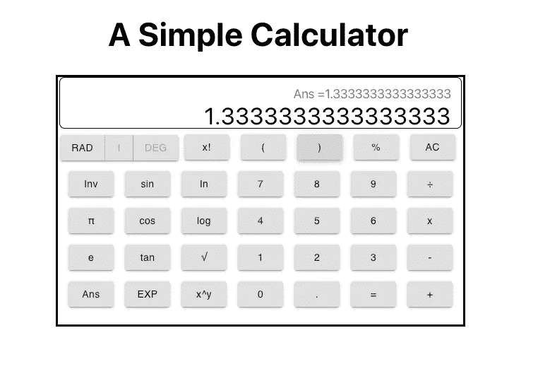
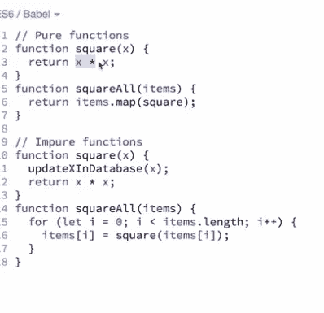
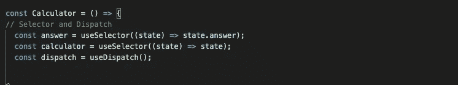
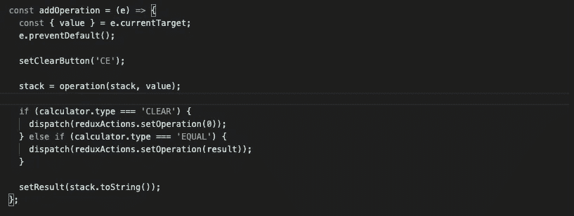
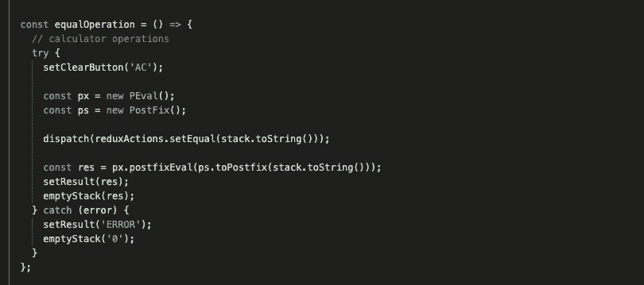
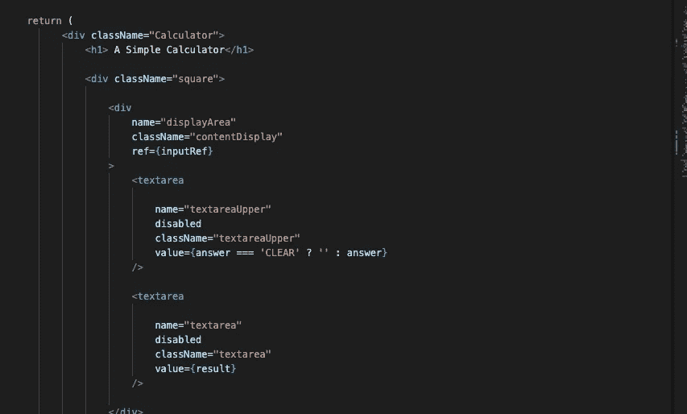

# 如何用 React Redux 钩子设计一个谷歌计算器

> 原文：<https://javascript.plainenglish.io/designing-google-calculator-with-react-redux-hooks-cfbf4b516dcb?source=collection_archive---------14----------------------->

适合初学者的 React Redux


Photo by [Clayton Robbins](https://unsplash.com/@claytonrobbins?utm_source=medium&utm_medium=referral) on [Unsplash](https://unsplash.com?utm_source=medium&utm_medium=referral)

2020 年，在我看了 Redux 的创造者 Dan Abramov 的视频教程和 Reinald Reynoso 的教程后，Redux 完全有了意义。有几十个 Redux 教程和文章，但缺少的是从初学者的角度来看有所帮助的教程类型。初学者应该理解 Redux 是一个基本的库，但是使用它需要一定程度的项目开发知识。

不要认为使用 Redux 需要某种复杂的应用程序。需要保存一些状态的最简单的应用程序就足够了。在构建应用程序之后，我学习了 JavaScript/React/Redux，众所周知，大多数 web 应用程序都需要一种方法来保存页面和视图之间的状态。考虑一下页面之间的一致性，您必须传递一些信息，一些信息在一个页面上，一些信息跨多个页面显示。

该信息可以作为路径和请求参数传递。它们可以作为模型属性嵌入到像 Spring 这样的框架中。然而，在 JavaScript 框架中，一些基本工具是 [localstorage](https://developer.mozilla.org/en-US/docs/Web/API/Window/localStorage) 和 [sessionstorage](https://developer.mozilla.org/en-US/docs/Web/API/Window/sessionStorage) ，它们都存在于窗口对象中。Redux 是 React 等 JavaScript 框架中的一个很好的状态管理库。

# 这个概念

Redux“是一个可预测的前端框架状态管理库”。在 React 很流行。还有其他像 Mobx，Flux。但是 Redux 的简单和轻薄使它成为 React 中的首选库。关于 Redux，他们常说的一句话是— *“找到正确的用例”*。所以你需要一个保存状态的应用程序。

# 用例

我试图设计你在谷歌上输入“计算器”或“谷歌计算器”时找到的计算器。[下图是我开发的，点这里看。](https://simplegooglecalculator.herokuapp.com/)



Simple Google Calculator LookAlike

## 它是如何工作的

该计算器有“Ans”按钮来检索当前答案，它将答案保存在内存中，并在上部显示器上方显示操作数。可以用 Ans 回忆一下上一个答案，用。当你做计算时，你用结果或数学表达式代替答案。如果您按 AC(全部清除)，您将清除所有内容，包括保存的答案。开始时，一旦您单击一个数字(操作数)或运算符，答案将更新为 0。如果您进行计算，上显示屏会显示表达式，下显示屏会显示答案。

## 军事演习

这就是 Redux 的用武之地。开始时，只要我们单击一个可点击的操作数/运算符，答案就会更新为 0。当我们完成一个计算并单击“等于”时，我们更新答案并显示表达式。如果我们点击 Ans 按钮。我们将检索答案并在表达式中使用。如果我们单击一个新的操作数或运算符，我们将开始新的计算，但我们之前的答案仍会保存。因此，跟踪这种状态我认为可以用 Redux 来完成，我不认为这可能是最合适的用例，但这就是我所做的。因此，我们有三种状态——相等、操作和清除。

要使用 redux，我们必须安装它。你应该用 npm create-react-app MY-APP 创建你的应用，然后再用 npm 或 yarn 安装 CRA (create-react-app)。并获得 React 绑定。

```
*npm install redux* *npm install react-redux*
```

我们的动作和 reducers 是使用 Redux 的主要构件。这些都是函数。正常功能。只是建议使用纯函数。纯函数返回可预测的结果，并且没有可观察到的副作用。一个纯粹的函数不应该有导致我们的状态不可预测的副作用，比如访问数据库、运行计算，这些都不会带来相同的结果。然而，Redux Thunk 解决了异步行为的问题。更多内容见最后的阅读清单。还有，见丹阿布拉莫夫的 egghead 视频教程的第三个视频。



Pure/Impure Functions

# 采取行动，减少紧张

因此，您的操作是将普通对象发送到 Redux 存储以供管理状态访问的函数。其中一个对象成员应该是可枚举类型。如存储、操作、清除。以下是计算器中使用的操作对象。每个动作描述了我们是否在做一个运算，用等于操作数或清除显示得到表达式的结果。

Reducers 是提供给 Redux store 的函数，Redux store 根据发送的操作使用 switch 语句返回所需状态或默认状态。这是这个计算器的减速器。我们的动作被导入到减速器中。我们插入 initialstate(取决于应用程序的逻辑)并创建存储。createstore 方法也可以输入 initialState。它需要第三个参数，可以是像 Redux Thunk 这样的中间件。如果您有多个 reducer 要跟踪，我们可以组合 reducer 并将其传递给 createstore 方法。

然后，我们转到需要 redux 的组件，并将存储的提供者提供给我们的组件。对于这个用例，计算器组件位于 App.js 中。

现在来看看计算器组件。下面找相关部分截图。它使用功能组件和挂钩。



对于功能组件，我们需要 useDispatch 和 useSelector 挂钩。useDispatch 将发送动作，这些动作将状态对象传递给我们的存储。选择器用于访问存储的状态。下面是我使用它们的地方。我用这个函数来添加操作数和运算符，我需要跟踪状态。



useDispatch Example



Second Use Dispatch

当计算完成时，将发送对计算表达式的回答。使用交流电时，也会清理显示区域。

所以基本上，我们能够管理我们需要的三种状态。直觉告诉我这可以用普通的钩子来完成。为了学习，我必须编造一个用例。

在下面找到我评估 useSelector 值的地方。



useSelector Example

useSelector 返回状态对象。所以不要搞错了，在它周围打个[]。就像其他返回数组的钩子一样。像普通对象一样访问它。关于预载状态。在 Redux 文档中，他们讨论了 preloadedState，其中应该给 createStore 方法一个 preloadedState 来设置初始状态。否则它将是未定义的。createStore 有三个参数，reducer、preloadedState 和 enhancer。PreloadedState 状态应为普通对象。例如，不要传入“initialState”而不是 initialState()(除非您在某处声明了该函数，并且只是传递一个引用)，这是您返回普通对象的操作之一。然后，如果您没有给它一个 preloadedState，useSelector 将返回一个未定义的 DefaultRootState。

即使在 React 中，Redux 也可能不是状态管理中的银弹。Kent C Odds 做了一个很好的使用上下文 API 的教程。React useContext 钩子派上了用场，但是它们都有不同的设计模式。

尽管如此。这就是 Redux 所做的，它管理应用程序状态。这只是基本的。观看丹·阿布拉莫夫的视频了解更多信息。

来自专家:

1.  丹·阿布拉莫夫的视频，纯功能见视频 3，其余为基本和[高级还原](https://egghead.io/courses/building-react-applications-with-idiomatic-redux)。
2.  [雷纳多·雷诺索的](https://levelup.gitconnected.com/react-redux-hooks-useselector-and-usedispatch-f7d8c7f75cdd)教程，是两本有意义的教程之一。
3.  [Tania Rascia](https://www.taniarascia.com/redux-react-guide/) 是全面的指南，它包括中间件使用 Redux thunk 进行异步行为。
4.  Kent C Odds(另一位 React 专家)建议我们“仅在道具钻探确实成为问题时使用上下文”。
5.  埃比尼泽·唐认为我们都应该[“使用钩子+上下文，而不是 React + Redux”。](https://blog.logrocket.com/use-hooks-and-context-not-react-and-redux/)
6.  要用自定义钩子替换 Redux，请参见 J [olanta 的](https://medium.com/javascript-in-plain-english/replacing-redux-with-custom-react-hooks-for-state-management-5d04592fd6d7)教程。

与此同时，[计算器](https://simplegooglecalculator.herokuapp.com/)正在研发中。这是回购的[路径](https://github.com/tksilicon/simplegooglecalculator)。

*更多内容请看*[*plain English . io*](http://plainenglish.io/)